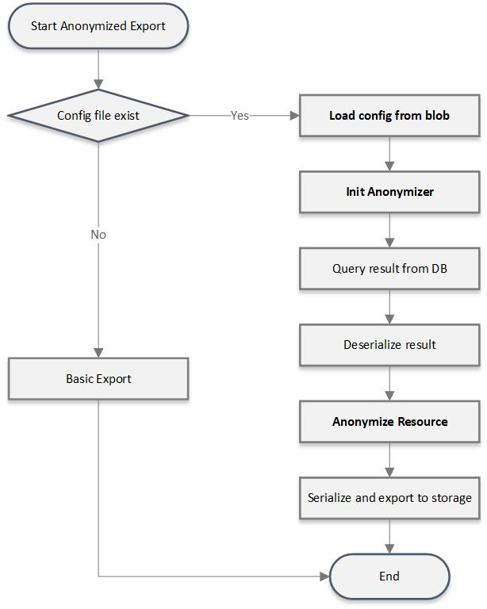

Anonymized export allow user exporting anonymized data to destination storage with customized configuration.

[[_TOC_]]

# Business Justification
Anonymization would help customer removing identifying information from data.
Customer can export anonymized data for various purposes like: sharing health information with non-privileged parties, use to train machine learning models.

# Scenarios
Customer can trigger export operation with anonymization configuration on FHIR server, in export request customer should provide reference to the configuration in query parameter like:
```GET [base]/$export?_anonymization_config_location=config-file.json```. 
The anonymization config details can be found from [FHIR Tool for anonymization](https://github.com/microsoft/FHIR-Tools-for-Anonymization).

Target public preview, we would use destination blob storage account to store the configuration. 
And we are also investigating the solution depends on the FHIR converter template store.
With this solution, we can provide same user experience for both anonymized export and converter. 

After anonymized export task completed customer can download the exported data from destination storage or share with non-privileged parties.

# Metrics
- Processing time. (Average, 90% , 95%, 99%). Also for basic export.
- Export data size. Also for basic export.
- Success/failure processing count. 
- Number of accounts that use anonymized export. 
- Anonymized export task count.

# Design
We would like to implement bulk export anonymized data based on current export operation and [FHIR Tool for anonymization](https://github.com/microsoft/FHIR-Tools-for-Anonymization).

## API details
- User can call `GET [base]/$export?_anonymization_config=<configfile>&_anonymization_config_etag=<etag_value>` to export anonymized data.
  - Query parameter `_anonymization_config` is the configuration file name on the storage blob. The container name is fixed, it should always `anonymization`.
  - Query parameter `_anonymization_config_etag` is the etag of configuration file on storage blob. If invalid ETag provided, then 400 should be returned with error `FailedToValidateETag`.
- User must have privilege to queue an export job. If user does not have the corresponding privilege, then `403 Forbidden` should be returned.
- The size of anonymization configuration file should be less than 1MB. If larger configuration provided, then 400 should be returned with error `TooLargeConfiguration`.

## Anonymized export work flow


## Multiple configuration support
Customer can use query parameter to specify the configuration file path in the storage. To make sure the file is expected, exporter can provide file hash in query parameter 
```GET [base]/$export?_anonymization_config_location=<configfile>&_anonymization_config_file_hash=46b3cd2a0d626fc2261b4ee232420d0e```

## OSS vs PaaS
For this design, most change should be at OSS project and PaaS solution would support anonymized export automatically after upgrade FHIR OSS nuget. 
A feature flag would be added to FHIR server settings to control it become public.

## Error Handling
1. FailedToParseAnonymizerConfig: when customer provides an invalid config file, then `400 Bad Request` with error code should be returned in export result. 
2. FailedToAnonymizeResource: when any critical error happen during anonymization, then `400 Bad Request` with error code should be returned in export result.
3. FailedToValidateFileHash: when the file hash not match the value customer provide, then `400 Bad Request` with error code should be returned in export result.

## Impact components
1. Microsoft.Health.Fhir.Core/Features/Operations/Export:
    - Add factory for IAnonymizer
    - Split ResourceDeserializer from ResourceToByteArraySerializer
    - Init IAnonymizer at first of export Operations
    - Add anonymization logic after deserialize
2. Add query parameter in export controller Api
3. Add new property of anonymization-config in ExportJobRecord
4. Refactor IResourceToByteArraySerializer 
    - Update interface from Serialize(ResourceWrapper resourceWrapper) => Serialize(ResourceElement resourceElement)
5. Add reference to Fhir.Anonymizer Nuget package in Microsoft.Health.Fhir.R4.Core
    - Future we would move the reference to Microsoft.Health.Fhir.Core.Shared after anonymizer support stu3 and R5
6. Add startup modules in Microsoft.Health.Fhir.R4.Api
    - Same as #3, only support R4 first.
7. Add IArtifactProvider and ExportDestinationArtifactProvider for preview.
8. Add Feature flag "SupportsAnonymizedExport" in "appsettings.json"

Skeleton changeset here: [https://github.com/skywalker-wu/fhir-server/pull/6](https://github.com/skywalker-wu/fhir-server/pull/6)

## Performance 
Based on current skeleton implementation, we did performance tests on small dataset (~100MB), it shows about 13% slower for anonymized export: 312s for basic export and 358s for anonymized export (cosmosdb and server on the same machine).

# Test Strategy
- In order to reduce the test time, most of the testing will depend on unit tests and integration tests. Integration test will require light weight FHIR server and storage emulator.
- Also we do want some E2E test coverage to make sure the pipeline is working correctly.
- To make sure there's no significant performance downgrade, we would setup performance baseline and should verify for major release update of ```FHIR Tool for anonymization```

# Security
- Anonymized export would reuse the ```FHIR Service Exporter``` Role for authorization.
- To protect original data, user who consume anonymized data from destination container should not change anonymization configuration. Exporter can share with container link with SAS token or config RBAC settings on container level for customer's service principle.

# Other
- We should go through security review with the final storage solution for both converter Paas Integrate and this anonymized export review.
- In the user documentation we should mention best practices for managing config file and sharing containers.
- In the preview documentation, we should mention that the config location is likely to change (from blob store to ACR).
