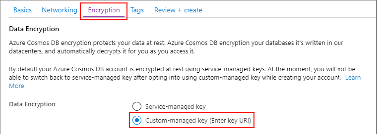
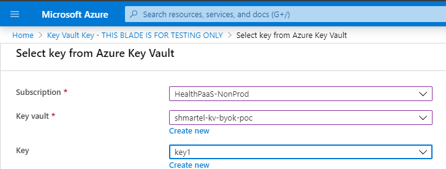
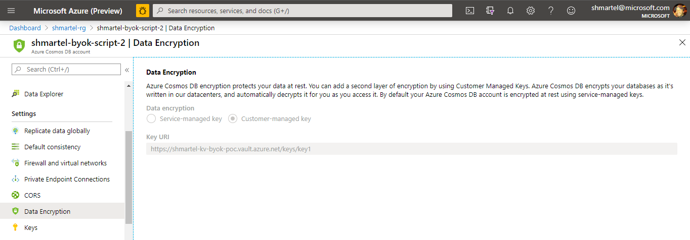

Design for PaaS to support "Bring Your Own Key" (BYOK), aka "Customer-Managed Key" (CMK).

[[_TOC_]]

# What is BYOK?

Some Azure services encrypt a customer's data at rest.  By default, the encryption is done using Microsoft-managed keys.  BYOK allows the data to be encrypted using a key that the customer chooses and manages.  In Azure, this is typically accomplished using an encryption key in the customer’s Azure Key Vault (AKV).  SQL, Storage and Cosmos DB (internally so far) are examples of services providing this capability today. 

# Business Justification

Today, PaaS customers' data is encrypted at rest by Cosmos DB using Microsoft-managed keys.  We wish to provide BYOK support so that:
- The PaaS customer can manage their own encryption keys to safeguard their data and meet their organization’s security and compliance needs.
- Security is improved:
    - Good implementation of the principle of least privilege. Giving customers control of encryption keys is a mechanism to minimize unnecessary access to customer data.
    - Increases isolation, avoiding blast radius issues where one customer’s data was targeted but several were exposed because of weak isolation or use of a common key encryption key.
- Build confidence/trust in Microsoft services.
- PaaS meets Azure Security Benchmark compliance.

# Resources

- Azure Security Compliance BYOK [Overview](https://aka.ms/encryptionatrestbyok)
- Azure Fundamentals BYOK [Score Card](https://aka.ms/byokscorecard)
- Cosmos DB Team's CMK [documenation](https://docs.microsoft.com/en-us/azure/cosmos-db/how-to-setup-cmk)

# Customer Scenarios

1. When a customer creates a new Azure API for FHIR account, they are given the option to provide their own encryption key.  If they choose to do so, all their data will be encrypted with this key. Else, their data will be encrypted with Microsoft-managed keys, which is the behavior today.
2. A customer can rotate the key by creating a new version of the specified key.  Their data will then get encrypted with the new version, without service interuption.  
3. A customer can remove access to the key.  Access to their data will be removed. If access to the key is returned, access to the data is also returned.

# Unsupported Scenarios

1. Enable BYOK on existing accounts.  This is because Cosmos DB currently does not support existing accounts.
    - NOTE:  SQL does support this. If, in the future, PaaS uses SQL for storing customer data, as expected, this scenario can be supported.
2. Disabling BYOK on existing accounts.  Again, this is not currently supported by Cosmos DB.
    - NOTE:  This scenario is also supported by SQL.
3. Changing the specified key (to a different key URI).  This is currently unsupported in Cosmos DB; it's planned, but no ETA
    - NOTE: This scenario is supported by SQL

# High-level Overview/Observations

1. To achieve BYOK, PaaS will leverage BYOK Cosmos DB support.
2. When a customer creates an account, they will have the option to specify an Azure Key Vault (AKV) key URI.  PaaS will pass this key to Cosmos DB when the DB account is provisioned.  (Note that Cosmos DB BYOK supports the scenario where the DB and AKV are cross-subscription and cross-tenant, which is the PaaS customer scenario).
3. When a FHIR request is made, Cosmos DB fetches the customer's key and uses it to encrypt/decrypt the data.  See this snippet from the FHIR thread model note the flow:


# PaaS Functional Requirements

1. Each mechanism to create a FHIR account will support the (optional) specification of a key URI.
2. If access to a key is removed, ensure the correct error HTTP status code is returned per the "Error Condition Handling Summary" section in the Azure Security Compliance BYOK [Overview](https://aka.ms/encryptionatrestbyok).
3. Further, if the key is not accessible, PaaS will write a log to the Azure API for FHIR Diagnostic Logginng to denote this.
4. These errors are by design, so no alerts should be generated in this scenario.
5. During provisioning, if the key is not accessible, provisioning should fail.  The customer will receive an appropriate error indicating the issue.
6. If a FHIR query fails because the key is not accessible, a specific OperationOutcome will be returned to indicate this.

# Design

## Account Creation Points

### Portal

- Similar to other Azure services that support BYOK, an "Encryption" tab will be added to the account creation flow.  By default, the service-managed key option will be choosen.  But, it will also allow for the specification of an AKV key URI.

Example of the "Encryption" tab from the Cosmos DB account creation flow (note the PaaS text will differ from the Cosmos DB text)



However, if the user selects "Custom-managed key", the user will not enter a key URI as is the case in the Cosmos DB experience.  Instead, per BYOK guidance, the user will be presented with the KeyPicker, a shared component developed by the KeyVault team.  Example:



For existing FHIR accounts, the user can view key encryption choices (Microsoft- or customer-managed key) in a new "Encryption" blade.  Since the key choice can't be updated, the contents of this blade will be read-only and grey'd out.  Example from Cosmos DB:



### PowerShell

A new, optional parameter will be added to the New-AzHealthcareApisService command:  -KeyVaultKeyUri.  Sample:
```
New-AzHealthcareApisService -Name nameoffhirservice -ResourceGroupName myResourceGroupName -Location westus2 -Kind fhir-R4 -AccessPolicyObjectId "xxxxxxxx-xxxx-xxxx-xxxx-xxxxxxxxxxxx" -KeyVaultKeyUri "https://<my-vault>.vault.azure.net/keys/<my-key>"
```

### CLI

A new, optional parameter will be added to the CLI creation command:  --key-vault-key-uri.  Sample:
```
az healthcareapis create --resource-group myResourceGroup --name nameoffhiraccount --kind fhir-r4 --location westus2 --access-policies-object-id "xxxxxxxx-xxxx-xxxx-xxxx-xxxxxxxxxxxx"
```

## Provisioning Workflow

### Addition of a New 'keyVaultKeyUri' Property

A optional property 'keyVaultKeyUri' will be added to the provisioning workflow.  Since we are adding a new property, the API version will be updated as well.  Snippet from healthcare-apis.json below.

Since this AKV key URI is a property on the Cosmos DB, it will be stored in the Cosmos DB config info node.  There is an argument that could be made that it be could located at a higher level so that any future PaaS-related storage services (eg: event hubs for IoMT) could also use the key.  However, we believe any new storage resources that PaaS creates for the customer should come with the option of using a separate key; we shouldn't force the user to the same key for each of these storage resources.  (more on the IoMT scenario below)

```
    "ServiceCosmosDbConfigurationInfo": {
      "description": "The settings for the Cosmos DB database backing the service.",
      "type": "object",
      "properties": {
        "offerThroughput": {
          "type": "integer",
          "description": "The provisioned throughput for the backing database.",
          "readOnly": false,
          "minimum": 400,
          "maximum": 10000
        },
        "keyVaultKeyUri": {
          "type": "string",
          "description": "The URI of the customer-managed key for the backing database.",
          "readOnly": false
        }
      }
    }
```

### Cosmos Account Provisioning

During the account provisioning process, if the keyVaultKeyUri is specified, it will be passed to the Cosmos DB account creation command.  
    - NOTE:  Currenty, the only way to create a Cosmos DB account with BYOK enabled in "code" is a PowerShell script.  There is work in progress for Cosmos to update the Fluent APIs, which we would much prefer (ETA is pending).
```
$CosmosDBProperties = @{
    "keyVaultKeyUri" = "https://<my-vault>.vault.azure.net/keys/<my-key>";
}

New-AzResource -ResourceType "Microsoft.DocumentDb/databaseAccounts" `
    -ApiVersion "2019-12-12" -ResourceGroupName "my-resource-group" `
    -Location "West US 2" -Name $accountName -PropertyObject $CosmosDBProperties
```

## FHIR OSS

We will update the OSS fhir-server to return a particular OperationOutcome when the customer's key is not accessible.  We propose:
```
{
    "resourceType": "OperationOutcome",
    "issue": [
        {
            "severity": "error",
            "code": "Forbidden",
            "diagnostics": "Customer-managed key is not accessible."
        }
    ]
}
```

## Billing

No billing changes are required.  A BYOK-enabled Cosmos DB account uses ~ 25% more RUs; however, with our current billing system, the customer will automatically get charged for those extra RUs withou any PaaS change.  We should communicate this to customers to set the expectation.

## Monitoring and Alerting

### Internal

We propose the addition of two internal metrics:
1. The number of FHIR accounts that have BYOK enabled.
2. The number of FHIR accounts that have BYOK enabled and key access is unsuccessful.

### External

1.  In the scenario where the customer's key becomes inaccessible, this will be viewable in the customer's Azure API for FHIR diagnostic logs.

## Deployment Strategy

We believe that providing preview access to this feature is not warranted because:
1. It has no impact on existing accounts.
2. It's not likely to be high-risk since, effectively, most of the actual core functionality is provided by Cosmos DB.

This feature can be deployed normally.

# Security

This feature will undergo a security review (which as been scheduled).

# Performance

Per the Cosmos DB team:  with BYOK enabled, all performance SLAs are still guaranteed.

# Testing Strategy

We will use multiple strategies to test this feature:

- Addition of unit test coverage for new code
- End-to-end testing in Dogfood
- Manual execution of all test scenarios mentioned in Azure Fundamentals BYOK [Score Card](https://aka.ms/byokscorecard)
- Add integration test(s) that cover the BYOK scenario

There are other strategies we will consider; we can evaluate their ROI as implementation progresses:
- Consider adding a KeyVaultKeyUri parameter to the Provision step of localbuildanddeploy.ps1 which would cause the test accounts to be created with BYOK.  This would allow for easy creation of personal and local environments that have BYOK enabled.
- Consider a bug bash

# PaaS-Related Features

Here we consider any impact BYOK might have on related features, or the possibility of extending it to them.

## DICOM

Azure API for DICOM will be a separate service, and so it is unaffected by this change.  It could some day support BYOK indepedently.

## IoMT

Providing BYOK support for IoMT is a possiblity for the future, as it provisions event hubs that have BYOK support.  Some considerations:
- Technically, the APIs required to enable this scenario are currently in preview.  We can hope they will GA in the future.
- Financially, the cost of an event hub that supports BYOK is $5000/month.  This is because a dedicated event hub instance is a requirement for BYOK.  This is a large jump from the typical cost of $20/month. Given this, it makes sense that IoMT BYOK support should allow for a separate/optional customer-managed key from the PaaS one.

# Disaster Recovery

Currently, the following mitigations exist for disaster recovery scenarios:
- If the region where the AKV goes down: AKVs are global and intended to be fault tolerant to regional failures.
- If we ever want to provide a CosmosDB failover location, BYOK is supported.

Future-looking:
- When we move customer data to SQL, and if there's a desire, note that SQL provides [support](https://docs.microsoft.com/en-us/azure/sql-database/transparent-data-encryption-byok-azure-sql#geo-dr-and-customer-managed-tde) for using a second key that is a clone of the first.

# Caveats, Risks, Open Questions and Future-Thinking Considerations

1.  As mentioned above, there currently is no Fluent API support for creating Cosmos DB accounts with BYOK.  However, for dev and testing purposes, the supported PowerShell commands should suffice.  There is precedence in our service of executing PowerShell scripts.

2.  In the scenario where the customer's key is inaccessible, the CosmosDB team has not yet documented substatus codes for 403s.  They are continuing to make improvements and better detail errors.

3.  There is currently a PaaS effort in progress to decrease the amount of time for PaaS resource settings to take effect.  Per this [Updating Resource Properties](https://microsofthealth.visualstudio.com/Health/_wiki/wikis/Resolute.wiki/64/Updating-Resource-Properties) spec, there will be an optimization where PaaS will store some settings data (audience, OIDs, token etc) in the customer's Cosmos DB. The consequence is that, in the BYOK scenario, this auth settings data is encrypted by the customer's key.  And if access to the key is lost, this data was not accessible.  As a consequence, if this happens, AND the FHIR service gets restarted, the service will not be able to get a token to access the Cosmos DB account. Effectively, a customer behavior is  preventing the system from getting auth tokens to the Cosmos account.  Though not desirable, it's possible we are OK with this because a consequence of this scenario is that no clients can access the customer data anyway.  So, the service behavior in this scenario is the same as if this optimization is not done.  We just have to be sure that PaaS returns an error that indicates that the cause is an inaccessilbe key, not an internal server error.  And no alerts should fire.
    - NOTE:  There is a possible mitigation for this in the future: Some time in 2020 the Cosmos DB team plans to support collection-specific BYOK. So, we could put this settings data into a different collection from the customer data, and have it not encrypted with the customer's key.

4.  There are various "levels" of customer experience for this BYOK feature, depending on what Cosmos DB provides in the future:

    a. The current customer experience of setting up AKV for Cosmos DB BYOK uses a "global identity" service principal. The customer must give this principal access to their key.  For PaaS, this functionally works, but it's not the most desirable option as it doesn't "hide" the backing Comos account.  This could cause customer confusion.

    

    b. The Cosmos DB team plans to provide managed identity support in June. For PaaS customers, this means they would give key access to a specific managed identity for the Cosmos DB.  This is a customer experience improvement.  But, it's unknown if that will support cross-tenant.

    c. For PaaS, the ultimate customer experience would be for Cosmos DB to support the "Hosted On Behalf Of" (HOBO), aka "Shared Identity" feature.  In this world, the customer would give the PaaS managed identity access to the key, and this access would get shared with Cosmos DB.  This would hide the Cosmos DB account from the customer.

5. A risk:  Looking to the future, PaaS will use SQL to store customer data.  Currently, SQL supports managed identities for giving access to keys, but it does not work cross-tenant.  This is a requirement for PaaS to support BYOK using SQL.  There are currently ongiong discussions involving the SQL team, the ASB BYOK owner, other services that require this feature, and the Meru team.

6. Should we feature-flag this feature?  Is this feasible given there is corresponding Portal/PowerShell/CLI changes; we believe this diminishes the control and value of a service-side feature flag.
