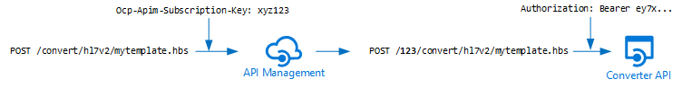

Customers that wish to use the Azure API for FHIR or the Open Source FHIR Server for Azure will often need to convert legacy data formats (e.g., HL7 v2) to FHIR for ingestion into the FHIR service. It is difficult to create a one-size-fits-all data converter since implementation of standards such as HL7 v2 varies from organization to organization. We are aiming to build a templates based conversion engine that will allow customers to leverage a library of provided conversion templates and adjust them for their organizational needs.

The project will include a conversion API, a set of standard templates, and tooling for authoring templates (not covered in this document). This is an initial pilot implementation to enable testing with a few select customers. Based on the feedback we receive, a full production environment will be designed.

[[_TOC_]]

# Business Justification

The feedback received after the launch of the Azure API for FHIR has been consistent: customers need a way to convert legacy HL7 v2 data (and possibly other formats) to FHIR. They want a mapping tool that does not require deploying an integration engine (Mirth Connect, Iguana, Rhapsody, etc). There is an opportunity to provide such a conversion tool as an API service where we could charge based on number of API calls and offer a high availability service. The service would be consumed in the same manner as cognitive services (e.g., face api).

# Scenarios

* As a user, I want to convert incoming HL7 v2 message to bundles of FHIR resources and insert them into a FHIR server.
* As a user, I want to call a conversion API service from Logic Apps or Functions.
* As a user, I want to make custom changes to conversion templates and have the modified templates deployed and managed by the API service.

# Metrics

* Feedback from early customers.
* Number of conversion API calls.
* Conversion errors.
* Conversion time.
* CPU/Memory load.

# Design

The prototype conversion API will try to adhere to the [Microsoft One API](https://github.com/microsoft/api-guidelines/blob/vNext/Guidelines.md) as best as possible. It will be a multi-tenant (multi-namespace, see below) template based data conversion service. The service will:

1. Parse an incoming message to a structured format (json). Initially we will target HL7 v2 messages.
1. Use the parsed message as context for a [handlebars](http://handlebarsjs.com/) template conversion.
1. Return converted message.

The handlebars syntax allows for a template to be broken into [partials](http://handlebarsjs.com/partials.html) and the service would support that.

In addition to template conversion the service has to provide functionality for storing and modifying templates.

## Template format

Templates will use handlebars syntax. An example could look like:

```json
{{#with (hl7v2GetSegments msg.v2 'PID' 'NK1')}}
{{#if PID}}
{
    "fullUrl": "urn:uuid:{{generateUUID (concat '/Patient?identifier=' PID.[0].[3].[0].[0])}}",
    "resource": {
        "resourceType": "Patient",
        "id": "{{generateUUID (concat '/Patient?identifier=' PID.[0].[3].[0].[0])}}",
        "identifier": [
            {{#if PID.[0].[3]}}
            {{>patientId-partial.hbs PID3=PID.[0].[3]}}
            {{/if}}
            {{#if PID.[0].[19]}},
            {
                "type": {
                    "coding": [
                        {
                        "system": "http://terminology.hl7.org/CodeSystem/v2-0203",
                        "code": "SS"
                        }
                    ],
                    "text": "SSN"
                },
                "value": "{{addHyphensSSN PID.[0].[19].[0].[0]}}",
                "system": "http://hl7.org/fhir/sid/us-ssn"
            }
            {{/if}}
            ],
        {{#with PID.[0].[7]}}
        "birthDate": "{{addHypensBirthDate @this}}",

        // More stuff for resource

    },
    "request": {
        "method": "POST",
        "url": "Patient",
        {{#if PID.[0].[3]}}
        "ifNoneExist": "identifier=http://terminology.hl7.org/CodeSystem/v2-0203|{{PID.[0].[3].[0].[0]}}"
        {{/if}}
    }
}
{{/if}}
{{/with}}
```

The format supports helper functions and partials. The service will provide a number of pre-registered helper functions that will assist with extracting information from the parsed messages.

## Namespaces (or Accounts)

The service will be able service multiple conversion accounts or namespaces. A namespace is an entity for which a set of named conversion templates are maintained. Suppose namespace `123` has a template named `patient.hbs`, namespace `345` could also have a template named `patient.hbs`. Each namespace will be identified by a string (could be a guid). All operations on the API are done in the context of a namespace.

## URL Scheme

All calls to the API will contain a version and the the namespace identifier, specifically:

```cmd
GET [base]/v1.0/{namespace}
```

would be the way to prefix all calls for a specific conversion namespace, where `[base]` is for example `https://azure-conversion-api.com/` and `{namespace}` is the namespace identifier (e.g. `123` or a guid).

We are using versioning in the URL instead of as a query parameter since we cannot guarantee the stability of the REST APIs URL path in future versions.

Specific operations and conversions would be available with something like:

```cmd
GET [base]/v1.0/{namespace}/templates
```

To get a list of templates or

```cmd
GET [base]/v1.0/{namespace}/templates/{template-name}
```

For a specific template (see details below)

## Error messages

We will follow the Microsoft One API guidelines on error messages. Specifically they take the form:

```json
{
  "error": {
    "code": "BadArgument",
    "message": "Input message type not found"
  }
}
```

We will also provide explicit error messages when a user tries to use API features that one could assume were there but we have not implemented yet (in this pilot), e.g., key addressing in a collection, filtering by property values (e.g. template name), sorting, etc.

## Built-in templates

The service will come with a set of built-in templates. The names of built-in templates will be prefixed with `_`.

```cmd
GET [base]/v1.0/{namespace}/templates/_default
```

will reference a built-in template called `default`. Built-in templates cannot be modified and are the same for all namespaces.

## Managing templates

### Upload (or update) a template

```cmd
PUT [base]/v1.0/{namespace}/templates/{template-name}
```

The body will contain the template body. When a template is received the template engine will:

1. Attempt to pre-compile (validate) the template.
1. Store the template in blob storage in a folder (or container) corresponding to the current namespace.

Possible responses are:

* `201`: Created, ew template stored.
* `200`: OK, template updated.
* `400`: Bad request, with message indicating why the template could not be compiled and/or stored.

### List templates

```cmd
GET [base]/v1.0/{namespace}/templates
```

Response:

* `200`: List of template names:

    ```json
         {
            "templates": [
                 {
                    "templateName": "_default"
                 },
                 {
                    "templateName": "patient.hbs"
                 },
                 {
                    "templateName": "encounter.hbs"
                 },
                 // More templates
            ],
            "@nextLink": "<opaqueUrl>"
         }
    ```

Next link is optional and maybe implemented at a later time to support a large number of templates.

### Get template

```cmd
GET [base]/v1.0/{namespace}/templates/{template-name}
```

Response:

* `200`: OK, template returned in body, Content-Type: `text/plain`.
* `404`: Not found. Template doesn't exist.

## Data conversion

Data conversion would be initiated with:

```cmd
POST [base]/v1.0/{namespace}/convert/{sourceformat}/{template-name}
```

e.g.:

```cmd
POST [base]/v1.0/123/convert/hl7v2/bundle-fhir3.hbs
```

This would initiate a conversion of an HL7 v2 message using the template `bundle-fhir3.hbs` in namespace `123`. The actual HL7 v2 message would be provided in the payload.

Response:

* `200`: OK, message body would be converted and returned with appropriate content type, e.g. `application/json` for FHIR.
* `400`: Bad request. Errors during message conversion.
* `404`: Resource not found when converter is not found (e.g. `POST [base]/v1.0/123/convert/ccda/bundle-fhir3.hbs` would fail if CCDA conversion is not implemented yet).
* `404`: Template not found if conversion request references a non-existent template (e.g. `bundle-fhir3.hbs` does not exist in current namespace)
* `404`: Partial not found. When a partial referenced in the template is not found.

## Template editing

To integrate with a live-editing experience either in Visual Studio Code or a browser based editor, we want the service to support on-the-fly template compilation and version. This would be accessed with:

```cmd
POST [base]/v1.0/{namespace}/convert/{format}
```

with a payload of:

```json
{
    "messageBase64": "eyxt6786...",
    "templateBase64": "yuoixgy6679...."
}
```

Where template and messages are supplied in base64 encoded form.

Response:

* `200`: OK, message body would be converted and returned with appropriate content type, e.g. `application/json` for FHIR.
* `400`: Bad request. Errors during message conversion.
* `404`: Resource not found when converter is not found (e.g. POST `[base]/v1.0/123/convert/ccda/bundle-fhir3.hbs` would fail if CCDA conversion is not implemented yet).
* `404`: Partial not found. When a partial referenced in the template is not found.

**NOTE**: This endpoint *should* be throttled in production. Customers should only be using this for editing templates.

## Sample messages

To assist with editing, the service will have set of sample messages. A list of available messages can be obtained with:

```cmd
GET [base]/v1.0/{namespace}/samples/{format}
```

e.g.:

```cmd
GET [base]/123/samples/hl7v2
```

Response:

* `200`: OK, with a list of samples:

    ```json
         {
            "samples": [
                 {
                    "sampleName": "adt01.hl7"
                 },
                 {
                    "sampleName": "adt02.hl7"
                 },
                 {
                    "sampleName": "..."
                 },
                 // More samples
            ],
            "@nextLink": "<opaqueUrl>"
         }
    ```

* `404`: Resource not found if message type (`{format}`) is not available.

A specific message would be retrieved with:

```cmd
GET [base]/v1.0/{namespace}/samples/{format}/{message}
```

e.g.:

```cmd
GET [base]/123/samples/hl7v2/adt01.hl7
```

Response:

* `200`: OK, message returned in body with appropriate content type, e.g. `text/plain` for HL7 v2.
* `404`: Resource not found if message type (`{format}`) is not available.
* `404`: Message not found if message type (`{message}`) is not found.

## Helper functions

Handlebars allows the use of "helper functions" in the templates. These helper functions must be registered with the handlebars instance prior to running the converter. In the MVP we will not allow customers to register their own helper functions, but we will provide a set of functions, which will be a combination of functions built into handlebars and some that we will create. An example from above would be:

```cmd
{{addHyphensBirthDate @this}}
```

where `addHyphensBirthDate` is a helper function, which could look something like (javascript):

```javascript
function(birthDate) {
    bd = birthDate.toString();

    if (bd.indexOf('-') != -1)
    {
        return bd;
    }

    if (bd.length < 8)
    {
        return bd;
    }

    return bd.substring(0,4) + '-' + bd.substring(4,6) + '-' + bd.substring(6,8);
}
```

To assist with the editing experience (in VS Code or a browser based app), we will provide a way to list available helper functions:

```cmd
GET [base]/v1.0/{namespace}/helpers
```

Response:

* `200`: OK, with a list of helpers:

    ```json
         {
            "helpers": [
                 {
                    "helperName": "if"
                 },
                 {
                    "helperName": "addHyphensBirthDate"
                 },
                 {
                    "helperName": "..."
                 },
                 // More helpers
            ],
            "@nextLink": "<opaqueUrl>"
         }
    ```

And there should be a way to get details about a function:

```cmd
GET [base]/v1.0/{namespace}/helpers/{helper}
```

e.g.:

```cmd
GET [base]/123/helpers/addHyphensBirthDate
```

Response:

* `200`: OK, with:

    ```json
    {
        "function": "addHypensBirthDate",
        "description": "This function adds some hyphens to a birth date",
        "arguments": [
            {
                "position": 0,
                "type": "string",
                "description": "This is the birthdate in the form of 19810223"
            }
        ],
        "return": {
            "type": "string",
            "description": "The birthdate in the form 1981-02-23"
        }
    }
    ```

* `404`: Helper not found.

## Access control

The API will (optionally) use OAuth for access control. If enabled, a consumer of the API must present a valid access token.

In the pilot we will not attempt to use the access token to identify the specific converter namespace that is being used. A valid token will grant access to all converter namespaces. See use of API management below for details on how namespaces will be handled.

If the API is being accessed for an namespace that does not yet exits, one will be created and initialized (see below).

## API Management

To onboard multiple customers to the service and allow them to manage their own templates we need a system for managing and issuing namespaces. In a final product, this should be managed through the portal, but for initial testing we can leverage [Azure API Management](https://azure.microsoft.com/en-us/services/api-management/). It provides tools for creating a developer portal (with API docs, instructions, etc), managing APIs and endpoints, and creating subscriptions to APIs, etc. It will also provide us with some ways to monitor the API usage, etc.

We can invite customers into the API management instance, let them subscribe to the conversion API and provide them with a way to obtain subscription keys.

When they consume the API, they will not provide a specific namespace identifier. We will write a policy in API management that, based on their subscription, determines which namespace they have and translates to appropriate, namespace prefixed URLs for the conversion API. The API management proxy will be responsible for obtaining a token for the backend API:



The use of API management is unlikely to be part of a product in the end, but it will allow us to leverage all the tools of APIM during the pilot phase instead of having to implement namespace management, etc.

## Namespace initialization

New namespaces will be created on demand when a consumer tries to access an namespace that does not exist. In this pilot namespaces are not security boundaries but simply ways to manage versions of templates. API management will handle access control and route to appropriate namespaces (see above).

When a new namespace is accessed the API will:

1. Create a new folder in the blob storage for templates corresponding to the namespace name.

## Output (FHIR) validation

We could (optionally) add FHIR validation to the conversion API:

```cmd
POST [base]/v1.0/{namespace}/convert/{sourceformat}/{template-name}?validate=true
```

Would force FHIR validation of the resulting resource and result in an error if the generated resource is invalid. Similarly for the editing mode:

```cmd
POST [base]/v1.0/{namespace}/convert/{format}
```

with a payload of:

```json
{
    "messageBase64": "eyxt6786...",
    "templateBase64": "yuoixgy6679....",
    "validate": true
}
```

Validation would default to `false`.

## Cached templates and cache invalidation

When a consumer accesses the conversion API, the required template(s) will be pre-compiled and registered with handlebars. Each namespace will have its own handlebars instance in the converter API service. Clearly this would represent a scaling challenge if we onboard thousands of customers, but there are ways that this could be optimized in a production implementation.

The use of a common set of standard start templates (prefixed with `_` as mentioned above) will mean (needs to be validated) than many partials will be shared among customers and a large number of customers will be able to be served on a single instance of the service.

In the pilot phase, we anticipate just a few customers (< 10) but in a final production version there could be many customers and growth of the pre-compiled template cache would be a concern that may have to be mitigated. In the pilot, we will punt on this for now.

Some of the strategies to consider in production would be:

1. Using a hash of the templates to refer to partials when they are converted so that templates that are the same in several customers would always share the same pre-compiled version regardless of what name the customer may use to refer to them with. This would require maintaining some record (database) of the dependency graph of the templates so that when a partial template gets updated, templates that reference it will get rehashed forcing a recompile when they are used.
1. Keeping track of when the templates are used and invalidating (deleting from cache) ones that have not been accessed recently.
1. Routing specific namespaces primarily to the same service instances to reduce the spread of all customers over all service instances.

# Test Strategy

Unit and integration tests will be built for the API. Deployment and E2E testing (with APIM) will also be included.

# Security

Security will primarily be handled in APIM as described above. Global access to the API backend will be secured with OAuth.

The API will not store any healthcare data. The templates *should* not contain PHI or PII and none of the messages that will be converted will be stored.

A security review should be conducted.

# Future work

The conversion API has been scoped down to handling a single input data time and producing a narrow set of output FHIR Resources. Future work could include:

1. Conversion from other formats: CCDA, CSV, etc.
1. Tight integration with the FHIR service, i.e. data could be ingested straight into FHIR service instead of being returned to the client.
1. Output in XML format. For FHIR we could easily convert to XML based on the `Accept:` header. We will defer for later.

# Other considerations

## FHIR mapping language

The FHIR specification prescribes a [FHIR mapping language](https://www.hl7.org/fhir/mapping-language.html). This language could be used instead of or in addition to the proposed handlebars approach described here. However, the FHIR mapping language requires structure definitions for both input and output and it is not particularly well understood or adopted. We should solicit feedback from early customers on their interest in using the FHIR mapping language and also investigate the work involved in creating proper structure definitions for HL7 v2 (and CCDA, etc.).

# The need for orchestration

It is important to note that conversion of data cannot work in isolation. Frequently, the order of HL7 v2 messages matter and depending on context, different conversions may be needed. Consequently, the conversion API would be used in conjunction with some sort of orchestration engine. This could be a traditional integration engine such as Mirth Connect or Iguana or it could be maybe something much leaner with the conversion being done by the conversion API. One hypothesis to test with this conversion API is whether having a conversion API would make it feasible to use something like Logic Apps as the primary orchestration engine.
