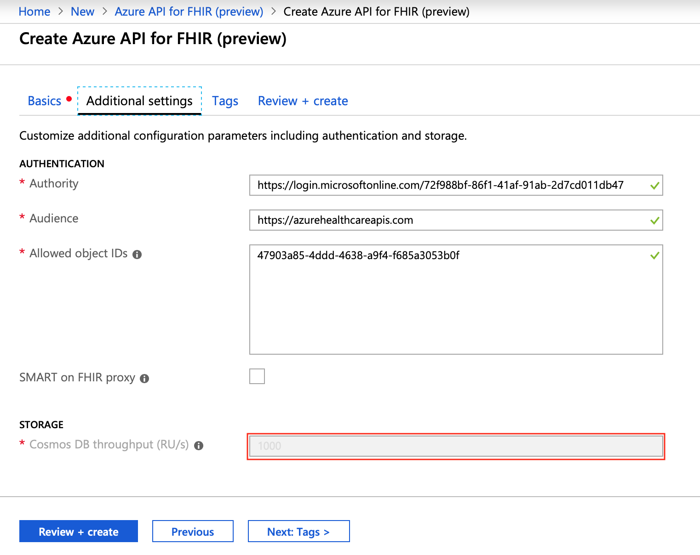

# Configurable Cosmos DB Thoughput

Currently Azure API for FHIR does not allow you to specify custom Cosmos DB settings during service creation or later when the service is provisioned. This includes RU setting, replication settings and consistency level settings. There is also a lack of information on what is the state of the underlying database and its settings (Size of the database, number of documents/records, replica location and performance indicators)

We want to change this by offering our customers flexibility in altering some settings in underlying database and viewing current database statistics.

[[_TOC_]]

# Business Justification

When customers provision Azure API for FHIR today, we automatically set their underlying Cosmos DB throughput to 1000 RU. This is ok for some scenarios and database size, but in order to ingest large amount of data and work on large datasets processing lots of queries, we might need to change this number to higher level. The only way to do this today is to file a ticket with Azure and we manually change the value on the underlying cosmos DB account. This is limiting and we need to give customers some control of underlying Cosmos DB database to achieve better performance of the service.

# Scenarios

* As a Azure user I want to set a custom RU value at service creation time
* As a Azure user I want to change RU value to higher or lower, depending on current state of the database and RU.
* As Azure user I want to see some statistic around Cosmos DB usage in Cosmos DB blade in Azure API for FHIR
    + Current RU value used by Cosmos DB (this number changes based on amount of data ingested)
    + If Geo-Redundancy is enabled on service level, show the location of cosmos DB replica
    + Basic Cosmos DB statistic like Database Size, Number of Documents stored.

# Metrics

N/A

# Design

## Service creation

During service creation we will make **Cosmos DB throughput (RU/s)** field editable, so customers can specify their custom value. We will cap this at 10.000 RU (and show this in (i) tooltip). If customer want to lift the limit of 10.000 RU, then they will still need to file a ticket with Azure.

## After service creation

# Test Strategy

N/A

# Security

N/A

# Other

*Describe any impact to privacy, localization, globalization, deployment, back-compat, SOPs, ISMS, etc.*
