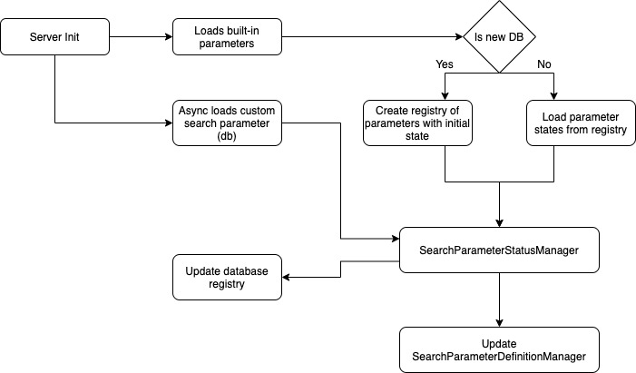
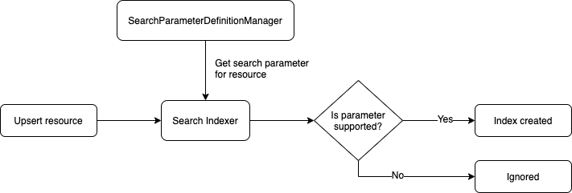

## Overview 

This document outlines the approach for introducing a registry that can track whether a search
parameter is supported, and then when it is fully indexed and able to return results. The reason that 
the status of search parameters needs to be tracked is so that the system is able to return consistent
search results. Given this design goal, parameters should be disabled in searches until this consistent state is reached.

[[_TOC_]]

## High level design



The implementation needs to eventually account for two different sources of search parameters, those defined as standard options in the FHIR Specification,
and custom defined parameters. The following sub-sections refer to the above diagram.

### Search Parameter Registry

To most optimally support the underlying storage technology, the search parameter registry will need a separate implementation for both CosmosDb and SQL Server, it should have components such as the following:

In JSON it might be represented per resource, this should provide a balance between size of document and number of documents needing to be read:
```json
{
  "resource": "Observation",
  "isSystem": true,
  "partitionKey": "__searchparameters__",
  "searchParameters": [
    {
      "name": "_profile",
      "status": "disabled | supported | enabled",
      "lastUpdated": "date"
    }
  ]
}
```

A SQL representation should leverage the type information that is already normalized, an example of this schema:

| Column Name | Description | FK
| ----------- | ----------- | ------------- |
| ResourceType | Type of the resource | dbo.ResourceType.ResourceType
| SearchParameterId | Type of the search paramter | dbo.SearchParameter.SearchParameterId
| Status | Integer of enum representing search parameter status
| Last Updated | When this status was last updated

### Search Parameter Status Manager

The `SearchParameterStatusManager` would have a primary responsibility of reading in all known search parameters, built-in and custom, then 
annotating the index status of each parameter and updating the `SearchParameterDefinitionManager`. This process will use a combination of
information from the built-in search-parameters.json and Search Parameter Registry information. For new parameters that are found,
the `SearchParameterStatusManager` should update these in the registry and mark them as supported if the appropriate data-type indexers
are found.

### Standard search parameters

Although most standard search parameters are supported, some data types have not had "data type to search index" converters written.
As we implement support for these or in the event that new types are introduced we need to have a registry of the status so that the 
existing data can be reindexed before results are served. The builtin search parameters are defined in an embedded 
'search-parameters.json' file, this file is a standard FHIR Bundle which lists [SearchParameter](https://www.hl7.org/fhir/searchparameter.html) 
resources as part of the base specification.

### Custom search parameters

Just like the builtin search parameters the [SearchParameter](https://www.hl7.org/fhir/searchparameter.html) resource can be 
uploaded to the FHIR Server as data. Creating custom search parameters is covered by [another spec](./Custom-Search.md), 
which details how the mechanics of this will work.

In regards to supporting the new parameter the `SearchParameterToTypeResolver` will need to inspect the FHIR Path query to determine
if the system has the capability of indexing and searching the the desired datatype(s).

## Indexing

A special implementation of the `SearchParameterDefinitionManager` ([detailed here](https://github.com/microsoft/fhir-server/blob/master/docs/Search.md)) called `SupportedSearchParameterDefinitionManager` was created to support
and resolve only parameters that can be index by the the SearchIndexer. By using this component, the below diagram represents the outcome of 
each search parameter.



## Searching

For searching, there are a number of states the system can be in, these can be:
1. A search parameter is supported by the system and all ingested data has been indexed
1. A search parameter has had support added, new data is being indexed but it cannot be used for search until all existing data has been reindexed
1. A custom search parameter has been added or updated, all existing data must be reindexed
1. Support for a search parameter has been removed (e.g. a custom search parameter)
 
 To support these goals, logic has been implemented in a specialized `SearchableSearchParameterDefinitionManager`. This implementation looks at the 
 searchable status on each parameter, in this special state the parameter may be indexed but it may be dropped from searches as the indexes
 are not fully up-to-date. The outcomes for this logic are represented below.


## Testing

Testing for this should be broken down into its scenarios and sub-components:

#### Known search parameters

Unit tests already exist for loading built-in search parameter, in the future testing should be expanded to include an amalgamation
of both built-in and custom parameters. These all should exist in `SearchParameterDefinitionManager`.

#### Supported parameter status

Unit tests in `SearchConverterForAllSearchTypes` run through every built-in search parameter to determine if there are converters that 
can transform the source data (in a resource) into the search datatype (e.g. token).
`SupportedSearchParameterDefinitionManager` provides the API for filtering only types where valid converters where found. 
Integration tests could be introduced to ensure that supported parameters are indexed correctly.
E2E tests should be expanded to test that these scenarios are correct:
1. Supported and not searchable parameters are dropped from _self links
1. Supported and searchable parameters are returned correctly 

#### Searchable (enabled) parameter status

The SearchableSearchParameterDefinitionManager filters parameters where both Supported and Searchable (fully indexes) status are true, testing this
status overlaps with Supported

#### New data types supported

`SearchConverterForAllSearchTypes` should detect this as a unit test and force all affected search parameters that use them 
to be added as supported (or unsupported). This status can then be tested as part of the registry.


#### New search parameters introduced

In this scenario the Search Parameter Registry should be tested (unit / integration) to ensure that the new parameter is detected
and the registry is updated.

#### Existing search parameters removed

In this scenario the Search Parameter Registry should be tested (unit / integration) to ensure that when a parameter is removed
that its status is also removed (or disabled) in the registry. The preference should likely be to remove as removing the search
parameter means removing its definition.


## Out of scope

- Custom search parameter implementation
- Reindexing worker implementation

## Resources
- [Edit diagrams](https://www.draw.io/?page-id=3c6phTDylA4_jW5TpOit&title=Search%20Parameter%20Registry#R%3Cmxfile%3E%3Cdiagram%20id%3D%22C5RBs43oDa-KdzZeNtuy%22%20name%3D%22Page-1%22%3E5Vpbd9o4EP41nLP7kD34BuQxkEuzTXu6h23T7JtiC1tbIVFJBtxfX8mWr0qBBBwT%2BpJYY1m255vvm9GYnjOZr28YWEQfaABxz%2B4H655z2bNty%2B3b8p%2ByJNrSt93MEjIUaFtpmKIfMJ%2BorTEKIK9NFJRigRZ1o08Jgb6o2QBjdFWfNqO4ftcFCKFhmPoAm9Z7FIgos47sYWl%2FB1EY5Xe2BufZmTnIJ%2Bs34REI6Kpicq56zoRRKrKj%2BXoCsfJe7pf72%2BQe330b3Pz9D%2F8OPo%2Ff%2F%2Fvxy1m22PVzLilegUEiXrz02RdvOEpuR9b1cslj9h%2F2ovWZ9gIXSe4vGEj36SFlIqIhJQBfldYxozEJoFq1L0flnDtKF9JoSeP%2FUIhExwKIBZWmSMyxPgvXSHytHD%2Bopf7y9OhyrVdOB0k%2BIIIlX6uDylVqWF6WjvLrdnSddjGnMfPhhnmOjmDAQig2%2BFWHjHJmJQw1MDeQzqF8SDmBQQwEWtZjFeiQD4t5JazyQCP7DJQtq0uYS2gfKmdOAmarK5g3PfUS4FjfaQrZEjJpuyVIGDFQIqxAWUVIwOkCpI5ZyWxQR3NGidBQW%2FIVxyEGnGvvc8Hot0Je1exCK58PjnxgAdcb3anPeppleWoa6fGq1HkrF%2B%2BoovFuvyWenb8VNX05XTap3Va62Eelin2DLncUBFyaHmOExRkimY%2BAvB1k%2FOToU%2FDgaPhjjzoh0C9yjt1e0tmUTLazyDsqGuVxV9LogifElyas6eTHXNC5cgEEzI%2BqrJLHfwSPf548t%2Bzhjtzy2uKW5b29GrBCwYcaA1%2BFj%2FaOfHQPTcf00gvGQFKZsKCICF5Z%2BZMylBE3GDQizu03YiZbsYyg4tH2EGz3DQbV8C0ElXMUQeU1ZexVgspIKLcqixC4kn8vx2auiOj8Mebb80RbYu81qGcNTLEfPaH1o9a0vtO2Ts6wnXh5YHq1QxtTbPt1xF2rAWXGb31Viea%2B%2FHMGjR7fludqzG%2BHr2bbYcIgEDB1c4h45nE6a%2BymJDuEqgURQQIBnIZretWJlYKud3SlYKd9iryq60Ie2inVOpOHZs13lPLgGvKg2iyNTWBKfSUKM5buFEvhODE1GDjHpgaegc%2FnRZDJ9zTdr3%2FKcbqEs1SsKfkACAgVcCeGjnteR8ezTXTsV0Unv1kFno%2FU8Lt8PVF3bubACcWUSQuhRGn4DGHcMAGMQiKHvvSkBNQZK2chH%2BALfWKOgiBNAE%2BhWU8Kr8aZJ1BxnwDFbg0Us%2Bf1AM0G8WmjUnDjaFDptqypfX4Z7vg1u%2Bg%2Ft%2F2Zc2MneXvLeXjowmk%2FpM2c1UhVU1lPxPx3SVNFfdldmhoYiJhkJMGF%2BkGP0jXlQ%2BQftK3XaVdvVyLt%2BummAqS3Acc99ylOs9wZNuIje3Fjn2Is5Lq%2FqJu2bHgO1jIcGuFXFLHyH3gEvN6O2EcQ2mJ185tR4dQWtgZyWP5wLUOh%2FP2fc%2FUT%3C%2Fdiagram%3E%3Cdiagram%20id%3D%22je061ctPcbo31-poOPZ-%22%20name%3D%22Page-2%22%3E7VnbdqIwFP0aH53FRbR9rPd2jW3XOLOsT7MiBEgbCSahar9%2BEggCgo69WNvO9KVkc3JIzj47OYk1szNfDSgI%2FRFxIK4ZmrOqmd2aYegNzRD%2FJLJWiGY0EsSjyFFYBozRE0wNFRohB7KCIScEcxQWQZsEAbR5AQOUkmXRzCW4%2BNUQeLAEjG2Ay%2BgEOdxP0DNLy%2FAhRJ6fflnX1Js5SI0VwHzgkGUOMns1s0MJ4cnTfNWBWEYvjcvw3kXXN86P0cAdUq03XDNtUk%2Bc9Z%2FTZTMFCgP%2BYtfjFtKuBhz0fnJAFp2LxyCidcUu4%2Bs0XtAR4VNNQrlPPBIA3MvQNiVR4EDpVROtzOY7IaEAdQHeQ87XKhdAxImAfD7H6i1cIX6Xe55KV98s1equlOe4sU4bAafru3wj10s2s25xK%2B2XzE9Oaisd%2FhJLZcdIRG3V1bkJIenbk8UI3%2FUWLbg4p0sVc40D6kG%2BJ9D6JmGE1CCZQzFI0Y9CDDh6LA4OqJT3NnYZreJBMVvN8r5BPgIcqS%2F9ChmkPB6AmuJ2HmQsS5qWPuJwHII4FkuxVBQZVf6FS7h6QZzLcVFeUpWmi09TtZeZkvVUnn5OxQ3t9ZGsprH5XzAHC2Y4WNxOvaszb9h4aE3sq%2B7vdf9wwVjvpJjqdbFRksxU7GLb3It050WqAEZeIJ5tES1IBSBFgcR2dKFezJHjJFkBGXoCs9iVDHxIUMDjeVjtmtUVCAYziNvAfvDiDOoQTGj8XdON%2F%2FYJT22nyn%2B2ieV53JPhOxWpfdMtq1lQpZm0DiZG%2Bb6V882ZENdlIiO2mdsM4RVknlS0mVCnuTdfU7TGaUXbKon2mvwLmjX2a7YuRNuyzj6saPelXI7LS5bEAgjXgiZBahSGQphSpP1y%2FeKT%2BSxip6tdGo2t4sWsKF70iuJlcwJ5c4GYn2UdfMP1rDIQH61q3zfInALGEFDbv00l0IUuChBHJBiBQJxjaVkEzyniXRJwxaIuZt32MGBMEcI4JQ%2BbA7S03pyGtSNqSD%2B3iqtWWUJGVf1vHUtB1ikV9MnK%2F92KKipv9%2FJ%2FKuXpO5QnsEtB5eoLKq101Lasw3aro0mtfAIbyEpDYykVuVKgiWVJN5NPHo%2BjlCAOeizQ1FxE8rauLWvAuir7LoQFhi7P3m57YSEIUswltHBrkliICeaNcnA8ghR910pUriNMJdkRE8fUtxJHqyhzzIrEMY92R2OVS0epWllhUwhkvfghL7ua2wXjyW%2B7jIpIegGhnyWCVfXCW0VQNLOr%2F%2BTQk%2F2CYvb%2BAA%3D%3D%3C%2Fdiagram%3E%3Cdiagram%20id%3D%223c6phTDylA4_jW5TpOit%22%20name%3D%22Page-3%22%3E7VrbcpswEP0aPybD1XEeYzu9TK9Tz7TNU0cBAWpkRIWI7X59VyABMiRx0zjYbfNitCwrtGePdldk5M6W65ccZck7FmI6cqxwPXLnI8exPcuBHynZKIl15laSmJNQyRrBgvzEWlFJCxLi3FAUjFFBMlMYsDTFgTBkiHO2MtUiRs1ZMxTjjmARINqVfiGhSCrpxLca%2BStM4kTPbFvqzhJpZSXIExSyVUvkXo7cGWdMVFfL9QxT6T3tl5NPN5kXLfKLOF68CT6Iz7cT%2B6Qy9uJ3HqmXwHEqnta0QjcXG%2B0vHIL71JBxkbCYpYheNtIpZ0UaYmnVglGj85axDIQ2CL9jITYqFlAhGIgSsaTqLl4T8bV1fSVNnfpqNF8ry%2BVgowep4Juv7UHrKTlsHitH%2BrlqfXJRW%2BHwgC%2BVXs4KHuB79BQZBOIxvteeXUcMcA2zJYa3hAc5pkiQW%2FPtkIr5uNZrcIULBe1vwKze8hbRQs20wIgHSfkCao3bgdDALHFaJUTgRYZKZ6xgrzAhVfYxF3j9CEd3%2FaKsjBX39O6jx6uGyrbmZ9KisWftyZPekIRpSHLVuvMQYRqOXBkUGYYwZ7sS5mxIwvgdwlxBEtuGHoJdmEghSuIUrgNwFuYgkJQgkI0u1I0lCcMqKHBOfqLr0pT0e8ZIKspl%2BNORPwcJRdeYTlFwE5cBNGOU8XJeNyr%2F7qOdyqbKfpPDHoTR6%2Fe64p9KFztjoAx9lGtrqbAoygH8bZDq%2BR6P27iD23v2P8U9E2MnQzL2rIP867zyAoIJgIuw0iLLAEuJ64tuukvY8rrIh0t1nr%2BV69yeXGf35Lq6Yn1yn06OJdntmwLnR1Hlnd9R5X3UHJjjiKREEJa%2BQyk0PvzPir6IpULBaMOqpzFFea4QyQVnN3XHJbXr9snaI4kcyzdI1MMhp69e9PdFIU3Y%2F%2Bnnsdyz9anBQ%2BQbtGDUb9ki34xjJLBcou61WCa5160jj551222a7%2B%2BWuvZHO6cDx0tZcTZY1IUBwDGmsoy%2Fhu1wHIvST5UkJLcGUOMfhTzsmcq6%2F0SV%2BhegQXEkmrvbVvIMpVoWMW703JUGLLGt1BKXb6Clz9p9yE0lV2G2x9BxbXPDrouZduh4PaHj7i103OPbsc0W3x56xz6OjsH2OntET7P4F%2Fb4VYTfSckT69S1XM%2Bk5ejAG3%2B9jQzUqzyGtfbosOqsnVl7Pihru0c8%2F8jRXBXid9LWOnUmk3ODtX94XKffe2IY1d%2BMnoHTu5zplPVc5cwjONRx%2B8qb5z3U0XC2vDrnLMtgH3SsiLMl%2FHzLMY1kYUvSm65TD%2BLDkHdoX4bs7vHL6zSgRVg6lkB1b%2F0osJro4PzpbPnT7Tt9fCJ%2FwrD5al5tFs0%2FH7iXvwA%3D%3C%2Fdiagram%3E%3C%2Fmxfile%3E)

