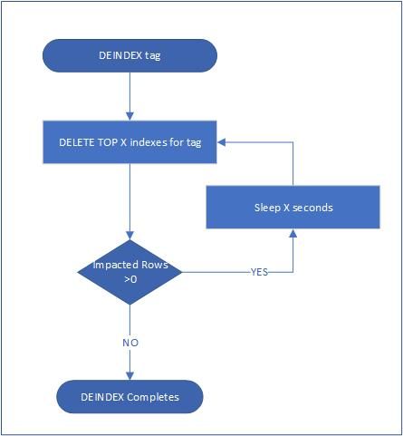

# Custom Tag Design V1
- [Custom Tag Design V1](#custom-tag-design-v1)
- [Requirements](#requirements)
- [Assumptions](#assumptions)
- [End to End Scenario](#end-to-end-scenario)
- [Design](#design)
  - [Design Overview](#design-overview)
  - [CustomTagCache](#customtagcache)
  - [Add Custom Tag](#add-custom-tag)
    - [Overview](#overview)
    - [API](#api)
    - [Custom Tag Store](#custom-tag-store)
    - [Job Store](#job-store)
    - [Tag Job Store](#tag-job-store)
    - [Custom Tag Index Store](#custom-tag-index-store)
    - [CustomTagPropagationTime](#customtagpropagationtime)
    - [Instance Navigation](#instance-navigation)
    - [Error Handling During Reindex](#error-handling-during-reindex)
    - [Time Differences](#time-differences)
    - [Idempotence on Reindex/Deindex](#idempotence-on-reindexdeindex)
    - [HeartBeatTimeStamp](#heartbeattimestamp)
    - [Index Worker](#index-worker)
  - [Remove Custom Tag](#remove-custom-tag)
    - [Overview](#overview-1)
    - [API](#api-1)
    - [Error Handling During Deindex](#error-handling-during-deindex)
  - [Store Dicom Instance](#store-dicom-instance)
  - [Query on Custom Tag](#query-on-custom-tag)
  - [List Custom Tags](#list-custom-tags)
  - [Get Custom Tag](#get-custom-tag)
  - [List Jobs](#list-jobs)
  - [Get Job](#get-job)
  - [Delete Dicom Instance](#delete-dicom-instance)
  - [Job Management (TBD)](#job-management-tbd)


# Requirements

For V1, we want to build a system that functionally works.

1. User should be able to add custom tag
   * After user added custom tag, a reindex job is kicked off, all instances in the past should be indexed, and user should be able to query on status
   * Before reindex job is completed, query on custom tag is denie
   * After user added custom tag, new instances after that should be indexed

2. User should be able to remove custom tag, and all custom tag indexes associated should be removed.

3. User should be able to list custom tags

4. User should be able to get custom tag status 

5. When user upload a new dicom instance, custom tag should be indexed

6. When user delete a dicom instance/series/study, custom tag indexes on them should be removed

 

**Out of scope**

1. Protect custom tag APIs. Only authorized users can invoke them. 

2. Deleting a custom tag that is reindexing, or adding a custom tag that is deindexing. 

3. User is able to manage custom tag job. Start/stop/pause/resume custom tag reindex/deindex jobs

4. User is able to control level of concurrency on reindex/deindex jobs to manage load on the server in flight

5. User can specify a range of instances for reindexing/deindexing

6. User is able to determine whether accept custom tag in query when it’s reindexing/deindexing

7. User can choose whether to reindex/deindexing or not when adding/removing custom tag

 

# Assumptions

·     When adding a new custom tag, user want to reindex every instance in the past.

·     When deleting a custom tag, user want to deindex every instances in the past

·     There are not many custom tags. It could be tens of, at most hundreds of.

·     Add/Remove custom tag is not a frequent work.

 

# End to End Scenario

End to end scenario is in [end_to_end.md](./end_to_end.md)


# Design

## Design Overview

This design optimized performance on STOW and QIDO based on assumption – custom tags are not frequently Change.  We cached custom tag list  in memory (**CustomTagCache**) and only update when required. The design minimized the time where CustomTagCache need to be updated. 


 

## CustomTagCache

To efficiently get custom tag list from database, we can introduce CustomTagCache. CustomTagCache is a cache for custom tag list in database. 
CustomTagCache.Refresh will get latest custom tag information from CustomTagStore, If fail to refresh, should deny the request for error like Internal Server Error (500).

CustomTagCache is retrieved when QIDO and STOW.

 

## Add Custom Tag


### Overview

Adding custom tag is an async operation. When adding custom tag, we should reindex instances. This is a long-time operation, need an reindexing job running on worker to handle with. The reindexing job go through all instances in the past, read metadata from Dicom Storage, and reindex. After each loop, should update job progress. After all instances are reindexed, delete the job, update tag status to Added.

We allow user to add multiple custom tag with one call.

### API

POST //dicomserver/tags

Body:

```json
[
    {
        "path": "00080107",
        "vr": "DT", // can be omitted for standard tags
        "level": 1 // 1 – instance level, 2 – series level, 3 – study level
    },
    {
        "path": "00080050",
        "vr": "SH",
        "level": 3
    }
]
```

Return:

On success will return 202 Accepted with response pay load of 

```json
{
    "tags": [
        {
            "tagid": 3,
            "path": "00080107",
            "vr": "DT", // can be omitted for standard tags
            "level": 1 // 1 – instance level, 2 – series level, 3 – study level
        },
        {
            "tagid": 4,
            "path": "00080050",
            "vr": "SH",
            "level": 3
        }
    ],
    "job": "//dicomserver/jobs/4" // the url to created job
}
```

 

If fail to add any of tags, the whole API call should fail out with error code 406 (Not Acceptable). 

The return should have tag path, vr and level, so that user can differentiate.

 

### Custom Tag Store

Custom Tag Store contains custom tag metadata, it includes: 

·     TagId: id to this tag. Use sequence or identity on SQL database.

·     Path: the path to custom tag.

·     VR: VR to custom tag. Should be string length of 2. For standard tags, this value can be omitted.

·     Level: 1 for instance level, 2 for series, 3 for study

·     Status: there are 3 status, Added and Adding, Deleting, can store as integer. 

* Reindexing: the custom tag is added to database, DICOM working on reindexing on instances.
* Added: the custom tag is added to database, all instances have been indexed.
* Deindexing: the custom tag is being deindexing

more details can be find in [custom_tag_store.md](custom_tag_store.md)

### Custom Tag Metadata Store

Custom Tag metadata store contains metadata of CustomTagStore, now it only has version number. Version number is big integer indicates current version of CustomTagStore. Every time there is update on CustomTagStore, the number increase by 1.

CustomTagStore is updated on below situations:

1. A new custom tag is added

2. An existing custom tag is removed

3. Custom tag status is changed -- e.g: reindex completed.

   

### Job Store

To manage custom tag long running jobs, we need job store, which should include:

·     JobId: the id to this job

·     JobType: Reindex/Deindex custom tag

* Reindex: reindex tag(s)

* Deindex: Deindex tag(s)

·     CompletedWatermark: the watermark of instance that has been indexed. Instances from CompletedWatermark to MaxWatermark should have been completed.

·     MaxWatermark: the latest watermark when the job is created.

·     HeartBeatTimeStamp: Last heartbeat from job executor. Who run this job should keep updating this field periodically, it is used to indicate if the job executor still alive.

·     Status: status of this job, it could be one of :

* Queued: the job has been added to Job store but have not been picked up by job executor (worker) yet.

* Executing: the job has been picked up by worker and executing now.

* Error: Fails to execute the job.

Since job is removed from Job Store immediately after completes, so we don’t need status Completed. 

If worker fails to executed a job for several time consecutively, it should mark the job as Error and stop executing. When a job quits for Error, ideally it should have enough diagnosis information, so that user can fix it and resume. But resuming job is out of scope for V1, we should prioritize that for V2.

 

### Tag Job Store

TagJobStore record relationship between tag and jobs, which should include:

·     JobId

·     TagId

1 job could have multiple tags, while 1 tag is only related to 1 job.

 

### Custom Tag Index Store

This part is in [custom_tag_store.md](./custom_tag_store.md)

 

### Instance Navigation 

To navigate instances, we can use combination of Dbo.Instance.CreatedDate and Dbo.Instance.Watermark.

When navigation, we start from latest DICOM instance when the job is created to earliest one. The reason is that: we may support query during adding custom tag in the future, thinking of when user has more than 10 years old DICOM instances, the reindex could take days. Reindex from latest ones could provide user useful data at beginning. 

 


### Error Handling During Reindex

We should log warning for non-critical error, fail out for critical error.

During navigation, a DICOM instance could have been deleted, in this case, should log a warning.

During navigation, we could fail to index a DICOM instance, in this case, should consider as critical error and fail out.

This is the naïve solution for V1.

Once user can resume the failed jobs on V2, they can fix the issue, and resume the job. The job will start from the failed instance.

This user scenario can be improved better. For example, we can provide user a summary after reindex completes, telling which DICOM instances we failed to handle, so that user can reindex them later after fixed issue. We can evaluate this later.

 

### Idempotence on Reindex/Deindex

Reindexing/Deindex on instances should be idempotent. There are always overlap on time range, which leads to reindexing/deleting index on same instances. This require tag to be unique within scope of individual instance.   

 

### HeartBeatTimeStamp 

Reindex/Deindex job could die for unexpected reason like machine shutdown, we should be able to detect dead job and resume it. The job should keep updating HeartBeatTimeStamp, if not updated for a threshold time, it is treated as dead, should be resumed. We should give enough time for considering a job is dead, so that avoid one job is executed on 2 workers.

If a job is interrupted by application restart, it will be picked up when exceed heartbeat threshold.

 

### Index Worker

Jobs are picked up and executed by Index worker.

Each job should be on different custom tags, 2 jobs on same custom tags are not allowed.

Should config concurrency and delay among each execution to manage load on the server. Because if the job consumed all threads, server could not be able to handle user requests for long time. 

Index worker can be run as background service with Dicom service together on same machine. Assign dedicated resources is another option, but more work is required, and not much benefit, we can evaluate that on V2.

Index worker Configuration

```json
{
    "Indexing": {
        "ConsecutiveFailuresThreshold": 5, // The number of consecutive failures allowed before the job is marked as Error. Setting this number to 0 means job will not be retried (this number should >=0)
        "MaximumConcurrentIndexJobs": 1, // The number of concurrent job allowed. this number should >0.
        "IndexJobPollingFrequency": 5000, // The time between polling indexing jobs (this number should >=0)
        "MaximumQueryCountSize": 100, // The maximum number of items to be returned by the query. (this number should >=1)
    }
}
```

 

## Remove Custom Tag


### Overview

Removing custom tag is similar to Add, it’s also async operation. A deindexing job is created, with EndTimeStamp as now + CustomTagPropogationTime. Different from reindex, it doesn’t need. It simply delete TOP X indexes on tag until no rows are impacted, also EndTime arrives. 

We don’t support buck delete for V1, can consider that for V2.

 

### API

DELETE //dicomserver/tags/<tagid>

Returns:

On success will return 202 Accepted with response pay load of

```json
{
    "Tagid": 3,
    "Status": "Deindexing",
    "Job": "//dicomserver/jobs/4" // the url to created job
}
```

 

### Error Handling During Deindex

We should log warning for non-critical error, fail out for critical error.

I cannot think of a common scenario where deindex fails, we can evaluate errors when encountered into.

A good part on Deindexing is it is much faster than Reindexing, even retrying on whole job won’t take much time, so Error Handling is not a big problem here.

 

## Store Dicom Instance

When STOW, Dicom server invoke STOW Storage Procedure with CustomTag Store version. STOW SP check if the version is latest, and error out if not, otherwise store index data.


 

  

## Query on Custom Tag


We have a storage procedure (QIDO SP) which takes version number, and QIDO SQL query string as input, before executing the query, verify version number is latest. If not, fails out without executing the query. When Dicom Server received this error, refresh CustomTagCache and rebuild the query.

·     CustomTagStore Version

Each row or CustomTagStore has row version, anytime row changed, the version increase.

The version type is rowversion which is globally increasing number. 

The max version in CustomTagStore is the version of CustomTagStore.

·     Operations that update CustomTagStore:

1. Add custom tag: when adding custom tag, a new tag should be added to CustomTagStore with status Reindexing.

2. Reindex completes: When reindex completed, tag status is changed from Reindexing to Added.

3. Remove custom tag: when start removing custom tag, it is marked as Deindexing. 

4. Deindex completes: when deindex complete, the tag should be removed from CustomTagStore

    

## List Custom Tags

User can list custom tags. We return all custom tags from CustomTagStore.

**API**

GET //dicomserver/tags

Return:

On success will return 200 OK with response pay load of 

```json
[
    {
        "Tagid": 3,
        "Path": "00080050",
        "VR": "SH",
        "Level": 1,
        "Status": "Added"
    },
    {
        "Tagid": 4,
        "Path": "00080107",
        "VR": "DT",
        "Level": 1,
        "Status": "Reindexing"
    },
    {
        "Tagid": 5,
        "Path": "00090107",
        "VR": "DT",
        "Level": 1,
        "Status": "Deindexing"
    }
]
```

​        

We can evaluate whether including jobs in the future.

Since there should not be many custom tags, we won’t support pagination and query. 

 

## Get Custom Tag

User can get custom tag by id. We query data from CustomTagStore.

**API**

GET //dicomserver/tags/<tagid>

Returns:

On succeeds return 200 OK with response pay load of 

```json
{
    "Tagid": 3,
    "Path": "00080107",
    "VR": "DT",
    "Level": 1,
    "Status": "Reindexing",
    "Job": "//dicomserver/job/4"
}
```

User can open the job link to see job details


## List Jobs

For V1, we don’t support listing all jobs. Can evaluate for V2

 

## Get Job

User  can get job by jobid. We query it from CustomTagJobStore

**API**

GET //dicomserver/jobs/<jobid>

On succeeds return 200 OK with response pay load of 

```json
{
    "JobId": 4,
    "TagId": 3,
    "JobType": "Reindex",
    "CompletedWatermark": null,
    "BoarderWatermark": 1023,
    "EndTimeStamp": "2012-04-23T17: 45: 00.000Z",
    "HeartBeatTimeStamp": "2012-04-23T18:00:00.000Z",
    "Status": "Queued"
}
```

 

## Delete Dicom Instance

The associated custom tags are also removed from CustomTagIndexStore.

 

## Job Management (TBD)

 We are evaluating a job framework shared between FHIR and DICOM

 