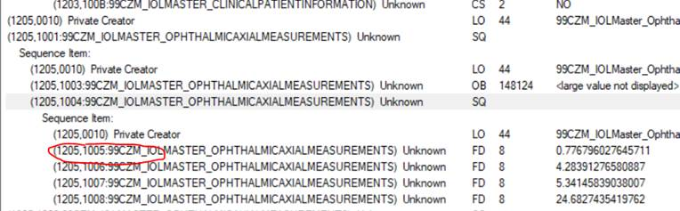

- [Context](#context)
  - [Dicom Custom Tag](#dicom-custom-tag)
  - [Attribute Match](#attribute-match)
  - [Notes](#notes)
- [CustomTags Table](#customtags-table)
- [Custom Tag Data Table](#custom-tag-data-table)
    - [Mapping between custom tag data type and SQL data type](#mapping-between-custom-tag-data-type-and-sql-data-type)
      - [Open Questions](#open-questions)
    - [Optimization](#optimization)

# Context


## Dicom Custom Tag

Dicom tag is composed of standard tags and private tags. Standard tags is commonly known tags, full list can be found [here](http://dicom.nema.org/medical/dicom/current/output/chtml/part06/chapter_6.html). Private tags are typically just documented by a device manufacturer in the DICOM Conformance Statement for the product adding the private tags, details can be found [here](http://dicom.nema.org/dicom/2013/output/chtml/part05/sect_7.8.html).

There are a list of standard tags are required to support in [standard](http://dicom.nema.org/medical/dicom/current/output/chtml/part18/sect_10.6.html#table_10.6.1-4), we currently support a [subset](https://github.com/microsoft/dicom-server/blob/master/docs/resources/conformance-statement.md#search-qido-rs).

Custom tags are any tags we don't support by default and are not required to be supported by the standard.

## Attribute Match
There are 6 type of attribute matching, and we currently support 2 of them: Range Matching, Single Value Matching. Full list can be found [here](http://dicom.nema.org/medical/dicom/current/output/chtml/part04/sect_C.2.2.2.html). For this design, we will initially only support range matching and single value matching.


## Notes
* GCP doesn’t support query on custom tags.
* No clear definition in standard for QIDO on custom tags.

# CustomTags Table

```sql
    CREATE  TABLE dbo.CustomTags (
    TagKey BIGINT NOT NULL,
    TagPath VARCHAR(64) NOT NULL,
    TagVR VARCHAR(2) NOT NULL,
    TagLevel TINYINT,
    );
```

- Tag path: the path of tags from root to specific element. 

  - Top-level tag: 12051005

  - Sequenced tag: 120510011205100412051005 (red circled one)

    

  - Note that on API level, we use 12051001.12051004.12051005 for readability and also match with [standard](http://dicom.nema.org/medical/dicom/current/output/chtml/part18/sect_10.6.html#table_10.6.1-4)

- TagKey represents an internal value to be a key between the various custom tag tables.
  

# Custom Tag Data Table


Each datatype has individual table, totally have 5 tables.

 * String
```sql
    CREATE TABLE dbo.CustomTagString (    
    StudyKey BIGINT NOT NULL,    
    SeriesKey BIGINT,    
    InstanceKey BIGINT,    
    TagKey BIGINT NOT NULL,    
    TagValue NVARCHAR(64) NOT NULL,
    Watermark BIGINT NOT NULL,
    );
```
 * Int on different level
```sql
    CREATE TABLE dbo.CustomTagInt (    
    StudyKey BIGINT NOT NULL,    
    SeriesKey BIGINT,    
    InstanceKey BIGINT,    
    TagKey BIGINT NOT NULL,    
    TagValue BIGINT NOT NULL,  
    Watermark DATETIME2(7) NOT NULL,  
    );
```
* Double on different level
```sql
    CREATE TABLE dbo.CustomTagDouble (
    StudyKey BIGINT NOT NULL,    
    SeriesKey BIGINT,    
    InstanceKey BIGINT,    
    TagKey BIGINT NOT NULL,    
    TagValue FLOAT(53) NOT NULL, 
    Watermark BIGINT NOT NULL,   
    );
```
* Datetime on different level
```sql
    CREATE TABLE dbo.CustomTagDateTime (    
    StudyKey BIGINT NOT NULL,    
    SeriesKey BIGINT,    
    InstanceKey BIGINT,    
    TagKey BIGINT NOT NULL,    
    TagValue DATETIME2(7) NOT NULL, 
    Watermark BIGINT NOT NULL,   
    );
```

- PersonName on different level (similar to how we index patient names today for fuzzy matching.)

```sql
    CREATE TABLE dbo.CustomTagPersonName (    
    StudyKey BIGINT NOT NULL,    
    SeriesKey BIGINT,    
    InstanceKey BIGINT,    
    TagKey BIGINT NOT NULL,    
    TagValue NVARCHAR(324) NOT NULL, 
    TagValueWords AS REPLACE(REPLACE(TagValue, '^', ' '), '=', ' ') PERSISTED,
    Watermark BIGINT NOT NULL,   
    );
```
When reindex tag of study level on instance, if there is already one, compare watermark, the bigger watermark wins.

### Mapping between custom tag data type and SQL data type

Custom tag data could be any VR type, it will be saved as mapping below. VR details can be found in [standard](http://dicom.nema.org/dicom/2013/output/chtml/part05/sect_6.2.html#:~:text=%20%20%20%20VR%20Name%20%20,16%20bytes%20maximum%20%2012%20more%20rows%20).

| VRCode | Name                    | Type             | Range(byte)    | SQL Type      | Comments                                                     |
| ------ | ----------------------- | ---------------- | -------------- | ------------- | ------------------------------------------------------------ |
| AE     | Application Entity      | string           | <=16           | NVARCHAR(64)  |                                                              |
| AS     | Age String              | String           | 4              | NVARCHAR(64)  |                                                              |
| AT     | Attribute Tag           | Uint             | 4              | BIGINT        |                                                              |
| CS     | Code String             | string           | <=16           | NVARCHAR(64)  |                                                              |
| DA     | Date                    | Date(string)     | 8              | DATETIME2(7)  | Eligible for range match                                     |
| DS     | Decimal String          | Decimal (string) | <=16           | NVARCHAR(64)  |                                                              |
| DT     | Date Time               | DateTime         | <=26           | DATETIME2(7)  | Eligible for range match.                                    |
| FL     | Floating Point Single   | float            | 4              | FLOAT(53)     |                                                              |
| FD     | Floating Point Double   | double           | 8              | FLOAT(53)     |                                                              |
| IS     | Integer String          | Int(string)      | <=12           | NVARCHAR(64)  |                                                              |
| LO     | Long String             | string           | <=64           | NVARCHAR(64)  |                                                              |
| PN     | Person Name             | string           | <=324(=64*5+4) | NVARCHAR(324) | Support fuzzy matching, matching is case in-sensitive and accent in-sensitive. |
| SH     | Short String            | string           | <=16           | NVARCHAR(64)  |                                                              |
| SL     | Signed Long             | slong            | 4              | BIGINT        |                                                              |
| SS     | Signed Short            | Sshort           | 2              | BIGINT        |                                                              |
| TM     | Time                    | Datetime         | 16             | DATETIME2(7)  | Eligible for range match                                     |
| UI     | Unique Identifier (UID) | String           | 64             | NVARCHAR(64)  |                                                              |
| UL     | Unsigned Long           | Ulong            | 4              | BIGINT        |                                                              |
| US     | Unsigned Short          | Ushort           | 2              | BIGINT        |                                                              |

#### Open Questions

1. How to handle Floating Point Single and Floating Point Double?

   | Solution  | Pros                     | Cons                                      | Comments                                                     |
   | --------- | ------------------------ | ----------------------------------------- | ------------------------------------------------------------ |
   | FLOAT(53) | Able to process all data | Not able to do equal comparison some time | Ensure conversion to float via [SqlDataReader SqlTypes typed accessor]([SQL Server Data Type Mappings - ADO.NET) |


### Optimization
Cluster/non-cluster Index should be used for query performance improvement

