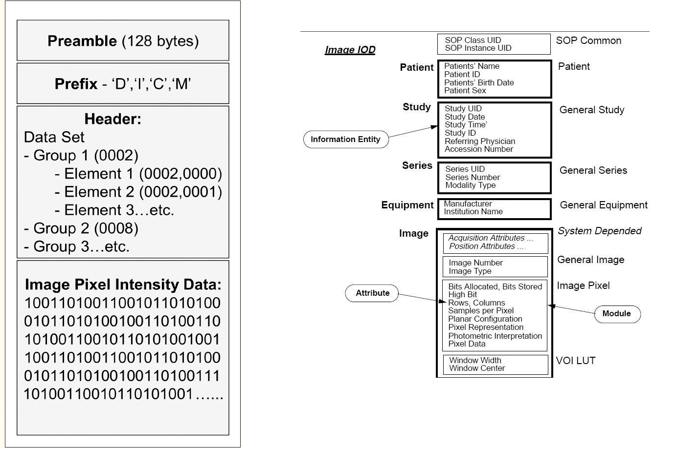

DICOM stands for Digital Imaging and Communication in Medicine.

DICOM is not just a image or a file format. It is an all-encompassing data tranfer, storage and display protocol built and designed to cover all functional aspects of contemporary medicine.

PACS (Picure Archiving and Communication System) are medical system built to run digital medical imaging. They compries:
1. *Modalities:* Digital image acquisition devices, sucn as CT scanners and ultrasound.
2. *Digital image archives:* Where the acquired images are stored.
3. *Workstations:* Wehre radialogists view the images

PACS functionality is DICOM-driven, which gurantees their interoperability within the system.

#### DICOM file

DICOM files contain a file header portion, File Meta Information portion, and a single SOP instance. The header is made up of a 128 byte preamble, followed by the characters DICM, all uppercase. The preamble must contain all zeroes if it is not used (sometimes applications will use it for proprietary data).

Following the header is the File Meta Information. This portion follows a tagged file format, and contains information about the file, the series and study it belongs to, and the patient that it belongs to. 

In the DICOM model, a patient can have 1..n studies (sometimes referred to as exams or procedures). Each study consists of 1..n series. A series generally equates to a specific type (modality) of data, or the position of a patient on the acquisition device. Each series contains 1..n DICOM object instances (most commonly images, but also reports, waveform objects, etc.). All of this information is contained in each DICOM object of a study. Therefore, if a study is performed on a patient, containing 2 series, each with 10 instances, all of the instanceswill contain the patient and study information in it's header. The instances will also contain information regarding the series it is in, as well as its instance information.

#### Additional Resources
- [DICOM Introduction presentation](https://microsoft.sharepoint.com/teams/msh/Shared%20Documents/Project%20Resolute/Medical%20Imaging%20and%20Media/Introduction%20to%20DICOM.pptx?d=wa2f95d3a33164cce8cdcf1ac3d2644c8)
- [DICOM Introduction recording](https://msit.microsoftstream.com/video/977cc741-5e4f-4cdd-bc26-2bc4dd99521a)
- [Latest Spec](https://www.dicomstandard.org/current/)
