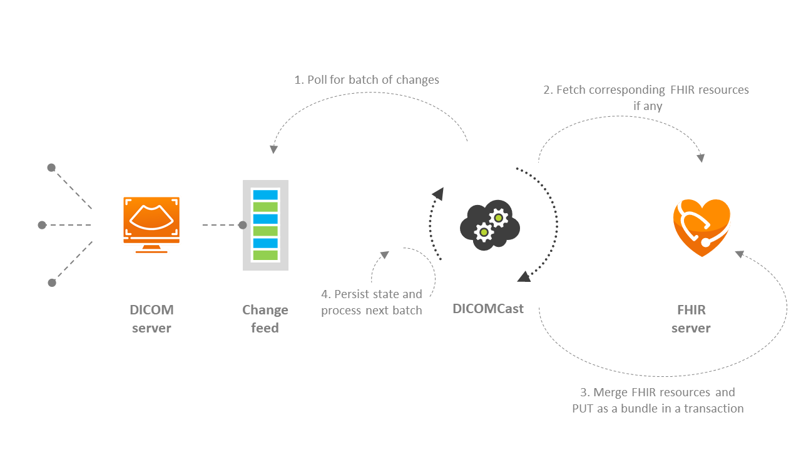
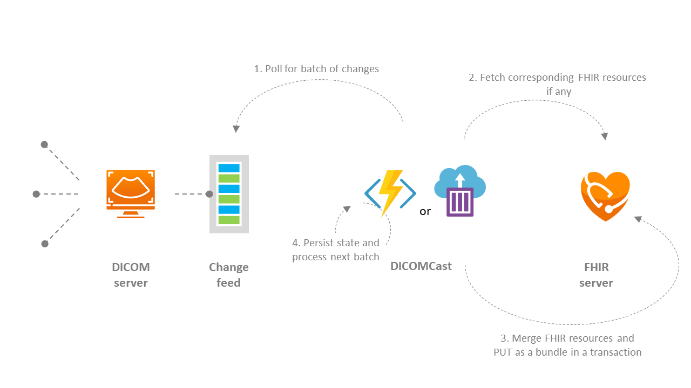
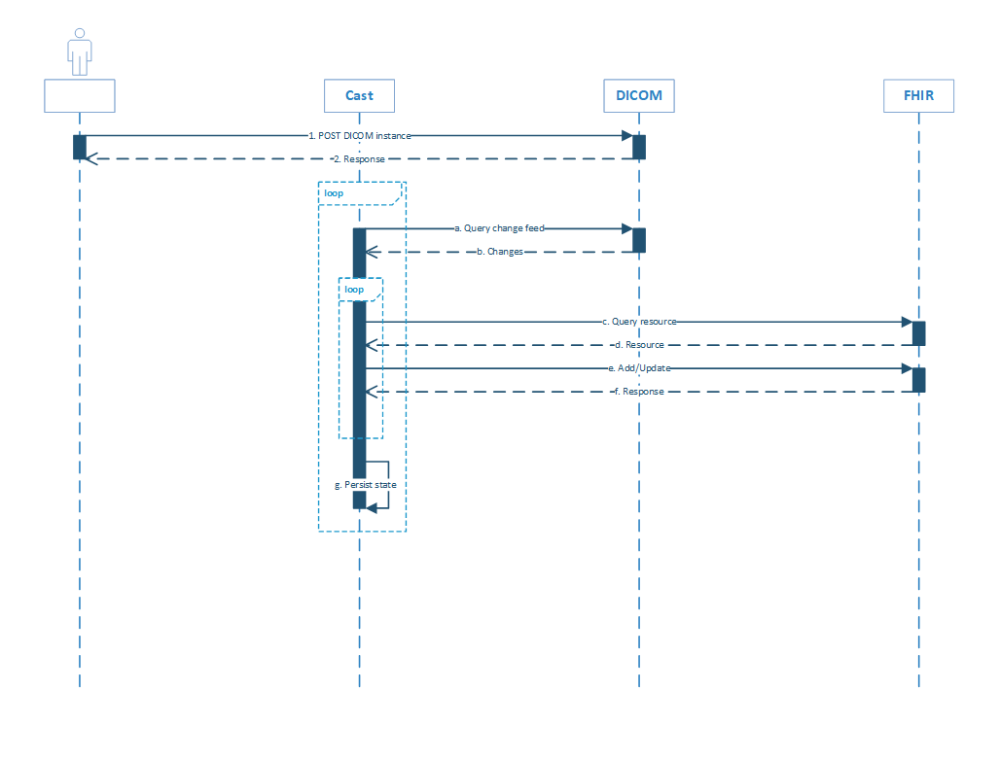
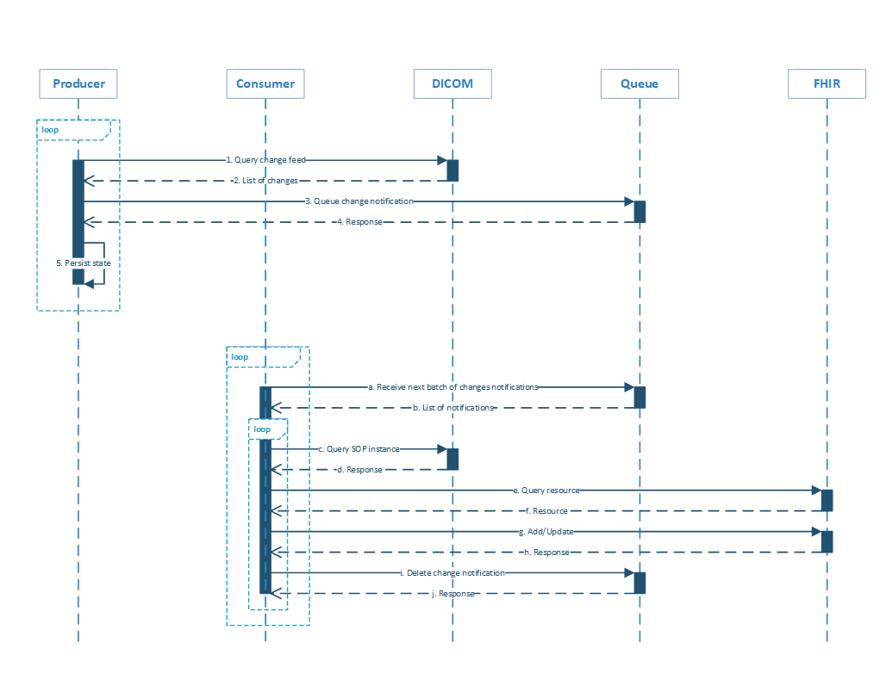
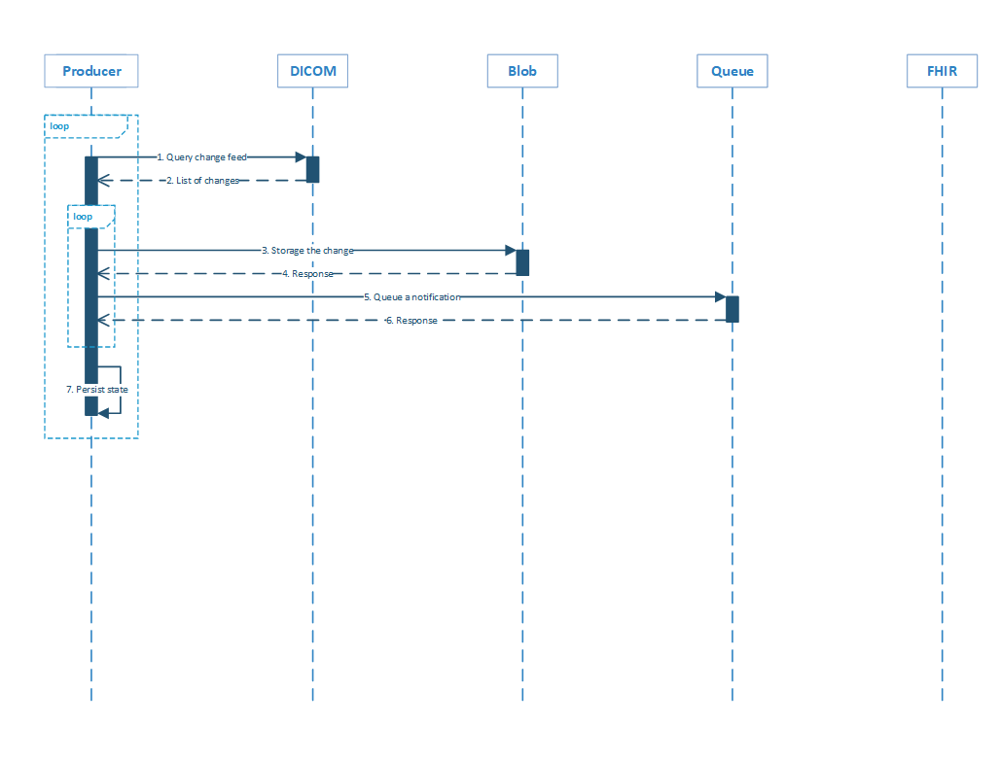
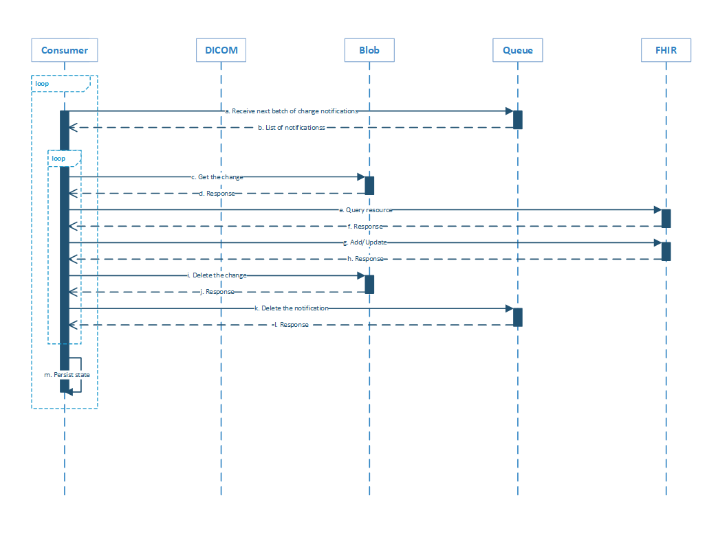

DICOMCast (naming TBD) allows the DICOM instance information to be synchronized from DICOM server to FHIR server.

[[_TOC_]]

# Business Justification

By allowing synchronizing the data from a DICOMweb service to the FHIR service, we can enable healthcare professionals, ISVs, and medical device vendors to innovate in new ways.

# Scenarios

For instance, teleradiologists, a growing percentage of radiologists worldwide, are under pressure to read dozens of cases per day. Yet, they are rarely given clinical feedback on their initial findings to improve their abilities. By incorporating imaging data into FHIR, solutions could notify radiologists when their diagnostic report didn't match the clinical results.

# Metrics

- Queue length
- Average leading time
- Average processing time
- Success/failure processing count

# Design

## DICOMCast

There are multiple ways to design the process that synchronized the changes from DICOM server to FHIR server.

The proposed design is to have the DICOMCast as a separate process that sits outside of the DICOM server and FHIR server.

This provides a few benefits including the following:

- It’s a cleaner architecture.
  - DICOM server only knows about DICOM.
  - FHIR server only knows about FHIR.
  - It gives the flexibility for the process to evolve on its own.
- It should have its own configuration and monitoring.
  - There will be complicated mapping configurations.
  - There needs to be a way to monitor sync progress and address issues.
  - Overloading these onto FHIR/DICOM complicates things.
- It can scale independently.
- We can choose to make the repo public or private.

### MVP

For the MVP of the DICOMCast, we are going to implement:

1. A single-threaded process that reads from DICOM change feed and writes to FHIR server.
1. The process will be hosted by Azure Function or Container.
1. The mapping will be minimum and will be hard-coded.
1. If there is time, simple batching and de-duping will be supported.

#### MVP: Architecture diagram

#### MVP: Sequence diagram

A background process will continuously poll from the DICOM change feed periodically. It then process each of the change in-order.

For each change, it needs to determine if a corresponding ImagingStudy exists in the FHIR server or not. If it doesn't exist, then it will create one. If the ImagingStudy already exists, then it will modify the Series/Instance array accordingly.

#### MVP: Consistency

Because each change is processed in-order and the process will not advance unless the item has been processed correctly, the resource in FHIR server will eventually be consistent. This, however, could be a problematic since failure in a processing could block the entire pipeline.

#### MVP: Concurrency

Since it's single-threaded, there will not be concurrency problem.

#### MVP: Fault-tolerance

Recovering from failures are pretty simple in this architecture because every step is repeatable.

- If step a or step c fails, the process will just restart.
- Step e might be a noop if the resource has already been updated previously.
- If step g fails, the process will reprocess the same batch.

#### MVP: Trade-offs

Pros:

- Very simple architecture.
- The changes are processed in-order, which makes the synchronization easier.
- The FHIR resource gets all over the history of the instance.

Cons:

- Single point of failure.
- Not scalable since the changes are processed in-order.
- Unnecessary update.

### Improved MVP

One of the issue with the previous approach is the single point of failure. We don't want failure in processing one change blocks everything else from being updated but we also want to ensure that the resource in FHIR will eventually reflect the state in DICOM server.

In the improved design, we will have two processes: a producer, which reads the change feed and queue change notifications, and consumer(s), which process those change notifications.

#### Improved MVP: Sequence diagram

The producer will continuously poll from the DICOM change feed periodically. For each change that it has detected, it will insert a change notification to the queue. The change notification only contains the identifier to the SOP instance and does not contain the metadata.

The consumers will continuously poll from the queue. It will first receive batch of change notifications (the notifications will be hidden from other consumers for period of time). For each of change notification, which is a SOP instance, it will query the DICOM server to get the latest copy. It will then execute the same logic as previously by creating or updating the ImagingStudy resource in the FHIR server.

Once the resource is updated correctly, it will then delete the notification from the queue.

#### Improved MVP: Consistency

Because the consumer will query the DICOM server to get the latest change before it modify the resource in the FHIR server, as long as we make sure FHIR server is updated with optimistic concurrency (that is we don't overwrite changes done by others), the resource in FHIR server will eventually be consistent.

For optimistic concurrency, there are few scenario to consider:

1. There is no ImagingStudy in FHIR server so the consumer determines that an instance of ImagingStudy needs to be created. Imagine the case where an external process creates the ImagingStudy after the check but before creating it. In this case, the create call would fail with conflict.
1. There is ImagingStudy and the SOPInstance entry does not exist so the consumer determines that the ImagingStudy needs to be updated. The consumer will keep track of the ETag returned by the server and uses the `If-Match` with the ETag value when it does the update. If the resource was updated by external process between the time it was retrieved and updated, then the update call would fail with conflict.
1. There is ImagingStudy and the last SOPInstance entry is being removed so the consumer determines that the ImagingStudy needs to be deleted. We will also use ETag and `If-Match` header to ensure that the resource is only deleted if no external process has modified it while it's being processed.
    - I just looked up the FHIR spec and it seems like it doesn't support `If-Match` header for delete.

For any of the cases above, once conflict is detected, the consumer can simply reprocess the change notification by starting from step c again.

#### Improved MPV: Concurrency

Because we could have multiple consumers, we could have multiple threads processing the same SOP instance at the same time.

Consider the following example:

1. SOP instance got added.
2. SOP instance got deleted.
3. SOP instance got added again.

This will queue 3 notifications. Let's assume there are 3 consumers with batch size of 1. We will end up with 3 processes each taking one of the notifications. After the consumers pick up the events, they will start processing. All of them will eventually try to create/update the same ImagingStudy resource. But because we will use optimistic concurrency described above, one of of the consumers will be able to successfully create/update the resource. The rest of the consumers will get conflict and will retry again but it will detect that the ImagingStudy already has the latest change and therefore will be noop.

#### Improved MVP: Fault-tolerance

- If step 1 or step 3 fails, the process will just restart itself.
- If step 3 succeeds but the response is not received by the producer, then the retry will inserts the same items in the queue again. However, this will not be a problem since the consumer will always query the DICOM server to get the latest before processing, so it will just be extra processing.

- If step a fails, the process will just restart itself.
- If step c, step e, or step g fails, the change notification will not be deleted and the consumer will retry it later. Even if the notification gets processed out-of-order, it wouldn't matter since the consumer will always query the DICOM server to get the latest before processing.
- Step g might be noop because the resource in FHIR server might already represent the latest state.
- If step i fails, then the change will be processed again, and it will simply be noop.

#### Improved MVP: Trade-offs

Pros:

- Relatively simple architecture.
- Because it always query the DICOM server for the latest status, it does not require in-order delivery.
- Multiple consumers can process the queue.

Cons:

- Each processing requires query to DICOM server (but since we are simply retrieving an instance metadata directly, it should be relatively cheap).
- FHIR server might not see some updates if the changes were collapsed.
- Multiple consumers might process the same SOP instance, which could result in wasted processing cycle.

#### Improved MVP: Further consideration

Further improvements can be done by introducing de-duping.

There are two types of de-duping we can do: server side duplicate detection and client side collapsing.

Since we really only cares about the latest data stored in DICOM server, if there are multiple change notifications for the same SOP instance, we could collapse them when queuing on the server side. We will not be able to do this using Azure Queue, but we can use other storage mechanisms such as Azure Service Bus, which supports duplicate detection, Azure Blob Storage, or Azure SQL server.

The consumer can also do some de-duping within the batch. Once it picks up the change notifications, it can then de-dup based on the SOP instance.

### Blob + Queue

The previous example requires the consumer to query the DICOM server every time before it process the change. By using the Change feed with option to include metadata, Blob storage, and Queue, we can avoid hitting the DICOM server and still maintain eventual consistency.

Build on top of the idea that DICOMCast only cares about the latest state, if we can store the latest metadata somewhere outside of the DICOM server, then we don't have to query DICOM server every time before processing.

#### Blob + Queue: Sequence diagram

The producer will continuously poll from the DICOM change feed with the option to include the metadata periodically. For each change that it has detected, it will write the metadata to a blob storage. The blob path is determined by the StudyInstanceUID/SeriesInstanceUID/SOPInstanceUID so that it is deterministic. It will overwrite the blob even if the blob exists. This ensures that the the blob will always have the latest content.

Once it successfully writes the metadata to the blob storage, it will then queue a change notification.

The consumers will continuously poll from the queue. It will first receive batch of change notifications. For each of change notification, which is a SOP instance, it will get the metadata from the blob storage. It will then execute the same logic as previously by creating or updating the ImagingStudy resource in the FHIR server.

Once the resource is updated correctly, It can do one of the two things:

1. Leave the blob and delete the change notification.
1. Delete the blob and delete the change notification.

Leaving the blob will incur extra charge for the data but might make the concurrency a little bit easier. If we decide to delete the blob, then we will need to make sure we handle the concurrency correctly.

#### Blob + Queue: Consistency

The same optimistic concurrency will be used to ensure only one process can update the resource in FHIR server at any given moment. However, because we are using blob storage as a buffer to store the metadata, we have some more interesting scenarios to consider in the concurrency section below.

#### Blob + Queue: Concurrency

The producer will write to the blob with the latest information it has retrieved from the change feed, and because we process the change feed in single-thread, the blob storage should not have issues with the metadata being out-of-order.

The consumer is a little be more interesting because multiple producer/consumer are operating on the same blob for a given SOP instance.

Consider the the following example where we do want to delete the blob at the end of processing:

1. Producer writes the newly added metadata to the blob.
2. Consumer retrieves the metadata and start processing.
3. Producer writes the deleted to the blob.
4. Consumer finishes processing the change and tries to delete the blob.

Because the consumer has successfully finished processing the change, it will try to delete the blob. But because there was an update that happened while the consumer was processing it, we don't actually want to delete the blob in this case. To solve this problem, we can once again use the `If-Match` header to make sure that the blob didn't get updated while it's being processing. if the blob is deleted successfully, then it means the SOP instance was not updated while the change was being processed. Otherwise, it means that the SOP instance was modified and we should leave the blob as is so that it can be processed later by another notification or the process could restart right away since it knows there is a new pending change.

#### Blob + Queue: Fault-tolerance

For the producer, it's the same as previous.

For the consumer, it's also very similar to previous with the addition of step i and step j. These steps can be repeated and the consumer will need to be able to handle the fact the blob might have already been deleted.

#### Blob + Queue: Trade-offs

Pros:

- It uses the blob storage as a temporary storage so it does not require the consumer to query DICOM server before processing.
- Multiple consumers can process the queue.

Cons:

- More complex architecture.
- FHIR server might not see some updates if the changes were collapsed.
- Multiple consumers might process the same SOP instance, which could result in wasted processing cycle.
- Might be more expensive since it requires much more additional storage.

## Mappings

### Mapping for MVP

For MVP, the we will have hard-coded mapping and will keep them minimum.

**Patient:**

| Property | Tag Id | Tag Name | Note |
| :------- | :----- | :------- | :--- |
| Patient.identifier.where(system = '') | (0010,0020) | PatientID | For now, the system will be empty string. We will add support later for allowing the system to be specified. |
| Patient.name.where(use = 'usual') | (0010,0010) | PatientName | PatientName will be split into components and added as HumanName to the Patient resource. |
| Patient.gender | (0010,0040) | PatientSex ||

**Endpoint:**

| Property | Tag Id | Tag Name | Note |
| :------- | :----- | :------- | :--- |
| Endpoint.status ||| The value 'active' will be used when creating Endpoint. |
| Endpoint.connectionType ||| The system 'http://terminology.hl7.org/CodeSystem/endpoint-connection-type' and value 'dicom-wado-rs' will be used when creating Endpoint. |
| Endpoint.address ||| The root URL to the DICOMWeb service will be used when creating Endpoint. The rule is described in http://hl7.org/fhir/imagingstudy.html#endpoint. |

**ImagingStudy:**

| Property | Tag Id | Tag Name | Note |
| :------- | :----- | :------- | :--- |
| ImagingStudy.identifier.where(system = 'urn:dicom:uid') | (0020,000D) | StudyInstanceUID | The value will have prefix of `urn:oid:`. |
| ImagingStudy.status | | | The value 'available' will be used when creating ImagingStudy. |
| ImagingStudy.modality | (0008,0060) | Modality | Or should this be (0008,0061) ModalitiesInStudy? |
| ImagingStud y.subject | | | It will be linked to the Patient above. |
| ImagingStudy.started | (0008,0020), (0008,0030), (0008,0201) | StudyDate, StudyTime, TimezoneOffsetFromUTC | More detail about how timestamp is constructed below. |
| ImagingStudy.endpoint | | | It will be linked to the Endpoint above. |
| ImagingStudy.note | (0008,1030) | StudyDescription | |
| ImagingStudy.series.uid | (0020,000E) | SeriesInstanceUID | |
| ImagingStudy.series.number | (0020,0011) | SeriesNumber | |
| ImagingStudy.series.modality | (0008,0060) | Modality | |
| ImagingStudy.series.description | (0008,103E) | SeriesDescription | |
| ImagingStudy.series.started | (0008,0021), (0008,0031), (0008,0201) | SeriesDate, SeriesTime, TimezoneOffsetFromUTC | More detail about how timestamp is constructed below. |
| ImagingStudy.series.instance.uid | (0008,0018) | SOPInstanceUID | |
| ImagingStudy.series.instance.sopClass | (0008,0016) | SOPClassUID | |
| ImagingStudy.series.instance.number | (0020,0013) | InstanceNumber | |

_Timestamp:_

DICOM has different date time VR types. Some tags (like Study and Series) have the date, time, and UTC offset stored separately. This means that the date might be partial. We will try to translate this into partial date syntax allowed by the FHIR server.

# Open Questions

- How to deal with ImagingStudy modified by outsider?
  - We can make it readonly if the ImagingStudy was created by the DICOMCast but it's a little bit tricky because we probably still need allow admin to force delete if it need to (in which cause does that mean subsequence update should not automatically create another ImagingStudy?) and also what happens if ImagingStudy already existed?
- How to deal with inconsistent values. Last write wins?

# Test Strategy

In order to reduce the test time, most of the testing will depend on unit tests and integration tests. The integration tests will require light weight DICOMWeb and FHIR emulators to produce synthetic data. Ultimately, we do want some E2E test coverage to make sure the pipeline is working correctly.

# Security

For accessing the DICOMWeb and FHIR server, we will utilize built-in authentication and authorization.

# Other

*Describe any impact to privacy, localization, globalization, deployment, back-compat, SOPs, ISMS, etc.*
