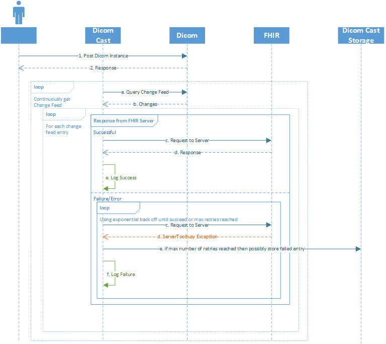

# Dicom Cast Retry Policy and Failure Resilience

## Problem
 Currently when processing change feed entries, certain errors cause the entire dicom-cast application to shut down and stop processing all change feed entries. The current logging of failures is also incomplete as it is difficult for the user to track down which specific dicom file caused the issue.

 ## Goals
 1. Comprehensive retry policy for errors that can be resolved without reuploading a dicom file
    1. In v1 we will allow for the change feed to continue processing and store failed change feed entries, but we will not retry them.
    1. In a future version we may retry entries based on a signal from the user triggering a retry.
 1. Proper logging of failures to allow users to fix any errors on the Dicom or FHIR side
 1. Configurable levels of validation

 # Types of Errors
 
 ## Transient Errors

 These are errors that we expect to be resolved on their own with the passing of time. 
 
 Examples: Server Too Busy Exception from FHIR, Timeout waiting for response from FHIR

 **Retry Policy for Transient Errors**
 1. Retry the same entry with exponential back off (or a similar backoff policy)
    1. Log each failure
 1. Do not process additional change feed entries until retry this one x amount of times
 1. After x times, mark it as un-processable, log an error and then move onto the next entry
	1. Essentially reclassifying it as an intransient error
    1. Place it into some storage where we will not retry- Azure Table Storage. The user will be able to access this and see failed change feed entries

Future work itmes: Expose an endpoint or way for user to access all the failed entries and information about them without having to access the storage directly.

## Intransient Errors

These can be broken down further into errors that are caused by the FHIR server or errors that are due to the dicom file containing invalid data. For the FHIR errors we will implement a retry policy, whereas we will not implement a retry policy for errors that are due to invalid data from a dicom file.

### **Fhir side errors**

These errors are errors that we get from the FHIR server when we either try to retrieve an existing resource to modify it or when we make a transaction to update/create resources. Since they are errors that are on the FHIR side, most of them can be resolved by manually fixing something in the FHIR server. Since the dicom file does not need to be changed for this to be fixed, the changes would never get captured in the change log so unless the user deletes and reuploads the dicom file the change feed entry would not be processed again. 

For now we will notify users of these errors, but in the future, we would like to create a retry policy for these cases.

Some examples of these errors and how they can be handled are following:

| Exception | Thrown | Reason/Fix | 
| :------- | :----- | :------- | 
| ResourceConflictException | A FHIR resource has been modified or created that we are also trying to change | Could possibly be resolved with automatic retry (currently we do this) |
| MultipleMatchingResourceException | When trying to retrieve an existing FHIR resources and there are multiple | One will most likely need to be manually deleted | 
| FhirResourceValidationException | When the FHIR resource retrieved is invalid | Some of the data in the FHIR resource is invaid, would need to be manually updted |
| TransactionFailedException | By FHIR server in response to a request |  | 
| InvalidFhirResponse | When get a response from FHIR after posting bundle when processing the response we find an error with it. | Most likely due to an error when processing the request in the FHIR server. Uncertain of fix. |

For a few of these errors, automatically retrying could possibly result in a success, where as for the others it would require a manual update on the FHIR side before the change feed entry could be processed successfully. 

**v1 retry policy**
(or lack there of)

After review, it was determined that in v1 for these errors we will not implement a retry policy due to unkowns regarding when the items will be ready to retry.

For intransient errors that are thrown we will catch them so that we can continue to process change feed entries. We will store failed change feed entries into a table in Azure Table Storage so that the user can find entries that we failed to process.

We will also move the sync state from the blob storage and put it into Azure Table Storage. 

**Possible v2 Retry Policy:**
1. Place any failed change feed entrys into the persistant storage for dicom-cast
    1. In addition to the change feed entry, we should store the number of times it has failed, time of most recent failure, and possibly the reason for the failure
1.  User notifies dicom-cast to retry previously failed change feed entry. (The exact method for this notification has not yet been determined)
1.  Make a request for the updated change feed entry from the dicom server
1.  If the change feed entry is "current" (not replaced or deleted) then add the entry to the current batch of changes being processed and process it
	1. If it is replaced or deleted then remove from the storage and continue processing other events
1. If get an error while processing again 
    1. Log an error and update the storage with number of times failed, error and any other pertinent information.

**Open Questions:**
1. What should the time period for retry be and how often should we retry?
    1. Answer: For now we will not have a retry policy for these errors, the failed change feed entries will just be stored and the user can directly see what failed. We will then continue to process items on the change feed.
1. At what point do we give up on retrying? (after x amount of time or x amount of retries)
    1. At this point for these errors we will not automatically retry, we prefer that the user notifies us somehow and we use that to trigger a retry. This will be implemented in a future iteration.
1. What is the form of storage that we should use?
    1. Storage Blob
    1. Queue Stoarge
    1. Table Storage
        1. We decided to go with this as it allows us to persist the data, retrieve and update it as needed, and also can be used to store the syncstate (data on how much of the change feed dicom-cast has processed that is currently being stored in a storage blob.).

### **DICOM Side Errors**
These errors  are the errors that are raised due to the change feed entry having a problem in it, particularly if the metadata is missing information or is an invalid format.
We will not have a retry policy for these because they require the dicom file to be reuploaded, but they may be stored in FHIR depending on level of validation configured in dicom-cast

**Validation levels**
1. Full Validation
    1. We will only do the transaction if all the meta data we get is valid
        1. In the case that there is invalid data we will not try to make a FHIR transaction, we will just log the error. The solution is for the user to delete the instance and reupload which would be captured in the change feed.
        1. Persist which entries failed in Azure Table Storage so user can access if needed.
1. Partial Validation (best effort store)
    1. As long as the required elements for the transaction (like InstanceID etc) are present we will complete the transaction.
        1. For any data that is invalid we will log a warning saying which field is invalid and that we did not store it into FHIR
        1. Possibly persist data that is failing to be stored in a table so user can access.

The level of validation should be configurabble and the user can set it in the application settings.

## Logging Policy

**General**

Update logging to log more specific information. For change feed entry that fails will log specifics about the dicom instance such as the study, series, and instance ids so the user can fix the particular instance. 

For FHIR side errors add in possible solutions to the errors.

**Logging Notification Interface**

To allow oss users more flexibility on how the want to get errors, we will abstract the logging by one level by creating an interface. Our implementation of the interface will use the Logger to continue logging to Application Insights as it does currently. Users could possibly implement  their own version to get alerts and notifications as they want.

## Testing Strategy

Unit tests to test individual components such as storing to Azure Table Storage and continuing proccessing of change feed in case of a failure when processing a change feed entry.

## Metrics
Some metrics we may consider tracking for v1

1. Rate of failure
1. Last time changfeed entry properly stored
1. How far behind we are in processing the changefeed
1. Number of items that we gave up retrying on (for transient errors)

## Alerts
Some possible alerts we may consider
1. If the error rate is too high or trending up
1. If we keep getting transient errors
1. Multiple change feed entries failing for same reason

