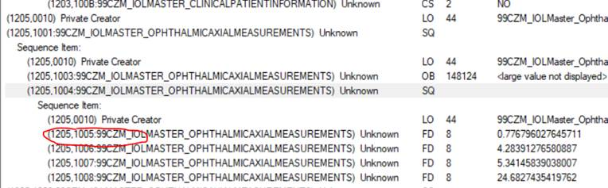
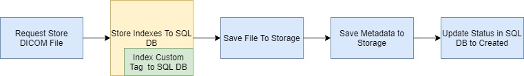
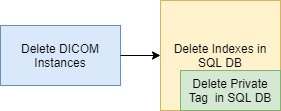
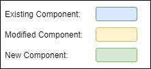
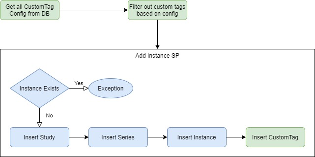
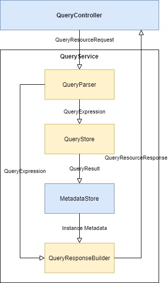
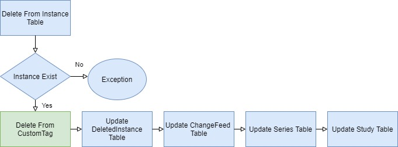

- [Context](#context)
  - [Dicom Custom Tag](#dicom-custom-tag)
  - [Attribute Match](#attribute-match)
  - [Notes](#notes)
- [Configuration](#configuration)
  
  - [Where to save custom tag configuration?](#where-to-save-custom-tag-configuration)
    - [Notes](#notes-1)
  - [Should we migrate existing tags into custom tag?](#should-we-migrate-existing-tags-into-custom-tag)
  
  - [High Level Design](#high-level-design)
    - [Notes](#notes-2)
    - [Open Question](#open-question)
  - [Low level design](#low-level-design)
    - [CustomTags table](#customtags-metadata-table)
- [Indexing Changes for custom tag](#indexing-changes-for-custom-tag)
  
  - [High Level Design](#high-level-design-1)
    - [Overview](#overview)
  - [Low Level Design](#low-level-design-1)
    - [Mapping between custom tag data type and SQL data type](#mapping-between-custom-tag-data-type-and-sql-data-type)
      - [Open Questions](#open-questions-1)
    - [Custom Tag Data Table](#custom-tag-data-table)
      - [Open question:](#open-question-1)
    - [Update on STOW/QIDO/DELETE](#update-on-stowqidodelete)
    - [Database Migration (TBD)](#database-migration-tbd)
    - [Optimization](#optimization)

# Context


## Dicom Custom Tag

Dicom tag is composed of standard tags and private tags. Standard tags is commonly known tags, full list can be found [here](http://dicom.nema.org/medical/dicom/current/output/chtml/part06/chapter_6.html). Private tags are typically just documented by a device manufacturer in the DICOM Conformance Statement for the product adding the private tags, details can be found [here](http://dicom.nema.org/dicom/2013/output/chtml/part05/sect_7.8.html).

There are a list of standard tags are required to support in [standard](http://dicom.nema.org/medical/dicom/current/output/chtml/part18/sect_10.6.html#table_10.6.1-4), we currently support a [subset](https://github.com/microsoft/dicom-server/blob/master/docs/resources/conformance-statement.md#search-qido-rs).

Custom tags are any tags we don't support by default and are not required to be supported by the standard.

## Attribute Match
There are 6 type of attribute matching, and we currently support 2 of them: Range Matching, Single Value Matching. Full list can be found [here](http://dicom.nema.org/medical/dicom/current/output/chtml/part04/sect_C.2.2.2.html). For this design, we will initially only support range matching and single value matching.


## Notes
* GCP doesn’t support query on custom tags.
* No clear definition in standard for QIDO on custom tags.

# Configuration

Custom Tag config should includes Tag Id (path) and tag VR code.

* **Tag Path**
  
  Normally tag path is composed of 8 hex digit (e.g: 00100010 stands for Patient's Name attribute tag). Tag path for hierarchy custom tag is composed of tags on each sequence, joined by dot (e.g: 12050010.12051001.12051005 is tag path of red circled custom tag)

  


Custom Tag configuration can be saved in Config File or Database. 
* **ConfigFile**: Save configuration in a file, which can be saved locally or storage. When application start, read it into memory, process requests based on which.
* **Database**: Save configuration in database, process requests based on it.
The custom tag configuration should include tag path (e.g:00101002.00100020 ), tag VR(only required for private tags) and tag level (study/series/instance)

| ID   | Solution    | Pros                                                         | Cons                                                         | Proposed | Comments                                                     |
| ---- | ----------- | ------------------------------------------------------------ | ------------------------------------------------------------ | -------- | ------------------------------------------------------------ |
| 1    | Config File | <p>Faster than \#2, since no need to read database to get config.<p>Simpler than \#2, since no need to expose API for custom tag modification | Not able to process in flight, every change requires restarting application to take effect |          |                                                              |
| 2    | Database    | Able to process in flight                                    | <p>Slower than \#1, requires at least 1 more transaction to get tag configuration	<p>Need to have API for custom tag configuration<p> | ✔        | Manually custom tag modification and application restart is not a good customer scenario, while SQL transaction to retrieve custom tag takes small amount of time, my proposed solution is \#2\. |

### Notes

**How fast is transaction to query custom tag config?**

Estimate 50th Percentile should be <20ms, 90th Percentile should be <100 ms.

We don’t have datapoint on how many custom tag in a query, so I use data from API change feed, because it only have 1 SQL select operation, and not return much data.
| K    | Name            | Result(ms) |
| ---- | --------------- | ---------- |
| 50   | 50th Percentile | 20         |
| 90   | 90th Percentile | 110        |
| 99   | 99th Percentile | 260        |

I collected request duration for GetChangeFeed from 6/1/2020 to 10/26/2020 (totally 531) on CI resource group and analyzed data as above. Considering CI use a low performance database (General Purpose: Gen5, 2 vCores), and custom tag request very likely has less data than GetChangeFeed, estimated 50th percentile of this transaction should be less than 20ms.
More details can be found [here](https://microsoft-my.sharepoint.com/:x:/g/personal/penche_microsoft_com1/ERNhfi0WtUdJszz8jAndL0AB9bkx-Y6BRZFXx1Q6FUgM4Q?e=tpRWDj).

##  Should we migrate existing tags into custom tag?

Treat existing tags (e.g: Patient name) as custom tag, in this case, all indexed tags can be treated as same way.

| ID   | Solution    | Pros                                                         | Cons                                                         | Proposed | Comments                                                     |
| ---- | ----------- | ------------------------------------------------------------ | ------------------------------------------------------------ | -------- | ------------------------------------------------------------ |
| 1    | Migrate     | Simplify indexing logic, reduce long term engineer maintenance cost. since all tags are processed in same way | <p>Not as good performance as #1. <p>Need to migrate existing data into custom tag table<p> <p>Need move storage to save tag path |          |                                                              |
| 2    | Not Migrate | <p>Better performance. Don’t need to find tag path at first <p>Better storage size. Don’t need to save tag path<p>Don’t need to migrate existing data into custom tag table | More long term engineer maintenance cost. More complicated indexing logic. Need to consider 3 cases: custom tag + existing tag/ custom tag only/ existing tag only | ✔        | <p>Ideally we should put frequently access tags into table column while others into custom tag table, unfortunately we don’t have such data.<p>My assumption is what are defined in [standard](http://dicom.nema.org/medical/dicom/current/output/chtml/part18/sect_10.6.html#sect_10.6.1.2.3) are more frequently used than others. <p>Base on this assumption, #2 is better than #1, since it optimized most requests. |


## High Level Design

4 API are exposed for custom tag operations.
| Operations        | Method | Example Uri        | Comments                                              |
| ----------------- | ------ | ------------------ | ----------------------------------------------------- |
| Add custom tag    | Post   | …/customtags/      | Custom tag information is put in request body as JSON |
| Remove custom tag | Delete | …/customtags/{tag} |                                                       |
| Get custom tag    | Get    | …/customtags/{tag} | Custom tag is returned as JSON                        |
| List custom tags  | Get    | …/customtags/      | Custom tag is returned as JSON                        |

### Notes
* Adding custom tag for existing [indexed tags](https://github.com/microsoft/dicom-server/blob/master/docs/resources/conformance-statement.md#searchable-attributes) should fail out
* Add and remove will be asynchronous calls where a background job is started to reindex/deindex

### Open Question
*  Permission on custom tag configuration API to ensure only elevated callers can update config

## Low level design
### CustomTags table

```sql
    CREATE  TABLE dbo.CustomTags (
    TagIdentifier BIGINT NOT NULL,
    TagPath VARCHAR(64),
    TagVR VARCHAR(2) NOT  NULL,
    TagLevel TINYINT,
    );
```

- TagPath for top-level tag: 12051005
- TagPath for sequenced tag: 120510011205100412051005 
- TagIdentifier represents an internal value to be a key between the various custom tag tables.

# Indexing Changes for custom tag

## High Level Design

### Overview
During the Store, when add indexes to SQL DB, also index private tag and add into SQL DB.



During the Query, when query instances from SQL DB, also include private tag in SQL query, when filter out required attributes, also include private tags.


During the Delete, when removing indexes, also remove private tags.



Legend:




## Low Level Design
Tag path: the path of tags from root to specific element. 


The path to red-circled element is 12050010.12051001.12051005

### Mapping between custom tag data type and SQL data type

Custom tag data could be any VR type, it will be saved as mapping below.

| VRCode | Name                    | Type             | Range(byte) | SQL Type     | Comments                                                     |
| ------ | ----------------------- | ---------------- | ----------- | ------------ | ------------------------------------------------------------ |
| AE     | Application Entity      | string           | <=16        | NVARCHAR(64) |                                                              |
| AS     | Age String              | String           | 4           | NVARCHAR(64) |                                                              |
| AT     | Attribute Tag           | Uint             | 4           | BIGINT       |                                                              |
| CS     | Code String             | string           | <=16        | NVARCHAR(64) |                                                              |
| DA     | Date                    | Date(string)     | 8           | DATETIME2(7) | Eligible for range match                                     |
| DS     | Decimal String          | Decimal (string) | <=16        | NVARCHAR(64) |                                                              |
| DT     | Date Time               | DateTime         | <=26        | DATETIME2(7) | Eligible for range match.                                    |
| FL     | Floating Point Single   | float            | 4           | FLOAT(53)    |                                                              |
| FD     | Floating Point Double   | double           | 8           | FLOAT(53)    |                                                              |
| IS     | Integer String          | Int(string)      | <=12        | BIGINT       |                                                              |
| LO     | Long String             | Long(string)     | <=64        | BIGINT       |                                                              |
| PN     | Person Name             | string           | <=64        | NVARCHAR(64) | Suport fuzzy matching, matching is case in-sensitive and accent in-sensitive. |
| SH     | Short String            | string           | <=16        | NVARCHAR(64) |                                                              |
| SL     | Signed Long             | slong            | 4           | BIGINT       |                                                              |
| SS     | Signed Short            | Sshort           | 2           | BIGINT       |                                                              |
| TM     | Time                    | Datetime5        | 16          | DATETIME2(7) | Eligible for range match                                     |
| UI     | Unique Identifier (UID) | String           | 64          | NVARCHAR(64) |                                                              |
| UL     | Unsigned Long           | Ulong            | 4           | BIGINT       |                                                              |
| US     | Unsigned Short          | Ushort           | 2           | BIGINT       |                                                              |

#### Open Questions
1. How to handle Age String?
   
   | Solution           | Pros                                | Cons                           | Comments          |
   | ------------------ | ----------------------------------- | ------------------------------ | ----------------- |
   | Treat it as string | Single solution, easy to understand | Not able to suport range match | Example: Age=018M |
   
2. How to handle Floating Point Single and Floating Point Double?
   
    | Solution  | Pros                     | Cons                            | Comments                                                     |
    | --------- | ------------------------ | ------------------------------- | ------------------------------------------------------------ |
    | FLOAT(53) | Able to process all data | Not able to do equal comparison | Ensure conversion to float via [SqlDataReader SqlTypes typed accessor]([SQL Server Data Type Mappings - ADO.NET) |


### Custom Tag Data Table
Each datatype has individual table, totally have 5 tables.

 * String
```sql
    CREATE TABLE dbo.CustomTagString (    
    StudyKey BIGINT NOT NULL,    
    SeriesKey BIGINT,    
    InstanceKey BIGINT,    
    TagId BIGINT NOT NULL,    
    TagValue NVARCHAR(64) NOT NULL,
    Watermark BIGINT NOT NULL,
    );
```
 * Int on different level
```sql
    CREATE TABLE dbo.CustomTagInt (    
    StudyKey BIGINT NOT NULL,    
    SeriesKey BIGINT,    
    InstanceKey BIGINT,    
    TagId BIGINT NOT NULL,    
    TagValue BIGINT NOT NULL,  
    Watermark DATETIME2(7) NOT NULL,  
    );
```
* Double on different level
```sql
    CREATE TABLE dbo.CustomTagDouble (
    StudyKey BIGINT NOT NULL,    
    SeriesKey BIGINT,    
    InstanceKey BIGINT,    
    TagId BIGINT NOT NULL,    
    TagValue FLOAT(53) NOT NULL, 
    Watermark BIGINT NOT NULL,   
    );
```
* Datetime on different level
```sql
    CREATE TABLE dbo.CustomTagDateTime (    
    StudyKey BIGINT NOT NULL,    
    SeriesKey BIGINT,    
    InstanceKey BIGINT,    
    TagId BIGINT NOT NULL,    
    TagValue DATETIME2(7) NOT NULL, 
    Watermark BIGINT NOT NULL,   
    );
```

- PersonName on different level (similar to how we index patient names today for fuzzy matching.)

```sql
    CREATE TABLE dbo.CustomTagPersonName (    
    StudyKey BIGINT NOT NULL,    
    SeriesKey BIGINT,    
    InstanceKey BIGINT,    
    TagIdentifier BIGINT NOT NULL,    
    TagValue DATETIME2(7) NOT NULL, 
    TagValueWords AS REPLACE(REPLACE(TagValue, '^', ' '), '=', ' ') PERSISTED,
    Watermark BIGINT NOT NULL,   
    );
```
When searching for a given study level tag, select distinct tag values based on study key and pick tag value with latest updated date. Follow a similar process for series.


### Update on STOW/QIDO/DELETE 

1. STOW
Storage Procedure Dbo.AddInstance is updated as below, a user defined table UDTCustomTagList is used to pass through all custom tags.



2. QIDO

QueryParser: modified to support parsing attribute id like 00120013.00A10231.

QueryStore: modified to query with private tag.

QueryResponseBulder: modified to support private tag in included fields.



3. Delete
The DeleteInstance Storage Procedure is modified to delete custom tags



### Database Migration (TBD)
Adding new table and updating storage procedure requires database migration.

### Optimization
Cluster/non-cluster Index should be used for query performance improvement
