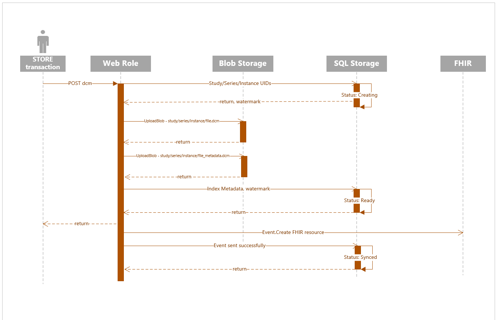

## Business Justification
[Product Opportunity Assessment - DICOM Server.docx](https://microsoft-my.sharepoint.com/:w:/p/stborg/EWt_x-xnfb9MozLTjl_-FdoBkUqT5n0w04m2pK7im6I-2A?e=2pEbaO&xsdata=MDR8MDF8U21pdGhhLlNhbGlncmFtYUBtaWNyb3NvZnQuY29tfGE5YWQ0ZTE1Mjg4ZjQyMzA3Yzg0MDhkN2E4MTUyMDIzfDcyZjk4OGJmODZmMTQxYWY5MWFiMmQ3Y2QwMTFkYjQ3fDF8MHw2MzcxNjI2ODA5OTk3NDk2MzB8VW5rbm93bnxUV0ZwYkdac2IzZDhleUpXSWpvaU1DNHdMakF3TURBaUxDSlFJam9pVjJsdU16SWlMQ0pCVGlJNklrMWhhV3dpTENKWFZDSTZNbjA9fC0x&sdata=ZzBJWGY3STlXaE9lL2UyYis4b3lrbWZwb2VZdmRRN2QwMnBrV1UyWVRlcz0%3D)

## Scenarios
- A DICOMWeb implementation specified in [DICOM conformance](DICOMWeb-Conformance.md) for medical image archiving and Radiology workflow.
- DICOM metadata in [FHIR](https://www.hl7.org/fhir/imagingstudy.html) to integrate HIS and RIS systems for better Physician workflow.

## Design 

### Optimized for
- Large storage
- Flexibility to evolve

### Raw storage
*Azure Blob storage* will be used to store the Part 10 DICOM binary files. Since there are so many transfer syntaxes supported for both ingress and egress, we will store the incoming dcm file *as is* and transcode on the way out, if needed and supported. This will also serve as the master store for original data. We will store 2 blobs for each DICOM instance
1. Original DICOM file in  the virtual path /container/{StudyUID}/{SeriesUID}/{SOPInstanceUID}/file.dcm. This file is used to serve the WADO DCIOM get.
2. Metadata portion of the DICOM file for faster metadata GET in azure Blob storage using the virtual path /container/{StudyUID}/{SeriesUID}/{SOPInstanceUID}/file_metadata.dcm. This file is used to serve the WADO metadata get.

We will also need the Study, Series and Instance UID mapping to support WADO GET on Study/Series. Where we will store this mapping will be informed by the index storage we choose below.

### Index storage
QIDO supports searching on the dicom tags. We need a efficient storage to search the supported tags quickly. We evaluated several options listed below to support QIDO and FHIR integration

Option|Pros|Cons
----------|----------|----------
FHIR| -Single index store, easy to maintain<br/>-*ExactMatch, Wildcard, ListMatch, SequenceMatch, RangeMatch and FuzzMatch supported<br/>-Future where Imaging is also stored and retrieved using FHIR APIs|-Custom attributes for custom tag query support<br/>-DICOM is tightly coupled to FHIR which reduces business, operational and feature flexibility<br/>-Limited DICOM search support<br/>-Query and Ingestion performance concerns<br/>-Corner cases around which service is the master of Patient resource type<br/>[Details](DicomWeb-FHIR-SingleStoreTradeOff.md)|
[SQL + Async FHIR resource creation](https://microsoft.sharepoint.com/:w:/t/msh/EY8pKt29ueRCijCrHhqBftcB1k1dTH3fiLR0s39xpyVyew)| -All QIDO requirements can be satisfied<br/>-On premise available<br/>-Inplace scaleUp<br/>-Geo-redundancy and Backup support<br/>-Can resuse the same SQL DB across FHIR and DICOM services<br/> -Normalized data to reduce storage size |-Dynamic SQL does not perform as good as known cached SQL<br/>-Joins on long table can also be relatively slow<br/>
Cosmos DB + Async FHIR resource creation| -Easy to deploy<br/>-Scale compute and storage independently<br/>-We can support all search conditions except wildcard with ?<br/>-Build-in geo-replications|-There is 2MB limit per document which might limit the number of tags we can extract<br/>-It does not support DISTINCT properly and depending on the schema we want to use, we might need it<br/>-Supporting OFFSET/LIMIT could be expensive since it doesn't create bookmark like continuation token does<br/>-Since there is no way to pass the continuation token to the client, we will not be able to support all consistencies
[Az Search + Async FHIR resource creation](https://microsoft.sharepoint.com/:w:/t/msh/EY8pKt29ueRCijCrHhqBftcB1k1dTH3fiLR0s39xpyVyew)| -All QIDO requirements can be satisfied<br/>-JSON indexer available for crawling the entire blob storage dataset<br/>-Possibility to extend support NLP and unstructured data searches|-Limited inplace index mapping changes supported<br/>-COGS higher than SQL, considering we need to manage 3 replicas for 99.9 availability<br/>-No in-place upgrade to a different tier<br/>-Managed geo-redundancy is not supported<br/>-On-prem or dev box solution not available<br/>-De-normalized data indexed.


## Architecture overview
With the above evaluation, we are considering the second option of SQL+Async FHIR integration for indexing. Which results in below design

1. A DICOMWeb end-point for STOW-RS, WADO-RS, QIDO-RS and delete
2. A async pipeline to publish **ImagingStudy** and its references to FHIR 


### Data consistency across stores

Possible initial SQL schema, with characteristics of
1. Table to store UID mapping, audit information and data consistency columns 
2. Normalized wide table for known core study/series tags that will be indexed
3. Custom tags in log table. Separate table for each SQL value type

``` sql
--Mapping table for dicom retrieval
CREATE TABLE dicom.tbl_UIDMapping (
	--instance keys
	StudyInstanceUID NVARCHAR(64) NOT NULL,
	SeriesInstanceUID NVARCHAR(64) NOT NULL,
	SOPInstanceUID NVARCHAR(64) NOT NULL,
	--audit columns
	CreatedDate DATETIME2 NOT NULL,
	LastUpdatedDate DATETIME2 NOT NULL,
	--data consistency columns
	Watermark BIGINT NOT NULL,
	Status TINYINT NOT NULL
)

--Table containing normalized standard Study tags
CREATE TABLE dicom.tbl_DicomMetadataStudyCore (
	--Key
	ID BIGINT NOT NULL, --PK
	--instance keys
	StudyInstanceUID NVARCHAR(64) NOT NULL,
	--patient and study core
	PatientID NVARCHAR(64) NOT NULL,
	PatientName NVARCHAR(64),
	PatientNameIndex AS REPLACE(PatientName, '^', ' '), --FT index
	ReferringPhysicianName NVARCHAR(64),
	StudyDate DATE,
	StudyDescription NVARCHAR(64),
	AccessionNumer NVARCHAR(16),
)

--Table containing normalized standard Series tags
CREATE TABLE dicom.tbl_DicomMetadataSeriesCore (
	--Key
	ID BIGINT NOT NULL, --FK
	--instance keys
	SeriesInstanceUID NVARCHAR(64) NOT NULL,
	--series core
	Modality NVARCHAR(16),
	PerformedProcedureStepStartDate DATE
)

--Table contains Custom indexed tags of type Int
CREATE TABLE dicom.tbl_DicomMetadataIntTags (
	--Key
	ID BIGINT NOT NULL, -- FK
	TagId SMALLINT NOT NULL,
	--instance key
	SOPInstanceUID NVARCHAR(64) NOT NULL,
	--value columns
	IntValue INT,		--[IS, SL, SS, UL]
)

CREATE TABLE dicom.tbl_CustomTag (
	TagId SMALLINT NOT NULL,
	--Tag 4*4+4 10/20/30/40, 4 level deep supported
	TagPath VARCHAR(20) NOT NULL,
	TagType VARCHAR(2) NOT NULL,
	SqlDataType SMALLINT NOT NULL
)
```
[Full SQL](DICOM-index-sql.md)

#### Data Ingestion Sequence 



#### Normalized indexed data for search

Within DICOM SOP Instances claiming to be from the same Patient/Study/Series we can expect inconsistencies. We will create new study/series version on conflict.

### FHIR integration

- Sync to FHIR will be configurable.
- Async evens to create FHIR resource. 
- DICOM service will be the master for ImagingStudy resourceType. We will have a service identity with write access to edit ImagingStudy
- Patient, Practitioner and Encounter ResourceType: Default FHIR service is the master. Configurable.

DEMO

## Test Strategy
- Unit tests
- EnE tests
- Bug bash
- Scale testing
- OHIF viewer validation and Customer validation

## Roadmap

- [Epics backlog](https://microsofthealth.visualstudio.com/Health/_backlogs/backlog/Medical%20Imaging/Epics/)
- [Feature Timeline](https://microsofthealth.visualstudio.com/Health/_backlogs/ms-devlabs.workitem-feature-timeline-extension.workitem-feature-timeline/Medical%20Imaging/Epics/)


