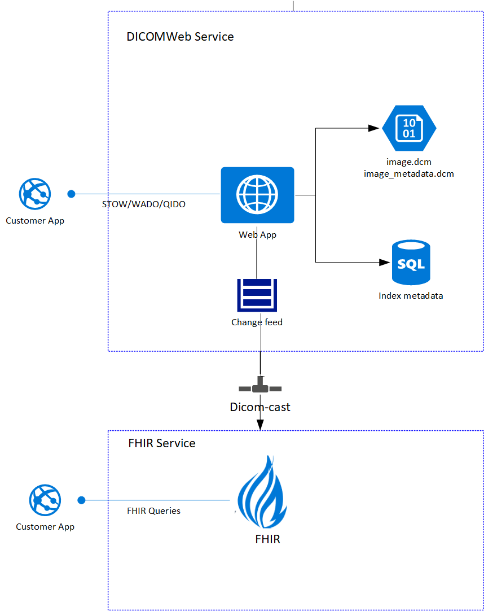

## Business Justification
[Product Opportunity Assessment - DICOM Server.docx](https://microsoft-my.sharepoint.com/:w:/p/stborg/EWt_x-xnfb9MozLTjl_-FdoBkUqT5n0w04m2pK7im6I-2A?e=2pEbaO&xsdata=MDR8MDF8U21pdGhhLlNhbGlncmFtYUBtaWNyb3NvZnQuY29tfGE5YWQ0ZTE1Mjg4ZjQyMzA3Yzg0MDhkN2E4MTUyMDIzfDcyZjk4OGJmODZmMTQxYWY5MWFiMmQ3Y2QwMTFkYjQ3fDF8MHw2MzcxNjI2ODA5OTk3NDk2MzB8VW5rbm93bnxUV0ZwYkdac2IzZDhleUpXSWpvaU1DNHdMakF3TURBaUxDSlFJam9pVjJsdU16SWlMQ0pCVGlJNklrMWhhV3dpTENKWFZDSTZNbjA9fC0x&sdata=ZzBJWGY3STlXaE9lL2UyYis4b3lrbWZwb2VZdmRRN2QwMnBrV1UyWVRlcz0%3D)

## Scenarios
- A DICOMWeb implemetation [DICOM conformance](DICOMWev-Conformance.md) for image archiving and Radiology workflow.
- DICOM metadata in [FHIR](https://www.hl7.org/fhir/imagingstudy.html) to integrate HIS and RIS systems for better Physician workflow.

## Design 

### Raw storage
**Azure Blob storage** will be used to store the unstructured data. Since there are so many codecs supported for both ingress and egress, we will store the incoming dcm file **as is** and transcode on the way out, if needed and supported. This will also serve as the master store for original data. We will store 2 blobs for each dicom instance
1. Original DICOM file in  the virtual path /container/{StudyUID}/{SeriesUID}/{SOPInstanceUID}/file.dcm
2. Metadata portion of the DICOM file for faster metadata GET in azure Blob storage using the virtual path /container/{StudyUID}/{SeriesUID}/{SOPInstanceUID}/file_metadata.dcm

We will also need the Study, Series and Instance UID mapping to support WADO. Where we will store this mapping will be informed by the index storage we choose below.

### Index storage
We evaluated several options listed below to support QIDO and FHIR integration

Option|Pros|Cons
----------|----------|----------
FHIR| -Easy|-Diff
SQL| -Easy|-Diff
COSMOS| -Easy|-Diff
Azure Cognitive Search| -Easy|-Diff

All could support the QIDO functionality. Most flexible.

Inconsistent Study/Series/Patient data
New data wins?

## Architecture overview
We have considered a number of architectural proposals. The leading contenter has the following properties:

1. A DICOMWeb end-point for STOW-RS, WADO-RS, QIDO-RS and delete
2. A async pipeline to publish **ImagingStudy** and its references to FHIR 

### Data consistency
SQL files

### FHIR integration

Optional: If configured. Async through events. 
ImagingStudy: DICOM service is the master
Patient, Practisionor and Encounter: FHIR service is the master. Configurable.
Mapping and demo

## Test Stratergy
- Unit tests
- EnE tests
- Bug bash

