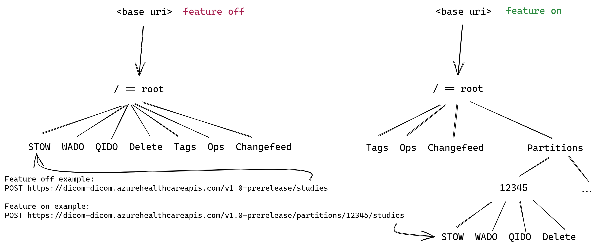

Implement a light-weight data partition scheme that will enable customers to store multiple copies of the same image with the same identifying study/series/instance UIDs on a single DICOM service.

# Business Justification

## Customer Requirements
Zeiss has asked us to provide a solution for the following requirements:
 1. Addressable storage for multiple organizational units should be implemented in one DICOM service
 2. Duplicate study/series/instance UIDs may exist across different organizational units (but not within one unit)
 3. Querying across organizational units is not required for this iteration
 4. No CRUD operations are required for the entity representing the organizational unit
 5. The feature is understood to be irreversible once enabled

 The first requirement is due to the scale of the solution Zeiss is building. They have a service topology that will involve multiple DICOM services, but they will support thousands of organizational units, so the operational overhead of one DICOM service per organizational unit is too high.

 This only becomes complex when paired with the second requirement, since one DICOM service should be able to handle the scale as long as each organizational unit stores unique images. Currently, our DICOM service enforces uniqueness by the combination of study, series, and instance UIDs. Even this is less strict than [the DICOM standard,](http://dicom.nema.org/dicom/2013/output/chtml/part05/chapter_9.html) which specifies that UIDs should be unique "across the DICOM universe of discourse irrespective of any semantic context" - so instance id alone would be uniquely identifying. At first glance, allowing duplicates would seem to violate the DICOM standard.

There is, however, an important distinction to be made. The responsibility for creating valid UIDs in on the _producer_ of the image, not on the storage class. While _creating_ duplicate UIDs violates the standard, _allowing_ duplicates is a matter of leniency. As a storage class, the DICOM service has no way to validate any UID for uniqueness.

Granting that we _can_ allow duplicates, why _should_ we? The answer is that in practice, duplicate DICOM objects have existed for decades. It's common practice for files to be written to portable storage media by a healthcare provider and given to the patient, who then gives the files to another healthcare provider, who then transfers the files into a DICOM storage system. Thus, multiple copies of one DICOM file commonly exist in isolated DICOM systems. As this functionality is moving to the cloud, we face a difficult problem: how can we ensure the **global uniqueness** of DICOM objects in an ever-more interconnected cloud ecosystem, while also providing an on-ramp for **existing data stores and workflows?**

## Microsoft / OSS Requirements
In conversation with the team, the following requirements (or at least strong preferences) have emerged:
 1. We should expose the status of the feature.
 2. Users should be able to discover all content on their server.
 3. For OSS, we should ensure that feature behavior is well-documented.

## Explored Approaches

### Can we simply ensure that duplicate files are modified to have unique UIDs? 
No, mainly because of Zeiss' appraisal of their end customer expectations. Zeiss doesn't want to present the end customer with files that have been altered in any way. Importantly, it doesn't matter whether this modification is performed by Zeiss, or in the DICOM service. 

_Note: the DICOM standard [does allow for coercing values during the import process,](http://dicom.nema.org/medical/dicom/current/output/html/part18.html#sect_10.5.2) and storing the original values as metadata._

### Can we store the organizational unit information in external metadata?
We can, but then it's difficult to guarantee uniqueness, especially when performing WADO requests. [(initial exploration)](OtherOptions/external-metadata.md)

### Should we create a full `tenant` concept for the user to manage?
We can, but we introduce complexity by increasing the API surface and adding background jobs to handle tenant lifecycle operations. [(initial exploration)](OtherOptions/add-tenant-id.md)

### Should we use a lighter version of the `tenant` concept?
Yes - we'll call this lighter version a `data partition`.

## Data Partition
We propose partitioning data via a unique id, maintaining object uniqueness as in the tenancy approach while not requiring the overhead of managing tenant lifecycle. The proposal is to implement the smallest version of the feature that fulfills the requirements above, and to consider a more robust approach to multitenancy as we discover the market demand. [(initial investigation)](data-partition.md) 

Logically, we can think of each partition as mapping to the ["service" concept](http://dicom.nema.org/medical/dicom/current/output/html/part18.html#glossentry_Service) in the DICOM standard, where a service comprises a set of REST APIs. The base URI can support [more than one service.](http://dicom.nema.org/medical/dicom/current/output/html/part18.html#sect_8.2). However, we don't want to use the word "service" because it's overloaded and may cause confusion. Similarly, we don't want to use the word "tenant" since it's commonly used in our documnentation to refer to AAD tenant.

We propose addressing partitions via URI. Here are some alternatives:

| Option | Pros ✔ | Cons ❌ |
| ------ | ------ | ------   |
| Body   | | Requires parsing the entire body; Zeiss doesn't want to do this, not visible in default logging |
| Header | | FHIR deep links will break, not visible in default logging |
| Query Parameter | | May break OSS viewers |
| URI Path Segment | Closer to DICOM standard | |

### Feature Toggling
We will specify the following supported behavior: 
 - when the feature is enabled, there must be no DICOM objects stored on the DICOM service
 - once the feature is enabled, DICOM objects can only be accessed through the partition path
 - the feature cannot be disabled

**Any other scenario is unsupported and will lead to undefined behavior.** ❌

### API Surface
When the feature is enabled, partitions will be addressable under the `partitions` path. Beneath each partition resource, STOW, WADO, QIDO, and delete APIs will be exposed.



This resource will only be accessible if the feature is enabled. When the feature is not enabled, any requests to this resource and sub-resources will return 400 indicating that the feature is not enabled. Here is the **future** API surface:
```
<base uri>/partitions GET, POST
<base uri>/partitions/id GET, DELETE
```

Of this group, **we will only implement `GET /partitions` in the first iteration.** This will allow all images on the DICOM server to be discovered.

We considered simply requiring a partition id to be specified for all paths, but this leads to broken links when a user deploys the OSS server, stores files, and then enables the feature. By making partitions a resource under the root, we limit the amount of API surface that is changed by the feature. 

### Storage
We will create a new table:
```
CREATE TABLE dbo.Partition (
    PartitionKey               BIGINT              NOT NULL, --PK
    PartitionId                VARCHAR(64)         NOT NULL,
) WITH (DATA_COMPRESSION = PAGE)
```
`PartitionId` will be unique and indexed. In the future, we can add to this structure to allow customers to specify other metadata as part of partition creation / update.

### Partition Id

 The partition id will be:
 - unique within the scope of the DICOM service
 - a string of 1 to 64 alphanumeric characters, `.`, `-`, or `_`. (allows GUIDs and DICOM UIDs)
 - specified by the client

Since the partition id will be visible in telemetry, we need to consider data classification. We will classify the partition id as OII according to the [Enterprise Data Taxonomy](https://microsoft.sharepoint.com/sites/privacy/Privacy%20Documents/Privacy%20Program%20Refresh/Enterprise%20Online%20Services%20Asset%20Classification%20Standard/Enterprise%20Data%20Taxonomy%20(Asset%20Classification%20Standard).pdf), aligning to the following examples:

```
Software, systems or container names created or provided by customers, such as configuration settings, Azure Resource Names: Account Name (ADL), VM Name, Cluster DNS Name (HDInsight), SQL Server and Database Name, Global Database Account Name (CosmosDB), Machine or Agent Name, Storage Account Name, Service Name, Form Name, Batch Job Name; Job Query Name, ARM-level objects; Collection Name (CosmosD)
```

The default value of this id will be `Microsoft.Default`, and all existing data at time of feature enablement will be backfilled with the default value. The path `<baseurl>/partitions/Microsoft.Default` will route to `<baseurl>/`.

# Partition API DICOM Operations

In all URIs below, there is an implicit base URI, then the optional version and [data partition segments](#data-partition). We will call this the `partition path` to differentiate from the `root path`.

Example root path: `https://dicom-dicom.azurehealthcareapis.com/v1.0-prerelease/`

Example partition path: `https://dicom-dicom.azurehealthcareapis.com/v1.0-prerelease/partitions/12345`

## STOW
We will create a new partition in the partition table when a request is received with a new partition id. In the future, we may allow this to be managed via `POST /partitions`.

**Request**
```
POST {partition path}/studies
```

**Response**
```json
{
  "00081190":
  {
    "vr":"UR",
    "Value":["{partition path}/studies/d09e8215-e1e1-4c7a-8496-b4f6641ed232"]
  }
  ...
}
```

**Errors**
Existing error behavior will remain the same, with the following clarification: if no partition id or an invalid partition id is included in the URI, a 400 status code will be returned, with a dataset including the reason code `272`.

## WADO
Results will be returned from the partition specified in the path.

**Request**
```
GET {partition path}/studies/{studyUid}
```

**Response**
```json
{
  "00081190":
  {
    "vr":"UR",
    "Value":["{partition path}/studies/d09e8215-e1e1-4c7a-8496-b4f6641ed232"]
  }
  ...
}
```

**Errors**
Existing error behavior will remain the same, with the following clarification: if no partition id or an invalid partition id is included in the URI, a 400 status code will be returned.

## QIDO
Results will be returned from the partition specified in the path. See [cross-partition query discussion](#cross-partition-queries).

**Request**
```
GET {partition path}/studies?...
```

**Response**
```json
[
  {
    "00081190":
    {
      "vr":"UR",
      "Value":["{partition path}/studies/d09e8215-e1e1-4c7a-8496-b4f6641ed232"]
    }
    ...
  }
]
```

**Errors**
Existing error behavior will remain the same, with the following clarification: if no partition id or an invalid partition id is included in the URI, a 400 status code will be returned.

## DELETE 
Resources will be deleted from the partition specified in the path.

**Request**
```
DELETE {partition path}/studies/{studyUid}
```

**Errors**
Existing error behavior will remain the same, with the following clarification: if no partition id or an invalid partition id is included in the URI, a 400 status code will be returned.

## Querying Partitions
In first iteration, we will enable a new endpoint to get list of partitions

**Request**
```
GET {root path}/partitions
```

**Response**
```json
[
  "{PARTITION_KEY_1}",
  "{PARTITION_KEY_2}",
]
```
Future, we will have all CRUD operations. This enable clients who do not have partition mapping.

## Extended Query Tags
These endpoints will remain unchanged; any extended query tag operation will be performed at the root path and will affect all partitions.

# Metrics
Add PartitionId as a dimension to current metrics. Whenever STOW, WADO, QIDO and DELETE operation are requested with partitionId, we should emit a metric so that we can know usage of this feature.

# Design

## SQL Data Model Updates
- Add a new column to the below tables.

```
CREATE TABLE dbo.Study (
    StudyKey                    BIGINT                            NOT NULL, --PK
    StudyInstanceUid            VARCHAR(64)                       NOT NULL,
    PartitionKey                VARCHAR(64)                       NOT NULL DEFAULT '00000000000000000000000000000000',
    PatientId                   NVARCHAR(64)                      NOT NULL,
    PatientName                 NVARCHAR(200)                     COLLATE SQL_Latin1_General_CP1_CI_AI NULL,
    ReferringPhysicianName      NVARCHAR(200)                     COLLATE SQL_Latin1_General_CP1_CI_AI NULL,
    StudyDate                   DATE                              NULL,
    StudyDescription            NVARCHAR(64)                      NULL,
    AccessionNumber             NVARCHAR(16)                      NULL,
    PatientNameWords            AS REPLACE(REPLACE(PatientName, '^', ' '), '=', ' ') PERSISTED,
    ReferringPhysicianNameWords AS REPLACE(REPLACE(ReferringPhysicianName, '^', ' '), '=', ' ') PERSISTED,
    PatientBirthDate            DATE                              NULL
) WITH (DATA_COMPRESSION = PAGE)
```

```
CREATE TABLE dbo.Series (
    SeriesKey                           BIGINT                     NOT NULL, --PK
    StudyKey                            BIGINT                     NOT NULL, --FK
    SeriesInstanceUid                   VARCHAR(64)                NOT NULL,
    PartitionKey                        VARCHAR(64)                NOT NULL DEFAULT '00000000000000000000000000000000',
    Modality                            NVARCHAR(16)               NULL,
    PerformedProcedureStepStartDate     DATE                       NULL,
    ManufacturerModelName               NVARCHAR(64)               NULL
) WITH (DATA_COMPRESSION = PAGE)
```

```
CREATE TABLE dbo.Instance (
    InstanceKey             BIGINT                     NOT NULL, --PK
    SeriesKey               BIGINT                     NOT NULL, --FK
    -- StudyKey needed to join directly from Study table to find a instance
    StudyKey                BIGINT                     NOT NULL, --FK
    --instance keys used in WADO
    StudyInstanceUid        VARCHAR(64)                NOT NULL,
    SeriesInstanceUid       VARCHAR(64)                NOT NULL,
    SopInstanceUid          VARCHAR(64)                NOT NULL,
    PartitionKey             VARCHAR(64)                NOT NULL DEFAULT 'Microsoft.Default',
    --data consitency columns
    Watermark               BIGINT                     NOT NULL,
    Status                  TINYINT                    NOT NULL,
    LastStatusUpdatedDate   DATETIME2(7)               NOT NULL,
    --audit columns
    CreatedDate             DATETIME2(7)               NOT NULL
) WITH (DATA_COMPRESSION = PAGE)
```

```
CREATE TABLE dbo.DeletedInstance
(
    StudyInstanceUid    VARCHAR(64)       NOT NULL,
    PartitionKey        VARCHAR(64)       NOT NULL DEFAULT 'Microsoft.Default',
    SeriesInstanceUid   VARCHAR(64)       NOT NULL,
    SopInstanceUid      VARCHAR(64)       NOT NULL,
    Watermark           BIGINT            NOT NULL,
    DeletedDateTime     DATETIMEOFFSET(0) NOT NULL,
    RetryCount          INT               NOT NULL,
    CleanupAfter        DATETIMEOFFSET(0) NOT NULL
) WITH (DATA_COMPRESSION = PAGE)
```
```
CREATE TABLE dbo.ChangeFeed (
    Sequence                BIGINT IDENTITY(1,1) NOT NULL,
    PartitionKey            VARCHAR(64)          NULL DEFAULT 'Microsoft.Default',
    Timestamp               DATETIMEOFFSET(7)    NOT NULL,
    Action                  TINYINT              NOT NULL,
    StudyInstanceUid        VARCHAR(64)          NOT NULL,
    SeriesInstanceUid       VARCHAR(64)          NOT NULL,
    SopInstanceUid          VARCHAR(64)          NOT NULL,
    OriginalWatermark       BIGINT               NOT NULL,
    CurrentWatermark        BIGINT               NULL
) WITH (DATA_COMPRESSION = PAGE)
```

```
CREATE TABLE dbo.DeletedInstance
(
    StudyInstanceUid    VARCHAR(64)       NOT NULL,
    SeriesInstanceUid   VARCHAR(64)       NOT NULL,
    SopInstanceUid      VARCHAR(64)       NOT NULL,
    Watermark           BIGINT            NOT NULL,
    PartitionKey        VARCHAR(64)       NOT NULL  DEFAULT 'Microsoft.Default',
    DeletedDateTime     DATETIMEOFFSET(0) NOT NULL,
    RetryCount          INT               NOT NULL,
    CleanupAfter        DATETIMEOFFSET(0) NOT NULL
) WITH (DATA_COMPRESSION = PAGE)
```

```
CREATE TABLE dbo.ChangeFeed (
    Sequence                BIGINT IDENTITY(1,1) NOT NULL,
    Timestamp               DATETIMEOFFSET(7)    NOT NULL,
    Action                  TINYINT              NOT NULL,
    StudyInstanceUid        VARCHAR(64)          NOT NULL,
    SeriesInstanceUid       VARCHAR(64)          NOT NULL,
    SopInstanceUid          VARCHAR(64)          NOT NULL,
    OriginalWatermark       BIGINT               NOT NULL,
    CurrentWatermark        BIGINT               NULL,
    PartitionKey            VARCHAR(64)          NOT NULL  DEFAULT 'Microsoft.Default'
) WITH (DATA_COMPRESSION = PAGE)
```

- All the corresponding indexes will be updated. PartitionId will be added to UNIQUE CLUSTERED INDEX 
- Update all the stored procedures that are related to retrieving studies, series or instances.

## Migration

We'll create a new schema version and diff. Add the `PartitionId` as the composite primary key and fill the default value as a single transaction.

Include `PartitionId` in all the indexes.

As part of the migration script, we will update all the rows to default PartitionId `where PartitionId is NULL`.

## Cross-partition queries

For the first iteration, each QIDO request will be scoped to the either the default partition (root path) or a specified partition. Zeiss is not requesting cross-partition queries now since there are authorization implications in their implementation. One approach could be for the root path QIDO operations to return results from all partitions if enabled.

## Roll-out Strategy

Zeiss has requested that this feature be enabled programatically, not via manual process (IcM). While we can reduce the management overhead by enabling the feature at the 

The eventual solution here will include:
 1. An AFEC feature flag managed via Geneva Actions (optionally exposed to customers via Azure Portal)
 2. Syncing the status of the feature flag (via [subscription lifecycle notifications](https://github.com/Azure/azure-resource-manager-rpc/blob/master/v1.0/subscription-lifecycle-api-reference.md)) to our subscription metadata (global CosmosDB)
 3. Read subscription metadata, and update the Dicom CRD with the relevant feature status

Our initial implementation will be limited to step 3 above: we will update the CRD and alter the subscription metadata via prodution change request. Steps 1 and 2 are straightforward, but require some coordination with other Healthcare APIs teams to make the solution usable cross-team.

For the initial PaaS implementation, we will specify that feature status will only be checked at resource creation - i.e. every DICOM resource will reflect the status of the subscription-level feature flag at the time the DICOM resource was created.

# Test Strategy

- Add and update existing unit tests, integration test and e2e tests to use partitionId
- Test for backward compatibility. Perform WADO operation after enabling the feature flag
- Ensure all the tests are not broken

# Security

We may (eventually) update the [Azure Healthcare APIs RP security role](https://msazure.visualstudio.com/One/_git/AD-RBAC-RoleDefinitions?path=%2FMICROSOFT.HEALTHCAREAPIS%2FPROD%2FHealthcare%20Apis%20Resource%20Provider%20Service%20Role.json) to include the `Microsoft.Features/providers/Microsoft.HealthcareApis/features` permission, and would need to update the threat model accordingly. This would allow us to directly query the feature registration status.

If we can handle subscription lifecycle notifications instead, we may not need this change.

# Other
Back-compatibility: all exising DICOM services will remain completely back-compatible regardless of feature enablement.
Privacy: as discussed above, the partition id will be OII, so our telemetry collection and access will be unaffected.