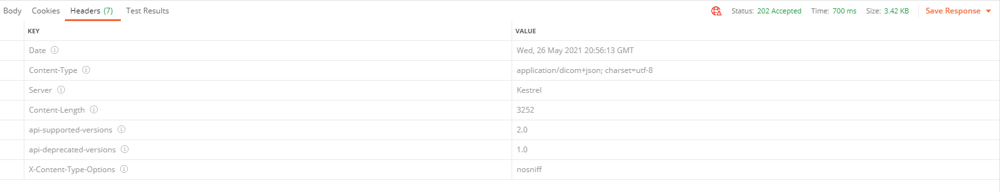
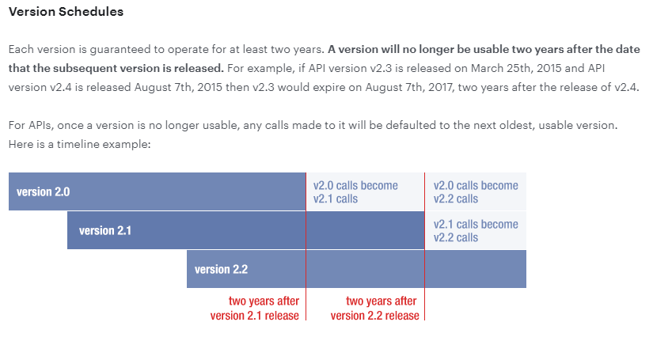

# Api Versioning

## Objective
Develop a plan for adding versioning to our existing DICOM API that meets Microsoft REST API Guidelines and is compatible for our exiting customers.


## Versioning Options
The following are the commonly used versioning options and the ones supported by the [nuget package](https://www.nuget.org/packages/Microsoft.AspNetCore.Mvc.Versioning) that we will use [(wiki)](https://github.com/microsoft/aspnet-api-versioning/wiki)

1. URL Path `/api/v1/helloworld	`
1. Query String `/api/helloworld?api-version=1.0`
1. Header 
    ```HTTP
    GET api/helloworld HTTP/1.1
    host: localhost
    x-ms-version: 1.0
    ```
1. Media Type

    ```HTTP 
    GET api/helloworld HTTP/1.1
    host: localhost
    accept: text/plain;v=1.0
    ```

From the [Microsoft Rest Api Guidelines](https://github.com/Microsoft/api-guidelines/blob/master/Guidelines.md#121-versioning-formats), of the four above, only two are recommend

1. URL Path
2. Query String

Recommendation: From the possible ways of versioning, the URL path has the benefits that it is expressive and also commonplace in modern apis (Google Cloud Healthcare API, Facebook's Graph API, and many other modern apis use this method for versioning). Based on this it seems like the best option when considering versioning for our API. It is also more clear semantically, as with the version being in the URL, users can expect that there may be different requirements.

## Updating Versions

### Version Formats
Versions are of the format Major.Minor

We can opt for Major only version scheme, which means .0 is implied for the minor version.

### Major Version
The major version needs to be incremented whenever there is breaking change. Using a new major version number signals existing versions may be deprecated in the future. When a new version is released we should provide a clear path to upgrading and plan for deprecation.

Breaking changes are defined as changes to the API contract and changes that are not backwards compatible.

We need to explicitly define our definition of a breaking change.

List of things we will consider to be a breaking change
1. Renaming or removing endpoints
1. Removing parameters or adding mandatory parameters
1. Changing status code
1. Deleting property in response or altering response type at all (but okay to add properties to the response)
1. Changing the type of a property
1. Behavior of an API changes (changes in buisness logic, used to do foo, now does bar)

More info on breaking changes from the [REST guidelines](https://github.com/Microsoft/api-guidelines/blob/master/Guidelines.md#123-definition-of-a-breaking-change)

### Minor Version
Minor versions would be used to signal changes that are not breaking to the API such as adding a new route. Minor versioning is not required, and if it is not specified then it defaults to Major.0.

Examples of changes that could possibly increment the minor version are
1. Adding routes
1. Adding a response field

However, using a minor version is not required. We could add these changes without incrementing the version number at all. This maybe the recommended path as it will be easier for us to maintain. Adding versions requires annotating every controller with the versions they support (as shown below), and having many minor versions will require every method to be annotated

Recommendation: No minor version, if we want to add to the API we could possibly encapsulate change in some other way (like some release notes detailing what has been added) instead of bumping the version.

Decision from design review: We will not be using a minor version as of now. In the future we can always add it in if necessary. An example of what release notes could look like: [google healthcare release notes](https://cloud.google.com/healthcare/docs/release-notes)

### No Change
Bug fixes would not require changing the version number either.

### Updating Version Example

```C#
    // shortened controller code for simplicity
    [ApiVersion("1.0")] // all routes in this controller are mapped to v1.0
    public class RetrieveController : Controller
    {
        private readonly IMediator _mediator;
        private readonly ILogger<RetrieveController> _logger;

        public RetrieveController(IMediator mediator, ILogger<RetrieveController> logger)
        {
            _mediator = mediator;
            _logger = logger;
        }

        [HttpGet]
        [Route("api/v{version:apiVersion}/studies/{studyInstanceUid}")] // api/v1.0/studies/{studyInstanceUid}
        [ProducesResponseType(typeof(IEnumerable<Stream>), (int)HttpStatusCode.OK)] // DIFF: v1.0 returns 200
        public async Task<IActionResult> GetStudyAsync(string studyInstanceUid)
        {
            RetrieveResourceResponse response = await _mediator.RetrieveDicomStudyAsync(studyInstanceUid, HttpContext.Request.GetAcceptHeaders(), HttpContext.RequestAborted);

            return CreateResult(response);
        }

        [HttpGet]
        [Route("api/v{version:apiVersion}/studies/{studyInstanceUid}/metadata")] // api/v1.0/studies/{studyInstanceUid}/metadata
        public async Task<IActionResult> GetStudyMetadataAsync([FromHeader(Name = IfNoneMatch)] string ifNoneMatch, string studyInstanceUid)
        {
            V1.RetrieveMetadataResponse response = await _mediator.RetrieveDicomStudyMetadataAsync(studyInstanceUid, ifNoneMatch, HttpContext.RequestAborted); // DIFF: uses v1.0 response model

            return CreateResult(response);
        }

        [HttpGet]
        [Route("api/v{version:apiVersion}/studies/{studyInstanceUid}/series/{seriesInstanceUid}")] // api/v1.0/studies/{studyInstanceUid}/series/{seriesInstanceUid}
        public async Task<IActionResult> GetSeriesAsync(string studyInstanceUid, string seriesInstanceUid)
        {
            RetrieveResourceResponse response = await _mediator.RetrieveDicomSeriesAsyncV1( // DIFF: uses v1.0 path for logic
                studyInstanceUid, seriesInstanceUid, HttpContext.Request.GetAcceptHeaders(), HttpContext.RequestAborted);

            return CreateResult(response);
        }
    }

    // shortened controller code for simplicity
    [ApiVersion("2.0")] // all routes in this controller are mapped to v2.0
    public class RetrieveController : Controller
    {
        private readonly IMediator _mediator;
        private readonly ILogger<RetrieveController> _logger;

        public RetrieveController(IMediator mediator, ILogger<RetrieveController> logger)
        {
            _mediator = mediator;
            _logger = logger;
        }

        [HttpGet]
        [Route("api/v{version:apiVersion}/studies/{studyInstanceUid}")] // api/v2.0/studies/{studyInstanceUid}
        [ProducesResponseType(typeof(IEnumerable<Stream>), (int)HttpStatusCode.Accepted)] // DIFF: v2.0 returns 202
        public async Task<IActionResult> GetStudyAsync(string studyInstanceUid)
        {
            RetrieveResourceResponse response = await _mediator.RetrieveDicomStudyAsync(studyInstanceUid, HttpContext.Request.GetAcceptHeaders(), HttpContext.RequestAborted);

            return CreateResult(response);
        }

        [HttpGet]
        [Route("api/v{version:apiVersion}/studies/{studyInstanceUid}/metadata")] // api/v2.0/studies/{studyInstanceUid}/metadata
        public async Task<IActionResult> GetStudyMetadataAsync([FromHeader(Name = IfNoneMatch)] string ifNoneMatch, string studyInstanceUid)
        {
            V2.RetrieveMetadataResponse response = await _mediator.RetrieveDicomStudyMetadataAsync(studyInstanceUid, ifNoneMatch, HttpContext.RequestAborted); // DIFF: uses v2.0 response model

            return CreateResult(response);
        }

        [HttpGet]
        [Route("api/v{version:apiVersion}/studies/{studyInstanceUid}/series/{seriesInstanceUid}")] // api/v2.0/studies/{studyInstanceUid}/series/{seriesInstanceUid}
        public async Task<IActionResult> GetSeriesAsync(string studyInstanceUid, string seriesInstanceUid)
        {
            RetrieveResourceResponse response = await _mediator.RetrieveDicomSeriesAsyncV2( // DIFF: uses v2.0 path for updated logic
                studyInstanceUid, seriesInstanceUid, HttpContext.Request.GetAcceptHeaders(), HttpContext.RequestAborted);

            return CreateResult(response);
        }

        [HttpGet]
        [Route("api/v{version:apiVersion}/studies/{studyInstanceUid}/aNewRoute")] // api/v2.0/studies/{studyInstanceUid}/aNewRoute
        public async Task<IActionResult> GetNewData(string studyInstanceUid) // DIFF: only exists in v2.0
        {
            RetrieveResourceResponse response = await _mediator.DoSomethingNew(studyInstanceUid);

            return CreateResult(response);
        }
    }
```
The above code shows examples of how different breaking changes would be represented in two different versions, v1.0 and v2.0.

GetStudyAsync -> v1.0 and v2.0 have different status codes returned in the response, which requires two separate methods. However both methods call the same code path since no functionality has changed.
GetStudyMetadataAsync -> v2.0 has a different response model than v1.0 (ex: a field was renamed). The methods reference different models but still share most of the same code.
GetSeriesAsync -> v2.0 has different behavior than v1.0, which requires the methods to use two separate code paths.
GetNewData -> v2.0 introduces a new endpoint.

It is recommended that you separate version specific code. This increases clarity of what behavior belongs to which version, and reduces the chance that changes in V2 will break an existing path in V1. 
However, if there are many shared controller methods between all versions, you can consider putting them in the one controller to reduce duplication.

Example:
/Api
    /V1
        /Controllers
        /Models
    /V2
        /Controllers
        /Models
    /Shared
        /Controllers
        /Models
    /Features
    /Modules
    ...

### Supporting urls with no version

Since the existing consumers of our API do not have any versioning, we need to continue to support urls that do not have the version as part of the path. This can be done by specifying multiple routes.

```c#
[Route("changefeed/latest")]
[Route("api/v{version:apiVersion}/changefeed/latest")]
```

However, we should only do this at the beginning to support the customers who currently did not have versioning, and we should just route to the oldest version. Once that version is no longer supported then we should remove this and force users to specify the version in the url path.

### Deprecating APIS

We can deprecate old versions by marking the version as deprecated as follows:
```c#
[ApiVersion("2.0")]
[ApiVersion("1.0", Deprecated = true)]
```
It may be a useful metric to track how many requests are going to the different versions so we can see when users are migrating to the newer version.

In addition, if we enable reporting of API versions, when someone calls an endpoint, in the returned headers the user will be able to see the supported and deprecated versions:



It may also be useful to develop a plan for when versions will be deprecated and at what point we will stop supporting them completely. 

For example, a schedule that is used for a facebook API:



A possible schedule could be that we support each version for a minimum amount of `x` >= 12 months after which we only support the most recent versions. For determining the schedule we need to get PM input and determine based on customer usage of our service.

## DICOM Versioining
In the DICOM spec there is no defined versioning so our versions do not have to match any external versioning.

In the DICOM spec there is a [capabilities end point](https://www.dicomstandard.org/dicomweb/capabilities/) that returns a WADL response tht explains what the server supports. We can expose a similar endpoint that allows the consumer to access information about what is supported in each version.


It makes most sense to version each service (DICOM, Fhir) on their own (but have the same guidelines for what is a breaking change and deprecating schedules) since each of their development is being worked independently. This will allow us the flexibility to develop for one of them and release a new version without changes in the other.

## Testing

### Testing across version compatibility
Since we are not bounding users to using only version of our service, we need to ensure that the service works using any combination of supported routes. For example, users should be able to store using v1 and retrieve using v2 if both v1 and v2 are currently supported.

We will need to add unit testing for this to ensure that the different versions are compatible with each other.

### Testing For Api Updates
In our pr pipeline, we will add in some checks to ensure that all previous versions of the API are supported and in the case of a breaking change, the version is updated properly.

At a high level we want to have a baseline for each version, and whenever a change is checked in we will have a test that generates the swagger and compares it to the baseline to make sure no breaking changes have been made without updating the version.

There are some tools we could leverage for this such as [Swagger:Diff](https://github.com/civisanalytics/swagger-diff)

The main purpose for this is two fold
1. Prevent developers from accidentally checking in breaking changes with out updating the version
1. Prevent developers from accidentally breaking previous versions when developing a new version

## Documentation that needs to be added

### For developers
- What is defined as a breaking change and what to do in the case of making a breaking change.
- How to properly increment the version (this should always be done manually)
- Plan for deprecation and when to mark as deprecated
- Testing that needs to be done to make sure breaking changes don't affect current users and understanding when to check in a new swagger


### For Consumers of API
- How to migrate to using versioning (and what happens if they don't specify version)
- When new versions released how to upgrade to new versions and details about changes
- Which versions are currently supported, and when versions will be deprecated (and any deprecation schedule we make)
- We may need to make more detailed guides for migrating from one version to another depending on the changes we make