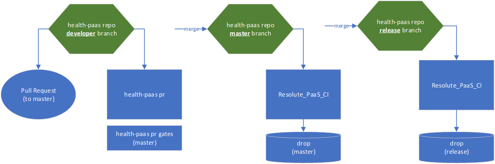
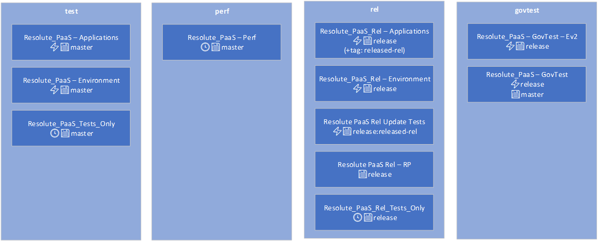
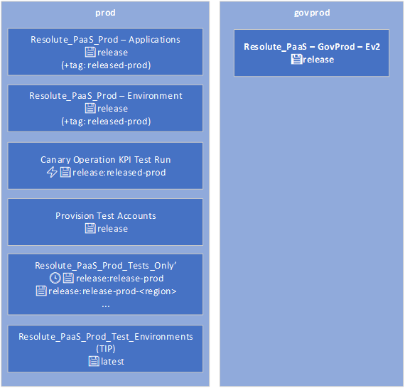
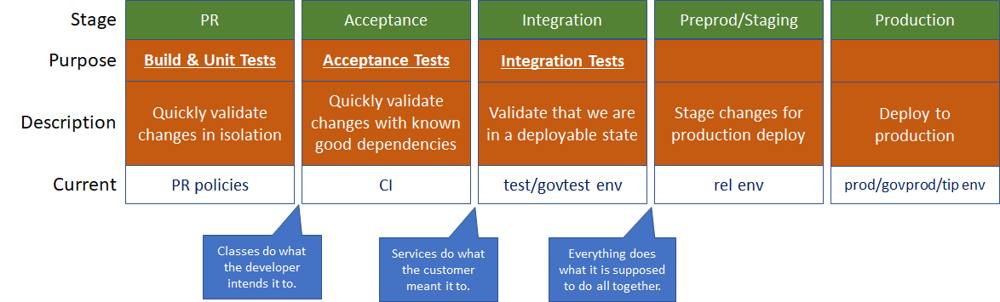
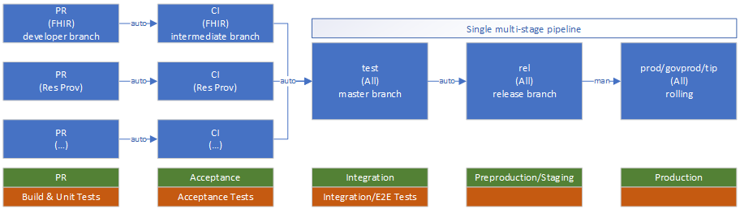
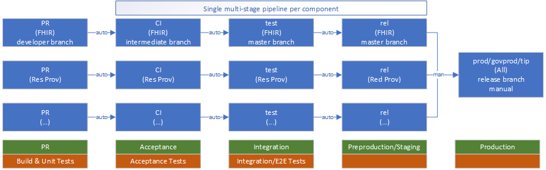
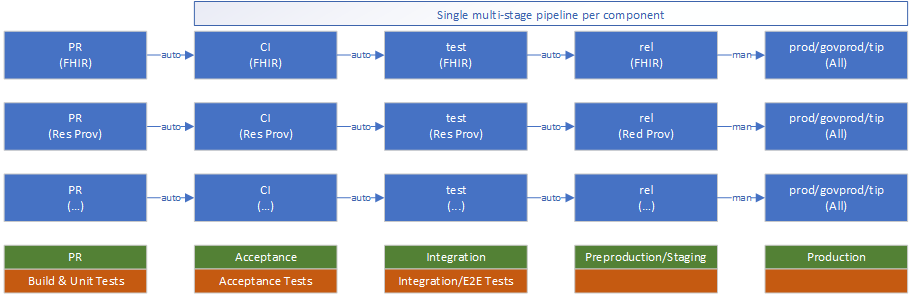

# Per-Component Pipelines for the `health-paas` Repo.

This is a design overview of migrating the current set of build and release definitions that support validation and deployment of code in the `health-paas` repo to a "per-component" paradigm. The intention is to protect developers working in one component from being blocked by failures in other components, greatly increase the speed in which code moves from the initial merge to production, and significantly decrease the mean time to pipeline failure mitigation.

[[_TOC_]]

# Related
## Books
- [Accelerate: the Science of Lean Software and DevOps](https://www.oreilly.com/library/view/accelerate/9781457191435/) by by Jez Humble, Gene Kim, Nicole Forsgren
- [DevOps Handbook, Second Edition](https://itrevolution.com/the-devops-handbook/) by Gene Kim, Jez Humble, Patrick Debois, and John Willis

## Specifications
- [PR Validation Optimizations](PR_Validation_Optimizations.md)

## Surveys
- [Developer Satisfaction Surveys](https://microsofthealth.visualstudio.com/Health/_wiki/wikis/Health.wiki/434/Developer-Satisfaction-Survey)

# Current Pipelines
Below is a visual review of the current (December 2021) build and release pipelines. The build pipelines show that when a developer submits a pull request, the "health-pass pr" pipeline runs as validation. When a PR is completed and merged into either the `master` branch or the `release` branch, the "Resolute_PaaS_CI" pipeline is run which create drops that are later used in Releases.

*Current Build Pipelines*

The non-production releases are handled through several Release definitions. The light-blue boxes (e.g. test, perf, rel, etc...) show the environment in which the definition is deployed. 

*Current Release Pipelines (non-prod)*

The production releases are similarly handled through several Release definitions.

*Current Release Pipelines (prod)*

# Concerns
Though no system is perfect and each user's experience will likely be unique, we have identified a set of common concerns that have a direct effect on reliability, observabiltiy, flexibility, and scale.

1. No unified view - Build, validation, and deployments of a commit are split across multiple pipelines/screens/paradigms.
2. Difficult to scale - The current paradigms likely worked well when the product consisted of a limited number of components (i.e. RP & FHIR), but tooling and pipeline management complexity increases quickly as we add components.
3. “Over the wall” - With the lack of a unified view, developers tend not to track their changes through to production.
4. Difficult to small batch - The pipelines currently handle all components at once, significantly impacting the time it takes to complete builds, validations, and deployments. These "heavy" pipelines are a barrier to smaller batching of changes, increasing the risk of each deployment.

# Goals
From the concerns above along with feedback from the [Developer Satisfaction Surveys](https://microsofthealth.visualstudio.com/Health/_wiki/wikis/Health.wiki/434/Developer-Satisfaction-Survey), we outlined these top-level goals for refactoring our pipelines:
1. **Reliability/Agility**
   - Allow other workstreams to continue when a workstream is blocked.
   - Failed pipelines should be rare and a very big deal to everyone.
2. **Observability**
   - Developers can more easily track the state of a commit is in the path to production.
   - Expand the definition of when a work item is “done” to when the change has been deployed to production.
3. **Scalability and Conway's Law**
   - Faster pipelines reinforce smaller batches rather than larger feature branches.
   - Minimize effort to add new or refactor components.

# Design
From the goals above...
1. Each component has its own pipeline through to prod, giving a a few key areas of significant improvement in accordance with our goals:
   - Developers can track their commits from PR complete through production.
   - Simplified unit of scale for new a refactored components.
   - Components can update their pipelines without risking other components.

2. The design will be implemented in a phased approach, which...
   - …allows time for organizational culture to adjust and internalize.
   - …allows time to update design based on real-world feedback.

## Components
As a first pass for identifying the components within the `health-paas` repo, we generally used the directory structure under the `/src` directory:
- FHIR
- Resource Provider
- Account Routing
- Frontend
- IotConnector
- Monitoring
- SQL Management
- Infrastructure (ClusterAgent, Environment, etc)

## Terms
For further context on the eventual intention for the refactored pipelines, refer to the abstract pipeline below and what each stage of the pipeline intends to achieve. The bottom row refers roughly to how the current pipeline structure lines up with these stages.

1. **Pull Request**
   - Runs builds and unit tests
   - Intends to quickly validate code internally, stubbing out all dependencies. Ideally, these tests should run in-process with all external dependencies stubbed out and complete within a few minutes maximum
   - When a PR stage completes successfully we should have confidence that the classes do what the developer intends.
2. **Acceptance**
   - Deploys a unit-tested build to a known stable environmnent and runs acceptance tests
   - Intends to quickly validate a deployed component against last-known-good versions of all other components. 
   - When the Acceptance stage completes successfully we should have confidence that the component does what the customer meant when calling it.
3. **Integration**
   - Deploys an accepted build to a known stable environment and runs integration/E2E/scenario tests
   - When the Integration stage completes successfully we should have confidence that everything does what it is supposed to do all-together.
4. **Preprodution/Staging**
   - Deploys a known good component to a stable environment.
   - This environment/stage is a logistical pausing point of known good components before being deployed to production. This gives internal developers access to an environment with their changes that is most-like production without needing to wait for a full production deployment to be completed compliantly.
5. **Production**
   - Deploys a known good component to the customer-facing production environment.

## Phase 1

In phase 1 we split the PR and CI builds per-component. Additionally we create a single multi-stage pipeline to handle deploying all components to the test, rel, and production environments. This model introduces the new split paradigm to developers and mitigates much of the risk by limiting changes in the critical path to production.

To have acceptance tests run with known good dependencies, the CI/Acceptance stage will leverage an intermediate branch to validate the change. On successful completion of this stage, the change will be merged into the default (`master`) branch, then deployed into the test environment in a rolling fashion with other accepted changes.

On successful completion of integration test stage, the changes will be automatically merged into the `release` branch in preparation for a compliant production deployment with manual approvals (as it is currently).

Before moving on to phase 2 we will integrate feedback and design adjustments from phase 1.

## Phase 2

Phase 2 extends the split pipelines through all non-production environments. Within phase one we hope to further stabilize the test environment allowing us to remove the use of the release branch and deploy the master branch from the default (`master`) branch in phase 2.

In the (hopefully) rare event of a production hotfix, we will pull the deployed commit (tagged in git) into a hotfix branch and run it through any validations required before deploying into production.

Before moving on to phase 3 we will integrate feedback and design adjustments from phase 3.

## Phase 3

Phase 3 extends the split pipelines through all production environments. Additionally, we hope to have gained enough confidence in the pipelines to deploy changes as they are in the master branch.

# Test Strategy / Migration
Each new pipeline definition will be run side-by-side with the existing legacy pipeline until we have confidence that they are behaving as expected and providing sufficient results. We will then update processes, dependent pipelines, and documentation to refer to the new pipeline and deprecate the legacy pipeline by first prepending "DEPRECATED_" to its title and eventually deleting it.

*(End of document)*