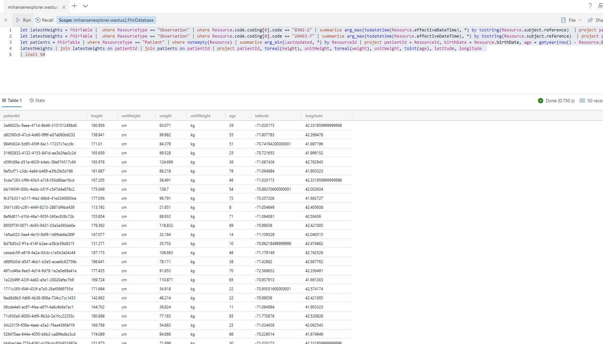
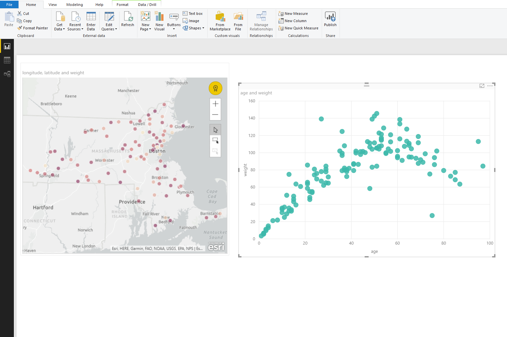

# EvenHub Connector and Data Explorer POC

This document is a simple demonstration of how an EventHub connector can be used to facilitate big data analytics using Data Explorer and Kusto.

## FHIR Server EvenHub connection

As a simply prototype a middleware was added to the FHIR server [See branch](https://github.com/hansenms/fhir-server/tree/feature-dataexplorer) and [diff](https://github.com/Microsoft/fhir-server/compare/master...hansenms:feature-dataexplorer):


```csharp
// -------------------------------------------------------------------------------------------------
// Copyright (c) Microsoft Corporation. All rights reserved.
// Licensed under the MIT License (MIT). See LICENSE in the repo root for license information.
// -------------------------------------------------------------------------------------------------

using System;
using System.IO;
using System.Text;
using System.Threading.Tasks;
using EnsureThat;
using Microsoft.AspNetCore.Http;
using Microsoft.Azure.EventHubs;
using Microsoft.Extensions.Logging;
using Microsoft.Extensions.Options;
using Microsoft.Health.Fhir.Core.Configs;

namespace Microsoft.Health.Fhir.Api.Features.EventEmission
{
    public class EventEmissionMiddleware
    {
        private readonly RequestDelegate _next;
        private readonly ILogger<EventEmissionMiddleware> _logger;
        private readonly EventEmissionConfiguration _eventEmissionConfiguration;
        private readonly EventHubClient _eventHubClient;

        public EventEmissionMiddleware(RequestDelegate next, ILogger<EventEmissionMiddleware> logger, IOptions<EventEmissionConfiguration> config)
        {
            EnsureArg.IsNotNull(next, nameof(next));
            EnsureArg.IsNotNull(logger, nameof(logger));

            _next = next;
            _logger = logger;
            _eventEmissionConfiguration = config.Value;

            if (_eventEmissionConfiguration.Enabled)
            {
                var connectionStringBuilder = new EventHubsConnectionStringBuilder(_eventEmissionConfiguration.ConnectionString)
                {
                    EntityPath = _eventEmissionConfiguration.EventHubName,
                };

                _logger.LogInformation($"Registering even emission middleware: {_eventEmissionConfiguration.EventHubName}");

                _eventHubClient = EventHubClient.CreateFromConnectionString(connectionStringBuilder.ToString());
            }
            else
            {
                _eventHubClient = null;
            }
        }

        public async Task Invoke(HttpContext context)
        {
            // In this simple example, we will only emit an event when something changes
            if (!_eventEmissionConfiguration.Enabled || (context.Request.Method != "PUT" && context.Request.Method != "POST"))
            {
                await _next(context);
                return;
            }

            // Copy a pointer to the original response body stream
            var originalBodyStream = context.Response.Body;

            // Create a new memory stream...
            using (var responseBody = new MemoryStream())
            {
                // ...and use that for the temporary response body
                context.Response.Body = responseBody;

                // Continue down the Middleware pipeline, eventually returning to this class
                await _next(context);

                // Format the response from the server
                var response = await FormatResponse(context.Response);

                // If we were successful in updating, then emit an event
                if (context.Response.StatusCode >= 200 && context.Response.StatusCode < 300)
                {
                    try
                    {
                        await _eventHubClient.SendAsync(new EventData(Encoding.UTF8.GetBytes(response)));
                    }
                    catch (Exception exception)
                    {
                        _logger.LogError($"{DateTime.Now} > Exception: {exception.Message}");
                    }
                }

                // Copy the contents of the new memory stream (which contains the response) to the original stream, which is then returned to the client.
                await responseBody.CopyToAsync(originalBodyStream);
            }

            return;
        }

        private static async Task<string> FormatResponse(HttpResponse response)
        {
            // We need to read the response stream from the beginning...
            response.Body.Seek(0, SeekOrigin.Begin);

            // ...and copy it into a string
            string text = await new StreamReader(response.Body).ReadToEndAsync();

            // We need to reset the reader for the response so that the client can read it.
            response.Body.Seek(0, SeekOrigin.Begin);

            // Return the string for the response, including the status code (e.g. 200, 404, 401, etc.)
            return $"{text}";
        }
    }
}
```

For every successful POST/PUT it simply emits the entire resource to an EventHub.

## Data Explorer Configuration

A Data Explorer instance was created with the [Portal Instructions] and a table and ingest mapping was created:

```
.create table FhirTable (LastUpdated: datetime, ResourceType: string, ResourceId: string, Resource:dynamic)
.create table FhirTable ingestion json mapping 'FhirMapping' '[{"column":"LastUpdated","path":"$.meta.lastUpdated","datatype":"datetime"},{"column":"ResourceType","path":"$.resourceType","datatype":"string"},{"column":"ResourceId","path":"$.id","datatype":"string"},{"column":"Resource","path":"$.","datatype":"dynamic"}]'
```

An EventHub instance was set up and connected to the Data Explorer using the [Event Hub Data Ingestion](https://docs.microsoft.com/en-us/azure/data-explorer/ingest-data-event-hub) instructions.

## Test set up and configuration

The following steps were used to set up a test environment:

1. The [OSS FHIR Server Samples scenario](https://github.com/Microsoft/fhir-server-samples) was deployed.
1. The Deployment github settings for the FHIR server web app were modified to point to https://github.com/hansenms/fhir-server/tree/feature-dataexplorer.
1. EventHub settings were added to the FHIR Server Web App:
    ```
            "EvenHub": {
                "Enabled": true,
                "ConnectionString": "<ConnectionString>",
                "EvenHubName": "<EventHub Name>"
            }
    ```
1. Synthea patients were uploaded to the BLOB storage attached to the FHIR Dashboard and ingested into the FHIR Server.

After a while (couple of minutes), events were registering on the event hub and after a few more minutes, records were showing up in the Data Explorer as validated with:

```
FhirTable | count
```

## Queries

To generate a table similar to the one used in the [FhirDemo](https://github.com/hansenms/FhirDemo), the following Kusto Query was used:

```
let latestHeights = FhirTable |  where ResourceType == "Observation" | where Resource.code.coding[0].code == "8302-2" | summarize arg_max(todatetime(Resource.effectiveDateTime), *) by tostring(Resource.subject.reference)  | project patientId = substring(Resource.subject.reference,8), effectiveDateTimeHeight = Resource.effectiveDateTime, height = Resource.valueQuantity.value, unitHeight = Resource.valueQuantity.code;
let latestWeights = FhirTable |  where ResourceType == "Observation" | where Resource.code.coding[0].code == "29463-7" | summarize arg_max(todatetime(Resource.effectiveDateTime), *) by tostring(Resource.subject.reference)  | project patientId = substring(Resource.subject.reference,8), effectiveDateTimeWeight = Resource.effectiveDateTime, weight = Resource.valueQuantity.value, unitWeight = Resource.valueQuantity.code;
let patients = FhirTable | where ResourceType == "Patient" | where notempty(Resource) | summarize arg_min(LastUpdated, *) by ResourceId | project patientId = ResourceId, birthDate = Resource.birthDate, age = getyear(now() - Resource.birthDate), latitude = extract("(\"latitude\",\"valueDecimal\":)([-+]?[0-9]*\\.?[0-9]+)",2,tostring(Resource.address[0].extension[0].extension)), longitude = extract("(\"longitude\",\"valueDecimal\":)([-+]?[0-9]*\\.?[0-9]+)",2,tostring(Resource.address[0].extension[0].extension));
latestHeights | join latestWeights on patientId | join patients on patientId | project patientId, toreal(height), unitHeight, toreal(weight), unitWeight, toint(age), latitude, longitude 
| limit 50
```

The query can be executed in the portal query tool. It is a join on patient demographics and observations (weight and height).



It can also be used directly in tools such as PowerBI to import data and plot:

