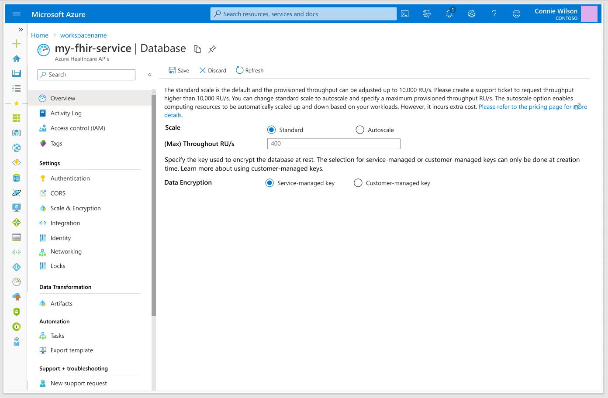

# FHIR Autoscaling Gen 1

## Autoscale Up and Down Compute Instances and Cosmos DB

# Scenario Contacts 

**Program Manager (PM):** Benjamin Xue

**Software Engineer (Dev):** Deepak Bansal, Abhijeet Thacker

# Why There is a Gap Today? (PM) 

*This section is **required** for assignment of engineering resources.*

Section status: \[draft\]

Date reviewed: \[Date\]

## Problem Statement 

The Azure API for FHIR runs in a shared Service Fabric environment for a set of customers 
in each Azure region. Each
customer is provisioned with a designated app or service with default 
configuration settings, which includes 2 compute instances or replicas
including 5 concurrent sessions in each instance and a Cosmos DB 
database. The default settings can only be adjusted manually, 
which has presented a big challenge for customers as they increase production workloads and
require more computing resources. It has also become a burden for the support team. 

With the manual process, customers can adjust the database provisioned 
throughput from the default 400 RU/s up to 10k RU/s through the portal, to support 
large workloads. When their workloads exceed the overall capacity of the API service, customers start 
seeing slow responses, 429 errors or "too many requests". They can create support tickets to get 
the support team involved, helping them raise compute instances, 
including the number of concurrent sessions in each instance, and/or Cosmos DB throughput RU/s. 
This has not been the best customer experience. Customers have asked that we provide support for autoscale 
that allows them to run various production workloads without having to worrying about running out of capability 
or paying extra costs due to over allocated computing resources.

To better serve our customers and meet their business needs, it is imperative that we improve the service scalability by providing 
autoscale as an option to the standard (or manual) scale through the Azure portal. The reason why we keep the two options available 
to customers is because there are extra costs associated with autoscale and customers must agree to pay for the extra costs when they 
enable the autoscale option. The extra costs are resulted from Cosmos DB autoscale, 
which is 50% more than the standard (or manual) throughput rates.

While autoscale involves compute autoscale, which is supported by Service Fabric autoscale, and database autoscale,
which is supported by Cosmos DB autoscale, it is unnecessary that we make compute autoscale as an option to the customers and that it should be 
enabled for all customers.
Here is why. With compute autoscale, the number of compute instances scales up (up to the max limit we can set) 
and down (down to the default 2 instances) to meet the transaction demands automatically. This is the expected scalability behavior.
On the billing side, unlike Cosmos DB autoscale, there is no extra cost. 
And we are currently not charging customers for the extra computing runtime resoures. In short, there is no reason why we should not enable 
compute autoscale for customers when we are ready to do so.

The screen mockups are included here to demonstrate the customer experience. 
1.Customers can change the provisoined throughput RU/s as they can today.
2.Customers can change between the standard (or manual) scale option and the autoscale optoin.
3.Customers can change max provisioned throughput only after autoscale is enabled.
4.Customers will pay the extra costs for autoscale.

**Supporting Customer Insights**

#### Cigna

Cigna, one of the large customers on our healthcare data platform, has
accumulated approximagtely 80 TB over the past sever years or so, mostly prescription claims and provider
directory data, which consists of small resource size but large number of resources, 
3.5 billion resources and 8 million provider resources. In
addition, Cigna processes 7 million claims/hour. They experienced 429
errors and performance throttling issues recently. To support such a
large number of requests/second, we granted them with 1million
RU/s, 45 instances with 25 concurrent sessions for each instance.

#### Walgreens

Walgreens rolledd out a Covid-19 vaccination program on our platform in early 2021. They
recently reported some performance issues due to high transaction
volumes. We worked with the internal support team and addressed the performance issue by increasing
their compute replicas to 16 with 25 concurrent sessions for each, and increased 
database RU/s to 50k.

#### Humana

Humana complained about lack of autoscaling and on getting 429s, and escalated the issue. They indicated that  
autoscaling on CosmosDB would resolve their issue most likely. As a direct response to the customer request,
we enabled Cosmos DB autocaling manually for the customer in early April. 

## Related Work 

The autoscale feature is an improvement over the manual process. There is no related work.

## What is Being Proposed? 

Provide autoscale as an option for the Azure API for FHIR

## Elevator Pitch / Press Release 

## Justification, Expected Business Impact, and Value Proposition 

We have recently seen strong demands from customers for the autoscale 
feature, especially from those who ran large production workloads in Azure 
API for FHIR and experienced service performance issues. Some of them  
escalated the issues and 
asked that we help them resolve the issues by providing the autoscale feature.

The team has agreed that, after reviewing the business priorities during the QBPR, 
we work on the autoscale feature in the second quarter of 2021 for Gen 1. 

When the autoscale feature is generally available, we expect that customers can run different workloads with 
no or less performance issues and that the support cases related to performance issues drop. In addition, 
we can apply lessons learned, and re-use some code possibly, when we offer the autoscale feature in Jupiter.

However, the autoscale feature may have revenue on some customers. 
While customers pay 50% extra costs when autoscale is enabled, 
some customers may pay less because they end up with consuming less database throughput RU/s. 
We are aware of the potential revenue impact and believe that it is the right thing to do for the customers. In essence, 
this aligns well with the new pricing model to be introduce in Jupiter where customers only pay what they use.

## Target User / Persona 

Once the autoscaling is enabled by an authorized user or administrator, no direct user interaction is required.

## Existing Solutions and Compete Info 

GCP 

The underlying infrastructure for the GCP’s healthcare API is built on
Spanner, although you won’t find it in the public documentation,
according to one Google engineer’s
blog [<u>post</u>](https://medium.com/@vneilley/are-all-fhir-apis-the-same-48be75ac4ac5).  One
of Spanner’s key feature is fully managed relational database with
unlimited scale, strong consistency, and up to 99.999% availability.

AWS 

Amazon
announced [<u>HealthLake</u>](https://aws.amazon.com/healthlake/) in
December of 2020, which is a HIPAA-eligible service. Amazon claims
that HealthLake allows customers to store, transform, query, and analyze
health data at petabyte scale. 

## Customers/Partners Interaction Log 

| Customer/Partner Name | Conversation Details / Specific Requirements | Last Contact | Private Preview Candidate |
|-----------------------|----------------------------------------------|--------------|---------------------------|
|                       |                                              |              |                           |
|                       |                                              |              |                           |

# APPROVAL GATE - WHY

Complete a review and get Director approval to continue.

# User-Facing Feature Design 

*Guidance: This section describes all aspects of the feature with a
user-facing component, including customer use cases, metrics, and
scenario KPIs. This section is more than just UI!*

*This section is **required** for all user-facing features. Features
with no user impact, for example improvements to the service
implementation, may treat this section as **optional**. You probably
can’t skip this section.*

Section status: \[draft, review, accepted\]

Date reviewed: \[Date\]

## Terminology (PM/Dev) 

| Term | Definition |
|------|------------|
|      |            |
|      |            |
|      |            |
|      |            |

## Branding (PM) 

## Detailed Feature Description (PM/Dev) 

## Goals (PM/Dev) 

| Goal                                                                                                                                           | Target Release | Priority |
|------------------------------------------------------------------------------------------------------------------------------------------------|----------------|----------|
| Phase I: Provide Cosmos DB autoscale as an option. Allow customers to change max throughput RU/s up to 10,000 RU/s. No portal integration.               | 5/31/21        | P0       |
| Phase II: Expose the autoscale feature through the Azure portal. Make compute autoscale a default option to all customers.           | 6/30/21        | P0       |                                                                                                                                                |                |          |
|                                                                                                                                                |                |          |
|                                                                                                                                                |                |          |
|                                                                                                                                                |                |          |
|                                                                                                                                                |                |          |
|                                                                                                                                                |                |          |
|                                                                                                                                                |                |          |
|                                                                                                                                                |                |          |
       |                                                                                                                                         |                |          |

## Non-Goals (PM/Dev) 

| Non-Goal                                                                     | Mitigation                                                                                                                |
|------------------------------------------------------------------------------|---------------------------------------------------------------------------------------------------------------------------|
| Change the billing service.                                                  | No change to the billing service for Azure ApI for FHIR is necessary. For Cosmos DB autoscale, the RU/s consumption is automatically adjusted. For compute autoscale, runtime billing rates are the same. |
|                  |                                       |

## Scenarios and Use Cases (PM/Dev) 

| Scenario / Use Case                                     | Steps to fulfill the scenario                                     | Priority |
|---------------------------------------------------------|-------------------------------------------------------------------|----------|
| The user enables or disables autoscale from the portal. | Change to autoscale to enable, or change to manual to disable, and save the setting.               | P0       |
| The user changes the max provisioned throughput RU/s from the portal. | After autoscale is enabled, change the number up to 10,000 RU/s and no less than 10% of the current value.              | P0       |
| The user changes a max provisioned throughput RU/s higher than 10,000 from the portal. | Create a support ticket to request a higher throughput RU/s number.            | P0       |
| The user changes provisioned throughput RU/s, when autoscale is disabled, from the portal. | Change up to 10,000 RU/s and no less than storage data in GB multiplied by 40 RU/GB            | P0       |
| The user changes provisioned throughput higher than 10,000 RU/s, when autoscale is disabled, from the portal. | Create a support ticket to request a higher throughput RU/s number.             | P0       |
|                                                         |                                                                   |          |
|                                                         |                                                                   |          |

## Scenario KPIs (PM) 

| Type  \[Biz \| Cust \| Tech\] | Outcome | Measure | Target | Priority |
| -------------------------- | ------- | ------- | ------ | -------- |
|                            |         |         |        |          |
|                            |         |         |        |          |

## What’s in the Box? (PM) 

*Guidance: This section lists everything the customer gets in the end.
Is there a new service? Templates? Samples? SDK?*

It is an improvement to the released service, including some changes to the portal UI.

## Feature Dependencies (PM/Dev) 

*Guidance: This section describes both the dependencies this feature has
on other areas as well as other areas impacted by this work. Examples of
areas which may be impacted: Persistence Provider, FHIR API.*

### Dependencies this design has on other features 

| Feature Name              | Nature of dependency | Mitigation/Fallback | PM  | Dev |
|---------------------------|----------------------|---------------------|-----|-----|
| Service Fabric Auto Scale | Built-in             |                     |     |     |
| Cosmos DB Auto scale      | Built-in             |                     |     |     |
|                           |                      |                     |     |     |

### Features that have a dependency on this design 

| Team Name | Contacts | PM  | Dev |
|-----------|----------|-----|-----|
|           |          |     |     |
|           |          |     |     |

## Customer Validation Plan (PM) 

*Guidance: This section gives details on how we plan on engaging with
customers to validate our assumptions and design.*

We plan to make the autoscale feature available to all customers. However,
it is not enabled by default. customers must enable (or disable) the feature.

### Customer Research Required 

We have heard and learned from more than one customer that they wanted to have the autoscale capability to run their data workloads that 
may vary signficantly. No additonal customer research is required.

### Criteria for Customer Selection 

All customers are eligible.

### Customers Selected 

All customers.

## User Interface (PM) 

### Storyboard 

*Guidance: This section is for features with a UI/UX component.
Alternatively, you can also create Storyboard in PowerPoint and provide
link to the PPT in this section.*

### Usability Validation 

*Guidance: This section defines the usability labs required to validate
the user interface design.*

## End User Troubleshooting (PM) 

*Guidance: This section describes what we provide to the customer in
order to enable them to troubleshoot issues with the feature. Customer
Metrics and logging to be provided by Azure Insights unless otherwise
noted.*

### Azure Monitor Metrics 

| Metric Name | Display Name | Description | Dimension | Metric Unit | Aggregation Type | Proposed Alert Rule | Time to Detect |
|-------------|--------------|-------------|-----------|-------------|------------------|---------------------|----------------|
|             |              |             |           |             |                  |                     |                |
|             |              |             |           |             |                  |                     |                |

### Logging 

| Log Category | Category Display Name | Log Event | Log Event Display Name | Proposed Alert Rule |
|--------------|-----------------------|-----------|------------------------|---------------------|
|              |                       |           |                        |                     |
|              |                       |           |                        |                     |

### Troubleshooting guidance 

*Guidance: This section describes the steps customers should take to
troubleshoot common errors. This will be used to populate the
documentation*

### Troubleshooting in the Azure Portal 

*Guidance: This section describes the troubleshooting guidance that is
populated in the Azure portal.*

| Problem Type (if new) | Problem Category | Troubleshooting Guidance |
|-----------------------|------------------|--------------------------|
|                       |                  |                          |
|                       |                  |                          |

## Proposed release plan (PM/Dev) 

*Guidance: This section is particularly important if running a private
preview as part of the release. Use it to align collateral releases.*

### Private Preview 

#### Target date

#### Goals for Release 

\[e.g. to validate assumptions\]

#### Features for Release 

\[List of features\]

#### Collateral Required 

\[List of collateral, e.g. docs, marketing, etc.\]

#### Success criteria 

\[List\]

#### Customers Involved 

\[List\]

### Public Preview 

#### Goals for Release 

\[e.g. to validate assumptions\]

#### Features for Release 

\[List of features\]

#### Collateral Required 

\[List of collateral, e.g. docs, marketing, etc.\]

#### Success criteria 

\[List\]

#### Customers Involved 

\[List\]

### General Availability 

#### Target date

Initial rollout: 05/31/2021

GA: 06/30/2021

#### Goals for Release 

\[e.g. to validate assumptions\]

#### Features for Release 

\[List of features\]

#### Collateral Required 

\[List of collateral, e.g. docs, marketing, etc.\]

#### Success criteria 

\[List\]

#### Customers Involved 

\[List\]
