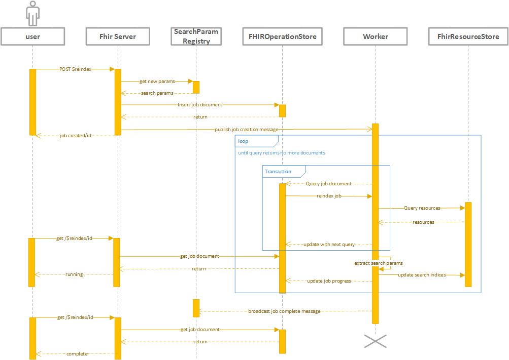

# Reindexing
- [Reindexing](#reindexing)
  - [Description](#description)
  - [Requirements](#requirements)
    - [Managing a reindexing job](#managing-a-reindexing-job)
    - [Reindexing worker](#reindexing-worker)
    - [Related search requirements](#related-search-requirements)
    - [Out of scope](#out-of-scope)
  - [Design](#design)
    - [Managing resources during reindexing](#managing-resources-during-reindexing)
    - [Configuration](#configuration)
    - [Reindex API](#reindex-api)
    - [Seach Param Hash](#seach-param-hash)
    - [$reindex job task](#reindex-job-task)
      - [Sequence Diagram](#sequence-diagram)
    - [Query of search params](#query-of-search-params)
  - [Generalizing a long running job framework](#generalizing-a-long-running-job-framework)
  - [Logging and Metrics](#logging-and-metrics)
  - [Test Strategy](#test-strategy)
    - [Unit tests](#unit-tests)
    - [Integration Tests](#integration-tests)
    - [E2E Tests](#e2e-tests)
    - [Performance testing](#performance-testing)
  - [Out of scope -- future work](#out-of-scope----future-work)
## Description
We want the ability to reprocess already committed resources and extract any new or updated search parameters. This will enable custom search parameters as well as support extensions, such as US Core.

This feature has many similarities to bulk export and follows the same general pattern.
## Requirements
### Managing a reindexing job
* User must be able to manually start a reindexing
* User must be able to obtain reindexing job status
  * Depending on FHIR data store capabilities, this should include a % complete based on total number resources needing to be reindexed vs completed
* User must be able to cancel an inprogress reindexing job
  * This will leave any resources that have been processed with the new indices as they are when the cancel occurs
* User must be able to control the level of concurrency to manage load on the server
* User shall be authenticated and authorization checked
  * We will add a specific action for reindex in the RBAC rules
* For testing purposes, users can specify a search query to limit the scope of the reindexing job.  This will result in a partially indexed search param.
* For testing a single resource, user can synchronously cause a resource to be reindexed
### Reindexing worker
* Worker must be able to determine which parameters have/have not been indexed, see [Search Parameter Registry](./SearchParameterRegistry.md)
* Worker must be able to identify which resources need to be reindexed
* Worker must be able to manage multiple independent threads/processes simultaneously reindexing part of the data store
* Worker must be able to resume an interrupted job
* Worker must be able to throttle so that it doesn't consume all available resources
### Related search requirements
* Searching against any unsupported or not-fully indexed search param shall result in a warning in the Bundle results
  * In the case of the `strict` header the result will be an OperationOutcome with an error message
* User can specify a header to allow use of partially indexed search params -- this is designed to allow development and testing of new search params against a subset of the data

### Out of scope
* Automatic adjustment of concurrency and query delay based on RU/DTU size of database
* Option to scale up during reindex job and automatically scale back down when job completes

## Design
An important aspect of the design is to maintain separation between the API and the reindexing worker.  We need a worker which can be easily deployed for the open source server and at the same time be something which can be totally separate from the FHIR Server instance.  For the PaaS solution we may need the ability to run the reindex job on a different node to avoid consuming resources for the FHIR server.

### Managing resources during reindexing
There may be times when we discover an issue with the data which requires us to reindex the resources in the customer database.  We will want to do this quickly and without using the resources dedicated to the customer.

Also, the customer may simply want to add a set of new custom search parameters and then reindex the data.  They may need to temporarily scale up their service while reindexing.  A nice feature would be to manage this scaling for the customer while the indexing is running.

### Configuration
There will be a new section in the configuration file
```json
{
    "FhirServer": {
        ...,
        "Operations" : {
            ...,
            "Reindexing": {
                "Enabled": true,
                "ConsecutiveFailuresThreshold": 5, // The number of consecutive failures allowed before the job is marked as failed. Setting this number to 0 means job will not be retried and setting this number of -1 means there is no threshold.
                "MaximumConcurrentReindexJobs": 1, // The number of concurrent job allowed.Setting this number to 0 means there is no limit.
                "DefaultMaximumThreadsPerReindexJob": 1, // The number of threads created per reindex job
                "MaximumQueryCountSize": 100, // The maximum number of items to be returned by the query. Settings this number to 0 means let the server decide the number of items returned.
                "QueryDelayIntervalInMilliseconds": 500, // The number of milliseconds to wait between queries. Setting this number to 0 means there will not be any delay between queries.
            }
        }
    },
}
```
### Reindex API
(adapted from [Custom Search doc](./Custom-Search.md))
Following the pattern from $export we will have an endpoint for the $reindex operation.

We should update the capabilities statement with the $reindex operation including details on the possible input and output parameters.
``` 
POST //fhirserver/$reindex
```
With an optional payload to specify concurrency:
```json
{
    "resourceType" : "Parameters",
    "parameter" : [
        { "name" : "maximumConcurrency" , "value" :"1" }, //0 means unlimited, reindex at the expense of server performance
        { "name" : "scope", "value":"/Patient/<GUID>" }
    ]
}
```
On success we will return `202 Accepted` with a response payload of:

```json
{
    "resourceType" : "Parameters",
    "parameter" : [
    { "name": "id", "value" : "<GUID>" },
    { "name": "startTime", "value" : "TIME-STAMP" },
    { "name": "progress", "value" : "0%" },
    { "name": "status", "value" : "queued" },
    { "name": "maximumConcurrency", "value" : 1 },
    { "name" : "scope", "value":"/Patient/<GUID>" }
    ]
}
```
This will also include a `Content-Location` header with the url `//fhirserver/$reindex/id` to indicate how to get status updates on the job.

An alternate POST can cause a single resource to be reindexed.  The POST will look the same, but the `scope` parameter must identify a single resource and the `Prefer` header must be included in the HTTP message with a value of `respond-sync`.   This will result in a `200 OK` and the response will include the extracted search parameter values.
```json
{
    "resourceType" : "Parameters",
    "parameter" : [
    { "name": "id", "value" : "<GUID>" },
    { "name": "startTime", "value" : "TIME-STAMP" },
    { "name": "progress", "value" : "100%" },
    { "name": "status", "value" : "complete" },
    { "name": "maximumConcurrency", "value" : 1 },
    { "name" : "scope", "value":"/Patient/<GUID>" },
    { "name" : "searchParamValue",
      "value" : [
          { 
              "name" : "param1",
              "type" : "type1",
              "value" : "value1"
          }
      ]}
    ]
}
```
Only one reindex job will be allowed to be currently running at a time.  If a user POSTs again the $reinded endpoint will return an OperationOutcome message  that a current job is in progress and must be canceled before another job can be created.
```
GET //fhirserver/$reindex/id
```
Allows a user query the job status
```json
{
    "resourceType" : "Parameters",
    "parameter" : [
    { "name": "id", "value" : "<GUID>" },
    { "name": "startTime", "value" : "TIME-STAMP" },
    { "name": "progress", "value" : "15%" },
    { "name": "status", "value" : "running" },
    { "name": "maximumConcurrency", "value" : 1 },
    { "name" : "scope", "value":"/Patient/<GUID>" }
    ]
}
```
```
GET //fhirserver/$reindex
```
We should also have a `GET` for a list of jobs.  It will return a Bundle of `Parameters` resources which each resource being a reindex job.
```json
{
  "resourceType": "Bundle",
  "id": "reindexjob20130528",
  "timestamp": "2013-05-28T22:12:21Z",
  "entry": [
      {
        "resourceType" : "Parameters",
        "parameter" : [
        { "name": "id", "value" : "<GUID>" },
        { "name": "startTime", "value" : "TIME-STAMP" },
        { "name": "progress", "value" : "15%" },
        { "name": "status", "value" : "running" },
        { "name": "maximumConcurrency", "value" : 1 },
        { "name" : "scope", "value":"/Patient/<GUID>" }
        ]
      }
  ]
}
```
PATCH //fhirserver/$reindex/id
```
Allows a user to pause a job or update the number of threads. Submit with a payload:
```json
{
    "resourceType" : "Parameters",
    "parameter" : [
    { "name": "id", "value": "<GUID>" },
    { "name" : "status", "value" : "paused",},
    { "name" : "maximumConcurrency", "value" : 5 }
    ]
}
```
Returns a `202 Accepted` with a payload equal to a `POST`:
```json
{
    "resourceType" : "Parameters",
    "parameter" : [
    { "name": "id", "value" : "<GUID>" },
    { "name": "startTime", "value" : "TIME-STAMP" },
    { "name": "progress", "value" : "15%" },
    { "name": "status", "value" : "paused" },
    { "name": "maximumConcurrency", "value" : 1 },
    { "name" : "scope", "value":"/Patient/<GUID>" }
    ]
}
```
```
DELETE //fhirserver/$reindex/id
```
Allows a user to cancel a job, will return a `200 OK` with payload:
```json
{
    "resourceType" : "Parameters",
    "parameter" : [
    { "name": "id", "value" : "<GUID>" },
    { "name": "startTime", "value" : "TIME-STAMP" },
    { "name": "endTime", "value" : "TIME-STAMP" },
    { "name": "progress", "value" : "15%" },
    { "name": "status", "value" : "canceled" },
    { "name": "maximumConcurrency", "value" : 1 },
    { "name" : "scope", "value":"/Patient/<GUID>" }
    ]
}
```

### IFHIRDataStore update
As we do not want to create a new version of the resource we will need a new method for the data stores to implement which allows updating search params on a batch of resources.

This operation should update not only the current version of the resource but any previous versions in history as well.
``` C#
Task<UpdateIndicesOutcome> UpdateSearchParamsBatchAsync(IReadOnlyCollection<SearchIndicesWrapper> paramsBatch, CancellationToken cancellationToken);
```
### Search feature updates
There will need to be updates to the search feature to allow searching for features based on a new searchParamHash field, and for retrieving both the raw resource, all previous versions of the raw resource in History as well as their associated search index values.  

### Queueing a new $reindex job
* user posts the job
    * Verify the user has permissions to reindex
    * Verify no other reindex jobs are running
* Query the [SearchParameterRegistry](/SearchParameterRegistry.md) for any searchParams that are marked as not fully indexed
* Determine which resources need to be reindexed based on the list of new/updated search params
* Set a flag blocking the update or creation of new search params until the $reindex job is completed or canceled
* Create reindex job document and persist to the FhirOperationStore

Sample reindex job document:
``` json
{
    "cancellationRequestedTimestamp": "", // The timestamp when the cancellation is requested.
    "endTimestamp": "", // The timestamp of when the job was completed.
    "id": "a0a13edb-ce1c-4347-8dca-8abfc6a7d453",
    "searchParams": [
        "http://hl7.org/fhir/us/core/SearchParameter/us-core-ethnicity",
        "http://hl7.org/fhir/us/core/SearchParameter/us-core-race"
    ],
    "searchParamHash":"<hashvalue>",
    "input": { // Information related to input.
        "parameter" : [
        {
            "name" : "maximumConcurrency" ,
            "value" :"1" //0 means unlimited, reindex at the expense of server performance
        }
        ]
    },
    "jobSchemaVersion": 1, // The version of the job schema.
    "numberOfConsecutiveFailures": 0, // The number of consecutive failures. If this value exceeds ConsecutiveFailuresThreshold, we will mark the job as completed with failure.
    "lastChangeTimestamp": "", // The timestamp of when the job record was last updated. If the status is Running and this timestamp is older than WorkerTimeoutThresholdInSeconds, we will consider the job no longer active and worker is free to pick this up again.
    "errors": [{
        "type": "OperationOutcome",
        "sequence": 1,
        "count": 1
    }],
    "progress": {
        "queries": [
            {
                "query":"/?_searchParamHash=ne<hashvalue>",
                "status":"started",
                "lastUpdated" : "2019-02-26T15:59:30.350Z",
                "failures": 0
            },
            {
                "query":"/?_searchParamHash=ne<hashvalue>&ct=%7B%22token%22%3A%22%2BRID%3Af79IAO15VDQEAAAAAAAAAA%3D%3D%23RT%3A1%23TRC%3A1%23FPC%3AAQQAAAAAAAAADAAAAAAAAAA%3D%22",
                "status":"queued",
                "lastUpdated" : "2019-02-26T15:59:30.350Z",
                "failures": 0
            }
        ],
        "results": {
            "total":"502094", // total number of resources needing to be reindexed
            "completed":"100", // resources successfully processed so far
        }
    },
    "queuedTimestamp": "2019-02-26T15:59:30.350Z", // The timestamp of when the job was queued.
    "startTimestamp": "", // The timestamp of when the job was picked up for the first time. Even if the job fails and gets picked up again, this value will not be changed.
    "status:" :"Queued", // The job status. Must be one of the following values: Queued, Running, Failed, Cancelled, and Completed.
    "totalNumberOfFailures": 0, // The total number of failures. We could choose to fail the job if this value exceeds certain threshold or we could simply use it for telemetry purposes. nccxc
}
```
### Seach Param Hash
Each resource will need a new metadata value which identifies the search parameters that have been successfully extracted.  This will require a schema update for SQL and a new property for Comsos DB resources.  The value of the field will be a hash of the latest search parameters which apply to this resource and have been successfully indexed.
### $reindex job task
Similar to export, we can use the IHostService to create the worker which will create threads for specific jobs.
Alternate technologies:
* Azure functions with both a timer to poll for jobs and an HTTP trigger to be notified of new jobs
* Microsoft Orleans Grains, more below
#### Sequence Diagram


The following steps must be done in an atomic or blocking fashion, allowing only one thread to read and update the reindex job document at a time.  Each persistence provider will need to implement this functionality to ensure that is the case:
* Read assigned reindex job document:
    * if there is no initial query, build it from the resource types and the search params newest date time
      * Building the query will involve calculating a hash for each resource type based on the current set of search params which apply to each type
      * Also, if possible pre-load the next set of batches or queries to unblock other threads -- this will need further investigation
    * else find the next query in the query list marked as queued
* run the initial query with count to find the total job size
* run the initial query to obtain the first batch of documents and any continuation token for the next query
* if a continuation token is returned:
    * write back to the reindex job document the continuation token for the next page of documents
    * publish a notification that another query is available for a worker thread to pick up
  
Here each thread can begin running concurrently:
* Begin extracting the search params from the batch of resources
* If possible, check the newly extracted search params against the previous values to determine if any update is needed.  If so, add these parameters to the batch
* Upsert the new collection of SearchIndices
    * ETAG will need to verified to check for any resources updated between the query and when the search param extraction finished
    * This upsert should also update the searchParamHash value identifying the newly successfully extracted parameters
* Update the reindex job document that this page of the query is complete
  * Clean up the entry in the queries list so that the reindex job document does not grow unbounded
* After all queries with continuation tokens have been run and indices updated, as a final check, run the initial query one last time to ensure no results are returned
* Finally broadcast notification that the search params from the job have been reindexed to date time when the job was queued.
### Query of search params
When reading the resources back in order to $reindex we should ensure that we avoid any unnecessary serialization/deserialization, and that all necessary data is returned to determine if an update of the indices is required or not.
## Generalizing a long running job framework
Reindexing has many similarities to export and there are other potential long running tasks that operate on many resources in the server which we may want to add (conversion to new FHIR version for example).  It may be worth the effort the generalize a framework for these types of tasks.  

A potential technology, [Microsoft Orleans](http://dotnet.github.io/orleans/index.html) offers some pieces of the solution and could be prototyped.  In summary: Orleans provides clients which can create  a distributed object instance called a grain.  Grains have behavior and state.  They are run on a distributed set of workers called Silos and can have the state persisted so they can recover from a failure.  Orleans helps manage the creation of Grains and their distribution to different Silos.
## Logging and Metrics
* We need to track metrics for during of processing each batch
* Audit log entries when submitting a new reindex job
## Test Strategy
### Unit tests
* individual components need unit test coverage
### Integration Tests
* multiple concurrent threads on one job processing simultaneously
* multiple $reindex jobs (possibly on different resources?) running together
* paused and restarted job
* deleted job
* failed process, job restarts
* Reindex job queries a batch of resources for processing, during the search parameter extraction one (or more) of the resources in the batch is updated via POST
### E2E Tests
* Complete scenario where new search params are added, then a $reindex job is kicked off, completed and a search with the params is run and works
### Performance testing
* We need to do some performance testing to have an idea of how long it will take to reindex a database of resources and how much it will place on the server
## Out of scope -- future work
* Update the search parameter extraction code so that we are able to target specific FHIR paths for search parameter values without deserializing the entire resource.  This could speed up reindexing for a specific search param
* We could explore running the search parameter extraction code on the database itself.  This would involve a separate implementation per database, but would possibly be a significant increase in speed.