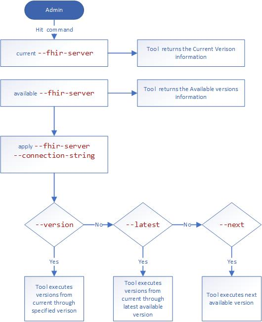

The database schema will evolve over time. A server in production will need to be upgraded to the latest version of the code, which may require changes to the schema.

Schema migrations can take a long time, often in proportion to the size of the database. For this reason, we do not believe that the server should perform schema migrations on startup. Instead, we propose shipping a command-line utility that admins can run to perform schema migrations.

Note that this design assumes that the migrations are static and that we do not need to generate tables based on a profile. (The idea would be the same but the complexity increases).

A migration is a T-SQL script that alters the database in some way and has a version encoded in its file name. The version will be an incrementing integer.

### Guiding Principles
* The information needed to update a FHIR server will be hosted by the FHIR server itself.
* The code will specify a min and max version of the schema that it can run against.
* Schema versions cannot break code that is running against the immediately preceding schema version.
* The admin tool will not perform an upgrade if the FHIR server(s) connected to the database will be broken by it. 
* The FHIR server instance will register its use of a specific version with the database.
* The FHIR server will not run against a database with an unknown version.
* The upgrade tool will not upgrade to the next version until all instances of the code are using the preceding version.

### High Level Diagram

#### Server


#### SchemaManager tool


### Example
Suppose we have a database currently on version 54 and a code version of 1.0.1. The next version of the FHIR server (1.0.2) decides to consolidate a "FirstName" and "LastName" column into a "Name" column, and drop the original columns.

This could be achieved by one code package update and 3 schema versions.

#### Schema versions
* 55 - Creates a new column
* 56 - Does a bulk update, setting the new `Name` column to be FirstName + ' ' + LastName
* 57 - Drops the old columns

#### Code package conditions
* `< 55` - Write data to the old columns, read from the old columns
* `== 55 ` - Write data to the new column and old columns, read from the old columns
* `>= 56 ` - Write data to the new column , read from the new column

#### Upgrade Sequence
1. The `SchemaVersion` table contains a row with the value 54 and the status of `completed`
2. A new version of the FHIR application is deployed with version 1.0.2
3. The admin runs the `SchemaManager` tool with `getcurrentversion` command
4. The server responds with `54`
5. The admin runs the `SchemaManager` tool with `getavailableversions` command
6. The server responds with `55`, `56`, `57`
7. The admin runs the `SchemaManager` tool with `applyversion` command with `--next` option
8. The `SchemaManager` checks that all servers are using version `54` and can support version `55`
9. Version 55 is added to the `SchemaVersion` table with the status of `started`
10. T-sql upgrade script is run
11. Version `55` is updated to `completed`
12. FHIR server polls and sees that `55` is now complete. It sets its current version to `55` and updates the instance schema table accordingly.
13. Steps 7-11 are repeated for versions `56` and `57`.

### Schema version table
The current version(s) are maintained in a `SchemaVersion` table. Each row will have a status that will indicate the current state of the given version. The states currently are:

| State     | Description                                                                                   |
| --------- | --------------------------------------------------------------------------------------------- |
| started   | The schema upgrade has started. This is the initial state when the version is inserted        |
| completed | The schema upgrade has been successfully completed. The code may now start using this version |

### Instance schema table
The currently running instance(s) of a FHIR server along with the schema information for that instance are recorded in an `InstanceSchema` table. On start-up a FHIR server will record its usage of a particular schema in this table along with a timeout. Periodically (before the timeout period) the server will update it's version information and the timeout will be extended. At the same time any old information (e.g. timeout < now) will be cleaned up. This information can be used from the `_schemas/current` route to correctly report which servers are using which version. It will also be able to determine if an upgrade is possible via the information in this table (by examining the current version and max versions). The table will likely need to record at least the following information.

| Column         | Description                                                   |
| -------------- | ------------------------------------------------------------- |
| Name           | A unique identifier for a particular instance.                |
| CurrentVersion | The current version of the schema that the instance is using. |
| MaxVersion     | The highest supported schema version for the instance.        |
| MinVersion     | The minimum supported schema version for the instance.        |
| Timeout        | The time at which the entry will age out of the table.        |

### Code considerations
The code will have to work for a number of schema versions and will specify a min and max version along with the current version that it's executing against. The current version will be mutable based on the values in the `SchemaVersion` table. 

Periodically the server should poll the database to find if there is a newer supported version in the `SchemaVersion` table that is completed and compatible. If found, it should assume that version and update its entries in the `InstanceSchema` table accordingly. 

On startup, the code should insert (or update) an entry in the `InstanceSchema` table with the schema version that it is using.

When a request is made to the FHIR server, it should record what version it is running against so that a consistent behavior can be accomplished throughout the request. 

### Initial setup
The plan is for a database to be previously provisioned/created before the tool is run. The current version endpoint must capture the case when the `SchemaVersion` table doesn't exist and return an empty array. The upgrade tool can then be run with the command `--latest` which will apply all applicable updates in order. 

### FHIR Schema APIs

GET //fhir-server/_schemas/current
```json
[
    {
        "id": 55,
        "status": "completed",
        "servers": ["instance1", "instance2"]
    },
    {
        "id": 56,
        "status": "started",
        "servers": []
    }
]
```

Returns the current version(s) of the schema

GET //fhir-server/_schemas/versions
```json
[
    {
        "id": 55,
        "script": "//fhir-server/_schemas/versions/55.sql"
    },
    {
        "id": 56,
        "script": "//fhir-server/_schemas/versions/56.sql"
    },
    {
        "id": 57,
        "script": "//fhir-server/_schemas/versions/57.sql"
    }
]
```

Returns the available schemas greater than or equal to the `current` version

GET //fhir-server/_schemas/compatibility
```json
{
    "min": 53,
    "max": 57
}
```

Returns the compatibility information from the server

For Example:

1. Lets say, InstanceSchema table looks like

|Name| CurrentVersion | MinVersion | MaxVersion | timeout |
|--|--|--|--|--|
|instance1  | 53 | 53 | 55 |  |
| instance2 |54  | 52 | 55 |  |
|  instance3| 53 | 53 | 56 |  |

2. SchemaVersion table looks like

|version| status |
|--|--|
| 52 |  complete|
| 53 |  complete|
| 54 | complete  |

3. Ideally the compability api returns
```json
{
    "min": 53,
    "max": 54
}
```
#### Technically(in words), 
* The compatibility API returns two values: min and max. 
* These are the minimum and maximum versions with which all running instances are compatible.
* min is calculated by finding the MAX(InstanceSchema.MinVersion).
* max is calculated by finding the the MIN(InstanceSchema.MaxVersion).

Note: we ensure that the values we pull from the InstanceSchema table are not stale by checking that the current time has not exceeded the value in the Timeout column.

### SQL Schema Manager tool

The following commands will be available via the tool
| Command           | Description                                                                                                                                                    | Options                                                                                |
| ----------------- | -------------------------------------------------------------------------------------------------------------------------------------------------------------- | -------------------------------------------------------------------------------------- |
| current    | Returns the current versions from the `SchemaVersion` table along with information on the instances using the given version                                    | --server                                                                          |
| available | Returns the versions greater than or equal to the current version along with links to the T-SQL scripts for upgrades                                           | --server                                                                          |
| apply      | Applies the specified version(s) to the connection string supplied. Optionally can poll the FHIR server current version to apply multiple versions in sequence | --server<br /> --connection-string<br />--next <br />--version<br />--latest<br />--force|

#### Options 

#### --next

It fetches the available versions and apply the next immediate available version to the current version.

#### -- version

It applies all the versions between current version and the specified version.

#### --latest

It fetches the available versions and apply all the versions between current and the latest available version.

#### --force
This option can be used with --next, --version and --latest. It skips all the checks to validate version and forces SchemaManager to perform schema migration.

#### Deployment mechanism
The tool should be available as a [.NET Core Global Tool](https://docs.microsoft.com/en-us/dotnet/core/tools/global-tools).

A global tool is simply a wrapper around a nuget package that can be executed via the dotnet command in a cross platform nature.

Additionally, we could ship a UX as an [Azure Data Studio](https://docs.microsoft.com/en-us/sql/azure-data-studio/what-is?view=sql-server-2017) extension. This would solve the problem of passing in a connection string and the tool already can help solve connectivity issues by changing firewall rules. **Requires more thought.**

Note that we will also need to run this tool (or invoke its core library) from the PaaS deployment scripts when upgrading and when the RP creates the database.

#### CommandLine Parsing
Command line parsing will be done via the [System.CommandLine](https://github.com/dotnet/command-line-api) library. This affords up many niceties that we don't have to create ourselves (parsing, help, etc.).

#### Upgrade failure thoughts
* An additional column of `checkpoint` could be added to `SchemaVersion` to more easily facilitate skipping portions of the upgrade script when restart needed
* Upgrade scripts could possibly be wrapped in a transaction to facilitate rollback

### Open issues

* Replication - What does replication mean for upgrading schemas. 
* Verification - Is there a need or way to verify that the SQL pulled by the tool is what is hosted by the server? 
* Tool versioning
* Hot fix schema version - Could possibly be addressed in how we cut versions of the code, but needs more thought.