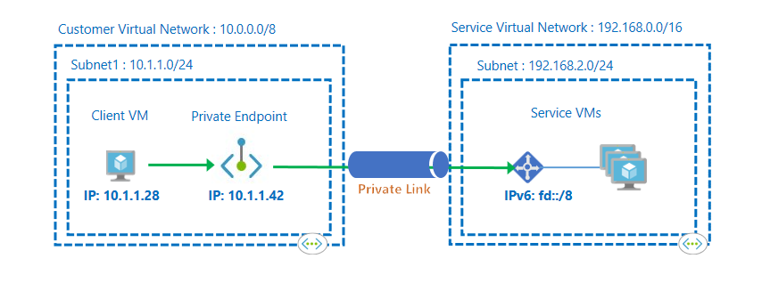
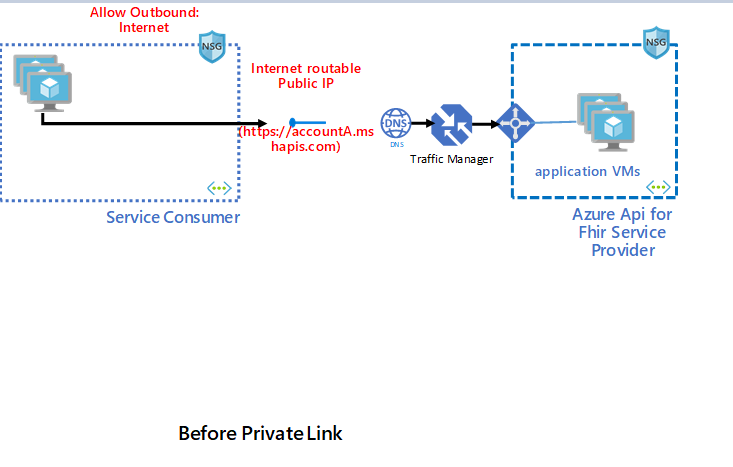
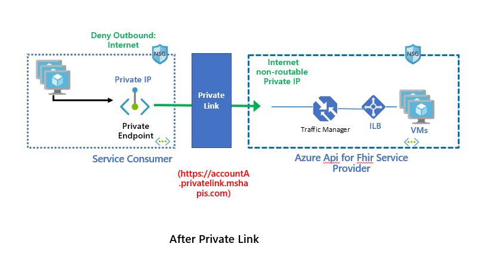
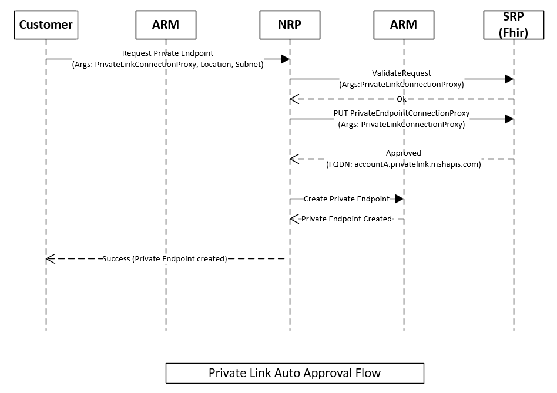
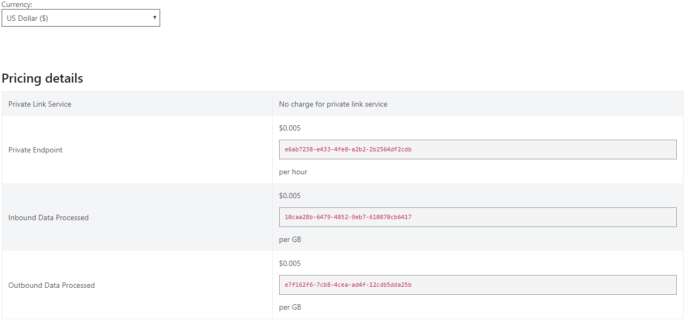

*Summary of the feature.*

[[_TOC_]]

# Business Justification

Private endpoints offer a solution to our customers who do not wish to access our Azure Api for Fhir service through public channels. This essentially brings the service into the customers virtual network allowing the customer to communicate with it directly using a private IP without having to use the public DNS.
This spec is about bringing the private endpoints feature to Azure Api for Fhir as a first party service.

# Scenarios

1. As a "Azure Api for Fhir" service user, I want to access the service securely from inside my Vnet as a first party service without having to go through a public DNS.
2. As a "Azure Api for Fhir" service user, I want my attempted connection request for private endpoint approved or rejected.
3. As a "Azure Api for Fhir" service user, I should be able to discover that I can create a private endpoint to the service.
1. As a "Azure Api for Fhir" service user, I should be able to create a private endpoint connection request from my vnet using powershell, cli or the azure portal after the service account is created.
1. As a "Azure Api for Fhir" account creator from Azure portal, I should be able to create the private endpoint connection during account creation. (P2 for Private Preview)
1. As a "Azure Api for Fhir" account creator from powershell/cli, I should be able to create the private endpoint connection during account creation. (P2 for Private Preview)

# Non Goals
The design for first party portal experience or first party powershell/cli is not included in here. We propose to have those for public preview.
The current thinking is that first party UI interactions for public preview will follow the same model as one of the released apps like storage. Same goes for first class support for powershell and cli for public preview.
Please see the [onboarding process](https://microsoft.sharepoint.com/teams/vnet/SitePages/Private-Endpoints.aspx) outline.

# Metrics

*List the metrics/telemetry that should be collected. For example: number of accounts that use feature X, number of requests to Y API per hour/day/week. How do we measure the success of this feature?*

Will work with @chami (PM) to ge the list of metrics. TBD.

# Design

## Terminologies

### Azure Private Link
It is a way to render and consume services delivered on Azure Platform privately.

### Private Link Service
A privately linkable service created by the Service provider (Microsoft.HealthcareApis). We will create this for Azure Api for Fhir as a first party service.

### Private Endpoint
A networking resource in consumer VNet used to consume services privately on Azure Platform. 

## Private Link Benefits
- Customers can consume services privately in their VNET.
- Traffic stays over Microsoft backbone and does not travel over the internet.
- Access from On-prem and peered networks.
- Approval workflow is available.

## High Level Architecture

### State Before Private Link

### State After Private Link

## Onboarding to make Microsoft.HealthcareApis Private Link enabled
We need to follow a bunch of steps for onboarding our service to be private link enabled.

## Onboarding Form
We provide a bunch of details for [onboarding](https://microsoft.sharepoint.com/teams/WAG/AzureNetworking/_layouts/15/Doc.aspx?sourcedoc={a5f1b1a5-c06f-47e0-8a99-65fe87d680af}&action=view&wd=target%28Documentation.one%7Cab1cc159-9ace-422c-9822-b902d233f61f%2FOnboarding%20Forms%20for%20All%20RPs%7Cae9ad659-79a6-4c71-9362-a5e82c0f1798%2F%29) to the private link team in an email including

- Our ResourceProvider Name (Microsoft.HealtcareApis)
- Arm Manifest Api version to use
- The client application id for our Resource Provider
	- DF: dc9e16dc-2d52-4950-ae2f-37d19ed2e317
	- Prod: 7e23c164-0bbc-4020-be55-aa5cf7f1ae28
- The ARM Rbac Role definition id that arm will use for RP-RP authorization.
- Team Contacts

## Control Plane Changes
We implement control plane changes as outlined in the private endpoints specification. Please see [spec](https://microsoft.sharepoint.com/:w:/r/teams/WAG/AzureNetworking/_layouts/15/Doc.aspx?sourcedoc=%7B64F10150-563A-4715-9476-FFA24F9BD42E%7D&file=%5BNRP%5D%20Private%20Endpoint%20Design%203.docx&action=default&mobileredirect=true&cid=7075b01e-18b3-42f7-950a-e1a09ede0e17).

### High Level Interaction Flow (Control Plane)
The below figure shows the high level auto approval interaction workflow happy path during provisioning. NRP is the network resource provider and SRP is the Microsoft.HealthcareApis Service Resource Provider.

- Customer requests a new private endpoint. The request goes through ARM to NRP.
- NRP sends a validate request to our service RP (SRP) through ARM with a proxy object representing the private endpoint.
- SRP validates the request and returns a validation response.
- NRP then calls SRP on validation pass with the private endpoint proxy object and a unique link identifier and the request type of either manual or auto approval.
- SRP stores the metadata for the endpoint and returns the FQDN information if auto approved. Otherwise, SRP stores the metadata as pending.
- NRP goes ahead and creates the private endpoint if auto approval. Otherwise, whenever a data admin approves the endpoint, NRP creates the private endpoint.

### Approval workflow for private endpoints
Customer requests a private endpoint with either manual or auto approval request type.

In case of manual request, ARM does not do any permission check, SRP stores the metadata with a pending state and returns. NRP creates a private endpoint pending approval by a data admin. 

In case of auto approval request, ARM checks to see if the user has permission on the healtcareapi account, if not rejects it. Otherwise, calls SRP which will store metadata information in the registry and return Success to NRP. NRP will create an active endpoint.

For pending manual approval requests, a data admin (user with permissions on the account) will have to approve or reject the endpoint. This resuls in NRP calling an api on our end and SRP will mark the endpoint as approved in its metadata and return. NRP will create an active endpoint.

### REST Api Calls to be implemented
We need to implement the following REST Api calls for the various interactions between NRP and SRP as outlined above. Please also see [spec](https://microsoft.sharepoint.com/:w:/r/teams/WAG/AzureNetworking/_layouts/15/Doc.aspx?sourcedoc=%7B64F10150-563A-4715-9476-FFA24F9BD42E%7D&file=%5BNRP%5D%20Private%20Endpoint%20Design%203.docx&action=default&mobileredirect=true&cid=7075b01e-18b3-42f7-950a-e1a09ede0e17) for more details.

| API                              | Method         | Description |
|--------------------------------------|--------------|-|
| https://manangement.azure.com/subscriptions/{subscriptionId}/resourceGroups/{rgName}/providers/Microsoft.HealthcareApis/{resourceType}/{resourceName}/privateEndpointConnectionProxies/{peName}.{guid}/validate?api-version=[version]  | POST |Validate Call|
| https://management.azure.com/subscriptions/{subscriptionId}/resourceGroups/{groupName}/providers/Microsoft.HealthcareApis/{resourceType}/{resourceName}/privateEndpointConnectionProxies/{peName}.{guid}?api-version=[version] | PUT     |Create Private Endpoint|
| https://management.azure.com/subscriptions/{subscriptionId}/resourceGroups/{groupName}/providers/Microsoft.HealthcareApis/{resourceType}/{resourceName}/privateEndpointConnections/{privateEndpointConnectionName}?api-version=[version] | PUT     |Approve/Reject for Manual Approval Flow|
| https://management.azure.com/subscriptions/{subscriptionId}/resourceGroups/{groupName}/providers/Microsoft.HealthcareApis/[resources]/[resourceName]/privateLinkResources?api-version=[version]  | GET     |Get Group Ids|
| https://management.azure.com/subscriptions/{subId}/resourceGroups/{rgName}/providers/Microsoft.HealthcareApis/[resources]/{resourceName}?api-version=[version]   | GET     |Modify existing API to add private link info in properties|
| https://management.azure.com/subscriptions/{subId}/resourceGroups/{rgName}/providers/Microsoft.HealthcareApis/[resourceTypes]/{resourceName}/privateEndpointConnectionProxies/{proxyName}   | DELETE     |Delete private link connection|

We will update the ARM Resource Provider Service to add new Resource Type handlers to handle the new routes required for implementing the above REST Api calls.

### Broad implementation outline for the various REST Apis
- Validate Call: For validate call, we will verify that the specified group id is valid and is fhir. We will check the account metadata to see if we have already reached the maximum number of private link connections allowed. We will also validate that the call is coming from NRP by checking for the NRP application id in the header.
- Create Private Endpoint: We will validate that the caller is NRP by verifying the application id for NRP in the header. Then we will update the registry document for the account (the private link service id is the same as the resource id for the account) to add the private endpoint information in the account metadata. The private endpoint information saved to the registry would be the endpoint name, the private link id, the fqdn, the approval status of approved and other details necessary in case of auto approval request. In case of manual approval request, we will update the metadata with the endpoint name and the approval status of pending.
- Approve/Reject for Manual Approval Flow: We will validate the caller is NRP by verifying the application id calling us is NRP's application id. This call will happen whenever a data admin goes ahead and approves a private endpoint connection. We will validate that the connection is indeed pending. We will follow the same process as in create private endpoint above for auto approval.
- Delete Private Link Connection: Remove the details added from registry added as part of Create Private Edpoint. Validations include check whether NRP is calling and also if the endpoint information actually exists in the registry.
- Get Group Ids: TBD what to return. For now, I believe we return "fhir". Need to get more information/details on this. Looks like you need at least one sub resource id (group id).

TBD: Do we need a group id? If so, can we name it fhir?

TBD: Do we need to restrict the customer for the maximum # of private endpoint connections allowed? If so, what is the number? Example 5??

## Portal Changes
For private preview, we are not planning on making any portal changes for now as part of provisioning or updating a fhir resource for creating private endpoints. There is a separate portal experience already available for managing private endpoints and we will initially have our customers use that experience.
For public preview, we will have an inbuilt portal experience for Azure Api for Fhir. This will need a bit of UI interaction design, however this is something we can follow from other apps like storage's lead.

## ARM Related Changes
- We will have to update the provider authorization section of the arm manifest to add the role id assoicated with our service.
- We need to add the new endpoints for private link in the arm manifest.
- We need to update our Swagger definition to add the new rest api endpoints for private link.
- TBD: Arm template changes needed to support specifying private endpoints in the properties section of the arm manifest.

## Data Plane Changes
Please see private link teams [spec](https://nam06.safelinks.protection.outlook.com/ap/w-59584e83/?url=https://microsoft.sharepoint.com/:w:/r/teams/WAG/AzureNetworking/_layouts/15/Doc.aspx?sourcedoc%3D%257BB01E6B97-725D-4B27-8975-EA8B9F3D4FCC%257D%26file%3DPrivateIp_DataPathSpec_Onboarding.docx%26action%3Ddefault%26mobileredirect%3Dtrue%26cid%3D6098a7f1-4323-41f3-b055-3dc9ba955800&data=02%7c01%7cmalop%40microsoft.com%7c729f78164e544c6ee3a308d742c44ec2%7c72f988bf86f141af91ab2d7cd011db47%7c1%7c0%7c637051283208742562&sdata=T0y1lCvjV4xqdDjlR9AGrNne04UpjwOyxWrZgzIbYT8%3D&reserved=0) on this.
Basically we need to do the following in our front end service.
- Check if the hostname has the format "accountA.privatelink.azurehealthcareapis.com". If so
- Validate that the incoming ip is ipv6 and the 10th bit is set.
- Extract the private link id from bits 17 to 48, a total of 32 bits.
- Extract the account name from the host name and get the registry information.
- Validate that the account is private link enabled.
- Validate that the link id in the metadata matches with the link id extracted from ipv6.

TBD: Not sure if we need to make any other changes, load balancer or otherwise to allow ipv6 traffic. Assumption currently is NO.

**Exception from above checks**

Whenever health checks are called (accountA.privatelink.mshapis.com/health/check), we will let it through.

## DNS Changes

### Create/Update private endpoint
We will reconfigure the azure public DNS records during provisioning create/update of private link as follows.

**Current DNS records**

cname accountA.mshapis.com => trafficmgrprofilenameforaccount.trafficmanager.net

**Updated DNS records**

cname accountA.mshapis.com => accountA.privatelink.mshapis.com

cname accountA.privatelink.mshapis.com => trafficmgrprofilenameforaccount.trafficmanager.net

### Delete private endpoint
We will reconfigure the azure public DNS records when **all** private endpoints are deleted.

**Current DNS records**

cname accountA.mshapis.com => accountA.privatelink.mshapis.com

cname accountA.privatelink.mshapis.com => trafficmgrprofilenameforaccount.trafficmanager.net

**Updated DNS records**

cname accountA.mshapis.com => trafficmgrprofilenameforaccount.trafficmanager.net

## Powershell Changes
For private preview, we do not intend to make any powershell changes. For public preview, we intend to add support for private endpoints in our healthcare apis commandlets.

During private preview, customers can use the available commandlet below to create a private endpoint.

New-AzPrivateEndpoint
   -Name <String>
   -ResourceGroupName <String>
   -Location <String>
   -Subnet <PSSubnet>
   -PrivateLinkServiceConnection <PSPrivateLinkServiceConnection[]>
   [-ByManualRequest]
   [-Tag <Hashtable>]
   [-Force]
   [-AsJob]
   [-DefaultProfile <IAzureContextContainer>]
   [-WhatIf]
   [-Confirm]
   [<CommonParameters>]

   **Example**:

   $virtualNetwork = Get-AzVirtualNetwork -ResourceName MyVirtualNetwork -ResourceGroupName TestResourceGroup

$plsConnection= New-AzPrivateLinkServiceConnection -Name MyPLSConnections -PrivateLinkServiceId "/subscriptions/00000000-0000-0000-0000-000000000000/resourceGroups/TestResourceGroup/providers/Microsoft.HealthcareApis/accountA" -RequestMessage "Please Approve my request"

New-AzPrivateEndpoint -Name MyPrivateEndpoint -ResourceGroup TestResourceGroup -Location centralus -PrivateLinkServiceConnection $plsConnection -Subnet $virtualNetwork.Subnets[0]

## Billing Changes
Azure charges the customer separately for each private endpoint. Please see [pricing](https://azure.microsoft.com/en-us/pricing/details/private-link/?resourceguids=1) details. Current snapshot below

Since Azure is already charging customers for data ingress and egress for using private endpoints, we were thinking whether to charge the customer for data egress. The consensus from the design review was to continue charging th customers for data egress like we plan to.

## Questions
- How would health check work with private link?
    - The front end service will allow health check requests to go through 
- How would audit logging work with private link?
    - Since the ip addresses can be overlapping in case of private link, we will also log the linkid with the private ip address (like privateip:linkid).

# Test Strategy

We will use unit tests where appropriate. We will update the arm integrations tests and add new ones for this feature. We will also look at adding e2e tests for this feature.

# Security

All interactions between the customer, NRP and SRP go through Azure Resource Manager (ARM). ARM verifies role based access during service to service interaction between NRP and our service. We will do the following changes.
- Add an ARM rbac role for Microsoft.HealthcareApis.
- Add permissions to the NRP role definition so that NRP can call our apis.

          "Microsoft.HealthcareApis/services/privateEndpointConnectionProxies/read",
          "Microsoft.HealthcareApis/services/privateEndpointConnectionProxies/write", 
          "Microsoft.HealthcareApis/services/privateEndpointConnectionProxies/delete", 
          "Microsoft.HealthcareApis/services/privateEndpointConnectionProxies/validate/action", 

- NRP will add permissions to our role definitions so that we can call NRP apis.
- We will verify the called app id to ensure that only the NRP service is allowed to call the private link apis. In case we find that NRP is not calling, we will return a 409 (Conflict) as per [spec](https://microsoft.sharepoint.com/:w:/r/teams/WAG/AzureNetworking/_layouts/15/Doc.aspx?sourcedoc=%7B64F10150-563A-4715-9476-FFA24F9BD42E%7D&file=%5BNRP%5D%20Private%20Endpoint%20Design%203.docx&action=default&mobileredirect=true&cid=7075b01e-18b3-42f7-950a-e1a09ede0e17).

# Implementation Timeline

| Item                              | Phase         |
|--------------------------------------|--------------|
|Onboarding Form|Initial (Mostly Done!)|
|Control Plane Implementation|Private Preview|
|Data Plane Implementation|Private Preview|
|DNS Changes|Private/Public Preview|
|Portal Changes|Public Preview|
|Swagger and SDK (PS/CLI)|Public Preview|
|Documentation|Public Preview|

# Other

## User Stories
Please see private link stories under [feature](https://microsofthealth.visualstudio.com/Health/_boards/board/t/Resolute/Stories/?workitem=71066).

## Open Issues

- Should we have fhir as a group Id for our RP.
- Should we restrict the maximum number of private connection a user can create? If so, what is the limit?
- Need to find if there are arm manifest changes to add private endpoints to properties?
- Are there any changes we need to make for our load balancer to support ipv6?

## Links
1. [Private Link Onboarding](https://aka.ms/privatelinkonboarding)
1. [Private Link for First Party Design Spec](https://microsoft.sharepoint.com/:w:/r/teams/WAG/AzureNetworking/_layouts/15/Doc.aspx?sourcedoc=%7B64F10150-563A-4715-9476-FFA24F9BD42E%7D&file=%5BNRP%5D%20Private%20Endpoint%20Design%203.docx&action=default&mobileredirect=true&cid=7075b01e-18b3-42f7-950a-e1a09ede0e17)
1. [Private Link DNS integration Spec](https://microsoft.sharepoint.com/:w:/r/teams/WAG/AzureNetworking/_layouts/15/Doc.aspx?sourcedoc=%7BBDEF881A-6D2E-4E9D-A146-6CFA1CF97B09%7D&file=Private%20Endpoints%20DNS%20Integration%20PM%20Spec.docx&action=default&mobileredirect=true&cid=90bc9c52-6a58-470a-89d5-5f34daaf41ed)
1. [Private Link Pricing](https://azure.microsoft.com/en-us/pricing/details/private-link/?resourceguids=1)

*Describe any impact to privacy, localization, globalization, deployment, back-compat, SOPs, ISMS, etc.*
