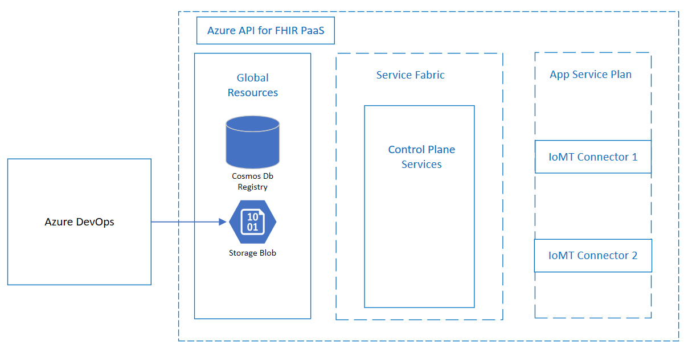
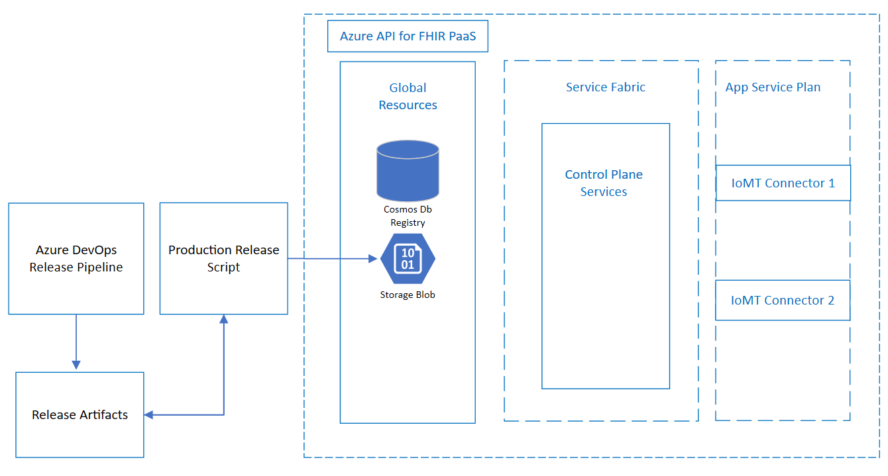
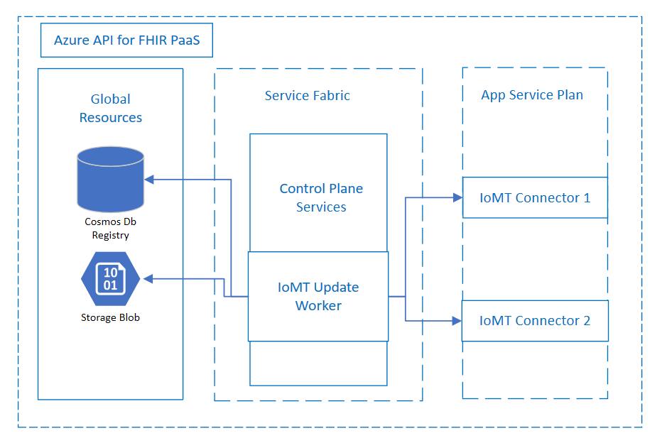

# IoMT Connector Code Delivery and Deployment

To ensure our IoMT PaaS connectors are up to date, we need a way to deliver code updates to the IoMT Connector to non-production and production environments.
Once the code is delivered, we also need a way of updating all the IoMT Azure Function applications with the delivered code.

[[_TOC_]]

# Scenarios

### IoMT Connector Continuous Deployments in Test
We will integrate within the exisitng Resolute CI/CD pipelines in Azure DevOps to deliver and deploy IoMT Connector code and code updates to test environments. 
The IoMT Connector code will be built as delivered as part of a new Azure DevOps pipeline build step.
The code will be delivered to the existing Resolute global environment storage account.
The IoMT Connector code will be deployed to IoMT Connectors by an IoMT update worker that lives within the service fabric.

### IoMT Connector On Demand Production Deployments
For production, Resolute currently merges master into a release branch. Azure DevOps creates artifacts to later be deployed to production using a script.
This script will be modified such that it can create IoMT artifacts if any of the underlying IoMT code has been added or modified. 
Next, the script will deliver the IoMT Connector code to production environments.
The code will be delivered to the existing Resolute global environment storage account.
After the code is delivered, the code will be deployed to IoMT Connectors by an IoMT update worker that lives within the service fabric.

### IoMT Connector Version Rollback On Demand
In the event that there are issues with the code in either the test or production environments, we will need to have the ability to roll back to a specified code version.
We plan on using [Geneva actions](https://genevamondocs.azurewebsites.net/actions/overview.html) to trigger rollbacks. (If there is an existing framework for Resolute that is currently in use we are willing to integrate with that instead).  

### Out of Scope ###
- The ability to create IoMT Connectors and Connections will be covered in a future design.  
- While code updates are occurring, it is possible that other IoMT connector updates (not code related) are occurring. At the moment, there shouldn't be conflicts that cause a break in functionality, but it is possible that this type of race condition could cause issues in the future. It may be good to consider writing IoMT connector operations that need to occur into a queue so that they are processed in order. This sort of operation queuing mechanism is not in scope for this design.

# Metrics
- Log when a code update is detected by the update worker
- Log when no code update is detected, no changes to be pushed
- Log list of Azure app services updated with a new version
- Log time taken to upgrade each Azure app service
- Log exceptions thrown

# Design
### Code delivery
- Part of the IoMT Connector runs as Azure functions, so to spin up or update an IoMT Connector, the worker that does so will need access to the code packages.
- As mentioned earlier in the design, there will be separate processes for deploying the code packages to test and production environments.
- In both cases, a zip containing the IoMT Connector package will be created as an artifact. The zip will contain the Azure DevOps build number (e.g. /IoMTConnector/1.zip).
- The zip file will be uploaded to the global storage account under the IoMTConnector container.

Test diagram:  


Production Diagram:  


### Update Worker  
 - We will create an IoMT update worker that checks hourly for code updates in the storage container, and if there is an update, the worker will proceed with updating IoMT Connectors with the update.
    - The existing Resolute ResourceProviderWorker will be enhanced such an IoMT worker can be created within the Service Fabric cluster under the ResourceProviderApplication service.  
    - An update provider called "IoMTUpdateProvider" will be created, and ResourceProviderWorker will be updated such that it can leverage this provider.  
    - In the new IoMTProvisioningProvider, we will have a task called UpdateIoMTConnectors that checks for updates.  
    - The update worker service principal of the ResourceProviderWorker will have read access to the storage container so that it can check for updates.
 - If there is a code update (determined by comparing the IoMT build version stored in the global db to the highest build version in the storage account), then get list of functions from the global database and deploy updates.  
    - The updater will update the Global db resource with the new current build version for the IoMT Connector.
    - The update to the Azure functions can be done via [Kudu REST APIs or the Azure CLI](https://docs.microsoft.com/en-us/azure/azure-functions/deployment-zip-push)
    - After the update is completed successfully, set the PROJECT_VERSION application setting property to the name of the zip file (which contains the Azure DevOps build version)
    - While updates are occurring it is possible that a customer could delete their IoMT connector. The updater should be smart enough handle the deletion and move on without trying to update a non-existent IoMT connector.
 - When the deploy is complete for all IoMT connectors, the updater will verify the version of all functions.  
    - The Azure IoMT App Service will have a new settings property called PROJECT_VERSION which contains the Azure DevOps build version.  
    - We can retreive the application settings using the [Kudu REST APIs](https://github.com/projectkudu/kudu/wiki/REST-API)  
 - Log relevant information described in the Metrics section.  



### Rollbacks
During a rollback, we will get the current build number from the global database. We will invalidate the current build and get the previous build (if one exists).
We will deploy the files from the previous build to all IoMT Connectors.

### Open Questions ###
- Should IoMT use the existing Application "ResourceProviderApplicationType", or create a separate application?

### Other Approaches Considered - Pros/Cons ###
Below are list of other approaches to this design that were also considered while writing this design. 

1. Use Azure DevOps to call a powershell script that zips all the files, then deploy updates to all Azure functions.  
   
   - Pros:  
       - This approach would technically work for updates - it would be obvious when the updates are complete since it would be when the script is complete.  

   - Cons: 
       - As each customer added IoMT connectors, the deploy time in Azure pipelines would continue to grow.
       - Does not seem like a good idea to give the Azure DevOps user to be able to create/destroy any resource. Would be better to limit the amount of things the Azure DevOps user can do.
       - In the future we will need to be able to create IoMT connectors and it would make sense to have the create and update code in the same general location (instead of having updates live in a powershell script and having IoMT creation live in code).  
       - The script would likely be be single threaded since multithreaded code written in powershell could be complicated and difficult to maintain.

2. Docker containers - Create a container image of the Azure function app and deploy the container.  

   - Pros:
       - Don't have to create a storage container to host source code (can upload docker image to a private registry)

   - Cons:  
       - Only runs on Linux hosts (Premium and Dedicated)
       - Would likely have to refactor code and ARM templates to support Docker containers
       - Would likely have to rotate the credentials that are used to access the private docker registry.

   - Unknown:  
       - Unknown performance advantages/disadvantages
       - Have to validate that the docker container works with other Azure services that IoMT uses.
       - Future maintenance and compatibility with OS / Docker / Linux / .NET


# Test Strategy
### Code delivery tests
Assumed to be already covered by Azure Pipelines and az command unit tests.  

### Update Worker Unit Tests  
Create mock storage containers and IoMT App Services using [IAzure](https://docs.microsoft.com/en-us/dotnet/api/microsoft.azure.management.fluent.iazure?view=azure-dotnet)
- Case 1: no code exists in container, or there are issues accessing file in container. No updates made and exception thrown.
- Case 2: a code update exists, but there are no IoMT connectors to update.
- Case 3: a code update exists, and there are IoMT connectors to update, then updates on IoMT connectors are performed, and the updates have been verified.
- Case 4: Metrics logged

### Rollback Tests
Likely an E2E test

# Security
- The storage container will not be publically accessible. Using Azure Active Directory to authorize requests, only access to the following two users/service principals will be granted.
- The Azure DevOps pipeline principal will have write access to the storage container where the .zip is delivered.
- The update worker will have read access to the storage container where the .zip is delivered.