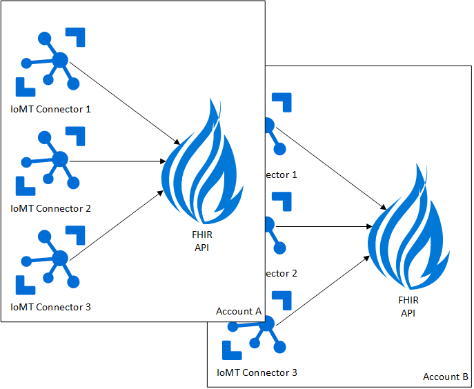
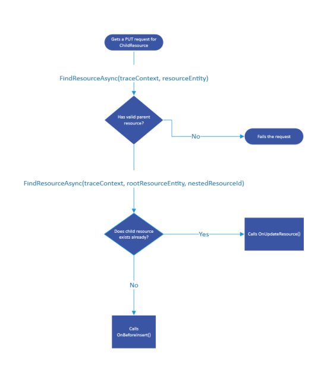

[[_TOC_]]

# Project Overview
The goal of the project is to offer the current capabilities of open source [IoMT FHIR Connector](https://github.com/microsoft/iomt-fhir) as a first party feature available for the Azure API for FHIR.  This will enable the Azure API for FHIR offering to easily ingest data from connected devices.

The IoMT connector will be offered as a feature that can be enabled for a given Azure API for FHIR service.  While the open source implementation can connect to any FHIR service, the PaaS version will only connect to the Azure API for FHIR.  A given FHIR service could have multiple IoMT connectors, a one to many cardinality (FHIR Service to Connector).

## Assumptions
* The PaaS IoMT connector will be offered as a feature for the Azure API for FHIR.
* The PaaS IoMT connector will only output to an Azure API for FHIR instance.
* The relationship between the PaaS IoMT connector to the Azure API for FHIR is many to one.

# Proposed Architecture
To offer the IoMT FHIR Connector as a managed feature with in the Azure API for FHIR integration with in the current PaaS architecture of the Azure API for FHIR is needed.  By integrating with in the currently PaaS architecture we are able to leverage existing compliance and control plane work.

Conceptually as covered in the project summary there is a one to many relationship between the Azure API for FHIR and the IoMT FHIR connector.  Each FHIR service account could have multiple IoMT connectors.

# Provisioning request flow overview
Commands and API calls from Azure Resource Manager for the IoMT connector will be handled in the same manner as for the Azure API for FHIR.

Rest Api calls that needs to be supported is specified in this swagger document(https://microsofthealth.visualstudio.com/Health/_git/health-paas?path=%2Fsrc%2FResourceProviderApplication%2FARMResourceProvider.Service%2FSpecification%2Fpreview%2F2020-05-01-preview%2Fhealthcare-apis.json)

Following are the new Rest Api endpoints for control plane operation of IoMTConnectors:

| API                              | Method         | Description |
|--------------------------------------|--------------|-|
| https://manangement.azure.com/subscriptions/{subscriptionId}/resourceGroups/{rgName}/providers/Microsoft.HealthcareApis/services/{resourceName}/IoMTConnectors?api-version=[version]  | Get |Gets all IoMT Connectors for a given FHIR service.|
| https://manangement.azure.com/subscriptions/{subscriptionId}/resourceGroups/{rgName}/providers/Microsoft.HealthcareApis/services/{resourceName}/IoMTConnectors/{connectorName}?api-version=[version]  | Get |Gets an IoMT connector description for a specific IoMT connector.|
| https://manangement.azure.com/subscriptions/{subscriptionId}/resourceGroups/{rgName}/providers/Microsoft.HealthcareApis/services/{resourceName}/IoMTConnectors/{connectorName}?api-version=[version]  | Put |Creates or Updates an IoMT Connector resource.|
| https://manangement.azure.com/subscriptions/{subscriptionId}/resourceGroups/{rgName}/providers/Microsoft.HealthcareApis/services/{resourceName}/IoMTConnectors/{connectorName}?api-version=[version]  | Delete |Deletes the specified IoMT connector.|
| https://manangement.azure.com/subscriptions/{subscriptionId}/resourceGroups/{rgName}/providers/Microsoft.HealthcareApis/services/{resourceName}/IoMTConnectors/{connectorName}/connections?api-version=[version]  | Get |Lists connections for an IoMT connector.|
| https://manangement.azure.com/subscriptions/{subscriptionId}/resourceGroups/{rgName}/providers/Microsoft.HealthcareApis/services/{resourceName}/IoMTConnectors/{connectorName}/connections/{connectionName}?api-version=[version]  | Get |Gets a connection for an IoMT connector.|
| https://manangement.azure.com/subscriptions/{subscriptionId}/resourceGroups/{rgName}/providers/Microsoft.HealthcareApis/services/{resourceName}/IoMTConnectors/{connectorName}/connections/{connectionName}?api-version=[version]  | Put |Creates or updates a connection for an IoMT connector.|
| https://manangement.azure.com/subscriptions/{subscriptionId}/resourceGroups/{rgName}/providers/Microsoft.HealthcareApis/services/{resourceName}/IoMTConnectors/{connectorName}/connections/{connectionName}?api-version=[version]  | Delete |Deletes a connection.|
| https://manangement.azure.com/subscriptions/{subscriptionId}/resourceGroups/{rgName}/providers/Microsoft.HealthcareApis/services/{resourceName}/IoMTConnectors/{connectorName}/mappings?api-version=[version]  | Get |Lists mappings for an IoMT connector.|
| https://manangement.azure.com/subscriptions/{subscriptionId}/resourceGroups/{rgName}/providers/Microsoft.HealthcareApis/services/{resourceName}/IoMTConnectors/{connectorName}/mappings/{mappingType}?api-version=[version]  | Get |Gets a mapping for an IoMT connector.|
| https://manangement.azure.com/subscriptions/{subscriptionId}/resourceGroups/{rgName}/providers/Microsoft.HealthcareApis/services/{resourceName}/IoMTConnectors/{connectorName}/mappings/{mappingType}?api-version=[version]  | Put |Creates or updates a mapping for an IoMT connector.|

## Scenarios
1. As a "Azure Api for Fhir" service user, I want to create an IoMT connector under my Fhir Account.
2. As a "Azure Api for Fhir" service user, I want to add more than one IoMT connector under my Fhir Account.
3. As a "Azure Api for Fhir" service user, I want to update properties of my existing IoMT connector under my Fhir Account.
4. As a "Azure Api for Fhir" service user, I want to delete existing IoMT connectors under my Fhir Account.
5. As a "Azure Api for Fhir" service user, I want to create a new connection to the existing IoMT connector under my Fhir Account.
6. As a "Azure Api for Fhir" service user, I want to update/delete existing connection  of an IoMT connector. 
7. As a "Azure Api for Fhir" service user, I want to create a new mappings to the existing IoMT connector under my Fhir Account.
8. As a "Azure Api for Fhir" service user, I want to update/delete existing mappings of an IoMT connector. 
9. As a "Azure Api for Fhir" service user, I want to get primary and secondary connection strings for the IoMTConnector connection.
10. As a "Azure Api for Fhir" service user, I want to regenerate primary and secondary connection for a specificed connection.


## Update in ArmManifest
IomtConnector will also use Microsoft.HealthcareApis as its resource provider. Three new resource types will be added as a child/nested resource under the Fhir Service. Arm manifest and arm template will be updated to reflect the same. The new child resource types will be:
* services/iomtconnector : This will be a tracked resource.
* services/iomtconnector/connections: This will be a proxy resource.
* services/iomtconnector/mappings: This will be a proxy resource.

```
{
	"name": "services/iomtconnectors",
	"routingType": "Default",
	"resourceDeletionPolicy": "NotSpecified",
	"resourceValidation": "ReservedWords, ProfaneWords",
	"endpoints": [
		{
			"enabled": true,
			"apiVersions": [
				"2020-05-01-preview"
			],
			 "endpointUri":  "https://armresourceprovider-test.mshapis.com:15612/providers/Microsoft.HealthcareApis/",
			 "locations": [
				"West Europe",
				"West US 2"
			],
			"timeout": "PT20S"
		}
	],
	"marketplaceType": "NotSpecified"
},
{
	"name": "services/iomtconnectors/connections",
	"routingType": "ProxyOnly",
	"resourceDeletionPolicy": "NotSpecified",
	"endpoints": [
		{
			"enabled": true,
			"apiVersions": [
				"2020-05-01-preview"
			],
			 "endpointUri": "https://armresourceprovider-test.mshapis.com:15612/providers/Microsoft.HealthcareApis/",
			 "locations": [
				"West Europe",
				"West US 2"
			],
			"timeout": "PT20S"
		}
	],
	"marketplaceType": "NotSpecified",
	"disallowedActionVerbs": []
},
{
	"name": "services/iomtconnectors/mappings",
	"routingType": "ProxyOnly",
	"resourceDeletionPolicy": "NotSpecified",
	"endpoints": [
		{
			"enabled": true,
			"apiVersions": [
				"2020-05-01-preview"
			],
			 "endpointUri": "https://armresourceprovider-test.mshapis.com:15612/providers/Microsoft.HealthcareApis/",
			 "locations": [
				"West Europe",
				"West US 2"
			],
			"timeout": "PT20S"
		}
	],
	"marketplaceType": "NotSpecified",
	"disallowedActionVerbs": []
}
```

## Update in ArmTemplate

Following three child resources will be added to the existing arm template
```
{
	"type": "Microsoft.HealthcareApis/services/iomtconnector",
	"name": "[concat(parameters('accountName'), '-r4', parameters('connectorName'))]",
	"dependsOn": [
		"[resourceId('Microsoft.HealthcareApis/services/', concat(parameters('accountName'), '-r4'))]"
	],
	"apiVersion": "2020-05-01-preview",
	"properties": {
		"serviceConfiguration": {
			"resourceIdentityResolutionType": "Lookup"
		}
	}
},
{
	"type": "Microsoft.HealthcareApis/services/iomtconnector/connections",
	"name": "[concat(parameters('accountName'), '-r4', parameters('connectorName'), '/', parameters('connectionName'))]",
	"dependsOn": [
		"[resourceId('Microsoft.HealthcareApis/services/', [concat(parameters('accountName'), '-r4', '/', parameters('connectorName'))])]"
	],
	"apiVersion": "2020-05-01-preview",
	"properties": {
		"serviceConfiguration": {
			"resourceIdentityResolutionType": "Lookup"
		}
	}
},
{
	"type": "Microsoft.HealthcareApis/services/iomtconnector/mappings",
	"name": "[concat(parameters('accountName'), '-r4', '/', parameters('connectorName'), '/', parameters('mappingType'))]",
	"dependsOn": [
		"[resourceId('Microsoft.HealthcareApis/services/', [concat(parameters('accountName'), '-r4', '/', parameters('connectorName'))])]"
	],
	"apiVersion": "2020-05-01-preview",
	"properties": {
		"serviceConfiguration": {
			"resourceIdentityResolutionType": "Lookup"
		}
	}
}
```

## RP Provisioning request work flow

The provisioning request flow for iomt connector will be similar to the existing request flow. 

To facilitate routing the provisioning/deprovisioning request for new resource types, new handlers and dataproviders will be added for each child resource.

During initilization of RP, we will provide these new handlers and data providers such that the request will be routed to appropriate handler and data provider.

For example, for the resourcetype: "services/iomtconnectors", we will have following dataprovider and handler.
* IomtConnectorsDataProvider
* IomtConnectorsTypeHandler


### WorkFlow for create request for the services/iomtconnectors resourcetype

1. Web API Request handler receives a PUT request and routes it to a DefaultGroupWideResourceTypeHandler.

2. (RP-SDK) DefaultGroupWideResourceTypeHandler will parse the request and provides a nested resourcetypename and resourcename. 

    As an example, for the following api call,  
	 https://manangement.azure.com/subscriptions/745e0481-38e3-4e11-84e9-7c02d3f87324/resourceGroups/TestResourceGroup/providers/Microsoft.HealthcareApis/services/TestFhirAccount/iomtconnectors/TestIomtConnector?api-version=2020-05-01-preview
	 
	 RP-SDK will  parse the resourceType to "services/iomtconnectors" and resourceName to "TestFhirAccount/TestIomtConnector".

3. (RP-SDK) DefaultGroupWideResourceTypeHandler will also perform validation on the request such as subscription for the resource is registered with our RP, and if the subscriptionID and resourcegroup match.

3. (RP-SDK) DefaultGroupWideResourceTypeHandler then calls the resourcetype specific resourcedataprovider. 

4. ResourcedataProvider will do the following to ensure if it is valid insert request. Following is the work flow


4. ResourcedataProvider then creates a new childresourceentity in memory and calls the type handler. We can put all our custom validation here.

5. ResourceTypeHandler then passes the entity back to resourceDataProvider.

6. ResourcedataProvider will call AccountRegistryManagementRepository to insert a new ChildResourceDoucment in the global Database. Once completed it will return the inserted child resource entity to DataProvider.

   Following is the snippet of how it would look like:

	```
	{
		"type": "iomtConnector",
		"subscriptionId": "745e0481-38e3-4e11-84e9-7c02d3f87324",
		"resourceGroupName": "TestResourceGroup",
		"resourceTypeName": "Microsoft.HealthcareApis/services/iomtconnector",
		"state": "Accepted",
		"location": "South Central US",
		"partitionKey": "42c5a86a-90e7-4bbf-aec7-0dd84cd09822",
		"providerNameSpace": "Microsoft.HealthcareApis",
		"parentServiceName": "fhirservice",
		"searchIndex": {
			"name": "testfhiraccount/testiomtconnector",
			"resourceGroupName": "TESTRESOURCEGROUP",
			"resourceTypeName": "MICROSOFT.HEALTHCAREAPIS/SERVICES/IOMTCONNECTOR",
			"providerNameSpace": "MICROSOFT.HEALTHCAREAPIS"
		},
		"name": "testfhiraccount/testiomtconnector",
		"id": "h94x69yjrgpjr9p2u7o9sgjii",
		"_etag": "\"00000000-0000-0000-e2d3-5e5fe1e901d5\"",
		"_self": "dbs/mTRmAA==/colls/mTRmAOKuFLQ=/docs/mTRmAOKuFLQGAAAAAAAAAA==/",
		"_rid": "mTRmAOKuFLQGAAAAAAAAAA==",
		"_attachments": "attachments/",
		"_ts": 1581642552
	}
	```

7. ResourcedataProvider returns the control to typehandler which then creates the operation document and calls operationdataprovider to insert the operation document in order to queue the new provisioning request for RP worker.

8. After inserting the operation document, we return to the RP SDK that the resource operation was completed asynchronously. This will contain the inserted childresource entity and the operation entity.

9. The RP SDK will return a 201 Created, with the child resource entity in the body, and a URL to check the status of the operation in an Azure-AsyncOperation header


### WorkFlow For Update request

The work flow is similar to the create flow where the RP checks if the parent resource and child resource are present. However, type handler skips some validaion that were done on create such as if resource group and subscription ID matches. It however adds the provisioning request operation document in the global db.

### Deprovisiong request workflow

The current scope is to only capture the deprovisiong work flow of individual child resources. Work flow for deprovisiong is similar to update except for that the Deprovisioing operation document is added. 
RP-SDK doesnot support the cascade deletion policy yet. We have to therefore be taking care deleting  all child resources of an iomtconnector before deprovisioning it.

##  Implementation Overview

 As mentioned before, Three Data providers and handlers will be added per each child resource. This is required to handle the request of particular resourcetype.
 1. IomtConnectorTypeHandler, IomtConnectorDataProvider (Handle /subscriptions/{subscriptionId}/resourceGroups/{resourceGroupName}/providers/Microsoft.HealthcareApis/services/{resourceName}/iomtconnectors/{iomtconnectorName} )
 2. IomtConnectorConnectionsTypeHandler, IomtConnectorConnectionsDatarovider  (Handle /subscriptions/{subscriptionId}/resourceGroups/{resourceGroupName}/providers/Microsoft.HealthcareApis/services/{resourceName}/iomtconnectors/{iomtconnectorName} )/connections/{iomtconnectionname} )
 3. IomtConnectorMappingsTypeHandler, IomtConnectorMappingsDataProvider  (Handle /subscriptions/{subscriptionId}/resourceGroups/{resourceGroupName}/providers/Microsoft.HealthcareApis/services/{resourceName}/iomtconnectors/{iomtconnectorName} /mappings/{iomtmappingsname} )

New Generic methods will be added to IAccountManagementRepository to :

```
public interface IAccountRegistryManagementRepository : IAccountRegistryReadRepository
{
    Task<TChildResource> UpsertChildResourceMetadataAsync<TChildResource>(IChildResource childResource, CancellationToken cancellationToken)
        where TChildResource : IChildResource;

    Task<TChildResource> DeleteChildResourceMetadataAsync<TChildResource>(IChildResource childResource, CancellationToken cancellationToken)
        where TChildResource : IChildResource;
}
```

## Testing:
Unit Tests and integration tests will be added for the new code flow.

### Scenarios to test

1. A complete E2E test where we send a provisioning request for a new iomtconnector under an existing fhir resource and validate that correct ChildResource document and operation account document has been stored in global db.
3. An E2E test where we send a provisioning request for a new iomtconnector under a non existing fhir resource and validate that the request fails.
4. An E2E test where we send an update request for the existing fhir connector 
5. An E2E test where we send an invalid update request for the existing fhir connector but request has fhir resource name that it doesnot belongs to and validate that the request fails.
6. An E2E test where we send a valid delete request for an existing fhir connector and validate that deprovision document has been added to global db and the child resource document has been deleted.
7. An E2E test to validate  adding, updating and removing the connections within an iomtconnector.
8. An E2E test to validate  adding, updating and removing the mappings within an iomtconnector.
9. An E2E test to validate the connection keys are enumerated using  listKeys resource.
10. An E2E test to validate the connection keys are regenerated using  regenerateKeys resource.


## Security
TBD

## Other
TBD