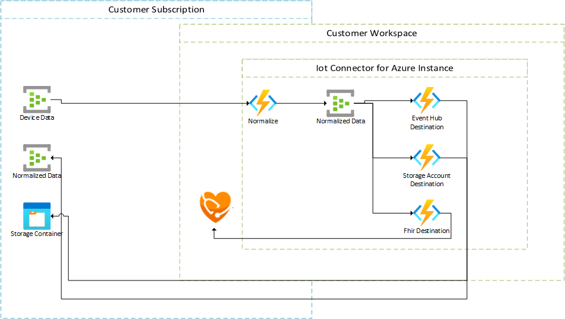
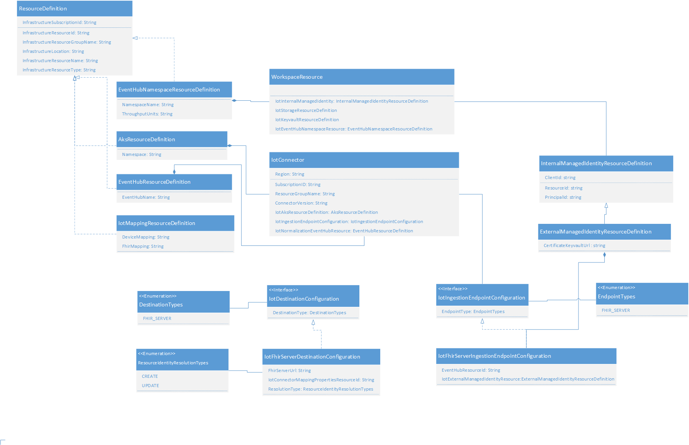

# Background

The purpose of this document is to detail the changes needed to support Gen 2 modifications for how IomT Connectors get deployed and ingest customer data

## Business Justification

The Gen 2 workstream has identified several key areas of improvement:

- Consuming data from customer provided event source
- Altered pricing structure through the concept of Workspaces
- Changing infrastructure from Azure Functions/App Service to AKS.

In order to support these several changes need to be made to the customer experience for configuring IomT Connectors as well as to the Resource Provisioning process.

## Design

### Update Gen 2 (Workspace) Resource Definitions

Gen 1 and gen 2 Iomt resources will exist at the same time. In order to support the management of both resource types new ARM template definitions will be created for gen 2. We will move any common functionality into a set of common classes but gen 1 and gen 2 specific classes will exist inside of a different namespaces.

All resources will be still make use of the existing RP Namespace (Microsoft.HealthcareApis) but will make use of the Gen 2 modifier **workspace**.

A new version of the **healthcare-apis.json** Swagger definition will be created which supports the new resource types.

#### Workspace Resource

This resource will be defined by the type __Microsoft.HealthcareApis/workspace__. This resource will provision resources common to all of its child and grandchild resources (i.e. IotConnector, Connectors and Fhir Mappings). This includes the following:

##### Storage Account

A Storage Account will be provisioned to hold data needed by all IotConnector instances. This includes checkpointing information required by EventHub.

##### Event Hub Namespace

A single Event Hub Namespace will be created that will contain the Event Hubs needed by all child IotConnectors. This ensures that customer throughput will not suffer from a 'noisy neighbor' as [Throughput Units](https://microsofthealth.visualstudio.com/Health/_git/health-paas-docs/pullrequest/14074) are at the namespace level. To reduce management costs the namespace will only exist if *at least one* IotConnector exists; if all IotConnectors are removed, then the namespace will be deleted.

##### Internal Managed Identity

Provisioning of Managed Identities are currently limited ~8 identities per second per tenant. Due to this limitation we will reduce the number of Managed Identities created as much as possible. With this in mind we will create a single Managed Identity to be used internally within the Workspace.

Example:

    {
        "type": "Microsoft.HealthcareApis/workspace",
        "kind": "fhir-R4",
        "name": "[variables('workspaceName')]",
        "apiVersion": "2020-11-01-preview",
        "location": "[parameters('region')]",
        "properties": {
                ...additional properties required for the Workspace
            }
        }
    }

#### IotConnectors Child Resource

This resource will be defined by the type __Microsoft.HealthcareApis/workspace/IotConnectors__.

##### Generated Resources

The following Azure resources will be provisioned when provisioning an IotConnector

###### EventHub

A new EventHub will be created within the Workspace's Event Hub Namepace. This will be used to hold normalized data produced by the Normalization App Function, and that is consumed by all [Destination App Functions](#Destination%20Grandchild%20Resource). The naming of the Event Hub must be unique as other IotConnector instances will share the same Event Hub Namespace.

###### External Managed Identity

An external System Assigned Managed Identity will be created for each IotConnectors resource. This managed identity will be given access to the customer provided ingestion source using RBAC. Because RBAC + managed identity is our only means of authentication with the ingestion source the **identity** value will be **required**; we will fail the deployment if this is not specified.

The creation of the Managed Identity will also result in the creation of a certificate. This certificate will be used by Iomt Resources to generate a Bearer token that will allow the resource to authenticate as the generated Managed Identity. The certificate will be placed inside of the Azure Keyvault associated with the IotConnectors Workspace.

##### Event Hub Connection Type

The following properties will be required when configuring an ingestion point for this connection type

- connectionType: Must be 'EventHub'
- resourceId: The Resource Id of the EventHub to pull events from.

Example:

    {
        "type": "Microsoft.HealthcareApis/workspace/IotConnectors",
        "name": "[concat(variables('workspaceName'), '/iomt1')]",
        "apiVersion": "2020-11-01-preview",
        "location": "[parameters('region')]",
        "identity": {
            "type": "SystemAssigned"
        },
        "dependsOn": [
            "[resourceId('Microsoft.HealthcareApis/workspace', variables('workspaceName'))]"
        ],
        "properties": {
            "ingestionEndpointConfiguration": {
                "connectionType": "EventHub",
                "resourceId": "[resourceId(<External Subscription>,<External ResourceGroup>,'Microsoft.EventHub/namespaces/eventhubs', 'eventHubName')]"
            }
        }
    }

#### Destinations Grandchild Resource

This resource will be defined by the type __Microsoft.HealthcareApis/workspace/IotConnectors/destinations__. The purpose of this resource will be to define where Normalized Data generated by the system get sent to. A user will be able to create more than one destination resource, and all Destinations will receive the same set of Normalized Data. In this way the same set of Normalized Data can be sent to different destinations such as a Fhir Server, an External Event Hub or Storage Account.

Each Destination will result in a new App Function being created that will belong to a seperate Event Hub Consumer Group on the Event Hub holding normalized data. In this way each Destination will have the opportunity to process the same set of normalized data before passing it along to its final destination. As there is a finite amount of [Consumer Groups per Event Hub](https://docs.microsoft.com/en-us/azure/event-hubs/event-hubs-quotas#basic-vs-standard-tiers) so to will there be a limit to the number Destinations that can be created.

For the initial implementation only a `Fhir Server Destination` will be available.

__Note__: For Private Preview the Gen 2 work for deploying a Fhir Server within a Workspace may not be done. We may have to allow manually supplying a FhirServer Url versus obtaining it from the resource.

##### Output Endpoint Connection Type

For the initial implementation we will only support an Azure API for Fhir server but future endoints may be supported (i.e EventHub, Storage Account).

[TODO] Determine how we'd authenticate to the Fhir Server. Would this also be through MI/RBAC?

- connectionType: Must be 'FhirServer'.
- resourceIdentityResolutionType: 'Create' or 'Update'.
- fhirServerUrl: The Url to the Fhir Server which will receive the Fhir Observations.
- fhirMappingResourceId: The Resource Id to the IotConnector Mapping resource to use when creating Fhir Observations

Example:

    {
        "type": "Microsoft.HealthcareApis/workspace/IotConnectors/destination",
        "name": "[concat(variables('workspaceName'), '/iomt1/output1')]",
        "apiVersion": "2020-11-01-preview",
        "location": "[parameters('region')]",
        "dependsOn": [
            "[resourceId('Microsoft.HealthcareApis/workspace/FhirServer', variables('fhirServerName'))]",
            "[resourceId('Microsoft.HealthcareApis/workspace/IotConnectors/mappings', concat(variables('workspaceName'), '/iomt1/fhir'))]"
        ],
        "properties": {
            "outputEndpointConfiguration": {
                "connectionType": "FhirServer",
                "resourceIdentityResolutionType": "Create",
                "fhirServerUrl": "[reference(resourceId('Microsoft.HealthcareApis/workspace/FhirServer', variables('fhirServerName')), '2015-08-01', 'Full').fhirServerUrl]",
                "fhirMappingResourceId": "[resourceId('Microsoft.HealthcareApis/workspace/IotConnectors/mappings', concat(variables('workspaceName'), '/iomt1/fhir'))]"
            }
        }
    }

#### Mappings Grandchild Resource

This resource will be defined by the type __Microsoft.HealthcareApis/workspace/IotConnectors/mappings__.

Example:

    {
        "type": "Microsoft.HealthcareApis/workspace/IotConnectors/mappings",
        "name": "[concat(variables('workspaceName'), '/iomt1/fhir')]",
        "apiVersion": "2020-11-01-preview",
        "location": "[parameters('region')]",
        "dependsOn": [
            "[resourceId('Microsoft.HealthcareApis/workspace/IotConnectors', variables('workspaceName'), 'iomt1')]"
        ],
        "properties": {
            "content": {
                "templateType": "CollectionFhirTemplate",
                "template": [
                    {
                        "templateType": "CodeValueFhir",
                        "template": {
                                ...
                            }
                        }
                    }
                ]
            }
        }
    }

## Code Modifications

### Generation of unique Role Assignment GUIDs within the Event Hub Namespace

In Gen 1 we create [Role Assignments via ARM templates](https://dev.azure.com/microsofthealth/Health/_git/health-paas?path=%2Fdeployment%2Ftemplates%2Fiomt-connector.json&version=GBmaster&line=432&lineEnd=433&lineStartColumn=1&lineEndColumn=1&lineStyle=plain&_a=contents) by passing the resource name through the `guid` and `uniqueString` functions to generate the assignments unique ids. This has a chance of causing a failure with the deployment and resulting in the below error:

    {
        "status": "Failed",
        "error": {
            "code": "HashConflictOnDifferentRoleAssignmentIds",
            "message": "A hash conflict was encountered for the role Assignment ID. Please use a new Guid."
        }
    }

To ensure that the assignment ids are unique we will procedurally generate the GUIDs within the RP worker. These Ids will be stored iside of the IotConnector metadata and passed to ARM when provisioning Role Assignments.

[TODO] Should this be done for all role assignment id generation?

### Updates to IotConnector Storage Entity

A new IotConnector class will be created to hold new attributes required for Gen 2. This class will subclass the existing [IotConnector](https://microsofthealth.visualstudio.com/Health/_git/health-paas?path=%2Fsrc%2FResourceProviderApplication%2FResourceProvider.Storage%2FEntities%2FIotConnector.cs&version=GBmaster&_a=contents). In addition to supporting Gen 1 attributes this new storage entity will have the following:

- IomtIngestResourceDefinition: This object will contain a single ConnectionDefinition object which describes the type of connection object (i.e. EventHub) as well as any properties needed for the connection (i.e event hub resource id).

Also, new [IotConnector Operation Documents](https://microsofthealth.visualstudio.com/Health/_git/health-paas?path=%2Fsrc%2FResourceProviderApplication%2FResourceProvider.Storage%2FEntities%2FIomtOperationDocument.cs&version=GBmaster&_a=contents) will be created for each of the resource types. These will hold the new properties required for Gen 2.

### IotConnectorDataProvider

Using the existing [IotConnectorDataProvider](https://microsofthealth.visualstudio.com/Health/_git/health-paas?path=%2Fsrc%2FResourceProviderApplication%2FARMResourceProvider.Service%2FDataProviders%2FIotConnectorDataProvider.cs&version=GBmaster&_a=contents) as a template, create seperate Data Providers for each of the resource objects (IotConnector, Connection, Mapping).

### ARM Resource Provider

New [ResourceHandlers](https://microsofthealth.visualstudio.com/Health/_git/health-paas?path=%2Fsrc%2FResourceProviderApplication%2FARMResourceProvider.Service%2FStartup.cs&version=GBmaster&line=324&lineEnd=325&lineStartColumn=1&lineEndColumn=1&lineStyle=plain) will be added to the RP request handler in order to process new Gen 2 Iomt Connector resource requests.

### Resource Provisioning

#### Scalability

Due to limits imposed on several infrastructure and Workspace components (i.e. [Event Hubs](https://docs.microsoft.com/en-us/azure/event-hubs/event-hubs-quotas#common-limits-for-all-tiers)] and [AKS](https://docs.microsoft.com/en-us/azure/aks/quotas-skus-regions#service-quotas-and-limits)), provisioning requests should begin by acquiring information needed to support scalability. This information will be persisted inside of the global database so that it can be tracked at the resource level. The type of information required is below. Note: it is expected that there will be a service where the below information can be obtained from. The creation of this service is out of scope for this spec.

- Subscription: The subscription to create resources in. We may maintain multiple internal subscriptions in order to scale our resources which are constrained at the Subscription level.
- AKS Cluster: The resource id of the AKS Cluster to use for pod deployments. There are a limit of nodes within an AKS Cluster and a limit of AKS Clusters within a Subscription. So we need to understand which AKS Cluster will be used for the provisioning request.
- Event Hub Namespace: The resource id of the Event Hub Namespace. These are limited per subscription. Provisioning requests for the same workspace will utilize the same Event Hub Namespace. As there is a limit on the number of Event Hubs per Namespace, a single Workspace can only provision **10** IotConnectors; if this number is exceeded the provisioning request will fail.
- Keyvault: The resource of the Keyvault used to hold certificates needed to generate Bearer Tokens as a External Managed Identity.

#### Commands

New [IotConnector Commands](https://microsofthealth.visualstudio.com/Health/_git/health-paas?path=%2Fsrc%2FResourceProviderApplication%2FResourceProviderWorker%2FCommands%2FIotConnectorCommandBase.cs&version=GBmaster&_a=contents) will be created to support handling the requested Iomt Operation Documents.

#### Managed Identity

##### External

An external System Assigned Managed Identity will be created per connection as [described here](#External%20Managed%20Identity). A reference to the certficiate created in Azure Keyvault will be passed along to Iomt AKS Pods.

In Gen 1 we implemented the **ListKeys** function on the Iomt Connection resource. This was done to output the primary key of the EventHub so that customers could connect and submit data. For Gen 2 we will not do this but instead allow the customer to retrieve the Managed Identity Object Id that was created for the Connection resource. They can then use RBAC to grant access for the identity on their ingestion resource. A customer would access the Managed Identity as an output inside of the ARM template.

Example:

    "outputs": {
        "managedIdentityId": {
          "type": "string",
          "value": "[reference(resourceId('Microsoft.HealthcareApis/workspace/IotConnectors', variables('workspaceName'), 'iomt1/connectiona'), '2020-11-01', 'Full').Identity.principalId]"
        }
      }

##### Internal

Internal Workspace resources will also use Managed Identity and RBAC for authentication when interacting with each other. A single User Assigned Managed Identity will be created per Workspace resource (see [here](#Internal%20Managed%20Identity) for more details.). All child Iomt Resourcse will make use of this managed identity. Through RBAC this identity will be granted the following:

| Resource                   | Access                                  |
| :------------------------- | :-------------------------------------- |
| Workspace Storage Account  | Read, Write, Delete                     |
| IotConnector Event Hub     | Read, Write                             |
| Global Keyvault            | Get, List                               |

#### AKS Provisioning

A new Iomt AKS provisioning provider will be used by the new Iomt Commands to provision/deprovision AKS resources. This will make use of the new Iomt K8s Go based api.

During provisioning the same set of values supplied as environment variables to the Azure Functions in Gen 1 will also be supplied as environment variables inside of the deployment definition. In addition, the following values will be supplied:

- Inget data connection configuration (i.e. Event Hub resource id)
- Values required for internal User Assigned Managed Identity (i.e. object id). This will be used for AAD Pod Identity Binding which will be configured during the AKS Provisioning process.
- Azure Keyvault Uri to certificate linked to System Assigned External Managed Identity. This will be used for creating a Bearer Token for authenticating to customer ingest source.

The Iomt Provisioning Provider will return the following data elements when interacting with AKS. This data will be persisted as part of the IomtConnect Storage Entity

- UID: A unique key to track the resource created within AKS
- Name: A human readable identifer of the resource deployed within AKS.

The AKS cluster which Iomt will be deployed to depends on the type of SKU defined in the parent **Microsoft.HealthcareApis/workspace** resource.

##### Consumption Sku

Iomt resources will be deployed into the shared AKS cluster associated with the region of the parent Workspace.

Deprovisioning operations will only report the deloyed Pods and not the AKS cluster, as this is a shared resource.

##### Dedicated Sku

In this scenario its assumed that a new AKS Cluster has been provisioned as part of provisioning the parent Workspace resource. Its also assumed that details for connecting to this cluster are stored within the Workspace storage entity. Iomt resources will be deployed onto this new AKS cluster.

Deprovisioning operations will only remove the deloyed Pods and not the AKS cluster, as that was provisioned by the parent Workspace resource.

### Class Diagram

