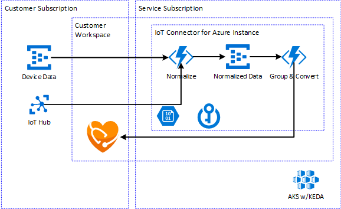

The purpose of this document is to detail the second generation architecture for IoT Connector for FHIR.  A full review of our current requirements, original architecture (Public Preview), and options considers can be found in the [IoT Gen2 Discussion](IoT-Gen2-Discussion.md).

This document and the architecture discussed are intended to align with the workspace concept and architecture changes under consideration for the entire platform covered [here](..\..\Second-Generation-Service\Second-Generation-Service.md).

[[_TOC_]]

# Business Justification

Align with initiatives and work streams across the Health Cloud and Data team as the team builds the next iteration of Healthcare services.  In addition, IoT Connector for FHIR has several requirements and features targeted for our GA release.  The second generation of the service is intended to fulfill those requirements while aligning with the future vision for the platform.

# Proposed Changes

For the second generation of the IoT Connector for FHIR there are two major architectural changes we are proposing: removing Stream Analytics and removing the hosted device data Event Hub.  The full review of both options can be found in the [IoT Gen2 Discussion](IoT-Gen2-Discussion.md).

## Remove Stream Analytics

The original design included Stream Analytics for two fundamental reasons.  First, it was a simple way to perform the collection and buffering of data with minimal developer effort accelerating our product development.  Second, Stream Analytics gave a service with a proven track record at very large scale and low latencies.  As we have developed the product though the downsides; mainly around restricting compute integration options and .

By removing Stream Analytics we can now share a common compute infrastructure on AKS with the FHIR and DICOM services.  We also have more options for reducing the cost of the service.  We no longer need to provision a Steam Analytics job with a static capacity and cost as part of the service and can now look at options that can dynamically scale with the customer's load on the service.

The current proposal is to replace Stream Analytics with an Azure Function that consumes the events from the Normalized Data Event Hub internal to the service.  The function will buffer in memory events based on certain batch size (i.e. 1000) or a time period (i.e. 5 minutes), which ever occurs first.  We will start with this simple approach and iterate to address any deficiencies or features as needed.

## Remove Hosted Device Data Event Hub Endpoint

The current design used in Public Preview includes an Event Hub hosted on our infrastructure subscription for the customer to send Device Data to.  Hosting the initial ingestion point on our subscription poses several challenges.  It adds an endpoint that we need to support for Private Link and requires us to support RBAC for the data layer.  While their are options for use route the Private Link configuration to the Event Hub we host there isn't a ready made solution to allow the customer's AAD principals to be trusted on an Event Hub hosted on our tenant.

In Gen2 the proposal is the customer configures the IoT Connector for FHIR to pull from an event source they provide.  The source could be Event Hub, IoT Hub, or another endpoint we support in the future.  Our service would have a first party managed identity that the customer would trust with read access on the event source.  Since we are no longer hosting the ingestion point we don't need to worry about encapsulating the cost, scaling the underlying endpoint, or providing the network or security options.  It does come with a little extra setup from the customer point of view but we believe the added flexibility is ultimately a win.  We also have the option in the future of adding back in various device ingestion endpoints but these can be premium features.

Having the customer supply the event ingestion endpoint also aligns with our thinking for future extension of the service.  In the future we plan on supporting routing for failures, intermediate stages in the pipeline, and events.  In these scenarios the customer would configure the destination endpoint (i.e. Event Hub) and our service would publish to that endpoint.

It is important to note one of the original drivers for supporting Event Hub as the ingestion point for the first iteration of the service is the integration it provides with the other Azure IoT products; IoT Hub and IoT Central.  Both support export capability to an Event Hub which makes integration fairly straight forward.  In the second generation of the service this is still possible but the customer is responsible for the setup of the Event Hub that acts as the bridge.  While functional this isn't the ideal scenario for our customers.  There are other options for a more direct integration which are covered later in the document.

# Design

In the second generation service design, the IoT Connector for FHIR will be a child of the workspace and siblings of other services like the FHIR API and DICOM. As part of configuration the customer will choose which FHIR server with in the workspace the IoT Connector will target.

## Ingest

Data is ingested through a customer provider event endpoint.  Initially Event Hub will be supported with the possibility of IoT Hub. Over time additional endpoints can be added based on demand. The preferred method for authorizing the IoT Connector for FHIR is the customer granting read rights to the MSI (managed service identity) of service on the supported endpoint.

## Normalize

Normalization will occur in the same way as today through an Azure Function that applies a customer configured mapping and emits normalized events on a secondary, internal event hub for further processing.  A key change is how we are planning to host the Azure Function.  Instead of the App Service backed by an App Service Plan used in public preview today we want to run our functions on [AKS using KEDA for scaling](https://docs.microsoft.com/en-us/azure/azure-functions/functions-kubernetes-keda).

Another option we have is changing how the normalized event hub is hosted.  Currently the customer gets a discrete namespace with the normalized function per connector.  We could switch to a shared namespace or even a dedicated Event Hub cluster per region.  Both could reduce operation costs at the expense of introducing more complexity.  For the first iteration of Gen2 it is recommended we keep the discrete Event Hub namespace per connector to reduce the complexity of the changes. Once other .  Since the normalization Event Hub is an internal detail we can always make improvements to how it is hosted later without impacting the customer.

## Grouping

Grouping will occur in an Azure Function reading events from the internal Normalized Data Event Hub. This function will also be hosted on an AKS cluster using KEDA for scaling.  The function will buffer in memory events based on certain batch size (i.e. 1000) or a time period (i.e. 5 minutes), which ever occurs first.  The output of the grouping step will be sent to the conversion.

## Conversion

The conversion to FHIR will occur in an Azure Function as it does today.  The main different the conversion will be invoked directly in-memory from the new grouping Function.  Otherwise the component will work as is.  There is parallel work stream to further define various stages of integration with customer defined logic.  In the future it is expected that the conversion process will be broken down into further discrete steps that allows the customer to customize their process.

## Other Components

### Blob Storage

Blob Storage will be used to track the watermarks and manage lease locks for the Azure Function Event Hub processors used in normalization and grouping.

### Azure Key Vault

Azure Key Vault will be used to managed any secrets necessary for the operation of the connector like the connection string to Blob storage.

# Integration

## Azure API for FHIR

The Azure API for FHIR will be the initial destination for data ingested through the Gen2 IoT Connector for FHIR. The MSI (managed service identity) of the connector can authorized on the FHIR server through normal RBAC setup.  In addition, to support FHIR servers using Private Link, the concept of [Trusted Service Implementation](https://microsoft.sharepoint.com/teams/vnet/SitePages/Transitive-Access) will need to be implemented on the FHIR service to allow the IoT Connector to connect.

## IoT Hub

IoT Hub supports an [Event Hub compatible endpoint](https://docs.microsoft.com/en-us/azure/iot-hub/iot-hub-devguide-endpoints) for processing events sent to the Hub.  This endpoint will allow our service to connect directly to IoT Hub with out needing an intermediate Event Hub.  One limitation of the endpoint is today it doesn't support RBAC for authorization, just SAS. If RBAC support isn't added we may need to a SAS based authorization to the our service.

## IoT Central

IoT Central doesn't have the same Event Hub compatible endpoint like IoT Hub. They are working improvements to their CDE (continuous data export) that can export to a REST endpoint/webhook. We could support this integration method by exposing an HTTPS endpoint into our normalization function.  Further investigation is needed as the feature becomes available from the IoT Central side.

# Security Benchmarks

## Private Link

By moving the initial device data event source outside the product subscription we no longer have an ingestion point to protect via Private Link.  Instead we need to allow customers to authorize our service to pull from Private Link protected resources like Event Hub. This can be accomplished through a concept called [Trusted Service Implementation](https://microsoft.sharepoint.com/teams/vnet/SitePages/Transitive-Access).  The first party managed identity of the service can be used by the customer to allow access to Private Link services even when they aren't on the same VNet.

## AAD Data Plane Authorization

By moving the initial device data event source outside the product subscription we no longer need to authorize identities on the customer's tenant into the service.  Instead we will have a first party service identity that the customer will authorize to read data from their Event Hub. In the future as we add different outputs (i.e. messages that errored) the same first party identity can be used by the customer to authorize the service to write data to various locations (Event Hub, Event Grid, Blob, etc.).

## BYOK

More investigation is still needed in this area.  The Gen2 iteration of the IoT Connector still has an intermediate Event Hub that could be protected through BYOK.  We need to verify if this is required.

## Service Tags

The IP range of the IoT Connector Azure Functions need to be included in any service tags generated for our service.  If our services end up sharing the same AKS infrastructure this can hopefully be done once for all services.

# Work Streams

Below is a list of high level work streams for implementing Gen2 of the IoT Connector for FHIR.

1. Host Azure Functions on AKS with KEDA scalers
1. Replace Stream Analytics with in memory Azure Function
1. Define RPaaS IoT Connector contracts
1. Implement provisioning workflows & services
1. Implement infrastructure deployment scripts and templates
1. Create MSI (managed service identity) for IoT Connector
1. IoT Hub Integration
1. IoT Central Integration
