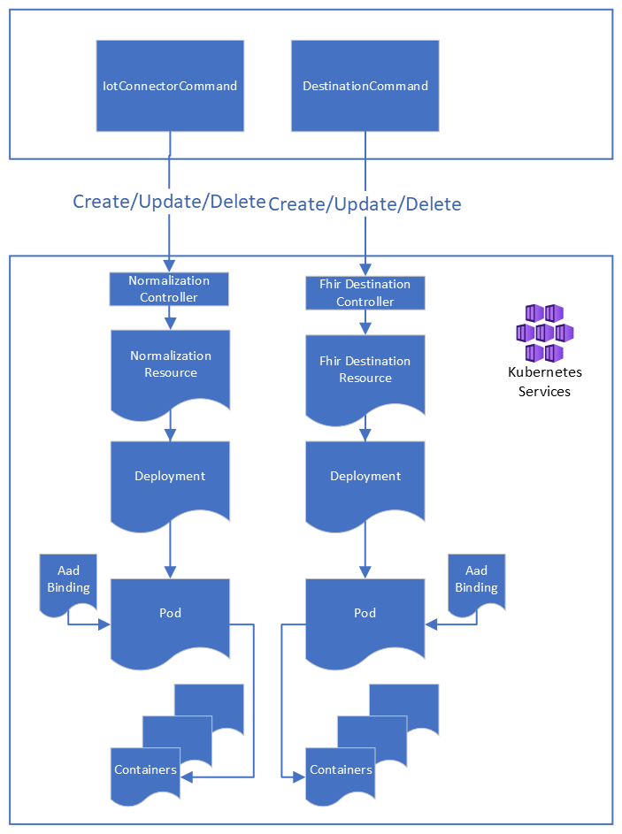
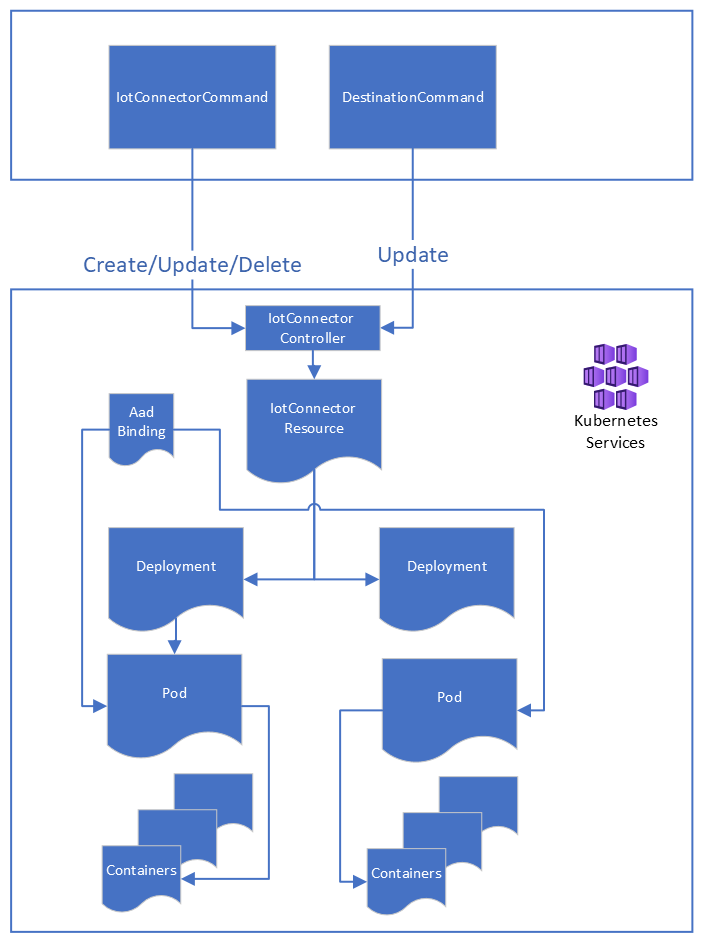

# Support independent provisioning of IoT Connector AKS Resources

[[_TOC_]]
# Background
The purpose of this document is to detail changes for the independent provisining of Iot Connector AKS Resources.

## Concepts
See this [section](./K8s-platform-Blueprint.md#Concepts) within the original K8s Platform blueprint for important concepts related to K8s and Controllers.

- Kind: The type of object that you'd like to create in Kubernetes. For example, a Pod, Deployment or Replica Set.
- Resource: A use of a particular Kind. For example, one or more instanciation of Kind __Pod__ may be created.
- Spec: The desired state of an resource

## Assumptions
1. An IotConnector Pod can exist without any Destination Pods.

# Why Change The Current Approach
We currently perform provisioning of Iot Connector AKS resources as a single operation. The operation:

- Occurs when a Destination (de)provision operation is received
- Deploys a single Pod that contains both a Normalization and Fhir Converter container
- Is associated with a single uber resource type (i.e Kind) in AKS: __IotConnector__:.

The above approach introduces the following concerns:

- Deprovisioning of the Iot Connector Destination results in removal of both the Fhir Converter and Normalization container. This is due to the fact that we remove the uber resource __IotConnector__ which causes a [cascading delete](https://kubernetes.io/docs/concepts/workloads/controllers/garbage-collection/#foreground-cascading-deletion) of all of its child resources.
- Scaling Normalization and Fhir Converter containers indepently is not possible as AKS scales at the Pod level

# Approach 1: Create Separate Resources
In this approach, instead of having an uber kind of type __IotConnector__ we register separate kinds to correspond to each type of resource that we can provision for a customer. This would included:

- Normalization
- Fhir Destination
- Storage Destination (future work)
- Eventhub Destination (future work)

## Assumptions
- An IotConnector Provision command is always performed before provisioning of Destintation Resources within the RP Worker
- All child Destinations are deprovisioned before the parent IotConnector within the RP Worker

## High Level Design

## Controllers
A separate controller will be created that will be responsible for each Kind. This controller will be responsible for creating a new K8s Deployment for the resource.

__Note__ A majority of code is common in regards to the provisioning logic for the controller. This will be moved into common code modules. The creation of a separate controller in this case is needed as it allows K8s to respond to create/update/delete requests for a specific resource. 

__Note__ Initial testing indicates that we cannot route create/update/delete requests for multiple resources to a single controller

A sample controller
```go
func (r *FhirDestinationReconciler) Reconcile(req ctrl.Request) (ctrl.Result, error) {
	ctx := context.Background()
	log := r.Log.WithValues("fhirdestination", req.NamespacedName)

	// Retrieve the Fhir Destination to be reconciled
	var fhirDestination servicesv1alpha1.FhirDestination
	if err := r.Get(ctx, req.NamespacedName, &fhirDestination); err != nil {
		err = client.IgnoreNotFound(err)
		if err != nil {
			log.Error(err, fmt.Sprintf("Unable to fetch Fhir Destination: Namespace \"%s\", ServiceName \"%s\".",
				req.NamespacedName, fhirDestination.Name))
		}
		return ctrl.Result{}, err
	}

	return performReconciliation(fhirDestination, req, r, log) // <---- Common provisioning code moved here
}

// SetupWithManager is a method generated by Kubebuilder.
func (r *FhirDestinationReconciler) SetupWithManager(mgr ctrl.Manager) error {
	return ctrl.NewControllerManagedBy(mgr).
		For(&servicesv1alpha1.FhirDestination{}).
		Complete(r)
```

### Shared Resources (Potential Improvement)
The below describes a potential approach to share resources between a specific IotConnector's K8s Normalization and Destination resources.

A Normalization Resource will always exist before any Destination Resources in K8s, and after all Destination Resources are removed. Given that we can update the Controller for the Normalization Resource to create shared resources. For example, a single Azure Identity Binding can be created and managed by the Normalization Resource. Each Destination Resource can make use of the binding via match selectors. 

## K8s Api
We then update the existing [K8s](./K8s-platform-Blueprint.md#'Source%20Structure') api to have providers capable of managing each resource. Each provider will submit a Spec to their respective Controller in the schema specified below. All containers specified inside of the spec will be included inside of the same Deployment. This will allow us to support side car containers.

```yaml
apiVersion: services.azurehealthcareapis.com/v1alpha1
kind: <Normlization | FhirDestination | StorageDestination ... >
metadata:
  labels:
    Tier: AlwaysUpdate
  name: <internal service name of resource>
spec:
  containers:
  - environmentVariables:
    - name: variable_a
      value: value_a
    - name: variable_b
      value: value_b
    image: mshapisg2devacr.azurecr.io/iotconnector-normalization:main-20210407-1
    type: Normalization
  serviceIdentity:
    clientId: <Managed Identity Client Id>
    resourceId: <Managed Identity Resource Id>
```

## RP Worker Updates
The RP Worker currently separates out provisioning logic for resources into Commands that target that resource. Each command would need to:

- Access the K8s provider which services its resource
- Create a Spec which captures the desired state of the specific K8s resource (if creating/updating the resource)
- Invoke the correct provision operation on the K8s provider
 
## Pros
- Creation/Update/Deletion of K8s resources are independent of one another
- Deployments for this specific resource are removed by simply deleting the resource.
- Removing the resource has no effect on other resources
- Provisioning flow of K8s lines up with current RP Worker Command architecture. There is a 1-1 relationship between an RP Worker IotConnector|Destination resource and an K8s resource.
- We are reusing the existing code and model objects currently deployed for the IotConnector CRD. We will simply rename common objects and place them into common modules
- Additional logic that is specific to each Kind can live within its individiual controller

## Cons
- Because each resource is provisioned independently its not possible to share common resources. For example, each pod will need an Azure Identity Binding to make use of Managed Identity. If we used a single Uber Resource we could first create the Identity Binding object and attach it to each created Pod, all within the same controller. With separate controllers we lose the central place to perform this type of coordination.
- Support for a new Resource Type inside of the RP Worker will result in the creation of a new Kind and controller in AKS
- May require new release manager per Resource. Need to investigate if we can create a generic release manager.

 # Approach 2: Use Uber Resource
 In this approach we continue to make use of an Uber Kind that is of type __IotConnector__.

## Assumptions
- An IotConnector Provision command is always performed before provisioning of Destintation Resources within the RP Worker
- All child Destinations are deprovisioned before the parent IotConnector within the RP Worker

## High Level Design

 ## Controllers
 All requests will route to a single controller registered to support this type. This is what is in place today. The controller will need to compare the current state of the resource against the desired state that is supplied inside of the request.The controller will be updated as follows:
 
 - Create a separate Deployment for each Pod provided within the request. An existing deployment will be updated
 - Perform a set difference between the current set of Deployments and the desired set of Deployments.
    - Any Deployments not in the current set should be created
    - Any Deployments existing in both sets should be updated
    - Any Deployments not inside of the desired set should be removed

## K8s Api
We continue to use the existing [K8s](./K8s-platform-Blueprint.md#'Source%20Structure') api, specifically the __IotConnectorKubernetesProvisionProvider__. The Spec definition will be updated to introduce the concept of Deployments. All containers belonging to a Deployment will be included in the same K8s Deployment. This will allow us to support side car containers.

```yaml
apiVersion: services.azurehealthcareapis.com/v1alpha1
kind: IotConnector
metadata:
  labels:
    Tier: AlwaysUpdate
  name: <internal service name of IotConnector Resource>
spec:
  deployments:
    - containers:
        - environmentVariables:
            - name: variable_a
              value: value_a
            - name: variable_b
              value: value_b
            image: mshapisg2devacr.azurecr.io/iotconnector-normalization:main-20210407-1
            type: Normalization
            name: <Internal Service Name of Resource>
    - containers:
        - environmentVariables:
            - name: variable_a
              value: value_a
            - name: variable_b
              value: value_b
            image: mshapisg2devacr.azurecr.io/iotconnector-fhirconverter:main-20210407-1
            type: FhirConverter
            name: <Internal Service Name of Resource>
  serviceIdentity:
    clientId: <Managed Identity Client Id>
    resourceId: <Managed Identity Resource Id>
```

### Spec Creation
The Api creates a Spec by first retrieving the current spec from AKS and the mutating it. 

For example, if an IotConnector provision command has run, when the FhirDestination command runs the returned spec may look like this:

```yaml
apiVersion: services.azurehealthcareapis.com/v1alpha1
kind: IotConnector
metadata:
  labels:
    Tier: AlwaysUpdate
  name: abcd1234
spec:
  deployments:
    - containers:
        - environmentVariables:
            - name: variable_a
              value: value_a
            - name: variable_b
              value: value_b
            image: mshapisg2devacr.azurecr.io/iotconnector-normalization:main-20210407-1
            type: Normalization
            name: <Internal Service Name of Resource>
  serviceIdentity:
    clientId: aaaa
    resourceId: bbbb
```

The FhirDestination command would then mutate this spec in order to represent the desired state to provision a FhirDestination K8s Deployment:

```yaml
apiVersion: services.azurehealthcareapis.com/v1alpha1
kind: IotConnector
metadata:
  labels:
    Tier: AlwaysUpdate
  name: abcd1234
spec:
  deployments:
    - containers:
        - environmentVariables:
            - name: variable_a
              value: value_a
            - name: variable_b
              value: value_b
            image: mshapisg2devacr.azurecr.io/iotconnector-normalization:main-20210407-1
            type: Normalization
            name: <Internal Service Name of Resource>
    - containers:
        - environmentVariables:
            - name: variable_a
              value: value_a
            - name: variable_b
              value: value_b
            image: mshapisg2devacr.azurecr.io/iotconnector-fhirconverter:main-20210407-1
            type: FhirConverter
            name: <Internal Service Name of Resource>
  serviceIdentity:
    clientId: aaaa
    resourceId: bbbb
```

Similarly, if a FhirDestination is to be deleted it would acquire the latest spec, remove its entry from the Deployment section and submit that to AKS. The controller will be updated to remove any deployments not referenced within the request.

### Deletion
Because multiple types are managed within the Uber Resource Controller we can no longer simply drop the resource to cleanup K8s resources. Resources such as Destinations need to first update the spec, remove their deployment entry, and submit an update request to remove only their K8s resources. 

Actual removal of the IotConnector resource can only be removed during IotConnector Deprovisioning.

### Concurrent Requests
Concurrent requests will be possible when interacting with the Uber Resource. For example, our current deprovisioning flow can [deprovision](https://microsofthealth.visualstudio.com/Health/_git/health-paas?path=%2Fsrc%2FResourceProviderApplication%2FResourceProviderWorker%2FCommands%2FWorkspace%2FIotConnector%2FIotConnectorDeprovisionCommand.cs&version=GBmaster&line=118&lineEnd=119&lineStartColumn=1&lineEndColumn=1&lineStyle=plain&_a=contents) multiple Destinations at a time. This would result in multiple updates to the K8s. 

K8s uses Optimistic Concurrency via version numbers to account for this. Our code will need to account for multiple retries in order to mutate the latest version of the IotConnector resource in this case.

## RP Worker Updates
The RP Worker currently separates out provisioning logic for resources into Commands that target that resource. Each command would need to:

- Access the K8s provider which services its resource
- Create a Spec which captures the desired state of the specific K8s resource (if creating/updating the resource)
- Invoke the correct provision operation on the K8s provider

## Pros
- A single controller can be shared for all provisioning related to IotConnector
- Common objects (such as Azure Identity Bindings) can be create once and shared amongs all created pods
- No longer need new Go code when a new Destination type is added. The same controller can be used as-is.

## Cons
- Garbage collection logic needs to be created inside of the controller
- Concurrent requests may occur and need to be retried by the RP Worker when performing an K8s operation

# Final Decision
After review of the approach on 4/16/2021 it was decided to move forward with Approach 2. The reasons for this are below:

- Less Go code. A Single CRD means a single controller and release manager. This is less Go code to write and maintain/test
- Simplified version strategry as there is only a single CRD's version to update. In contrast, with a CRD for each resource, each resource may be at a different version. 
- We can ecapsulate the K8s provision logic inside of .Net K8s providers specific to each resource type. In this way the RP Provision code can treat Creates/Updates/Deletes the same and the implementations take care of the details.

# Upgrading
Introducing the above design change will result in a breaking change to the current IotConnector Crd and controller. The following section outlines how we will upgrade existing provisioned IotConnectors from V0 (current Crd) to V1 (IotConnector described in Approach 2).

## Design
We will not be using the [Multi-Versioned Apis](https://book.kubebuilder.io/multiversion-tutorial/tutorial.html) approach suggested by Kubebuilder to support multiple versions of our controllers. Briefly put, this approach deploys a converter function which converts one version of the crd into another. Clients may then continue to send previous versions of the Crd to K8s, which will convert the previous version into the one expected by the controller via the converter functions. 

This approach would require extra infrastructure which would increase our maintenance costs. Instead we will add in a new attribute to both our IotConnector Crd and Release Crd called __Version__:

IotConnectorCrd
  - __Version__: Indicates what the *current* version of a specific IotConnector is currently at

IotConnector Release Crd
  - __Version__: Indicates what the *desired* version of all deployed IotConnectors should be

As we will not be using the converter functions as outlined above each client submitting changes to the Crd needs to be aware of the Crd __Version__ and take appropriate action.

### V0 to V1 Crd Upgrade
V0 Iotconnectors defined the following types of Containers:
  - At most one Normalization container
  - At most one FhirTransformation container

Given the above we will upgrade a V0 Crd to [V1](#K8s%20Api) as follows:
  - For each Container, create a new Deployment Section. Add the __Container__ to the Deployments Containers list.
  - The __type__ of the Deployment will be calculated from the __Container__ type.
  - The __name__ of the Deployment will be the Internal Service name of the Service being deployed (i.e. Normalization app, FhirDestination, EventhubDestination, etc). If this isn't available this field will be left blank.
  - Store the previous version of the Crd as an K8s attribute inside of the updated Crd. This will be used to compare the previous and current Crd (i.e. set difference between deployments).

### Controller Changes
The controller will be updated to support requests for both V0 and V1 IotConnector Crd changes. Once all clients (i.e. RP Worker) are submitting Crds in V1 format, and all existing V0 IotConnectors are upgraded to V1 we can deprecated this V0 reconciliation code path.

The code path for V0 remains unchanged. For V1, K8s Deployments created by the Controller will observe the following rules:
  - The name of K8s Deployments will be that of the __name__ specified in the IotConnector Crd Deployments object.
    - If this value is blank, the name will created by concatenating the IotConnector Crd Name (i.e. IotConnecter Internal Service Name) with the Deployment Type.
  - Perform a set difference between the Deployments of the previous and current Crd. Remove all of the ones not specified in the current Crd.

### IotConnector Reconciler Changes
The IotConnector Reconciler will compare the Version contained within the Reconciler Crd with those of all deployed IotConnectors. For a version of 1, the reconciler will perform the mutation steps outlined in [V0 to V1 Crd Upgrade](#V0%20to%20V1%20Crd%20Upgrade). 

**Note** The Deployment __name__ field will be left blank, as that information will not be present.

### RP Worker Changes
The RP Worker will be updated to produce V1 IotConnector Crds. If the current version of an existing IotConnecter is at V0 the RP Worker will first perform the mutation steps outlined in [V0 to V1 Crd Upgrade](#V0%20to%20V1%20Crd%20Upgrade) before making further modifications. 

**Note** The Deployment __name__ field will be set to the Internal Service name of the resource being deployed.

## Rollout
Updates to the various components will rollout as follows:

1. IotConnector Controller
  - The controller changes will rollout first in order to support both V0 and V1 reconciliation requests
  - IotConnector upgrade requests will continue to have their 'Version' attribute set to 0
1. RP Worker
  - Changes to the RP Worker to begin producing V1 IotConnectors will then rollout.
  - RP Worker will upgrade any existing V0 IotConnector Crds to V1
1. IotConnector Controller
  - After all RP Workers have been updated, IotConnector upgrade requests will have their 'Version' attribute set to 1. This will force any remaining V0 IotConnector Crds to be upgraded to V1.
