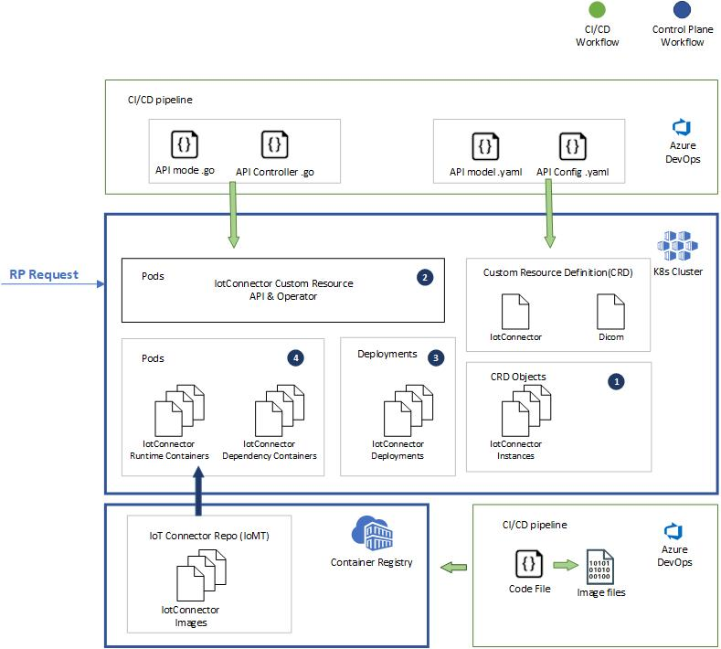
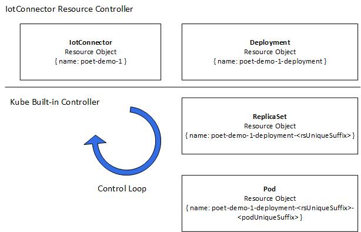
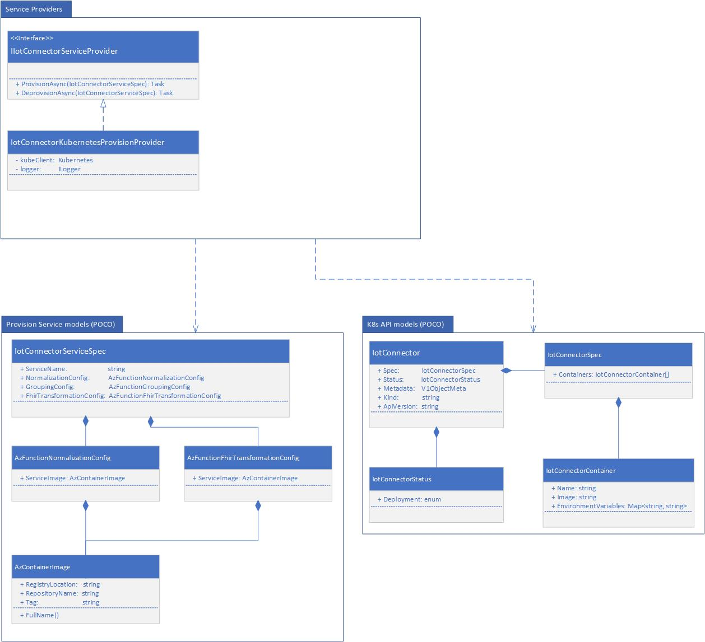

# IoT Connector K8s platform Blueprint

**STATUS: Work In Progress.**

[[_TOC_]]
# Background
The purpose of this document and PR is to communicate logic view of the high-level design for setting up the IoT Connector K8s platform to manage the Custom Resources and Definitions.

# High Level Integration Architecture


## Resource Provision in Control Plane
In the control plane, the RP request triggered the below workflow on the AKS cluster server.
1. A Custom Resource object will be created on behalf of the Iot Connector. The validation will be run agaist with the Custome Resource Definition(CRD) preset for defining the IoT Connector on the cluster.
2. The IotConnector Resource operator will be invoked to reconcile the request.
3. There will be a new K8s Deployment created for the requeset with metadata and required images.
4. A Pod will be created for the deployment. The Pod will have the containers that run the Docker images. The Docker images will contain Azure functions of the core runtime logic.

After that step, a sub-resource Status will be created under the CRD object to represent whether the deployment has finished. RP can rely on that Status to inform the result in an Async creation process. 



## CI/CD Process
- Build the API model and Operator Controller that are written in GoLang and deploy them to the cluster. The Operator is also running in a Pod.
- Apply the CRD definitions that are written in YAML and deploy them to the cluster.
- Build the core Azure function code into docker images and upload to ACR.
- Build and release library code to Nuget.
- Manage the K8s cluster platform. 
- Manage the runtime environment and core peripheral modules on the AKS, like AAD Pod, key-vault, db, metrics, logging etc.

# Kubernetes Extension API for IoT Connector CRD
The CRD(Custom Resource Definition) defined the resources of the IoT Connector service instance. The API controller will reconcile the incoming request to mutate the states of deployments and their statuses.

## Concepts
### CRD schema
At a high level, the CRD schema includes the information required to create deployments of containers that will run the Azure Function images separately for Normalization, Grouping, and FHIR Transformation. 

There will also be sidecar containers to handle requirements for Managed Identity, Key Vault Management, Metrics, and Security Benchmark. This portion is currently Working-In-Progress. More demo-able code can be found in DICOM's setup.

Schema location: 
- Golang Models: workspace-platform/src/iot-connector/kubernetes/resource-operator/api/v1alpha1/iotconnector_types.go
- YAML: workspace-platform/src/iot-connector/kubernetes/resource-operator/config/crd/bases/services.azurehealthcareapis.com_iotconnectors.yaml    
  Note: **DO NOT** manually update this YAML file. It's auto-generated by the [kubebuilder](https://book.kubebuilder.io/quick-start.html).

### CRD Controller
The CRD Controller reconciles the requests for managing the custom resources. It's currently responsible for creating or updating the deployment of IoT Connector service instance. For now, it's one deployment resource per one IoT connector instance provision. Later, it will also be responsible for coordinating the request with the other resources, for example, Azure Identity. More demo-able code can be found in DICOM's setup.

Controller source:
- workspace-platform/src/iot-connector/kubernetes/resource-operator/controllers/iotconnector_controller.go

# Resource Provision
Resource Provision module includes the libraries for provisioning and de-provisioning the resources for the IoT Connector service instances.

## Provision States
On Kubernetes side, we're using the concept of Condition to represent different measurements of the system and resources. The measurement can be evaluated at various levels of the resources, system components or any runtime monitors. One condition itself doesn't necessarily have to stand for a State or a Phase for the entire connector service, in fact, a State can depend on any number of conditions. For example, you can define a "Good" weather as when it is in both Sunny condition and Cool condition. Similarly, you can defined a "Provisioned" state when the deployment condition is done and other runtime configurations are completed as well. 

The benefit of using the condition is we will reduce the complexity of maintaining the variety of states, dependent relationships, and the transitioning logic on K8s clusters side. We can just add or remove conditions when needed. We will translate the conditions into a single value state on the RP Worker side in order to reture the response back to customer on the RP PaaS. RP worker will decide how to use them.

At the high level, Kubernetes cluster will only surface the configurational conditions at platform or infrastructure level for the K8s cluster resource in provision or deprovision time, a.k.a, deployment time in the control plane. They will not depend on any upstream or consumer's states. The conditions can be queried through the built-in APIs or CRD APIs. The runtime conditions or healthy conditions will be reported diffferently, basically not in provisioning or deployment time, for the runtime monitors and alarms to use. 

### IoT Connector CRD Object Conditions 
Note, the list of conditions will grow base on new requirements. We will add more conditions when start working on more details in each phase of the life-cycle of the IoT Connector resource.

| Condtion Name | Possible Values | Description |
|-|-|-|
| DeploymentInitialSuccess | **Unknown**/**False**/**True** | Examine the deployment owned by the IoT Connector Object has succeeded at least once initially.  <br> **Unknonw**: The deployment does NOT exist. <br> **False**: The deployment does NOT have minimum replica set initially. <br> **True**: The deployemnt has minimum replica set initially. |
| DeploymentReady | **Unknown**/**False**/**True** | Examine the deployment owned by the IoT Connector Object in real time: <br> **Unknonw**: The deployment does NOT exist. <br> **False**: The deployment does NOT have minimum replica set ready. <br> **True**: The deployemnt has minimum replica set ready. |
| *Example: ManagedIdentityBindingReady* | *Example: Unknown/True/False* | *Example: Bind the identity to compute pods* | 
| .. | .. | .. |

## IoT Connector Identifiers
As for today, Kubernetes provide two resource object properties that guarantee the uniqueness at different level: [UID and Name](https://kubernetes.io/docs/concepts/overview/working-with-objects/names/).

"**Name**" is unique on same kind of resource object within the same Namespace. The Namespace encapsulates resource objects in a "Virtual Cluster". It offers a few isolations, including naming, authorization, service DNS etc.

"**UID**" is a unique string that is generated by K8s system and is unique per entire cluster. It represents a specific Resource Object, for example, Deployment, ReplicaSet, Pod, or IotConnector Custom Resource.

In short, we can leverage the Name property since that's a given value from client side. In such topology, the RP worker would be able to initiate it and start provisioning the K8s resources with it. At a later time, RP worker will be able to locate the resource for performing any CRUD operations with it without ambiguity.

Furthermore, we can also leverage the Namespace to organize the resources and map them to the relavant entities in Gen2. For example, we can use Namespace to stand for a customer or a workspace or even just a IoT Connector. There would be different strategies to combine Namespace and Name for isolations. 

The final design of naming convention would better be top-down and decided from RP Service side.

# Resource Deprovision
Deprovision of an IoT Connector service instance means that we should delete(hard-delete) all the resources provisioned for that service instance and purge all data in other resources related to that instance, for example, any registry of any sidecar services, on the target cluster.

## Requirements
1. The RP Worker should be able to deprovision or delete resources that were created and configured for a designated IoT Connector service instance on the AKS cluster.
1. The RP Worker should be able to query or pull the current status of the deprovision process.
1. When the RP worker deletes a request that doesn't exist or has deletion in progress, the request should be handled differently and gracefully.

## Assumptions
1. Deprovision in this doc scopes to the resources managed on the AKS cluster. 
1. The triggers are Kubernetes requests with its client. In the Production, it should be the C# K8s SDK client. In the development, it may be either SDK or kubectl.
1. By design, there should be only one deprovision request to process for any IoT Connector instance at one time. Before the first deprovision request finished, either succeeded or failed, no other provision or deprovision requests should arrive.
1. Deprovision may take time to finish, either with a successful result or failed result. The deprovision process of the AKS resources does not need to notify the RP service actively. It should support pull-mode for the client to check the current status.
1. Deprovision does not have to consider a grace period for draining all the data on the fly before terminating all Pods or containers; it should immediately start deleting the resources.
1. Deprovision may end in a failed case for various reasons; AKS needs to submit telemetry and communicate the failure reasons. In the worst case, the technician will arrive and fix the problem in the case that all automated approaches failed.
1. Deprovision takes priority over the upgrade or the deployment of the code change since customer had determined to delete everything immediately.


## Solution
The deprovision will rely on the CRD declarative API. The RP worker tells AKS CRD API that a designated IoT Connector instance should be deleted, the CRD API operator will reconcile and make sure the goal should be achieved or report telemetry for errors. 

Kubernetes provides the garbage collection mechanism to clean up the dependent or orphaned resources that do not have the owner resource existing anymore, called cascading deletion. There are two modes of cascading deletion: background and foreground. The tech specs are defined at [here](https://kubernetes.io/docs/concepts/workloads/controllers/garbage-collection/).

In the background mode, the root CRD will get deleted immediately. The remaining dependents get deleted implicitly unless we find or create an additional way to track and check them or use a success-by-default assumption until the alarm is on. This mode will increase either logical or technical complexity for knowing the exact deprovision status of all resources. 

Compared to the background mode, in the foreground mode, the "root" CRD resource has visibility to all its dependents' progress explicitly, until all dependents get deleted, then itself gets deleted. During that time, the RP can query the CRD object for the progress.

Another option considered was use the imperative way to instruct the AKS to delete the resources. This will lose the encapsulation of the resources and move the responsibilities to the RP worker side.

# Repo structure

## Package Structure

**Status: The package(namespace) structure should be delineated in the diagram. The model of the CRD API contract details will tend to update.**



## Source Structure
```
workspace-platform/src/iot-connector/provision

.
├── Microsoft.Health.Cloud.IoMT.Provision
│   ├── K8s\Api\V1Alpha1\Models   // POCOs for K8s Service model 
│   └── Service
│       ├── Models      // POCOs for modeling Iot Connector Properties and Configuration
│       └── Providers   // Resource Providers
│
└── Microsoft.Health.Cloud.IoMT.Provision.Console //  Console App example 
```

# Appendix

## Owners and dependents  
In K8s, there are the concepts of owners and dependents. It's very useful for K8s to perform GC and other operations. In our current design, for the IoMT, we will establish the resource of the IoT Connector Kind, it will own a Deployment, and then a ReplicaSet, then the Pod(s) and potentially along with other resources in descendant order.

In the example below, you can spot the ownership relationship by looking at the "uid" of current object and the "ownerReferences.uid" of its owner.

A IotConnector object:
```json
{
    "apiVersion": "services.azurehealthcareapis.com/v1alpha1",
    "kind": "IotConnector",
    "metadata": {
        "name": "iot-connector-demo",
        "namespace": "default",
        "selfLink": "/apis/services.azurehealthcareapis.com/v1alpha1/namespaces/default/iotconnectors/iot-connector-demo",
        "uid": "daf2b909-c6ef-4fa6-a1da-411b479bedd0"
        ...
    },
    ...
}
```
The Deployment object owned by above object:
```json
{
    "apiVersion": "apps/v1",
    "kind": "Deployment",
    "metadata": {
        "name": "iot-connector-demo-deployment",
        "namespace": "default",
        "ownerReferences": [
            {
                "apiVersion": "services.azurehealthcareapis.com/v1alpha1",
                "blockOwnerDeletion": true,
                "controller": true,
                "kind": "IotConnector",
                "name": "iot-connector-demo",
                "uid": "daf2b909-c6ef-4fa6-a1da-411b479bedd0"
            }
        ],
        "selfLink": "/apis/apps/v1/namespaces/default/deployments/iot-connector-demo-deployment",
        "uid": "ed33b3d5-5af9-4514-9aac-00e9d99a4b66"
        ...
    },
    ...
```
The ReplicaSet object owned by above object:
```json
{
    "apiVersion": "apps/v1",
    "kind": "ReplicaSet",
    "metadata": {
        "labels": {
            "deployment": "iot-connector-demo-deployment",
            "pod-template-hash": "7f9f8dd5b6"
        },
        "name": "iot-connector-demo-deployment-7f9f8dd5b6",
        "namespace": "default",
        "ownerReferences": [
            {
                "apiVersion": "apps/v1",
                "blockOwnerDeletion": true,
                "controller": true,
                "kind": "Deployment",
                "name": "iot-connector-demo-deployment",
                "uid": "ed33b3d5-5af9-4514-9aac-00e9d99a4b66"
            }
        ],
        "selfLink": "/apis/apps/v1/namespaces/default/replicasets/iot-connector-demo-deployment-7f9f8dd5b6",
        "uid": "ee01949b-c963-41b9-8b43-f59f4e437261",
        ...
    },
    ...
}
```

The running Pod object owned by above object:
```json
{
    "apiVersion": "v1",
    "kind": "Pod",
    "metadata": {
        "creationTimestamp": "2020-11-06T04:46:19Z",
        "labels": {
            "deployment": "iot-connector-demo-deployment",
            "pod-template-hash": "7f9f8dd5b6"
        },
        "name": "iot-connector-demo-deployment-7f9f8dd5b6-jf589",
        "namespace": "default",
        "ownerReferences": [
            {
                "apiVersion": "apps/v1",
                "blockOwnerDeletion": true,
                "controller": true,
                "kind": "ReplicaSet",
                "name": "iot-connector-demo-deployment-7f9f8dd5b6",
                "uid": "ee01949b-c963-41b9-8b43-f59f4e437261"
            }
        ],
        "selfLink": "/api/v1/namespaces/default/pods/iot-connector-demo-deployment-7f9f8dd5b6-jf589",
        "uid": "c12b34f6-b42e-4d45-a0cc-0bb77d1f8cd6",
        ...
    },
    ...
}
```

[Read more](https://kubernetes.io/docs/concepts/workloads/controllers/garbage-collection/)

## Resolved Open questions:
1. How does RP decide whether the CRD Resource has been purged? 
   **Option 1:**  Depend on the result from the interface ListNamespacedCustomObject.
   
   **Pros:** 
    - We rely on the result of a 2xx status code and examine whether the resource still exist on the cluster in good hand-shake flow.   

   **Cons:** 
    - List API needs a generic selector to be assigned, e.g. label or annotation, which make sense for not using the name, which should be unique. However, in this way, we have to maintain the unique name with target selector type, for example, labels.

   **(CHOSEN) Option 2:**  Depend on 404 with GetNamespacedCustomObject  
   **Pros:** 
     - We don't need extra naming mechanism since the name of the CR in one namespace must be unique and namespace must be unique as well.

   **Cons:** 
     - 404 should be reserved for client side errors as the RFC pointed out: "The 4xx class of status code is intended for cases in which the client seems to have erred." In this case, the client, or the RP worker, isn't doing anything erroneous but querying the server with valid intentions. 
     - Another pitfall is that this approach also would obsfuscate the response shows "CR no longer exists" with other possible mistakes which caused the "Not Found" status on the server side, or AKS cluster. That will confuse the alarming system potentially so we may need to add extra logic for filtering out this erroneous situation as a "valid" use case.