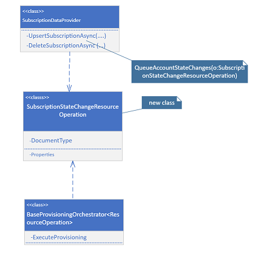
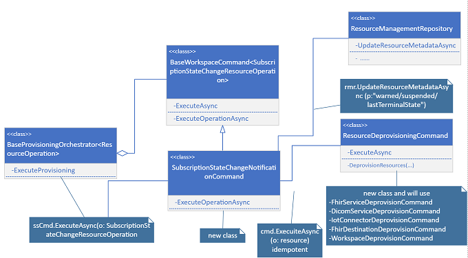

# Design
  As in the case with Gen1, when our service receives a notification of subscription state change, these states will be cascaded to the corresponding Azure Healthcare API resources ( workspaces, Fhir Services, Dicom Services, Iomt) or accounts. Thus, we update the `State` property of workspaces/fhirservices/dicomservices/Iomt.
  
 ### Taking resources offline
  As part of the suspended and warned states, the customer should not be able to use Azure Healthcare API
    1. Marking all the Azure Healthcare API workspaces, fhir services and dicom services for that subscription suspended/warned
	2. Blocking traffic at the front for the account(s) with suspended/warned subscription state.
	

  When an account is marked as suspended, frontend server shall not forward traffic to backend nodes. This can be achieved by updating  `GetFhirServiceResourceRoutingInfoByDomain`, and `ListFhirServiceResourceRoutingInfoAsync` of `RoutingProvider` to check for the account subscription state to filter out suspended/warned state accounts

  For <b>Dicom Services</b>, update `GetDicomServiceResourceRoutingInfoByDomain` , and `ListDicomServiceResourceRoutingInfoAsync` of the `RoutingProvider`
  to check the state of the subscription.

  For <b>Iot services </b> some sort of checking is required to check the state of the subscription before doing operations ??? may be `ListAccountsAsync` of `RoutingProvider`
  
  ### Re-Instate accounts
  As soon as the subscription state goes back to "Registered" state from "suspended/warned", we will mark the resources (workspaces, Fhir services, Dicom services, Iot services) back to   the `lastTerminalState` of the account if there is one.
  
  ### Stop emitting usage
  
  This shall be implemented in the `BillingWorkspaceResourceGetter`
  
  ### Delete Resources
  
  When a subscription is deleted, delete all accounts (workspaces, fhir services, dicom services, Iot Services , resource groups) under that subscription. All resources linked to the subscription should  be deprovisioned. The existing `WorkspaceDeprovisionCommand`, `FhirServiceDeprovisionCommand`, `FhirDestinationDeprovisionCommand`, `IotConnectorDeprovisionCommand` etc could be used. Verify that workspaces, fhir services, dicom services, iot, private links, DNS etc are all deprovisioned. Finally,Mark each reasource in the global database as 'Deprovisioned'
  
  ### Finding all accounts associated with a subscription
  
  An existing or a new method will be required to list all accounts (workspaces, Fhir services, dicom services, Iot) in `ResourceReadRepository` by subscription
  
  ### Preventing PATCH/PUT/POST
  As this is implemented in `ServiceTypeHandler` for gen1, for Jupiter, this functionality will be added in the parent class `ResourceObjectTypeHandler` where all public methods except `OnDeleteResourceAsync` and `OnEnumerationOperations` shall check the subscription state before executing the command. If the
  subscription state is suspended/warned, these methods shall throw exception Http Status code 403.
  
  ### Handling subscription state change notification
  As we get subscription state change notification, we will enqueue an object of `SubscriptionStateChangeResourceOperation` in `SubscriptionDataProvider`. 
  
  A partial snippet of `SubscriptionStateChangeResourceOperation` should look like as in: 
  
  ```
  
  public class SubscriptionStateChangeResourceOperation : ResourceOperation
  {
      public const string DocumentType = "SubscriptionStateChangeResourceOperationrequest";
  }
  ```
  
  ### Warned state
  Only GET/DELETE management APIs shall function.
  1. Update workspaces, fhir services `state` proeprty to Warned
  2. Update Dicom Services `state` property to Warned
  3. Update Iot Services `state` property to Warned, check??

Once these actions are successfully performed, Azure Healthcare API ( Fhir, Dicom, Iot) should show a status of "Offline" in the Azure Portal.

### Suspended State
As in the case with Warned state, only GET/DELETE APIs shall function
1. Update workspaces, fhir services `state` property to Suspended
2. update Dicom Services  `state` property to Suspended
3. update Iot Services  `state` property to Suspended, check??

Both the Suspended and Warned state updates required `UpdateResourceMetadataAsync` in the `ResourceManagementRepository` class

### Delete State
When our service receives a deleted state change notification, all the underlying Azure Healthcare API resources should be deprovisioned. In this action
1. Fhir services and associated resources (DNS, Traffic Manager, Private Links etc) shall be deprovisioned
2. All Dicom services and associated resources shall be deprovisioned
3. All Iot services and any associated resources shall be deprovisioned
4. Workspaces shall be deprovisioned
5. Resource groups shall be deprovisioned , if needed??

All these subscription state changes shall be handled in `SubscriptionStateChangeNotificationCommand` ; snippet shown below

```
public class SubscriptionStateChangeNotificationCommand : BaseWorkspaceCommand<SubscriptionStateChangeResourceOperation>
{

}
```

## Queue subscription state change notification operations


## Handling subscription state change notification operations


# Test Strategy
Unit tests, end to end tests will be added for the scenarios.

Testing subscription state change events (Suspended, Registered/Restored) can be done through the Subscriptions blade in the dogfood portal.

## Suspend subscription state:

1. In the dogfood portal, search for subscriptions in the top search bar (select the subscriptions result)
2. Select the subscription you wish to suspend/re-instate from the list on the subscriptions blade.
3. On the overview page, you will have a "Cancel Subscription" option.
4. Once selected, you will be taken to a warning page, select "Ignore and cancel"
5. provide the subscription name and reason to verify and click "cancel subscription"

## Re-Instate subscription state:
If the subscription is in suspended state, you will be given the option on the overview page to re-instate subscription.

## Delete subscription state:
The workaround to test this scenario is
1. Create dogfood account and subcription
2. Create a fhir account on the subscription
3. Create a  test (should be ignored after) to call  `SubscriptionDataProvider` `DeleteSubscriptionAync` with subscription state change
4. Then verify that the fhir account created is deprovisioned
