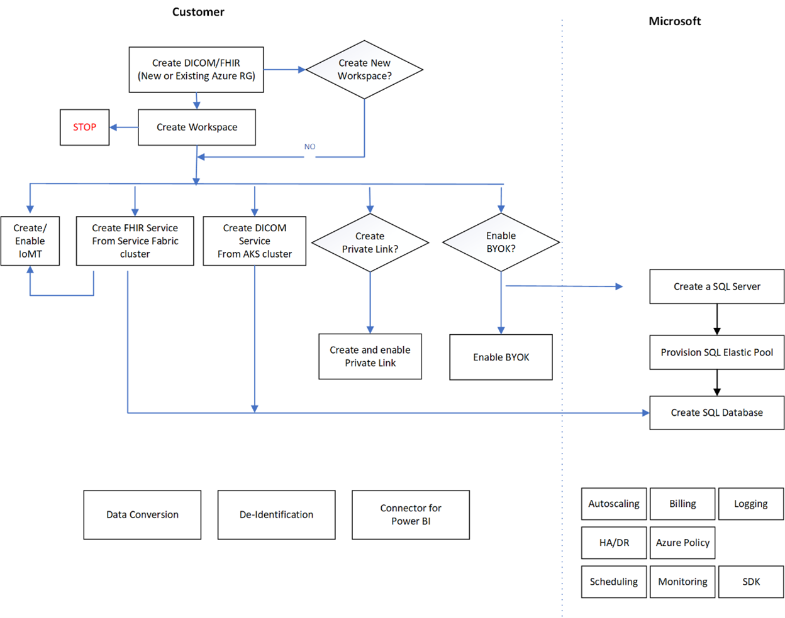
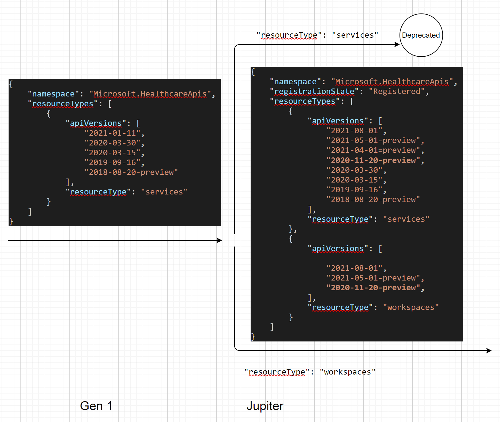

# Workspace for Healthcare APIs

## Provision Workspace and Manage Service Settings Through Workspace

# Scenario Contacts 

**Program Manager (PM):** Benjamin Xue , Matjaz Ladava

**Software Engineer (Dev):** Dustin Burson

# How to Use This Document

*This is a living document tracking the specification for your feature.
It follows the lifecycle of the feature and should be written and
reviewed in four stages.*

*1. Justifying the work, in which the feature is greenlit for
engineering resources. **This portion must be completed and achieve
Director approval before committing engineering resources.***

*2. User-facing feature design, which goes into detail about how a
customer interacts with the feature.*

*3. Implementation design, which describes the work the team is doing.*

*4. Release activities, including documentation, demos, and field
readiness.*

*Not all sections may be relevant to your feature, and that’s okay.
Leave unused sections empty – do not delete them!*

**Note:** Not everything described in this document is part of the
solution scope. Some information is provided to help understand the
overall problem domain and should be kept in mind while designing a
solution. Scenarios are yet to be prioritized.

# Why There is a Gap Today? (PM) 

*Guidance: This section is used to build consensus around the need for
work to be done in a specific feature area and is equivalent to a “one
pager”. This section is likely to be 2-3 pages when completed. When
pitching the idea via a PowerPoint presentation, make sure all these
items are included in your presentation.*

*This section is **required** for assignment of engineering resources.*

Section status: \[draft\]

Date reviewed: \[Date\]

## Problem Statement 

*Guidance: State the problem or challenge in a way that ties back to the
target user. What is their goal? Why does this matter to them? Can be of
the form, “Customers have a hard time doing FOO, I know this because I
heard it from X, Y, Z.”*

As we continue to expand the healthcare API platform and add new
services such as DICOM and IoT to the FHIR base service in Jupiter
release, it is therefore important that we want to provide an effective
way of helping customers manage one or multiple service instances. The
concept of Workspace was conceived.

A workspace is a top-level, logical container for all healthcare API services. 
It represents metadata, not actual service or resource, and performs no processing of customer data.

Initially a workspace supports the following settings or properties for all services:
1. Private Links
1. Customer Managed Key (CMK)
1. Azure Region Selection
1. Shoebox including audit logs and metrics (aka resource or diagnostic logs)
1. Application Roles
1. Billing

Except for billing, which is handled behind the scenes, each property specified at the workspace level, shall be 
implemented by each service. The benefit of managing properties at the workspace level is to ensure consistency and 
reduce administrative work. However, doing so may add constraints to a particuplar service. One workaround is to 
create a new workspace if a setting cannot be applied to a specific service. As we evolve the workspace
concept, we will relax and/or remove some constraints, to make
configuration management of the underlying services centralized and more
flexible.

The flowchart below illustrates how a workspace is provisioned and how
Healthcare API services.

## Supporting Customer Insights 

*Guidance: This section should include direct quotes from customers,
direct quotes from the field, and summaries of interactions with
customers in which they describe the problem they are having.*

#### Since the workspace concept is new and hasn’t been released yet, there isn’t any known issue from customers yet. 

#### However, we anticipate that having a workspace will help simplify administrative work for customers with adequate usage of our Healthcare APIs. On the other hand, we expect that customers will help us identify feature gaps that will prioritize in future releases.

## Related Work 

*Guidance: What other features are related to this work? Please include
links.*

One related work is Azure ARM resource provider (RP). As we introduce
the workspace concept and onboard DICOM and IoT managed services, it is
inevitable that we introduce new API versions and possibly new ARM RP,
thus potential breaking changes as defined by [Azure breaking change
policy](http://aka.ms/azbreakingchangespolicy). The rationale behind the
policy is to ensure that we do not break customer solutions that are
built with our services, thus satisfactory customer experience.

There are possibly three options, each of which has significant business
impact as we work towards the general release of Jupiter.

-   Use the same RP, and carry forward with Gen 1 in Jupiter, thus no
    breaking changes

-   Use the same RP, and break away from Gen 1, thus resulting in
    breaking changes and triggering the 3-year deprecation process

-   Apply and use a new RP, which can take more than one month, thus
    possibly delaying the Jupiter release

With the goal of moving all customers to Jupiter once it is GA’ed as
quickly as we reasonably can, it appears that the first option provides
the least resistance to us. As soon as we help migrate customers to
Jupiter, we can safely deprecate Gen 1 service, subject to some internal
review and approval.

The flowchart below illustrates how Gen 1 and Jupiter will co-exist and
API versions we must support during the transition.

## What is Being Proposed? 

*Guidance: In 20 words or less, describe the proposed solution.*

Provision a workspace as a top-level container along with applicable
settings and associate Healthcare API service(s) with it.

## Elevator Pitch / Press Release 

*Guidance: Create a story for your scenario – detail out the customer,
their problem and/or goal, and then specific outcomes the customer will
achieve or how success would be measured. Avoid implementation details.
Think of this as the blog post announcing this feature. 500 words max.*

## Justification, Expected Business Impact, and Value Proposition 

*Guidance: Why are we tackling this scenario? What is the expected
impact? What’s the value proposition of this work?*

As aforementioned, the workspace concept is introduced to help customers
manage Healthcare APIs, including modifying settings such as Private
Link and CMK for underlying services. On the other hand it requires that
we maintain both Gen 1 and Jupiter versions to prevent us from going
through the lengthy deprecation process as required by the Azure
breaking change policy.

## Target User / Persona 

*Guidance: Specify the target user/persona(s).*

The feature is used by all users, including but are not limited to, IT
administrators, business analysts and developers.

## Existing Solutions and Compete Info 

*Guidance: List the various ways in which a user may currently handle
this problem/challenge. With what expectations will customers approach
our solution? What are our competitors doing in this space?*

N/A

## Customers/Partners Interaction Log 

*Guidance: What customer have voiced and validated the specific problem
statements? Did you discuss the elevator pitch and the potential
solutions (under NDA)? Are they candidates for continued follow-up and
participation in our early access program? This should be a list of the
different customers you have talked to. Repeated interactions with the
same customer, such as via private preview customers, should be tracked
elsewhere.*

| Customer/Partner Name | Conversation Details / Specific Requirements | Last Contact | Private Preview Candidate |
|-----------------------|----------------------------------------------|--------------|---------------------------|
|                       |                                              |              |                           |
|                       |                                              |              |                           |

# APPROVAL GATE - WHY

Complete a review and get Director approval to continue.

# User-Facing Feature Design 

*Guidance: This section describes all aspects of the feature with a
user-facing component, including customer use cases, metrics, and
scenario KPIs. This section is more than just UI!*

*This section is **required** for all user-facing features. Features
with no user impact, for example improvements to the service
implementation, may treat this section as **optional**. You probably
can’t skip this section.*

Section status: \[draft, review, accepted\]

Date reviewed: \[Date\]

## Terminology (PM/Dev) 

*Guidance: This section defines terms used in the rest of the spec. The
terms may feed into public docs and blogs as be used to define metric
names and logging categories.*

| Term      | Definition                                                 |
|-----------|------------------------------------------------------------|
| Workspace | A top-level logical container for Healthcare API services. |
|           |                                                            |
|           |                                                            |
|           |                                                            |

## Branding (PM) 

*Guidance: This section discusses branding decisions such as
product/feature names. Note that all branding decisions **require**
sign-off by the Product Marketing Manager.*

## Detailed Feature Description (PM/Dev) 

*Guidance: This section describes, at a high level, what the feature is
and is not to the target customer and how we measure success.*

## Goals (PM/Dev) 

*Guidance: This section describes the goals for how the feature is to be
used.*

| Goal                                                                                              | Target Release | Priority |
|---------------------------------------------------------------------------------------------------|----------------|----------|
| Provision a workspace as a top-level, logical container.                                          | 3/31/21        | P0       |
| Create one or multiple instances of FHIR, DICOM, and/or IoT for a given workspace.                | 3/31/21        | P0       |
| Support Private Link and CMK during the initial provision.                                        | 3/31/21        | P0       |
| Enable and validate setting changes at the workspace level.                                       | 3/31/21        | P0       |
| Deprovision a workspace and all associated service instances.                                     | 3/31/21        | P0       |
| Provide workspace level audit log and metrics and include the data in export.                     | 5/31/21        | P0       |
| Allow managed identity for each service.                                                          | 5/31/21        | P0       |
| Enable IoT to communicate with FHIR service when Private Link is enabled.                         | 5/31/21        | P0       |
| Improve workspace capabilities based on feedback during public preview.                           | 5/31/21        | P1       |
| Browse workspaces and look up services within a workspace.                                        | 5/31/21        | P0       |
| Support movable workspace and underlying services to a different resource group and subscription. | 5/31/21        | P0       |
|                                                                                                   |                |          |
|                                                                                                   |                |          |

## Non-Goals (PM/Dev) 

*Guidance: This section describes the topical customer goals that this
feature is specifically not addressing, and why.*

| Non-Goal                                                               | Mitigation                                                                                                                            |
|------------------------------------------------------------------------|---------------------------------------------------------------------------------------------------------------------------------------|
| Move services from one workspace to another.                           | We may remove the constraint if there is a strong demand for such capability from customers.                                          |
| All the services under the same workspace reside in different regions. | Doing so prevents cross region data flows. But we may relax the constraints and properly account for data transfer costs accordingly. |
| Apply workspace settings to some of the underlying service instances.  | Create a workspace where settings should be, or should not be, applied.                                                               |
| Aggregate billing at the workspace level                               | Billings are calculated and recorded for each individual service. No plan to provide aggregate billing info at the workspace level.   |

## Scenarios and Use Cases (PM/Dev) 

*Guidance: This section describes the customer scenarios that this
feature is designed to address. Include how the feature is used to solve
the scenario/use case. Following these steps should be used to validate
the feature.*

| Scenario / Use Case                                                                  | Steps to fulfill the scenario                                                                                                                                                                                                                                  | Priority |
|--------------------------------------------------------------------------------------|----------------------------------------------------------------------------------------------------------------------------------------------------------------------------------------------------------------------------------------------------------------|----------|
| The user creates a new workspace from the portal or through PowerShell/CLI.          | Invoke ARM RP to create the new workspace.                                                                                                                                                                                                                     | P0       |
| The user changes the settings in a workspace.                                        | Validate the changes and apply them to the underlying service instances if no errors are found. Notify users if applying the setting changes requires some infrastructure changes, for example, moving data to a separate environment in order to support CMK. | P0       |
| The user browses workspaces and underlying service instances for a workspace.        | Provide navigation through the Azure portal.                                                                                                                                                                                                                   | P0       |
| The user views audit logs and metrics through the portal and downloads logging data. | Provide user interface in the portal and enable the download option in a common data format.                                                                                                                                                                   | P0       |
| The user moves a workspace from one resource group to another.                       | Allow the user to move the selected workspace and all underlying services to another resource group.                                                                                                                                                           | P0       |
|                                                                                      |                                                                                                                                                                                                                                                                |          |
|                                                                                      |                                                                                                                                                                                                                                                                |          |
|                                                                                      |                                                                                                                                                                                                                                                                |          |
|                                                                                      |                                                                                                                                                                                                                                                                |          |

## Scenario KPIs (PM) 

*Guidance: These are the measures presented to the feature team, e.g.
number of FHIR endpoints, total data storage size.*

<table>
<thead>
<tr class="header">
<th>Type 
[Biz | Cust | Tech]</th>
<th>Outcome</th>
<th>Measure</th>
<th>Target</th>
<th>Priority</th>
</tr>
</thead>
<tbody>
<tr class="odd">
<td></td>
<td></td>
<td></td>
<td></td>
<td></td>
</tr>
<tr class="even">
<td></td>
<td></td>
<td></td>
<td></td>
<td></td>
</tr>
</tbody>
</table>

## What’s in the Box? (PM) 

*Guidance: This section lists everything the customer gets in the end.
Is there a new service? Templates? Samples? SDK?*

## Feature Dependencies (PM/Dev) 

*Guidance: This section describes both the dependencies this feature has
on other areas as well as other areas impacted by this work. Examples of
areas which may be impacted: Persistence Provider, FHIR API.*

### Dependencies this design has on other features 

| Feature Name | Nature of dependency | Mitigation/Fallback | PM  | Dev |
|--------------|----------------------|---------------------|-----|-----|
|              |                      |                     |     |     |
|              |                      |                     |     |     |
|              |                      |                     |     |     |

### Features that have a dependency on this design 

| Team Name | Contacts | PM  | Dev |
|-----------|----------|-----|-----|
|           |          |     |     |
|           |          |     |     |

## Customer Validation Plan (PM) 

*Guidance: This section gives details on how we plan on engaging with
customers to validate our assumptions and design.*

### Customer Research Required 

### Criteria for Customer Selection 

### Customers Selected 

## User Interface (PM) 

### Storyboard 

*Guidance: This section is for features with a UI/UX component.
Alternatively, you can also create Storyboard in PowerPoint and provide
link to the PPT in this section.*

### Usability Validation 

*Guidance: This section defines the usability labs required to validate
the user interface design.*

## End User Troubleshooting (PM) 

*Guidance: This section describes what we provide to the customer in
order to enable them to troubleshoot issues with the feature. Customer
Metrics and logging to be provided by Azure Insights unless otherwise
noted.*

### Azure Monitor Metrics 

| Metric Name | Display Name | Description | Dimension | Metric Unit | Aggregation Type | Proposed Alert Rule | Time to Detect |
|-------------|--------------|-------------|-----------|-------------|------------------|---------------------|----------------|
|             |              |             |           |             |                  |                     |                |
|             |              |             |           |             |                  |                     |                |

### Logging 

| Log Category | Category Display Name | Log Event | Log Event Display Name | Proposed Alert Rule |
|--------------|-----------------------|-----------|------------------------|---------------------|
|              |                       |           |                        |                     |
|              |                       |           |                        |                     |

### Troubleshooting guidance 

*Guidance: This section describes the steps customers should take to
troubleshoot common errors. This will be used to populate the
documentation*

### Troubleshooting in the Azure Portal 

*Guidance: This section describes the troubleshooting guidance that is
populated in the Azure portal.*

| Problem Type (if new) | Problem Category | Troubleshooting Guidance |
|-----------------------|------------------|--------------------------|
|                       |                  |                          |
|                       |                  |                          |

## Proposed release plan (PM/Dev) 

*Guidance: This section is particularly important if running a private
preview as part of the release. Use it to align collateral releases.*

### Private Preview 

#### Target date

#### Goals for Release 

\[e.g. to validate assumptions\]

#### Features for Release 

\[List of features\]

#### Collateral Required 

\[List of collateral, e.g. docs, marketing, etc.\]

#### Success criteria 

\[List\]

#### Customers Involved 

\[List\]

### Public Preview 

#### Goals for Release 

\[e.g. to validate assumptions\]

#### Features for Release 

\[List of features\]

#### Collateral Required 

\[List of collateral, e.g. docs, marketing, etc.\]

#### Success criteria 

\[List\]

#### Customers Involved 

\[List\]

### General Availability 

#### Target date

Initial rollout: 3/31/2021

GA: 4/30/2021

#### Goals for Release 

\[e.g. to validate assumptions\]

#### Features for Release 

\[List of features\]

#### Collateral Required 

\[List of collateral, e.g. docs, marketing, etc.\]

#### Success criteria 

\[List\]

#### Customers Involved 

\[List\]
