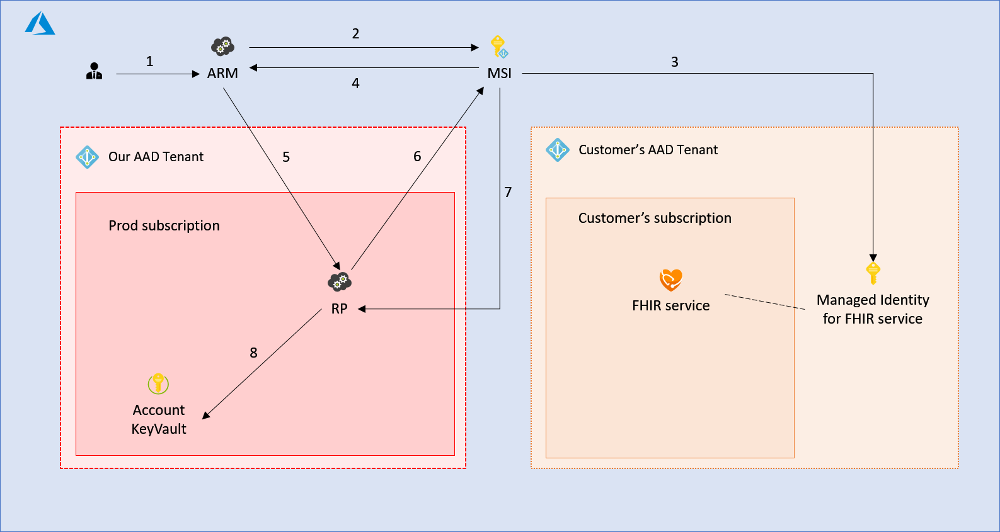
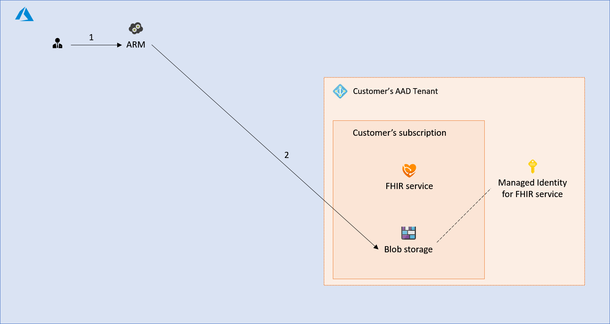

Managed identity allows us to build more secure service and simplify credential management for our customers.

To understand more about managed identity, [What is managed identities for Azure resources?](https://docs.microsoft.com/en-us/azure/active-directory/managed-identities-azure-resources/overview) is a great place to start. From the link:

> A common challenge when building cloud applications is how to manage the credentials in your code for authenticating to cloud services. Keeping the credentials secure is an important task. Ideally, the credentials never appear on developer workstations and aren't checked into source control. Azure Key Vault provides a way to securely store credentials, secrets, and other keys, but your code has to authenticate to Key Vault to retrieve them.
>
>The managed identities for Azure resources feature in Azure Active Directory (Azure AD) solves this problem. The feature provides Azure services with an automatically managed identity in Azure AD. You can use the identity to authenticate to any service that supports Azure AD authentication, including Key Vault, without any credentials in your code.

[[_TOC_]]

# Business Justification

The managed identity will be useful in a few scenarios both internally and externally. It allows us to establish an identity for the FHIR service and allow RBAC to be controlled using that identity. Both scenarios are described in the following section.

# Scenarios

1. As a customer, I want to be able to grant permission to my FHIR service so that it can export data to specified storage account without having to specify storage key.
2. As an engineer, I want to isolate each account such that access to resources is limited to individual account only.

# Metrics

*List the metrics/telemetry that should be collected. For example: number of accounts that use feature X, number of requests to Y API per hour/day/week. How do we measure the success of this feature?*

# Design

## External resource access scenario

In this scenario, we want to establish an identity for the FHIR service that provisioned in customer's subscription allowing customer to grant permissions for our FHIR service to directly access other resources in their subscription.

Use case:

The customer has a FHIR service and a storage account provisioned in their own subscription. The customer should be able to export their FHIR data to the storage account without having to provide us their storage key and would like the service to handle it seamlessly behind the scene.

In this case, the customer can establish an identity for the FHIR service and grant write permission to their storage account using that identity. Our service will then obtain the bearer token of that identity and call the storage endpoint.

### Establishing the managed identity

In order to establish the identity, we will need to onboard with MSI service, create a first party AAD application for our RP and update our RP to accept the calls from MSI.

The specific onboarding process can be found [Onboarding instructions for Partner Resource Providers](https://microsoft.sharepoint.com/teams/AzureMSI/_layouts/OneNote.aspx?id=%2Fteams%2FAzureMSI%2FSiteAssets%2FAzureMSI%20Notebook&wd=target%28Onboarding%20Guide%20-%20Partner%20Teams.one%7CCE62BE5A-835A-479E-9475-A2F787A04C1E%2FOnboarding%20Instructions%20for%20Partner%20Resource%20Providers%7C9DED79C3-F2AD-4FDA-B18B-1662D7FB093A%2F%29).

The following diagram shows the interactions between different components.



1. The customer requests to create a resource (in this case a FHIR service)  with a system managed identity in their subscription.
2. ARM requests the identity to be created through the MSI control plane call using the RP's 1st party AAD app.
3. MSI creates a service principal in the customer's AAD tenant.
4. MSI returns identity metadata to ARM including the URL to retrieve the credentials.
5. ARM requests our RP to create the FHIR service, passing the identity metadata from step 4.
6. RP retrieves the credential of the identity through MSI data plane call using the RP's 1st party AAD app.
7. MSI returns the certificate and metadata for the identity.
8. RP stores the certificate in the account specific key vault.

### Assign RBAC using managed identity

Once the identity is established, the user can assign RBAC permissions using the newly created identity.



1. The customer requests to create a new blob storage and allows access to the managed identity by setting specifiesRBAC permissions.
2. ARM requests a blob storage account to be created and sets the RBAC permissions.

### Accessing resource using managed identity

The service now can request the bearer token from AAD using the certificate of the managed identity and access the target resource.


1. The background service fetches the certificate from account specific KeyVault.
2. The KeyVault returns the certificate and metadata.
3. The background service request the bearer token from customer's AAD tenant using the certificate.
4. AAD returns the bearer token.
5. The background service performs operations against the blob storage using the bearer token from step 4.

### Rotating the credential

The certificate has expiration date and must be renewed before the expiration periodically.

When RP retrieves the credential of the managed identity from MSI, MSI returns the location of the certificate along with metadata indicating when the certificate needs to be renewed.

``` json
{
  "client_id": "60702f51-2cc0-4941-bb8f-0e4151284cf4",
  "client_secret": "<secret>",
  "client_secret_url": "https://control-eu2.identity.azure.net/subscriptions/f871dcf3-f8c8-42b3-933b-451c20342f55/resourcegroups/MSIGROUP4298c72d58f541e3b3a4c9e/providers/Microsoft.Compute/VirtualMachines/MSIRESOURCEc9a563409ba8494aada3c97/credentials?tid=abd8daee-d393-4239-9377-883adda3d40f&oid=60702f51-2cc0-4941-bb8f-0e4151284cf4&aid=29c14bce-0cfe-49e9-8129-338a8d73150a",
  "not_before": "2016-12-01T14:11:00Z",
  "not_after":"2017-03-01T14:11:00Z",
  "renew_after":"2017-02-28T14:11:00Z",
  "cannot_renew_after":"2017-05-30T14:11:00Z
}
```

We already have a process that enumerate through each account and rotate the Cosmos DB key for the account. We can use the same process to check the status of the certificate and renew the certificate if necessary.

## Internal resource isolation scenario

In the previous example, once the RP retrieves the certificate for the managed identity, it has to store the certificate somewhere safely and in the example, it is stored in the account specific KeyVault. We want to isolate the access and therefore would ideally secure the account specific KeyVault and lock it down only to be accessible from specific FHIR service. To do this, we would also like to leverage the managed identity.

Since we deploy the FHIR server as a Service Fabric application, we would then require to be able to assign separate identity to each application. Unfortunately, Service Fabric today only support identity at VMSS level not at per application level.

I've talked to Service Fabric team and the support for assigning identity per application will be announced as preview feature at the end of June/early July.

# Test Strategy

*Describe the test strategy.*

# Security

For each account, we will need to store the certificate and rotate it according to the metadata provided by MSI. Will require security review before shipping the feature.

# Other

*Describe any impact to privacy, localization, globalization, deployment, back-compat, SOPs, ISMS, etc.*
