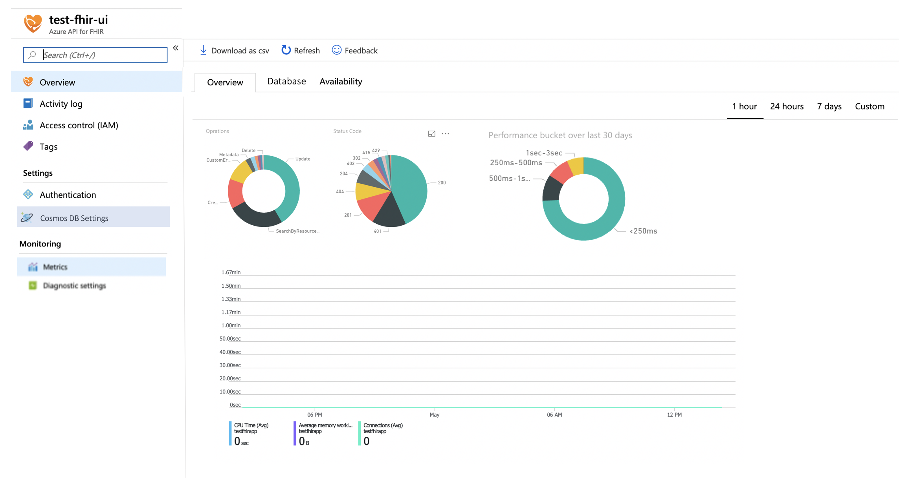

# Metrics and Diagnostic Logs - Shoebox onboarding

For customers to monitor the service, we need to surface different metrics and diagnostic logs. There are two types of logs we want to expose:

* Diagnostics logs: This are various system and security logs and metrics from the service that customer can pipe into their Storage Account, Stream to event hub or send to Log Analytics
* Metrics: This are various performance counters that we can show on Metrics dashboard, where customer can see the performance of the service, size of the database etc (see Scenarios)

[[_TOC_]]

# Business Justification

Access to Metrics and diagnostics logs are core requirement by any customer in order to use any cloud service. This gives customers confidence on how service performs and monitoring of any configuration changes and access to the service. Also as a healthcare service we fall under strict security and compliancy requirements (HIPAA) and need to provide customers insight into performance, availability and security of the service

# Scenarios

* Diagnostics logs:
    + Security Logs (Data plane):
        - CRUD operations on the service (Read, Write, Update, Delete)
		+ Application Logs:
				- Critical, Error, Warning, Information
* Metrics
	+ Overview
		- Show current regions where service is running (world map)
        - Number of API Calls (Total, per second) - (averaged over a minute)
        - Statistic over what operations were performed on FHIR
        - Status Code returned for operations
        - CPU time, Memory working set and number of connections to the service
	+ Database
		- Cosmos DB Average throughput RU/s) - averaged over a minute
        - Cosmos DB Database Size in B 
        - Cosmos DB Index Size in B 
        - Cosmos DB Number of requests exceeded capacity (agregated over 1 minute interval) - Http 429
	+ Availability
        - Availabiliy of the service against defined [SLA](../roadmap/SLA.md#introduction)

# Metrics

N/A

# Design

## Metrics

Metrics will be exposed in Azure portal under Monitoring section, initially showing basic statistics of Azure API for FHIR service and underlying database (Cosmos DB). There will be two tab's showing the metrics of the service

* Overview
* Database
* Availability

## Diagnostics Log

# Test Strategy

*Describe the test strategy.*

# Security

NA

# Other

* Content will need to be localized as per Azure requirements.
