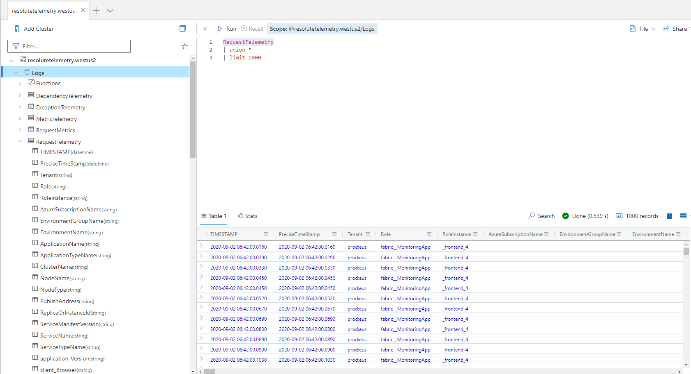

# Azure API for FHIR Account information table - new log table in resolutetelemetry 
Table name: Azure API for FHIR Detail Table


[[_TOC_]]

# Business Justification

As we expand our service, it is critical to analyze the customer usage and feature adoption, as well as to track customer setup when using our product. This table is used to study who and how customers are using our hero product Azure API for FHIR, and how the users are setting up accounts initially. We will persist the data in Kusto logs so that the historical data can be queried.


# Scenarios

Overall, this table contains the following information per account:
* Dimension
	+ Overview
        - Created Time - P1
        - Changed Time - P1
        - Timestamp - P1
        - Account name - P1
        - Primary Region - P1
        - Resource Group - P1
        - Subscription ID - P1
        - FHIR Version - P1
	+ Feature
        - Provisioned throughput(RU/S) (Cosmos DB throughput threshold) - P1
        - Enabled SMART on FHIR Proxy - P1
        - IoT Connectors - P1
        - Enabled BYOK - P1
        - Enabled Private Link - P1
        - Enabled Export - P1


# Metrics

N/A


# Design

Table will be exposed in Kusto and we can further track and query these collections of meta data. It should contain the properties per account listed above, and will be logged in resolutetelemetry table in Kusto. We can load the table to Geneva Logs, and sync the table in Kusto.

* Table in Kusto (similar to RequestTelemetry)




## Data Collection

Based on initial guide, Account name, Primary Region, Resource Group, Subscription ID, FHIR version, Provisioned throughput, SMART on FHIR Proxy, IoT Connectors, BYOK, Managed Identity, Private Link are required. Created Time and Changed Time might be helpful to query. A daily snapshot is required to summarize the active account details. 


#### Add operation
| Dimension (Type) | Availability |
|------------|----------------|
|Created Time (DateTime)|\* (by parsing meta data)|
|Changed Time (DateTime)|\* (by parsing meta data)|
|DocumentTimestamp (DateTime)|\* (by recording the real time timestamp)|
|Account Name (string)|\* (by parsing meta data)|
|Primary Region (string)|\* (by parsing meta data)|
|Resource Group (string)|\* (by parsing meta data)|
|Subscription ID (string)|\* (by parsing meta data)|
|FHIR version (string)|\* (by parsing meta data)|
|Provisioned throughput (int)|&#x2714;|
|SMART on FHIR Proxy (boolean)| &#x2714;|
|IOT Connectors (int)|&#x2714;|
|BYOK (boolean)|&#x2714;|
|Private Link (boolean)|&#x2714;|
|Managed Identity (boolean)|&#x2714;|
|Export (boolean)|&#x2714;|

Sample Account Document:

``` json
    {
      "createdTime": "2020-03-28T23:16:49.1645309Z",
      "changedTime": "2020-05-28T23:16:49.1645309Z",
      "subscriptionId": "890c152b-af19-414c-b56e-b7f21233f6f6",
      "primaryRegion": "westus2",
      "resourceGroupName": "DEMO",
      "fhirVersion": "R4",
      "requestedProperties": {
            "secondaryLocations": null,
            "accessPolicies": [
                {
                    "objectId": "923eb756-e601-41f8-97a1-f550ea16e795"
                }
            ],
            "cosmosDbConfiguration": {
                "offerThroughput": 400,
                "keyVaultKeyUri": "https://mshapis-test-test-kv.vault.azure.net/keys/ByokKeyyixzhanwus2",
                "privateLinkEnabled": true
            },
            "authenticationConfiguration": {
                "authority": "https://login.windows-ppe.net/acad93b0-d7e5-46eb-998f-37564c6efac2",
                "audience": "https://mshapis.com",
                "smartProxyEnabled": false
            },
      "exportConfiguration": {
            "storageAccountName": "test1"
        }
    }
```

    Actions: read.

#### What will this table look like?

* Current plan is to put Provisioned throughput, SMART on FHIR Proxy, IOT Connectors, BYOK, Private Link etc into property bag, and Created Time, Changed Time, TimeStamp, Account name, Primary Region, Resource group, Subscription ID, FHIR version will be dimensions in this table. 

Kusto has defined columns in a table definition. Create Time, TimeStamp, Changed Time, Account name, Resource group, Subscription ID are static dimensions, and properties in property bag can be extended. We potentially have more properties in the future.

#### How will we host this service and collect data?

* Current plan is to add this service in our existing application <code>ResourceProviderWorker.cs</code> and schedule this task. We ingest telemetry information of every active account into Geneva ETW events, and sync the data with Kusto. We can apply a distributed lock <code>CosmosDbDistributedLock.cs</code> and synchronize this process to avoid race condition. We can also apply a highwater mark on global db. The logic is that if worker completes the process, it will add/update watermark in global db. Highwater mark is DateTime type and stored in a document in global DB. We can set up "double-checked locking" mechanism to check if the task has been in process and if the task has completed processing. Each worker will wake up and check highwater mark every hour, and see if the highwater mark is "old" or not. If the highwater mark does not get updated on schedule, some other worker will repeat this process and update highwater mark later (eg. in an hour). Duplicate account information will be handled in SQL server.

        
* Other Consideration
	+ Use other Azure services. eg. Azure batch, Azure functions, Azure Logic Apps.
        + For Azure batch and Azure function, we need to set up management identity and assign VM. It might be heavy-weighted to assign the resources and permission to do this lightweight job. We also need to manually assign permission to access Cosmos DB and storage account, and need storage key to access storage account. For Azure Logic Apps, connections about Cosmos DB and blob storage rely on keys, and those are what deployment agent can query, and it can cooperate with ARM deployment. We might consider to use Azure Logic Apps if we have other scheduling service, and we can migrate  these to Azure Logic Apps.
        + Other Consideration
	+ Create a new application to execute  this task. We can scale it up later if we plan to have more features in this application, and decouple it with other threads in Resource Provider worker application instead of adding more features in RP worker application. However, It would increase complexity of our system by having more applications, and cost more time to implement only this feature in a single application.

#### How will we load the table in Kusto?
* The current plan is to load the table in Geneva logs by emitting ETW event steam, and sync with Kusto. Geneva Logs to Kusto: https://genevamondocs.azurewebsites.net/connectors/Geneva%20to%20Kusto/overview.html  
	+ Pros
        + We have an existing pipeline to flow data from Geneva to Kusto eg. requestMetrics. It is simple to implement and align with the existing pipeline.
* Other Consideration
	+ Directly load the table in Kusto using SDK. https://docs.microsoft.com/en-us/azure/data-explorer/ingest-data-overview Azure Data Explorer provides SDKs to ingest data. It can reduce ingestion cost by minimizing storage transactions by comparing with other options.
	+ Write the data in a file (eg. csv, json) and save it in Azure storage account. Kusto monitoring agent will scan it timely, and persist data into Kusto when Event Tracing for Windows(ETW) logs are emitted. https://docs.microsoft.com/en-us/azure/data-explorer/kusto/management/data-ingestion/ingest-from-storage

#### MVP plan
To make this table deliverable, I am planning to divide and conquer in multiple steps if we go with the current plan.
* Step 1: Make accountTelemetry table in Geneva Logs, ingest basic account information including Account name, Resource group, Subscription ID, FHIR version. Make a property bag to include feature information.
* Step 2: Include properties such as Provisioned throughput, SMART on FHIR Proxy, IOT Connectors, BYOK, Private Link into property bag.
* Step 3: Sync accountTelemetry with Kusto to ensure this accountTelemetry is workable to be used in aka.ms/resolutedashboard.
* Step 4: Add distributed lock and highwater mark to ensure data integrity.


# Test Strategy

* We will use unit tests where appropriate. We can also use integration tests for verifying that metrics are being emitted to our Metrics accounts.

* Manual full E2E test to ensure that Azure API for FHIR Account information table is logged in Kusto is required. A new Kusto logs for ResoluteNonProd is created for test purpose. Reference: https://mshapistest.westus2.kusto.windows.net

* We will manually check persisted account information in accountTelemetry with the unchanged account document in our Global DB to ensure the account information is correct.

# Security

* Properties about Private link, BYOK should follow compliance and shall not expose customer privacy. We can choose to log whether these features are enabled or not to avoid exposing privacy details.
* We shall not create, update or delete customer data in this process. We should only assign read permission to access customer data in global DB.
* Data integrity should be ensured here. By applying a distributed lock and extra logic to check ingested timestamp, if we find any missing information, we can repeat execution of reading global DB and persist the data.
