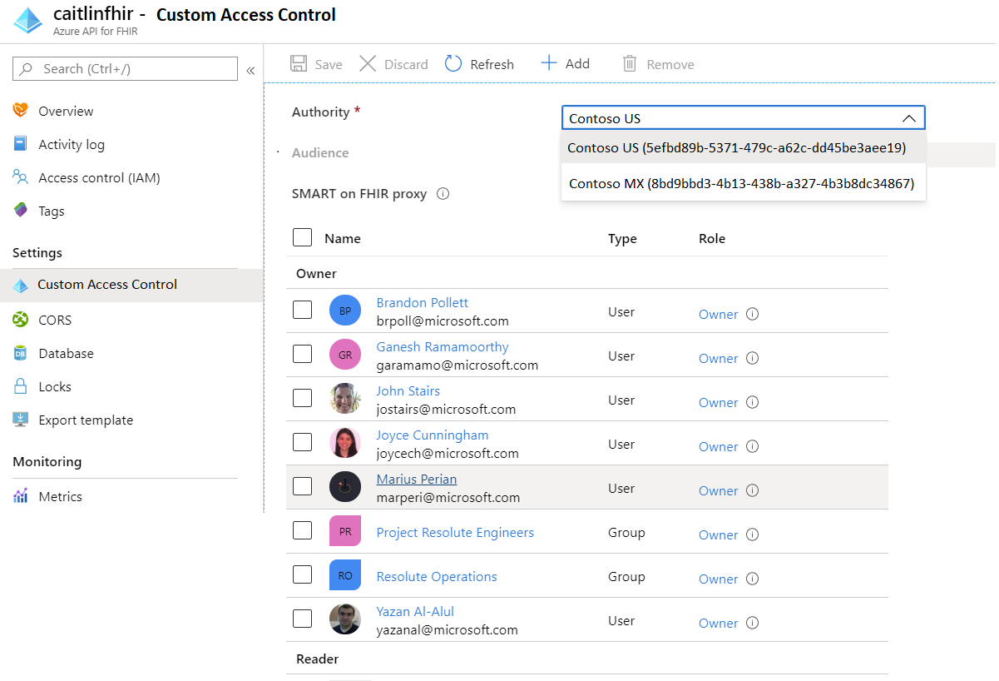
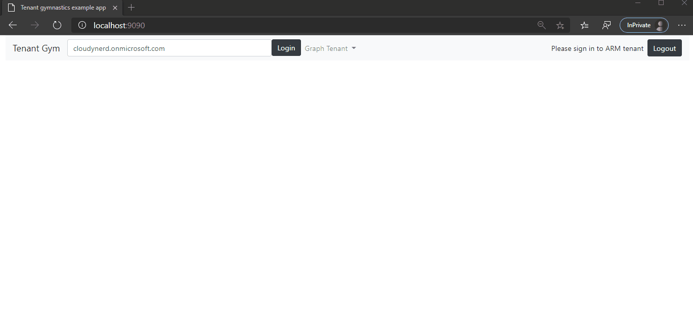
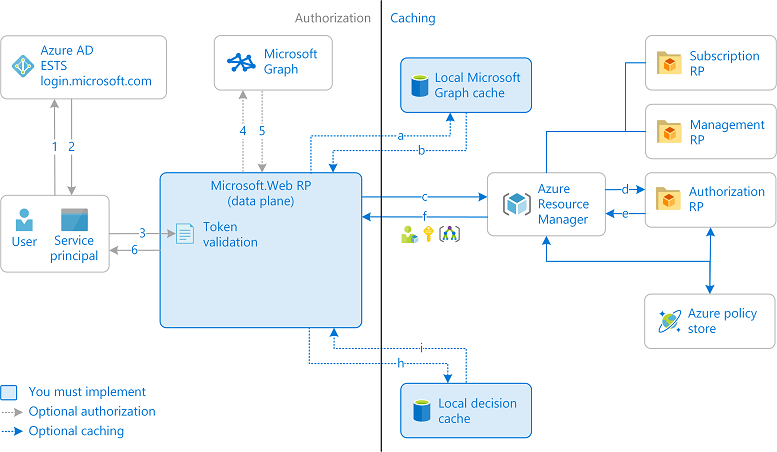
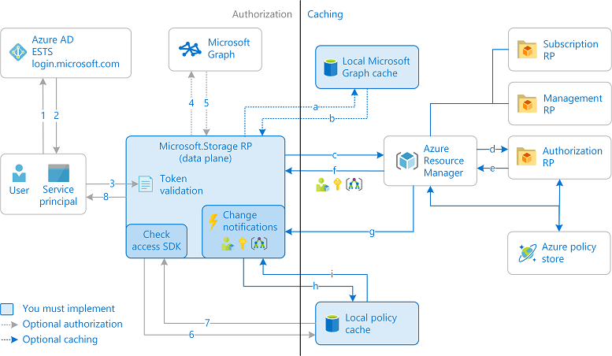
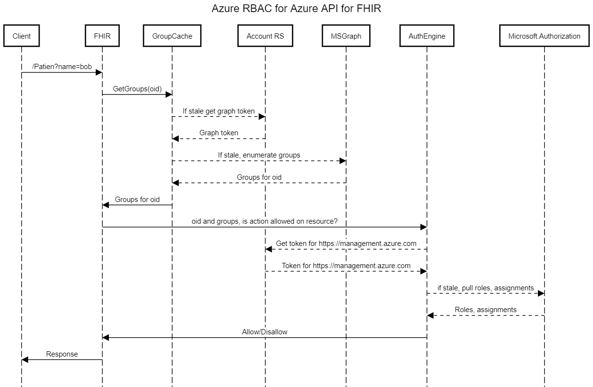

We believe that a flexible and granular access control system will make the Azure API for FHIR far more operationally useful than it is today. Our vision is to build a system that allows administrators to grant users access to a subset of the data in a FHIR server and to control the actions that can be performed on this data, based on their role memberships. We also intend to support scenarios where users themselves can authorize another user to interact with their data.

There will be at least two phases to this this effort. The **first phase** will have the following goals:

- For the PaaS service, support [Azure RBAC](https://docs.microsoft.com/azure/role-based-access-control/overview) for data plane. This is part of the [Azure V1 security benchmarks](https://strikecommunity.azurewebsites.net/articles/4638/azure-cloud-security-benchmark.html) that we need to implement by June 2020. More details can be found [here](https://armwiki.azurewebsites.net/authorization/data-plane.html).
- Continue to support authorization rules for users in an AAD tenant that is not the same as the tenant of the Azure subscription.
- Unify the OSS and PaaS RBAC models.
- Allow an an admin to configure which **principals** are allowed to perform an **action**. In this first phase, these rules will apply to **all resources in the FHIR server**.
- Support role assignments to AAD groups, not just individual principals.
- Every time a request with an access token arrives at the FHIR service, the service will be able to determine if a user/principal has rights to perform the specific action they are trying to perform. The service will inspect the token and based on that make a binary determination of whether or not the action is allowed.
- In OSS, role assignment will continue to be managed with app roles and role definitions will continue to be specified in configuration, with some changes.

We intend to ship phase one before moving on to the **second phase**, where we will extend the model to allow granting access to only a subset of the data in the FHIR server:

- Administrators will be able to define **data slices**, which represent a subset of data in a FHIR server based on a set parameterizable FHIR search queries. In this way, attributes on the FHIR resources themselves can be used to define who can access them. For example, a "patient" data slice might be defined in terms of the Patient compartment (`Patient/<id>/*`).
- Slices can additionally include one or more **data slice filters**, which can restrict access and supported operations at the individual field level in a FHIR resource, or can specify that resources should be rendered de-identified.
- Slices will be represented as child Azure resources of the FHIR service. They will also have their own endpoint URI with a capability statement that represents what resources, actions, operations, and search parameters are supported.
- We will define a mechanism for relating an identity provider claim and a FHIR resource, which will help answer the question "what patient is this AAD user"?

An example data slice (Azure resource) definition might look like this:

``` json
{
    "id": "/subscriptions/cc148bf2-42fb-4913-a3fb-2f284a69eb89/resourceGroups/demo/providers/Microsoft.HealthcareApis/services/fhirdemoaccount/dataSlices/patient",
    "name": "patient",
    "type": "Microsoft.HealthcareApis/services/dataSlices",
    "location": "westus2",
    "tags": {},
    "properties": {
        "segments": [
            "Patient/{currentPrincipalAsPatient().id}/*"
        ],
        "filters": [
            {
                "_comment": "only allow the patient to update their address",
                "onActions": [
                    "write"
                ],
                "remove": [
                    "*.*",
                ],
                "add": [
                    "Patient.address"
                ]
            }
        ]
    }
}
```

This slice's endpoint would be `https://fhirdemoaccount.azurehealthcareapis.com/_slices/patient` and a patient could retrieve their vital sign observations at `https://fhirdemoaccount.azurehealthcareapis.com/_slices/patient/Observation?category=vital-signs`. The capability statement at `https://fhirdemoaccount.azurehealthcareapis.com/_slices/patient/metadata` would exclude resource types that cannot be [part of a patient compartment](https://www.hl7.org/fhir/compartmentdefinition-patient.html).

[[_TOC_]]

# Business Justification

The motivation for implementation of a new RBAC system falls in two categories:

1. We are required to adopt Azure RBAC for the data plane by June 2020. The motivation is to create a consistent experience across Azure services. It is easier for customers to use our service if we align with other Azure services. Currently, there is a consistent experience for the Azure control plane, but services with data planes implement RBAC in many different ways. We will aim to follow the model for AAD authentication for storage since they have integrated Azure RBAC for the data plane.
1. Customers are asking for more granular control mechanisms for the data in the FHIR server.

# Phase One: Access Control at the Server Level

## Scenarios

As an administrator, I should be able to use Azure RBAC (IAM) to assign roles to groups and users. Each role provides a set of allowed actions and a set of disallowed actions.

When a request arrives at the FHIR service, it should be possible from the token to determine if the user/principal is allowed to perform the action they want to on a specific slice of the data.

## Model

The access control model is based on the following Azure RBAC concepts:

- **Actions** refer to specific allowed or disallowed operations that can be performed on a FHIR server's data. Examples include `read`, `create`, and `update`.

- **Role Definitions** (or just "**roles**") are named collections of actions that are allowed be performed (or not allowed to be performed). We will have a number of built-in role definitions and administrators can define custom roles.

- **Role Assignments** grant a role definition to an identity (user, group, or service principal). In Azure, role assignments have a **scope**, which identifies which FHIR service, resource group, subscription, or management group the assignment applies to.

- **Deny assignments**: block users from performing specific actions even if a role assignment grants them access.

### Actions

Our RP will define a set of data plane actions. These are fixed and cannot be created by an administrator. They are:

- `Microsoft.HealthcareApis/services/fhir/resources/read` (includes searching and versioned/history reads)
- `Microsoft.HealthcareApis/services/fhir/resources/create/action`
- `Microsoft.HealthcareApis/services/fhir/resources/update/action`
- `Microsoft.HealthcareApis/services/fhir/resources/write` (includes include `create` and `update`)
- `Microsoft.HealthcareApis/services/fhir/resources/delete`
- `Microsoft.HealthcareApis/services/fhir/resources/hardDelete/action`
- `Microsoft.HealthcareApis/services/fhir/resources/export/action`
- `Microsoft.HealthcareApis/services/fhir/resources/subscribe/action` (subscribing and unsubscribing to FHIR subscriptions)
- `Microsoft.HealthcareApis/services/fhir/resources/flushAccessControlCache/action`
- `Microsoft.HealthcareApis/services/fhir/resources/Resource-validate/action` (taking the id of the FHIR operation [resource](https://www.hl7.org/fhir/operation-resource-validate.html))

Note that there is a specific naming convention here. Actions other than `read`, `write`, and `delete` must take the form `<actionName>/action`. Also note that we are including `fhir/` in the action path to distinguish from future DICOM actions, which may be different. The `resources` segment is to differentiate from future control-plane actions that are scoped to the FHIR service, which would not include the segment.

In OSS, we will use simplified action names like `read`, `create` etc.

Our RP already defines a set of control-plane actions:

- `Microsoft.HealthcareApis/register/action`
- `Microsoft.HealthcareApis/unregister/action`
- `Microsoft.HealthcareApis/services/read`
- `Microsoft.HealthcareApis/services/write`
- `Microsoft.HealthcareApis/services/delete`
- `Microsoft.HealthcareApis/locations/operationresults/read`
- `Microsoft.HealthcareApis/Operations/read`
- `Microsoft.HealthcareApis/checkNameAvailability/read`

We will not introduce `services/fhir` control-plane operations until needed.

### Role Definitions

Administrators can create custom role definitions from our set of actions, but we will also have some built-in ones. Role definitions list data operations (`DataActions`) that are allowed to be performed, such as read, write, and delete. It can also list the operations that can't be performed (`NotDataActions`). Note that if a user is assigned a role that excludes a data operation in `NotDataActions`, and is assigned a second role that grants access to the same data operation, the user is allowed to perform that data operation. `NotDataActions` is not a deny rule – it is simply a convenient way to create a set of allowed data operations when specific data operations need to be excluded.

Examples of built-in roles that we will define include:

``` json
{
  "Name": "FHIR Data Reader",
  "Id": "3426bff5-fd40-4f6a-8755-cdd0b89c7c00",
  "IsCustom": false,
  "Description": "Allows for read access to Azure Healthcare APIs FHIR data resources",
  "Actions": [],
  "NotActions": [],
  "DataActions": [
    "Microsoft.HealthcareApis/services/fhir/resources/read"
  ],
  "NotDataActions": [],
  "AssignableScopes": [
    "/"
  ]
}
```

``` json
{
  "Name": "FHIR Data Writer",
  "Id": "85d17205-c956-47f3-a085-9f631a909dc2",
  "IsCustom": false,
  "Description": "Allows full access to Azure Healthcare APIs FHIR data resources, except for the ability to perform hard delete",
  "Actions": [],
  "NotActions": [],
  "DataActions": [
    "Microsoft.HealthcareApis/services/fhir/resources/*"
  ],
  "NotDataActions": [
      "Microsoft.HealthcareApis/services/fhir/resources/hardDelete/action"
  ],
  "AssignableScopes": [
    "/"
  ]
}
```

``` json
{
  "Name": "FHIR Data Contributor",
  "Id": "fde0b00d-b549-4234-9095-3f6bcc6b3473",
  "IsCustom": false,
  "Description": "Allows full access to Azure Healthcare APIs FHIR data resources",
  "Actions": [],
  "NotActions": [],
  "DataActions": [
    "Microsoft.HealthcareApis/services/fhir/resources/*"
  ],
  "NotDataActions": [],
  "AssignableScopes": [
    "/"
  ]
}
```

``` json
{
  "Name": "FHIR Data Owner",
  "Id": "fde0b00d-b549-4234-9095-3f6bcc6b3473",
  "IsCustom": false,
  "Description": "Allows full access to Azure Healthcare APIs FHIR data resources and role assignments",
  "Actions": [
      "Microsoft.Authorization/roleAssignments/write",
      "Microsoft.Authorization/roleAssignments/delete"
  ],
  "NotActions": [],
  "DataActions": [
    "Microsoft.HealthcareApis/services/fhir/resources/*"
  ],
  "NotDataActions": [],
  "AssignableScopes": [
    "/"
  ]
}
```

### Role Assignments

We don't need to do anything special to support role assignments. They are performed with the Microsoft.Authorization RP, for example using the `New-AzRoleAssignment` cmdlet. Here is an example of a role assignment:

``` json
{
    "id": "/subscriptions/17af5f40-c564-4afe-ada0-fe7193bd474a/resourceGroups/jsfhir/providers/Microsoft.HealthcareApis/services/myFhirService/providers/Microsoft.Authorization/roleAssignments/54d3f62d-49d5-47f5-ace6-174585e30097",
    "type": "Microsoft.Authorization/roleAssignments",
    "name": "54d3f62d-49d5-47f5-ace6-174585e30097",
    "properties": {
        "roleDefinitionId": "/subscriptions/17af5f40-c564-4afe-ada0-fe7193bd474a/providers/Microsoft.Authorization/roleDefinitions/c6a89b2d-59bc-44d0-9896-0f6e12d7b80a",
        "principalId": "537c4e63-427e-4d05-a4fd-d69fcd967ee7",
        "principalType": "User",
        "scope": "/subscriptions/17af5f40-c564-4afe-ada0-fe7193bd474a/resourceGroups/jsfhir/providers/Microsoft.HealthcareApis/services/myFhirService"
    }
}
```

## Existing Access Control Model ("Local Role Assignments")

The managed service has an existing access control model. It allows specifying the AAD tenant and a list of AAD user or service principal object IDs that have full access to the system:

``` json
{
    "id": "/subscriptions/17af5f40-c564-4afe-ada0-fe7193bd474a/resourceGroups/jackliu/providers/Microsoft.HealthcareApis/services/pe-test",
    "name": "pe-test",
    "type": "Microsoft.HealthcareApis/services",
    "location": "westus2",
    "kind": "fhir",
    "properties": {
        "accessPolicies": [
            {
                "objectId": "6d61c861-1343-413f-a877-bd87108783a8"
            }
        ],
        "authenticationConfiguration": {
            "authority": "https://login.microsoftonline.com/72f988bf-86f1-41af-91ab-2d7cd011db47",
            "audience": "https://azurehealthcareapis.com",
            "smartProxyEnabled": false
        }
    }
}
```

We need to preserve this capability for two reasons: (1) existing accounts will not have migrated to the new Azure RBAC model and (2) the Azure RBAC model only supports principals in in the subscription's tenant.

We will extend the existing model, which we will call **"local role assignments"** in a backwards-compatible fashion. We will add a `roleDefinitionId` field to the `accessPolicy` object, which will be the GUID ID of a role definition in the account's subscription (either built-in or custom). For backwards compatibility (and simplicity), the absence of this property will imply that all actions are allowed.

The portal blade will need an upgrade as part of this work, looking something like this:



Note that the portal UI will need to be able to render names of users in the configured tenant, which is not currently supported out of the box. In order to support this, the portal will need to get a Microsoft Graph (or AAD graph) token for a different tenant than the user has selected. To illustrate that this is possible, this spec includes a sample [tenant gymnastics](examples/TenantGym) application:



This application signs the user in to a given tenant and gets a token from that tenant for ARM (`aud: https://management.azure.com`), it uses this token to enumerate other tenants that a user has access to, i.e. tenants that the current signed-in user (same credentials) is a user or guest user in. The tenant enumeration is done with `GET https://management.azure.com/tenants?api-version=2019-11-01`. In the example app, the user can then browse tenant information for another tenant (for example, list users).

> There are a number of "failure" modes where we would be unable to query the other tenant.  If the FHIR server is already configured with a tenant where the signed in user is not a (guest) user, if getting a graph token requires admin consent in that tenant, or if the user does not have rights to read directory information. In those cases, we would grey out editing options in the portal and put a banner on saying that they need to use ARM to change the settings.

Since the capability statement of a FHIR service can only surface one authority, we do not not want to support multiple authorities on a FHIR server resource. We will support data slices having a different authority in [phase two](#Phase-Two:-Access-Control-on-Data-Slices). Note that for IoMT, we may need to support an additional authority in PaaS, however, this capability will not be exposed to customers.

The value of the `authority` property and whether it corresponds to the AAD tenant tied to the subscription determines the kind of UI that we render in the portal and the runtime access checks we perform, as summarized in the table below:

| Authorities match | Local Role Assignments | Portal View                                                                                                              | Runtime Checks                                |
|-------------------|------------------------|--------------------------------------------------------------------------------------------------------------------------|-----------------------------------------------|
| Yes               | None                   | Role assignments grid not rendered                                                                                       | Only Azure RBAC                               |
| Yes               | Some                   | Role assignments grid rendered<br>Banner recommending migration to Azure RBAC<br>Link to CloudShell to perform migration | Both Azure RBAC and local<br>role assignments |
| No                | None or some           | Role assignments grid rendered                                                                                           | Only local role assignments                   |

Therefore at runtime, we will need to be able to check access against either Azure RBAC or local role assignments. For the latter, we need to ensure that we respect the same semantics as Azure RBAC's CheckAccess API (respecting hierarchy, wildcards, etc.). Ideally we would use the internal `Microsoft.IdentityModel.Authorization.Azure` SDK to perform this check, feeding in role definitions that we query from Azure RBAC. At the time of writing, however, this SDK does not support .NET Core or Standard.

We will also support role assignments to groups instead of only individual principals. The Microsoft.Authorization RP can take care of group membership queries for us, but we will need to determine memberships ourselves for local role assignments. The RP will need to validate that our first party app can access the tenant when creating or updating a FHIR server. When we do not have access, we will output a warning error telling the user to run `az ad sp create --id <appid>` or similar and until they do, we will not we able to perform any group membership lookups.

Finally, we will need to enforce RBAC on role assignments themselves. We will check for `Microsoft.Authorization/roleAssignments/write` and `Microsoft.Authorization/roleAssignments/delete` when modifying the `accessPolicies` property in a FHIR resource, and `Microsoft.Authorization/roleAssignments/read` when reading the resource. (What should we do when the user does not have read access?).

Supporting an authority that is not AAD is currently out of scope.

## OSS

The model in OSS is largely the same with a couple of differences.

We will use AAD app roles assignments, which come as claim in the JWT. We will then have a manifest that associates each **app role** with a set of **actions** and **notActions** and a set of **scopes** (in phase one, the only supported scope is `/`, but slices will be supported in phase two).

As an example, suppose we have an AAD app for the FHIR service with a "nurse" app role.

``` http
GET https://graph.microsoft.com/beta/servicePrincipals/e89c25ef-69a9-4aef-a32b-d5791d82a07f?$select=appRoles
```

``` json
{
    "@odata.context": "https://graph.microsoft.com/beta/$metadata#servicePrincipals(appRoles)/$entity",
    "appRoles": [
        {
            "allowedMemberTypes": [
                "User",
                "Application"
            ],
            "description": "nurse",
            "displayName": "nurse",
            "id": "d0f518b4-abdc-470b-a8ce-7e225940e295",
            "isEnabled": true,
            "origin": "Application",
            "value": "nurse"
        }
    ]
}
```

Someone is also assigned to that role:

``` http
GET https://graph.microsoft.com/beta/servicePrincipals/e89c25ef-69a9-4aef-a32b-d5791d82a07f/appRoleAssignedTo
```

``` json
{
    "@odata.context": "https://graph.microsoft.com/beta/$metadata#appRoleAssignments",
    "value": [
        {
            "id": "Y058U35CBU2k_dafzZZ-53bVLOl9tNpLsJn1_hjk4_0",
            "creationTimestamp": "2020-02-06T00:39:50.2930414Z",
            "appRoleId": "d0f518b4-abdc-470b-a8ce-7e225940e295",
            "principalDisplayName": "John Stairs",
            "principalId": "537c4e63-427e-4d05-a4fd-d69fcd967ee7",
            "principalType": "User",
            "resourceDisplayName": "jostairsfhir",
            "resourceId": "e89c25ef-69a9-4aef-a32b-d5791d82a07f"
        }
    ]
}
```

A JWT issued for that user for the FHIR service will contain the `roles` claim:

``` json
"roles": [
  "nurse"
],
```

The FHIR server can easily see that the user is part of the "nurse" app role, but what does that mean? That would be defined in the configuration manifest:

``` json
{
  "roles": [
    {
      "name" = "nurse", // corresponds to the app role name
      "actions" = [ "*" ],
      "notActions" = [ "hardDelete" ],
      "scopes" = [ "/" ] // "/" is required and the only supported value until we support slices
    }
  ]
}
```

This manifest states that the "nurse" role can do everything except hard delete across the entire FHIR server.

## Design

This design follows the ARM team's guidance. Some important documents for reference are:

1. [Motivation for Azure RBAC on data plane](https://armwiki.azurewebsites.net/authorization/data-plane.html).
1. [How to enforce compliant RBAC](https://armwiki.azurewebsites.net/authorization/rbac.html).

In those pages there are links to guidance and patterns for how to implement Azure RBAC for data plane.

At a high level, there are two ways to implement this:

1. Remote CheckAccess API that allows a service or RP to check against an API whether a given user (with an enumerated set of groups) has rights to perform a specific action on a specific scope. This is the recommended (lowest bar) path, but it will require careful consideration on caching.
1. Local CheckAccess SDK. With the SDK, the service (or RP) will be responsible not only for enumeration a users/principals groups but also for pulling down all known roles and assignments and performing the checks locally. There is more work in caching and maintaining these artifacts, but it may be required to go with this approach to get the desired performance.

As a first pass on the implementation, however, we can go with the remote CheckAccess API.

### Resource provider changes

The resource provider needs to publish the allowed data plane actions. It would be done somewhere in the [code where we enumerate the control plane operations](https://microsofthealth.visualstudio.com/Health/_git/health-paas?path=%2Fsrc%2FResourceProviderApplication%2FARMResourceProvider.Service%2FHandlers%2FServiceTypeHandler.cs), but the data plane actions need to be labeled as data plane actions. To see data plane actions for a specific RP, you can do something like:

```PowerShell
Get-AzProviderOperation Microsoft.Storage/storageAccounts/* | ? IsDataAction -eq  $true
```

The RP will also need to perform local role assignment validation (i.e. validation of role assignments on the resource itself, outside of the Azure RBAC system), which will consist of validating that the object IDs after ensuring that our first-party app can access the specified tenant (and otherwise issuing a warning).

To improve runtime performance, the RP will resolve the type of each object ID, so that the FHIR server knows which ones represent groups.

### Built-in roles

To enable users to get up and running quickly with the RBAC system, we should define some built in roles ("FHIR Data Administrator", "FHIR Data Reader", etc.). These will be some combinations of the actions that we permit, see [Details on onboarding built-in roles](https://armwiki.azurewebsites.net/authorization/OnboardingRBACRoles.html).

### Local role assignment decision engine

Local role assignments will be passed into the FHIR server via configuration. The assignments will reference role definitions that we will retrieve from Azure RBAC for the current subscription. We will need to refresh custom role definitions periodically as they can change.

If any roles are assigned to groups, we will need to verify, for each request, which of those groups the user is part of. We can use the checkMemberGroups Graph call for this:

``` http
POST https://graph.microsoft.com/v1.0/directoryObjects/{oid}/checkMemberGroups
Content-type: application/json

{
  "groupIds": [
        "fee2c45b-915a-4a64b130f4eb9e75525e",
        "4fe90ae065a-478b9400e0a0e1cbd540"
  ]
}
```

### Azure RBAC using CheckAccess API (remote decision engine)

See [instructions for remote CheckAccess API](https://microsoft.sharepoint.com/:w:/r/teams/aad/authz/_layouts/15/Doc.aspx?sourcedoc=%7B46C00883-2616-4BED-8A0E-8FBA949E6E63%7D&file=CheckAccess%20API%20Design.docx&action=default&mobileredirect=true)

When using the remote CheckAccess decision engine, much of the orchestration is handled for us, but we should expect latency. The current stats are 95th percentile: 3s, but they target 50th percentile 10ms and 95th 1s, so improvements are expected. Nevertheless, caching is critical.

The ARM wiki uses the following figure to illustrate the remote check decision engine flow.



This diagram suggests that our service should enumerate the groups for an incoming user/principal (and cache the response) before sending a request to the CheckAccess API. This is actually not required, we can ask the CheckAccess API to perform that using the `xms-pasrp-retrievegroupmemberships` property of the `SubjectInfo` object. We could also optionally decide to include that property or do the enumeration of groups in the service based on what we see in the token. This would be an optimization.

The diagram also shows the data plane requests going through the RP, however, our flow would look more like:

[](https://mermaid-js.github.io/mermaid-live-editor/#/edit/eyJjb2RlIjoic2VxdWVuY2VEaWFncmFtXG5cdENsaWVudC0-PitSZXF1ZXN0SGFuZGxlcjogL1BhdGllbnQ_bmFtZT1Cb2JcbiAgICBSZXF1ZXN0SGFuZGxlci0-PitBdXRoU2VydmljZTogQ2hlY2tBY2Nlc3MocmVhZClcbiAgICBBdXRoU2VydmljZS0-PkF1dGhTZXJ2aWNlOiBDaGVja0NhY2hlKG9pZCwgcmVhZClcbiAgICBBdXRoU2VydmljZS0-PitBQUQ6IEdldFRva2VuXG4gICAgQUFELS0-Pi1BdXRoU2VydmljZTogVG9rZW5cbiAgICBBdXRoU2VydmljZS0-PkF1dGhTZXJ2aWNlOiBjYWNoZSB0b2tlblxuICAgIEF1dGhTZXJ2aWNlLT4-K01pY3Jvc29mdC5BdXRob3JpemF0aW9uOiBDaGVja0FjY2VzcyhvaWQsIHJlYWQpXG4gICAgTWljcm9zb2Z0LkF1dGhvcml6YXRpb24tLT4-LUF1dGhTZXJ2aWNlOiBkZWNpc2lvbihhbGxvd2VkKVxuICAgIEF1dGhTZXJ2aWNlLT4-QXV0aFNlcnZpY2U6IENhY2hlRGVjaXNpb24ob2lkLCByZWFkKVxuICAgIEF1dGhTZXJ2aWNlLS0-Pi1SZXF1ZXN0SGFuZGxlcjogZGVjaXNpb24oYWxsb3dlZClcbiAgICBSZXF1ZXN0SGFuZGxlci0-PitEYXRhU3RvcmU6IEV4ZWN1dGUgU2VhcmNoXG4gICAgRGF0YVN0b3JlLS0-Pi1SZXF1ZXN0SGFuZGxlcjogc2VhcmNoIHJlc3VsdHNcbiAgICBSZXF1ZXN0SGFuZGxlci0tPj4tQ2xpZW50OiBzZWFyY2ggcmVzdWx0c1xuICAgIFxuXHRcdFx0XHRcdCIsIm1lcm1haWQiOnsidGhlbWUiOiJkZWZhdWx0In0sInVwZGF0ZUVkaXRvciI6ZmFsc2V9)

To make the flow of getting an access decision from the remote check access API a bit more practical, we have written a [console app](CheckAccessApiDemo/) which submits an access decision request to the API. To use this test application, you can issue a command like:

```console
dotnet run --client-id xxxxxxxx-xxxx-xxxx-xxxx-xxxxxxxxxxxx --client-secret "XXXXX" --tenant cloudynerd.onmicrosoft.com --oid xxxxxxxx-xxxx-xxxx-xxxx-xxxxxxxxxxxx --resource "/subscriptions/xxxxxxxx-xxxx-xxxx-xxxx-xxxxxxxxxxxx/resourceGroups/mygroup/providers/Microsoft.Storage/storageAccounts/mystorage" --action "Microsoft.Storage/storageAccounts/blobServices/containers/blobs/read"
```

### Cache storage and optimizations

There are multiple caches involved in these designs. For a FHIR service with thousands of simultaneous users, it is possible that in-memory caching will be impractical and we will have to introduce something like a Redis cache. However, initially, in-memory caching should be sufficient and we can add external caching as a later optimization. We can also set a limit on the number of entries cached and kick out the the oldest ones if the cache starts getting too big.

Another performance optimization could be to proactively refresh (in the background) cache entries that have been frequently used before they actually expire. That way the latency for refreshing could be hidden in the background. Again, this could be an optimization if needed.

### Cache invalidation endpoint

We will pick a reasonable, practical default cache expiration time, e.g. 5 minutes, but it is possible, that we will need a cache-invalidation endpoint on the FHIR server to allow an administrator to flush the caches in the event that a user needs their privileges revoked immediately. Since we will be relying on refreshing caches periodically, it may be necessary for administrator to force a refresh to remove any cached privileges. It could also become necessary for an administrator to flush the cache when granting access, if a care provider needs urgent access to data. Finally, we should also invalidate the cache when slice definitions are updated to ensure that any cached behavior due to filtering is flushed.

To perform a flush, the principal will need `Microsoft.HealthcareApis/services/fhir/resources/flushAccessControlCache/action` permission. We will not ever cache whether a principal has that permission.

## Test Strategy

The exact detailed test strategy is TBD, but will involve basic unit and integration testing of the Authentication engine components and end-to-end tests for both OSS and PaaS service.

Also critically important will be performance testing with and without RBAC system enabled.

# Phase Two: Access Control on Data Slices

Once phase one has shipped, we will extend the RBAC capabilities to allow administrators to scope role assignments to a subset of the data in a FHIR server. For example, a patient would be able to see their data, but not all data in the FHIR server. Furthermore, they may only be able to update their address — all other data is read-only to them.

A second example would be a researcher having read-only access to a de-identified subset of data. Search parameters that cover redacted fields would not be available. De-identification itself is outside of the the scope of this spec; here we focus on how it is part of the RBAC model.

## Data Slice Model

Data slices will be child Azure resources of the FHIR service resource. The Azure resource definition would look something like this:

``` json
{
  "id": "/subscriptions/cc148bf2-42fb-4913-a3fb-2f284a69eb89/resourceGroups/demo/providers/Microsoft.HealthcareApis/services/fhirdemoaccount/dataSlices/patient",
  "name": "patient",
  "type": "Microsoft.HealthcareApis/services/dataSlices",
  "location": "westus2",
  "tags": {},
  "properties": {
    "variables": {
      "patientId": "{currentPrincipalAsPatient().id}"
    },
    "segments":[
      "/Patient/{patientId}",
      "/Observation?subject={patientId}",
      "/Encounter?patient={patientId}",
      "/AllergyIntolerance?patient={patientId}"
    ],
    "filters": [
      {
        "_comment": "only allow the patient to update their address",
        "onActions": [
          "write"
        ],
        "remove": [
          "*.*",
        ],
        "add": [
          "Patient.contact"
        ]
      }
    ]
  }
}
```

The OSS version of this slice definition would be somewhat simplified (the `properties` object is promoted and all top-level properties except `name` are discarded):

``` json
{
  "name": "patient",
  "variables": {
    "patientId": "{currentPrincipalAsPatient().id}"
  },
  "segments":[
    "/Patient/{patientId}",
    "/Observation?subject={patientId}",
    "/Encounter?patient={patientId}",
    "/AllergyIntolerance?patient={patientId}"
  ],
  "filters": [
    {
      "_comment": "only allow the patient to update their address",
      "onActions": [
        "write"
      ],
      "remove": [
        "*.*",
      ],
      "add": [
        "Patient.contact"
      ]
    }
  ]
}
```

We will use the OSS definition in the rest of this document.

## Associating Claims and FHIR Resources

The first thing we need to be able to do is associate an AAD user or service principal with a resource in the FHIR server (a `Patient`, `Practitioner`, `RelatedPerson`, or `Device`). There are numerous ways this could be done, and organizations may want to have their own way of doing it. We will initially support security tags with the system `https://microsoft.com/fhir/oid` on resources to specify the object id of the user.

For example, the `Patient` resource for AAD user "4c816baf-f0be-44a2-82bb-551b92950bad" might look like this:

```json
{
    "resourceType": "Patient",
    "id": "47c19230-72bb-41c0-ab34-68067d937d15",
    "meta": {
        "security": [
            {
                "system": "https://microsoft.com/fhir/oid",
                "code": "4c816baf-f0be-44a2-82bb-551b92950bad",
            }
        ],
        "versionId": "5d2bf130-1775-4822-aa26-2cfc6659a577",
        "lastUpdated": "2019-11-24T17:52:38.075+00:00"
    }
}
```

The following search query will let you find the `Patient` resource that corresponds to this object id:

```http
GET /Patient?_security=https://microsoft.com/fhir/oid|4c816baf-f0be-44a2-82bb-551b92950bad
```

To determine the object id, the FHIR service needs to look at the `oid` claim in AAD. In other identity providers, this could be a different claim.

Because the implementation of this mechanism could be configurable in the future, it will be abstracted away by a set of [functions](#functions), so that slice definitions do not need to know how the association is managed.

### Slice Definition Language

The following is an extremely brief and incomplete overview of the language elements used to specify slices.

A slice is defined as the union of a set of **segments**. Slice segments and **variables** are expressed in a language that is a combination of **FHIR search** and a subset of [**FHIRPath**](http://hl7.org/fhirpath/). Fhir search queries are parameterized with FHIRPath expressions, which can reference variables, call functions, and navigate properties on a FHIR resource. These FHIRPath expressions are enclosed in curly braces.

For example, `/Patient?_id={patientId}` is a search query where the patient id parameter is the result of the `patientId` variable (which may have many values). Note that the curly braces do not imply string interpolation like they do in C# strings. It is therefore not possible to specify arbitrary string concatenations, like `Pat{'ient'}?_id=abc'` with this mechanism. Instead, the expression `/Patient?_id={patientId}` is parsed as a search expression where the `_id` parameter's value is not a constant (which it always is in a normal search query) but an expression that itself needs to be evaluated.

FHIRPath and FHIR search always yield collections, and therefore variables and segments are always collections of a certain type. All search expressions yield a set of resources, and all FHIRPath expressions yield a set of resources, strings, references, or other types.

#### Functions

We will define a number of custom FHIRPath functions:

- `claim(id)`: returns a collection of claim values with the given claim id. Note that any claim mapping will already have been applied.
- `ref(element)` returns a reference to a resource in the form `ResourceType/<id>`
- `currentPrincipalAsPatient()`: returns a collection of `Patient` resources have have a security tag with system `https://microsoft.com/fhir/oid` and code that matches the value of the `oid` claim.
- `currentPrincipalAsPractitioner()`: returns a collection of `Practitioner` resources have have a security tag with system `https://microsoft.com/fhir/oid` and code that matches the value of the `oid` claim.
- `currentPrincipalAsRelatedPerson()`: returns a collection of `RelatedPerson` resources have have a security tag with system `https://microsoft.com/fhir/oid` and code that matches the value of the `oid` claim.
- `currentPrincipalAsRelatedDevice()`: returns a collection of `Device` resources have have a security tag with system `https://microsoft.com/fhir/oid` and code that matches the value of the `oid` claim.

#### Evaluation Model

Take the given slice as a simple example:

``` json
{
  "name": "relatedPerson",
  "variables": {
    "relatedPersonId": "{currentPrincipalAsRelatedPerson().id}"
  },
  "segments":[
    "RelatedPerson/{relatedPersonId}/*"
  ]
}
```

The `relatedPersonId` variable can have multiple values (a person will have a `RelatedPerson` resource for each person that they are related to). Therefore this data slice is the union of the compartment of each `RelatedPerson` resource. Logically, the evaluation model would be something like:

``` C#
var slice = currentPrincipalAsRelatedPerson().Select(p => $"RelatedPerson/{p.id}/*")).Select(ParseSearchExpression).Union();
var finalExpression = slice.Intersect(queryFromUri);
```

Of course, we have opportunities to optimize the evaluation to a single SQL statement and/or cache function results (`currentPrincipalAsPatient()` is likely not going to change very frequently).

### Filters

Filters apply restrictions to resources at a field level. The example below removes removes write access to all fields on all resources, but then adds back in the ability to change Patient.address.

``` json
{
    "onActions": [
        "write"
    ],
    "remove": [
        "*.*",
    ],
    "add": [
        "Patient.address"
    ]
}
```

This would block all writes except for `PATCH` on `Patient.address` or `PUT` on Patient where only `address` changes (we would need to compare against the existing version).

Preventing read and write on security tags could be accomplished with a filter like this one:

``` json
{
    "onActions": [
        "read",
        "write"
    ],
    "remove": [
        "*.meta.security",
    ]
}
```

This would prevent `meta.security` being read on any resource and would block anything but `PATCH`, and not on `meta.security`.

It will also be possible to specify that resources should be rendered de-identified:

``` json
{
    "_comment": "only allow the patient to update their address",
    "onActions": [
        "read"
    ],
    "deIdentity": "true"
}
```

This will also block search parameters that touch redacted fields and remove them from the capability statement.

### Writes

When a user performs a write, we need to make sure the resource falls within the slice. If it does not, we would return a `401 Unauthorized` HTTP response code. To do this, we will need to evaluate the slice definition against the incoming resource.

### Parameterized Slices

> TBD whether this is useful.

### FHIR Subscriptions

[FHIR subscriptions](https://build.fhir.org/subscription.html) (not to be confused with Azure subscriptions) will need special handling to enforce RBAC. In addition to checking that the principal has permission to perform the `subscribe` action, the slice where the principal subscribes needs to be taken into account when evaluating whether to send a notification.

So

```http
POST /Subscription
```

is not the same as performing

```http
POST /_slice/patient/Subscription
```

In the latter, the scope of the subscription is filtered according to the slice definition, in addition to any filters defined on the subscription itself, meaning that any resource outside of the slice would not result in a notification.

When registering a new subscription, the server will need to capture the slice as well as any claims necessary for evaluating RBAC rules against a candidate resource when determining whether to send a notification.

When evaluating whether to raise a notification, the principal must still have read access to the slice and the resource must be part of the slice's current definition.

## Examples

1. As a **patient**, I have access to my own patient compartment, but not all of the compartment; only Patient (read and write on contact details), Encounter (read), Observation (read), AllergyIntolerance (read)

    Slice:

    ``` json
    {
      "name": "patient",
      "variables": {
        "patientRef": "{ref(currentPrincipalAsPatient())}"
      },
      "segments":[
        "/{patientRef}",
        "/Observation?subject={patientRef}",
        "/Encounter?patient={patientRef}",
        "/AllergyIntolerance?patient={patientRef}"
      ],
      "filters": [
        {
          "_comment": "only allow the patient to update their address",
          "onActions": [
            "write"
          ],
          "remove": [
            "*.*",
          ],
          "add": [
            "Patient.contact"
          ]
        }
      ]
    }

    ```

    Actions: `read`, `write`

    Discussion:

    Suppose a user performs a query for vital signs observations:

    ```http
    GET /_slice/patient/Observation?category=vital-signs
    ```

    Logically, the server would first determine the patient ID:

    ```http
    GET /Patient?_security=http://microsoft.com/fhir/oid|4c816baf-f0be-44a2-82bb-551b92950bad
    ```

    And then perform a query scoped to that patient ID:

    ```http
    GET /Observation?category=vital-signs&subject=Patient/30249075-8582-4d1d-9508-f3e7c9bb0a03
    ```

    Of course, the server may choose to perform a join instead of two queries, or may choose to cache the result of the first query (determining the patient ID).

1. As a **local data administrator**, I have read/write access to data from my facility

    Slice:

    ``` json
    {
      "name": "localDataAdmin",
      "segments": [
        "?_security=facility|{claim('facility')}"
      ]
    }
    ```

    Actions: `*`

1. As a **parent/patient**, I have access to my own patient compartment and my dependents' (children's) compartments

      Slice:

      ``` json
      {
        "name": "parent",
        "variables": {
          "patientId": "{currentPrincipalAsPatient().id}",
          "relatedPerson": "RelatedPerson?_id={currentPrincipalAsRelatedPerson().id}&relationship=PRN",
          "child": "Patient?_id={relatedPerson.patient.id}"
        },
        "segments": [
          "Patient/{patientId}/*",
          "Patient/{child.id}/*"
        ]
      }
      ```

      Actions: `read`

1. As a **nurse**, I have access to the record of all the patients in my care (defined as member of their CareTeam either directly or organizationally). But I only have access to Patient, Observation, and AllergyIntolerance

    Slice:

    ``` json
    {
      "name": "nurse",
      "variables": {
        "practitioner": "{currentPrincipalAsPractitioner()}",
        "directCareTeam": "/CareTeam?participant={ref(practitioner)}}",
        "indirectCareTeam": "/CareTeam?participant:Organization._has:PractitionerRole:organization:practitioner={ref(practitioner)}",
        "combinedCareTeam": "{directCareTeam | indirectCareTeam}"
      },
      "segments": [
        "Practitioner/{practitionerId}",
        "Patient?_id={combinedCareTeam.patient.id}",
        "Observation?subject={ref(combinedCareTeam.patient)}",
        "AllergyIntolerance?patient={ref(combinedCareTeam.patient)}"
      ]
    }
    ```

    Actions: `read`, `write`, `delete`

## Data Slice Design

### RP Changes

TODO

#### DataSlice resource type

TODO

##### Validation

TODO

### FHIR Server Changes

#### Slice routes

TODO

#### Capability statements

TODO

#### Multiple Authorities

TODO

#### Smart on FHIR Proxy

TODO

#### Cosmos DB vs SQL

TODO

#### Expression evaluator

TODO

# Security

This is, obviously, all security related and multiple security reviews and reviews with the Azure RBAC team will be needed.

# Implementation - Phase One

[![](https://mermaid.ink/img/eyJjb2RlIjoiZ3JhcGggVERcblxuT1NTOjo6RG9uZVxuQ2FjaGluZzo6OkluUHJvZ3Jlc3MtLT5GaGlyQXpSQkFDXG5DYWNoaW5nLS0-RmhpckxvY2FsUm9sZVJCQUNcbkxvY2FsUGFhU0RldltMb2NhbCBQYWFTIERldmVsb3BtZW50XTo6OkluUHJvZ3Jlc3MtLT5PU1NcbkZoaXJBelJCQUNbRkhJUiBBenVyZSBSQkFDXTo6OkluUHJvZ3Jlc3MtLT5PU1NcbkZoaXJMb2NhbFJvbGVSQkFDW0ZISVIgTG9jYWwgUm9sZSBBc3NpZ25tZW50IFJCQUNdOjo6SW5Qcm9ncmVzcy0tPk9TU1xuRmhpckxvY2FsUm9sZVJCQUMtLT5GYXN0Q29uZmlnQ2hhbmdlc1xuUlAtLT5QdWJsaXNoXG5Qb3J0YWwtLT5SUFxuQ2xpW0NsaS9Qcz9dLS0-UlBcblB1Ymxpc2hbUHVibGlzaDogYXBwLCBhY3Rpb25zLCByb2xlc106OjpJblByb2dyZXNzXG5GYXN0Q29uZmlnQ2hhbmdlc1tGYXN0ZXIgQ29uZmlnIENoYW5nZXNdXG5HdWlkQ2hlY2tTY3JpcHRbR1VJRCBDaGVjayBzY3JpcHRdLS0-UlBcbkVuZm9yY2VHdWlkc1tUdXJuIG9uIEdVSUQgZW5mb3JjZW1lbnRdLS0-R3VpZENoZWNrU2NyaXB0XG5GbHVzaENhY2hlRW5kcG9pbnRbRmx1c2ggQ2FjaGUgRW5kcG9pbnRdLS0-Q2FjaGluZ1xuVXBkYXRlTWFuaWZlc3RbVXBkYXRlIFJQIE1hbmlmZXN0XS0tPkVuZm9yY2VHdWlkc1xuVXBkYXRlTWFuaWZlc3QtLT5Qb3J0YWxcblVwZGF0ZU1hbmlmZXN0LS0-Rmx1c2hDYWNoZUVuZHBvaW50XG5cbnN1YmdyYXBoIExlZ2VuZFxuICAgIE5vdFN0YXJ0ZWRbTm90IFN0YXJ0ZWRdLS0-SW5Qcm9ncmVzc1tJbiBQcm9ncmVzc106OjpJblByb2dyZXNzLS0-RG9uZTo6OkRvbmVcbmVuZFxuXG5jbGFzc0RlZiBJblByb2dyZXNzIGZpbGw6Z3JlZW55ZWxsb3c7XG5jbGFzc0RlZiBEb25lIGZpbGw6ZGVlcHNreWJsdWU7XG5cbiIsIm1lcm1haWQiOnsidGhlbWUiOiJkZWZhdWx0In0sInVwZGF0ZUVkaXRvciI6ZmFsc2V9)](https://mermaid-js.github.io/mermaid-live-editor/#/edit/eyJjb2RlIjoiZ3JhcGggVERcblxuT1NTOjo6RG9uZVxuQ2FjaGluZzo6OkluUHJvZ3Jlc3MtLT5GaGlyQXpSQkFDXG5DYWNoaW5nLS0-RmhpckxvY2FsUm9sZVJCQUNcbkxvY2FsUGFhU0RldltMb2NhbCBQYWFTIERldmVsb3BtZW50XTo6OkluUHJvZ3Jlc3MtLT5PU1NcbkZoaXJBelJCQUNbRkhJUiBBenVyZSBSQkFDXTo6OkluUHJvZ3Jlc3MtLT5PU1NcbkZoaXJMb2NhbFJvbGVSQkFDW0ZISVIgTG9jYWwgUm9sZSBBc3NpZ25tZW50IFJCQUNdOjo6SW5Qcm9ncmVzcy0tPk9TU1xuRmhpckxvY2FsUm9sZVJCQUMtLT5GYXN0Q29uZmlnQ2hhbmdlc1xuUlAtLT5QdWJsaXNoXG5Qb3J0YWwtLT5SUFxuQ2xpW0NsaS9Qcz9dLS0-UlBcblB1Ymxpc2hbUHVibGlzaDogYXBwLCBhY3Rpb25zLCByb2xlc106OjpJblByb2dyZXNzXG5GYXN0Q29uZmlnQ2hhbmdlc1tGYXN0ZXIgQ29uZmlnIENoYW5nZXNdXG5HdWlkQ2hlY2tTY3JpcHRbR1VJRCBDaGVjayBzY3JpcHRdLS0-UlBcbkVuZm9yY2VHdWlkc1tUdXJuIG9uIEdVSUQgZW5mb3JjZW1lbnRdLS0-R3VpZENoZWNrU2NyaXB0XG5GbHVzaENhY2hlRW5kcG9pbnRbRmx1c2ggQ2FjaGUgRW5kcG9pbnRdLS0-Q2FjaGluZ1xuVXBkYXRlTWFuaWZlc3RbVXBkYXRlIFJQIE1hbmlmZXN0XS0tPkVuZm9yY2VHdWlkc1xuVXBkYXRlTWFuaWZlc3QtLT5Qb3J0YWxcblVwZGF0ZU1hbmlmZXN0LS0-Rmx1c2hDYWNoZUVuZHBvaW50XG5cbnN1YmdyYXBoIExlZ2VuZFxuICAgIE5vdFN0YXJ0ZWRbTm90IFN0YXJ0ZWRdLS0-SW5Qcm9ncmVzc1tJbiBQcm9ncmVzc106OjpJblByb2dyZXNzLS0-RG9uZTo6OkRvbmVcbmVuZFxuXG5jbGFzc0RlZiBJblByb2dyZXNzIGZpbGw6Z3JlZW55ZWxsb3c7XG5jbGFzc0RlZiBEb25lIGZpbGw6ZGVlcHNreWJsdWU7XG5cbiIsIm1lcm1haWQiOnsidGhlbWUiOiJkZWZhdWx0In0sInVwZGF0ZUVkaXRvciI6ZmFsc2V9)

# Appendix

## Azure RBAC using CheckAccess SDK (local decision engine)

See instructions for [local CheckAccess SDK](https://microsoft.sharepoint.com/:w:/r/teams/aad/authz/_layouts/15/Doc.aspx?sourcedoc=%7BE8566615-1DB4-4E8F-9458-AED4C521FD6A%7D&file=CheckAccessForRPHighThroughPutAndLowLatency.docx&action=default&mobileredirect=true) and details of the [Microsoft.Storage Azure RBAC implementation](https://microsoft.sharepoint.com/:w:/t/AzureMSI/EZmPEqnbWdJJu-Hs0vuCHgoBhUWT3H0GLJEosf_cnYzfbw?e=5ZqVdG)

When using the local CheckAccess SDK. we have to implement our own decision engine. The role of the RBAC decision engine is to make the following determination: Given a specific user/principal `oid`, is this user/principal allowed to perform a specific action on a specific resource (FHIR server or slice of FHIR server). As an example:

- `oid`: fb48a37a-2c87-456e-b678-f2d129d9df64
- resource: `/subscriptions/xxxxxx-xxxx-xxxx-xxxx-xxxxxxxxxxxx/resourceGroups/mygroup/providers/Microsoft.Healthcareapis/service/myfhir`
- action: `Microsoft.Healthcareapis/fhir/read`

The decision would be binary `Allowed` or `Disallowed`.

We will consider this local approach if, we require lower latencies than we can achieve with the remote CheckAccess API. In that case, we will follow the pattern implemented by the Storage team. For ease of reading, we have copied the architecture figure from the ARM teams documentation:



In this diagram for storage, RP and service are drawn as the same entity. In our case (and for storage), requests to the data layer don't actually go through the RP.

In our case, the sequence leading to a decision would look something like this:



As indicated, the auth engine will need to pull data from two external sources: Microsoft Graph and the Microsoft.Authorization API (a.k.a PAS). In order to get access to those services, it will get a token using the first party service principal, which has been configured to have access to them.

To make the flow a bit more practical and to capture the specific steps, we have implemented an [example command line application](examples/SDKDemo), which uses a service principal to walk through the steps of enumerating groups, pulling the required artifacts from PAS before using the SDK to make an authorization decision. To use the example app:

```console
.\AzureRBACSDK.exe --client-id xxxxxxxx-xxxx-xxxx-xxxx-xxxxxxxxxxxx --client-secret "XXXXX" --tenant cloudynerd.onmicrosoft.com --oid xxxxxxxx-xxxx-xxxx-xxxx-xxxxxxxxxxxx --resource "/subscriptions/xxxxxxxx-xxxx-xxxx-xxxx-xxxxxxxxxxxx/resourceGroups/mygroup/providers/Microsoft.Storage/storageAccounts/mystorage" --action "Microsoft.Storage/storageAccounts/blobServices/containers/blobs/read"
```

The required external API calls to get the required artifacts for the decision are:

1. Getting group memberships:

    ```text
    POST https://graph.microsoft.com/v1.0/users/fhirsampdev-admin@fhirserversamples.onmicrosoft.com/getMemberGroups
    ```

    with payload:

    ```json
    {
        "securityEnabledOnly": true
    }
    ```

1. Getting all the built in roles:

    ```text
    GET https://management.azure.com/providers/Microsoft.Authorization/roleDefinitions?api-version=2018-01-01-preview&$filter=builtinRolesIncludingServiceRoles()
    ```

1. Getting all the custom roles for a subscription:

    ```text
    GET https://management.azure.com/subscriptions/8d0d324c-b1a1-4c71-8b9b-12320b418911/providers/Microsoft.Authorization/roleDefinitions?api-version=2018-01-01-preview&$filter=Type+eq+'CustomRole' and rewriteManagementGroupScopes()
    ```

1. Get all the role assignments in a subscription:

    ```text
    GET https://management.azure.com/subscriptions/8d0d324c-b1a1-4c71-8b9b-12320b418911/providers/Microsoft.Authorization/roleAssignments?api-version=2018-01-01-preview&$filter=includeAssignmentsToServiceRolesAlso() and rewriteManagementGroupScopes()
    ```

1. Get all the deny assignments in subscription:

    ```text
    GET https://management.azure.com/subscriptions/8d0d324c-b1a1-4c71-8b9b-12320b418911/providers/Microsoft.Authorization/denyAssignments?api-version=2018-07-01-preview&$filter=rewriteManagementGroupScopes()
    ```

These artifacts are then converted and passed to the decision engine for the yes/no decision.

> We will also have to implement change notification, which will give our RP notifications about new role assignments. However, all role assignments will go to the RP and not to the individual services, and there would be considerable work in managing this noisy signal and filtering for all service instances.
