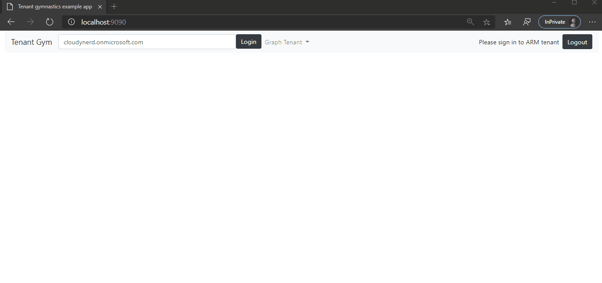

# SPA with access to multiple tenants

This apps signs in and gets a token for ARM with a given tenant. Then populates a menu of other tenants that the current user has access to and when selecting one of those tenants, it will list the first page of users from the other tenant using https://graph.microsoft.com.

To run the application:

```shell
npm install
npm start
```

Then point your browser to http://localhost:9090


