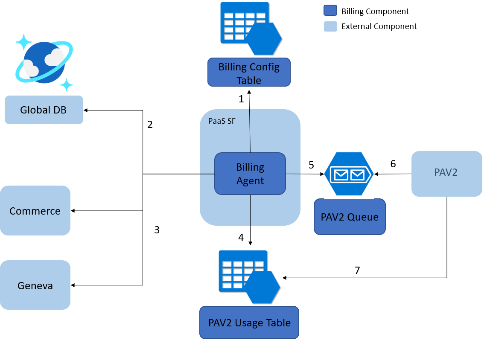
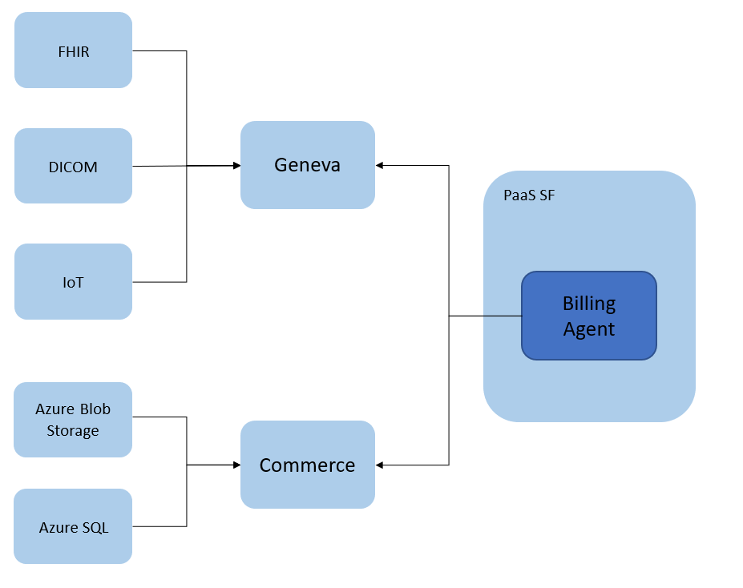
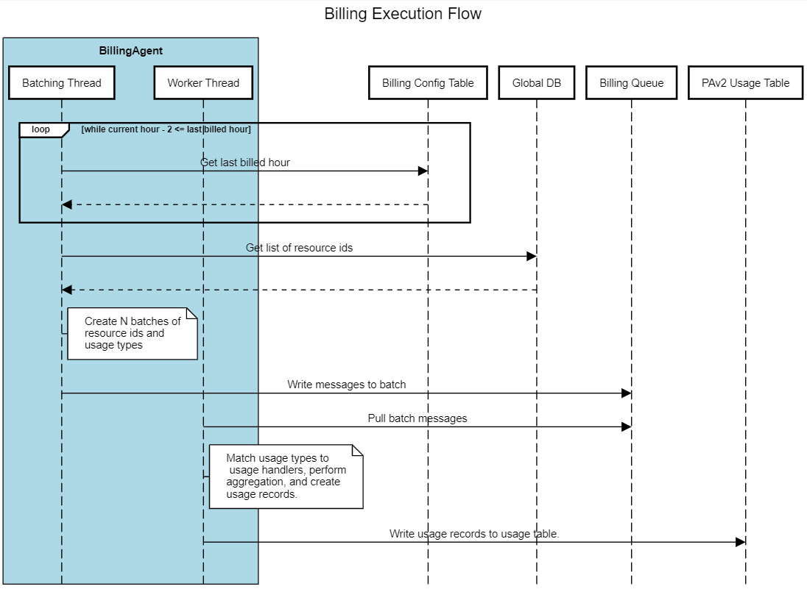

[[_TOC_]]

# Overview
With the introduction of Workspaces and other new services comes the need for a more robust BillingAgent. One that can handle usage from all the different types of services under Workspaces (FHIR, DICOM, IoT, etc.) as well as the new consumption pricing model that contains different pricing tiers based on usage quantity. This document will discuss the new requirements of the BillingAgent and the engineering work to create a common billing framework that can be used for all the different services. It will not go into implementation details for each usage category but will instead focus on the common framework that the different services will utilize.

# Requirements
For reference a table for the new pricing model has been included below with more in the [Pricing Spec](https://microsoft.sharepoint.com/:w:/t/msh/EUrBuamGqMhOqg26UINHjeUBcTEQrwshHGEzt9bjV_wC2Q?e=XujhCN&CID=EEE97932-ED0C-4227-A03D-15298E5D6C93&wdLOR=c6346DFF4-4EE2-45C7-99A5-FB5B5C9E3CC4).
1.	The BillingAgent will support billing customers for usage of all services in a Workspace including FHIR, DICOM, IoT, and any future resource types. The BillingAgent currently only bills for usage from Gen1 FHIR accounts. 
2.	The usage across these different services will be billed at the Workspace level under common meter ids. For example, when billing for the number of API calls for a given Workspace, the API Requests meter will be charged for the total number of requests across all data set services (FHIR, DICOM, etc.).
3.	Customers will be billed based on a new consumption model that will include a free tier (See table below). For example, the first 50k API Requests for a given Workspace are free. After that the customer will be charged for every 100k requests. These tier thresholds apply uniquely to each distinct Workspace. Currently the BillingAgent does not support any sort of multi-tiered pricing.

| Consumption SKU  | | |
|-----------|-----|-----|
| **Storage (/GB/month)**| | |
| **Storage Class** | **<= 1 GB** | **> 1 GB** |
| Structured Storage | $0.00 | $0.39 |
| Unstructured Storage | $0.00 | $0.023 |
| | | |
| **API Requests (/100,000 requests** | | |
| **Category** | **<= 50k** | **> 50k** |
| API Requests | $0.00 | $0.54 |
| | | |
| **Transforms /GB** | | |
| **Category** | **<= 0.5 GB** | **> 0.5 GB** |
| Transformations | $0.00 | $1.14 |
| Structured De-Identification | $0.00 | $1.14 |
| Transcode DICOM | $0.00 | $0.004 |
| | | |
| **Notifications ( /1,000,000 notifications)** | | |
|  **Category** | **<= 100K** | **> 100k** |
| Standard Notifications | $0.00 | $0.59 |
| | | |
| **ETL Operations /GB** | | |
| **Category** | **<= 1 GB** | **> 1 GB** |
| Export Batching | $0.19 | $0.14 |
| Export Streaming | $0.34 | $0.29 |
| | | |
| **Egress /GB** | | |
| **Category** | **>0 GB** | |
| Egress (Data Out)* | [Egress Pricing](https://azure.microsoft.com/en-us/pricing/details/bandwidth/) | |

\* We will be charging egress to customers using the existing Bandwidth meters and pricing.

# BillingAgent Review


1.	The BillingAgent runs as an application in Service Fabric. A loop continuously checks a BillingConfig table in Azure Storage for the next hour to bill. When it is time to bill for the next configured hour, the billing process kicks off.
2.	Once triggered BillingAgent gets the list of active FHIR accounts from the PaaS global db.
3.	The BillingAgent then collects usage data for the current billing hour for all active accounts. It retrieves usage data from different sources such as Cosmos DB usage from Commerce Usage API and Egress data from Geneva. The usage data is then mapped to the appropriate FHIR account from the list of active accounts.
4.	The usage data is converted into usage records (See [Appendix: Usage Records Format](#Usage-Records-Format)) with appropriate quantity and meter ids, and a partition key for all records in the current billing hour. These usage records are then stored in the PAv2 Usage Table.
5.	A message containing the batch’s partition key is added to the PAv2 Queue.
6.	PAv2 reads the message from the queue and extracts the partition key.
7.	PAv2 then reads all the records in the PAv2 Usage Table with the given partition key and bills the subscriptions accordingly.

## Issues
While the BillingAgent has worked for our service so far, there are a couple issues with it that have caused problems in the past and could cause problems with the next generation of Healthcare services. It is not part of the business requirements that these be fixed but it is recommended we take this opportunity to address them in the next generation of our services.

### Lengthy Execution Time
Our largest region, East US, has about 500 Gen1 FHIR accounts and takes approximately 10 minutes to complete a billing cycle. While this falls well within our 60 minute window this time could grow as our number of services grow with the addition of more customers and service types. Most of this time is taken up by several serialized calls to Commerce. There are opportunities here to add more parallelization that could reduce execution time.
### Exception Handling & Retrying
If any exception occurs, then the entire BillingAgent process pauses and retries all the usage for the failing hour before it can continue billing. Only once every record is handled successfully will the BillingAgent continue billing. For example, if there is a problem with Commerce such that the Commerce Client returns a 500 then all billing, even if it does not require Commerce data, is stopped until the issue is resolved. This can lead to delayed billing and we have a finite window of 48 hours to bill a customer for usage before we can no longer bill them for it and lose the billing. 

When we do retry after an exception, we have to retry the whole hour, nothing from the previous execution is saved. In the event that we want to retry a specific billing hour in the past, for example we have the correct data but perhaps we dropped usage records for some of the data due to a silent error, it can be difficult and timewasting to retry. We would have to set the next billing hour in the Billing Config Table back to the desired hour and then the BillingAgent will process that hour again and then continue forward re-processing every hour of billing from that time up to current billing time. There is no way to tell BillingAgent to re-run only a specific billing hour.

### Long Term Support
When the BillingAgent was originally created it was created using .Net Framework. As some of our other services in PaaS have upgraded to .Net Standard or .Net Core, BillingAgent was never upgraded due to some of its .Net Framework dependencies. This could pose a problem in terms of long term support from other dependencies that are moving away from .Net Framework as well as limits design and infrastructure choices in the future.

# Proposal
The BillingAgentV2 design is split into two sections, Usage Reporting and Usage Processing. The Usage Reporting section deals with how different client services will report usage metrics for their different services to a shared data store. Usage Processing will talk about the changes to the BillingAgent and how it will read and process the reported usage. 

## Usage Reporting


### Reporting to Geneva
Client services (FHIR, DICOM, IoT) will use Geneva to report billing usage as metrics to the existing ResoluteProd-Billing MDM account. These client services should already be onboarded to Geneva for their own operational metrics and can re-use their existing publishing infrastructure to onboard to BillingAgent. The metrics reporting system also has the advantages of reporting in an offline way that does not affect client service latency, as well as automatically handling idempotent retries in the event of reporting failures. 

On the BillingAgent side we can query these metrics using the [metrics client SDK](https://genevamondocs.azurewebsites.net/metrics/metricsclientapi/gettingstarted.html) which we already do today with Network Egress billing. Previously we had concerns with this SDK targeting .NET Framework however the latest version now supports .NET Standard 2.0. From there the BillingAgent can do the necessary processing to determine which pricing tier the usage falls into and report it to the Commerce team for billing.

MDM metric timeseries have a timestamp, a name, a quantity, and dimensions which are a set of key/value pairs that can contain metadata about the metric. A billing usage metric will look as follows:

| Property Name | Description | Example |
|---------------|-------------|---------|
| Timestamp | The timestamp of the billing usage event | 5/11/2020 18:05 UTC |
| Name | The name of the metric which will match a billing usage type | API Requests |
| Quantity | The amount of usage of the usage event that the customer should be billed for | 1|
| **Dimensions** | | |
| ResourceId | The Azure resource id of the resource the usage event is related to | /subscriptions/c243745d-50bb-48d1-9e62-3f72efb3166c/resourceGroups/testGroup/providers/ Microsoft.HealthcareApis/workspaces/testWorkspace/fhirservices/testFhirService |
| ParentWorkspaceResourceId | The Azure resource id of the resource the usage event is related to | /subscriptions/c243745d-50bb-48d1-9e62-3f72efb3166c/resourceGroups/testGroup/providers/ Microsoft.HealthcareApis/workspaces/testWorkspace |
| Region | The region of the cluster that will handle billing for this usage. This should match the region of the resource related to the usage event. | westus2 |

Each client service can capture the usage as it happens and then report it to Geneva as a metric in this format. In the workspace-platform repo, shared-packages directory, we will create a client library that will define a BillingUsageMetricLogger that wraps around an IFx MeasureMetric object and defines the billing MDM account values and performs dimension validation to ensure client services are reporting usage in the expected format. This library will be packaged and published to Nuget using the existing workspace-platform-shared-components pipeline. From there the client services can add the Nuget package as a dependency and use in their own services to report billing usage metrics.

### Commerce Usage
Not all usage is live events that the client services can capture dynamically. The main usage type like this is Storage. We charge for Structured and Unstructured Storage every hour and need to know the usage for the given billing hour. Each client service could implement their own poller that checks the usage of their customer’s storage and report it through Geneva like other usage types but Commerce already has this information for us. 

Instead, we can use the same process the existing BillingAgent uses for billing Azure CosmosDB storage. Each customer has a CosmosDB as the backend of their Gen1 FHIR service. Those CosmosDB instances live in one of our team’s internal subscriptions and the usage gets billed to us on one of those subscriptions. The BillingAgent calls the Commerce API to get the usage for all these instances and maps it to a customer's FHIR service. Then it passes on the usage to Commerce under our own meter id so that it gets billed to the customer as Azure API for FHIR Storage.

The same can be performed for other storage solutions since Azure SQL Database and Azure Storage also charge storage per GB per month. We can query Commerce for the Storage usage, calculate pricing tier, and then forward the usage with the appropriate meter id. No need for client services to determine usage and report through Geneva. 

## Usage Processing
The BillingAgent as it exists today could handle processing billing usage for Workspace services with some additions. 

#### Environment Config
The BillingAgent uses an environment config to list the different usage types we bill for and any associated info such as Commerce meter id. We would have to add the new usage types to this configuration as well as add the concept of configurable pricing tiers and resource types that should be charged together for this usage type.

**Example:**
```
{
  ...
  "StructuredStorage": {
    "commerceMeters": [ // list of meters to check for usage from Commerce
      "56f07b6a-c7d9-490f-a196-a7ee08e28712"
      ...
    ],
    "billingMeterTiers": [ // meter ids we use to bill customer and threshold to begin charging usage
      {
        "meterId": "0823a782-9eeb-4047-945c-fa12b2e5e4be",
        "usageThresholdStart": 0
      },
      {
        "meterId": "9995d93a-7d35-4d3f-9c69-7a7fea447ef4",
        "usageThresholdStart": 1
      }
    ],
    "resourceTypes": [ // list of workspace resource types who's usage should be charged to this usage type
      "workspaces/fhirservices",
      ...
    ]
  },
  "ApiRequests": {
    "commerceMeters": [],
    "billingMeterTiers": [
      {
        "meterId": "b1bac98f-6112-4022-9e73-974f7f317999",
        "usageThresholdStart": 0
      },
      {
        "meterId": "56f07b6a-c7d9-490f-a196-a7ee08e28712",
        "usageThresholdStart": 50000
      }
    ],
    "resourceTypes": [
      "workspaces/fhirservices",
      ...
    ]
  }
}
```

**CommerceMeters** is the list of meter ids we expect to find the usage data in Commerce billed too. For example the meter id that the SQL usage in our internal subscriptions would be charged too.

**BillingMeterTiers** contains the definitions for the different tiers. A tier contains the meter id for that tier that we charge the customer too and the threshold for which we begin billing to that meter id.

**resourceTypes** are the list of workspace child resource types who's usage will be charged to this usage type. As noted in the business requirements all usage should be billed at the workspace level. However in the future we may want to charge different prices for different services. 

#### Building List of Workspaces
In order for the BillingAgent to know which Gen1 FHIR accounts to bill for, it creates a list of active accounts in the region by querying the global db. Since Workspace resources use the PaaS RP to manage provisioning and state, the info for these resource types is also in the global db. The BillingAgent would be modified to similarly query the global db for a list of Workspace resource documents to bill. 

#### Usage Handlers
The BillingAgent has different handlers for different usage types that know how to retrieve the raw usage data, perform any aggregations or transformations, and create usage records for each active account in the previously created list. We would need to implement new handlers for the new configured usage types, each running in parallel in their own thread.

For the usage types reported to MDM, the handling logic will be the same across usage types and could be implemented in a shared handler. 
1.	For a given usage type use the existing MDM metric client to get aggregates of all the different metric time series for the current billing hour and for the month. 

**Example:**
```
{
  "TimesSeriesSets": [
    {
      "DimensionValues": [ // List of Dimension names and values for the TimeSeries
        {
          "ResourceId": "/subscriptions/c243745d-50bb-48d1-9e62-3f72efb3166c/resourceGroups/testGroup/providers/Microsoft.HealthcareApis/workspaces/testWorkspace/fhirservices/testFhirService"
        },
        {
          "ParentWorkspaceResourceId": "/subscriptions/c243745d-50bb-48d1-9e62-3f72efb3166c/resourceGroups/testGroup/providers/Microsoft.HealthcareApis/workspaces/testWorkspace/"
        },
        {
          "Region": "westus2"
        }
      ],
      "SamplingTypesData": { //Values in the queried time range for queried sampling type(s)
        "Sum": [25, 0]
      }
    }
  ]
}
```

2. Map the time series aggregates to a Workspace in the active Workspaces list using the time series “parentWorkspaceResourceId” dimension. 
3. Filter as necessary using the usage type's configured list of child resource types against the dimension "resourceId".
4. Determine which meter id to charge the new usage to based on the month aggregate and the usage type pricing tiers.

For usage types retrieved from Commerce it is a bit more complex. When retrieving usage from Commerce we have to map the resource id of the resource in our own subscriptions to the corresponding service in the customer’s subscription. In Gen1 we do this by using the Commerce API to retrieve the usage in a set of target subscription ids we provision customer backend resources in. Then iterating over the list of FHIR accounts, use the FHIR account’s internal id to identify the corresponding CosmosDB since we use the internal id as part of the CosmosDB’s name. In the case of the new Storage usage types, Workspaces do not have “Storage” resources, their children do. So for Storage usage types we would need to:
1.	Query Commerce for the all the usage in a list of target subscription ids. This list of subscription ids will now include ids for IoT and DICOM subscriptions that can contain customer backend resources. A performance improvement we can make is to make parallel calls for usage in different subscriptions. This will give us a map of resource ids to usage for the requested time period.

**Example**
```
{
  "values": [
    "id": "/subscriptions/sub1/providers/Microsoft.Commerce/UsageAggregate/sub1-meterID1",
    "name": "sub1-meterID1",
    "type": "Microsoft.Commerce/UsageAggregate",
    "properties": {
      "subscriptionId":"c243745d-50bb-48d1-9e62-3f72efb3166c", // Internal Subscription
      "usageStartTime": "2021-01-01T13:00:00+00:00",
      "usageEndTime": "2021-01-01T14:00:00+00:00",
      "instanceData":"
        {
          "Microsoft.Resources":{
          // Backend SQL Resource ID
          "resourceUri": "/subscriptions/c243745d-50bb-48d1-9e62-3f72efb3166c/resourceGroups/mshapis-test-integration-test-rg/providers/Microsoft.Sql/servers/mshapis-test-integration-sql/databases/2cdokbb97tf3rg4glzgcxu3uq", 
          "location": "WestUS2",
          "tags":null,
          "additionalInfo":null
        }
      }",
      "quantity":2.4000000000,
      "meterId":"meterID1"
  }
  ]
}
```

2.	Then iterating over the list of Workspaces, query for their child resources based on the child resource types expected to have usage for the given usage type. For example when processing Structured Storage we would want to query for child resources that are expected to have Structured Storage usage.
3.	Using the information from the child resources you can build the resource id for the backend storage resource that belongs to the child resource. Then use that to lookup the usage for that resource in the Commerce data.
4.	Once all the usage data for the Workspace’s children have been identified, the usage can be aggregated together to determine appropriate pricing tier and meter id.

#### Usage Reporting
Finally, the BillingAgent defines some utility functions to create usage records in a standard format (see [Appendix: Usage Record](#Usage-Record-Format)) to be stored in the PAv2 Usage Table. They take in information about the service and the current usage and generate a usage record. These utilities take in a Gen1 FHIR account and expect certain properties in order to generate values for the usage record. These would have to be generalized to support new Workspace resource types. Once the records are created and published to the PAv2 Usage Table the down stream process remains the same.

### Process Flow Changes
Today the BillingAgent starts off with a single thread that creates the list of accounts, gathers the data from Commerce, and then spins off a new thread to process each usage type. Remember if an exception occurs the entire billing process is interrupted and the BillingAgent will retry the billing hour again. With some added complexity to how we manage these processes we can better handle the failure scenario so that a failure of billing one type does not prevent the billing of others. And should a failure occur we should be able to retry that specific subset of usage for that specific hour at any time (within the 7 day window) without having to turn the whole BillingAgent back in time.

#### Batching
By breaking the work up into batches we create descrete pieces of work that can be processed in parallel without disturbing the work on other batches. And should a batch fail, we can resubmit that specific batch without having to retry other batches.

When the BillingAgent begins executing for a billing hour it will query the list of active Gen1 FHIR accounts and Workspaces as described above and then create batches that consist of the queried list of resoruces and  one or more usage types. These batches will be a JSON message that gets written to an external Azure Storage Queue in the existing billing Storage account.

**Example:**
```
{
  “batchId”: “cf9f9616-ef27-41d7-b207-afa266c14a55”,
  “usageTypes”: [
    “API Requests”,
    ...
  ]
  “billingHour”: “2021-01-01T13:00:00Z”,
  “resourceIds”: [
    “/subscriptions/8f9ea587-2050-4b59-8a8c-6fa447d92fc8/resourceGroups/exampleRG/providers/Microsoft.HealthcareApis/workspaces/exampleWs”,
    …
  ],
  “retryCount”: 0
}
```

**BatchId** is a unique GUID that is unique to the batch.

**UsageTypes** is the list of usage types that should be processed for the given batch of resources and their usage data.

**BillingHour** is the billing hour the batch was created for and the hour of usage data that should be processed.

**ResourceIds** is the list of active resource ids (Workspace, FHIR, etc.) that should be charged for the usage in the list of usage types.

**RetryCount** is a count of how many times the batch has attempted to be processed. This is used in the event of a failure (See Failure Scenarios).

#### Batch Processing
These messages in the Storage Queue will then be pulled down by worker threads in the BillingAgent for processing. The worker thread will map the usage type to the appropriate usage handler which will perform the necessary processing as described above (See [Usage Handlers](#Usage-Handlers)). Once the usage is processed and usage records are added to the usage table, the batch can be stored in blob storage for our records. In the event of a failure, the message will be added back to the queue with a visibility timeout such that another worker can try the batch again after a delay. After enough retries the message will be added to a dead letter queue where on-call can take further actions.

#### Sequence Diagram


#### Advantages
1. By assigning the work to batches we can retry a specific batch as needed. We won't block other unrelated billing, and we don't have to roll back the BillingAgent.

2. We can have each usage type execute in parallel or group as needed. Remember that querying Commerce takes up most of our execution time. By batching the Commerce related usage types together we can query Commerce once, and then all the related usage handlers can use that data for the batch. Meantime we can process usage reported to MDM in parallel without having to wait for Commerce querying to complete like we do today.

# Failure Scenarios
**1. Client Service does not capture entire usage or drops usage data before reporting to Geneva.**

This scenario is up to the client service to ensure does not occur; the billing system has no control of client service operations.

The impact of this would be underbilling for the client service.

**2.  Client Service captures the usage but gets error reporting to Geneva.**

The metrics reporting framework already has a robust retry mechanism where it can retry sending metrics without accidently duplicating metrics or spamming Geneva. 

If after all retries Geneva is still returning errors and the metrics cannot be published, then the impact will be underbilling until the issue with Geneva is resolved.

**3. The BillingAgent is unable to execute on the scheduled time trigger.**

The last billed hour is stored in a storage table outside of the BillingAgent to preserve state. Whatever the reason that BillingAgent cannot execute, once it has resolved the BillingAgent can pick up from wherever it left off before the exception. 

The impact would be delayed billing.

**4. The BillingAgent executes as expected but encounters an exception in the middle of making the batches.**

If an error occurs after creating and submitting an incomplete number of batches then the BillingAgent will retry batching for the billing hour until successful. If a subset of batches were published before exception, then the batches will be created and published again on the retry. This is acceptable due to duplicate handling when creating usage records. Duplicate usage records may be created but they will have the same EventId and EventTimestamp which will prevent any duplicate record from being processed by PAv2. The customer will not get billed twice.

The impact would be delayed billing and potential duplicate processing of batches but no double billing.

**6. One or more worker threads encounters an exception while processing a batch.**

When a worker thread encounters an exception and is unable to complete billing for everything in the batch, the batch is cancelled, and the batch message re-inserted into the Billing Queue with an incremented retryCount. The message will be inserted with a visibility timeout to create a retry delay. After the retryCount has reached a configured limit, the message will be instead moved to the dead letter queue where it can be handled manually. If the issue is not related to the message itself, it can always be re-inserted into the live queue to be processed again. If the problem is the batch message, see Failure Scenario #7.

The impact would be delayed billing of that batch until the batch document is able to be re-run successfully.

**7. A batch document is corrupted/malformed such that it will always fail.**

The malformed message will sit in the dead letter queue waiting for on-call attention. From there we can decide to either drop the message entirely or manually edit/re-create the message and re-insert the message into the processing queue.

If the message is dropped then the impact is lost billing for that batch. If able to recover the batch then the impact is delayed billing.

**8. The BillingAgent is unable to write the records to the PAv2 Usage Storage Table.**

See failure scenario 6.

# Future Expansion
## Onboarding a New Service
When a new service wants to onboard to BillingAgentv2 they ensure they can publish the usage metric data to the ResoluteProd-Billing MDM account. They will have to ensure that they have a  certificate configured with the MDM account to authenticate. This can be done by any Admin on the billing account.

Once they are able to publish to the billing MDM account they will be responsible for making the changes to their service in order to capture the usage and report it via the appropriate metrics. 

After the metrics are published to the account, the BillingOrchestrator can be modified to include instances of the new resource type when generating batches for billing. The usage data for existing usage types will already be pulled when querying Geneva as we pull all the time series for a metric and then filter by the list of resource ids in the batch. 

For usage data retrieved from Commerce there may be some extra steps. For usage reported to Geneva by client services, the usage is already categorized into usage types for the BillingAgent. For usage retrieved from Commerce, the BillingAgent is responsible for getting the different usage types in Commerce (SQL Storage, Blob Storage, CosmosDB Storage, etc.) and aligning them to our usage types (Structured Storage, Unstructured Storage). If the service is using a storage solution that we are already billing for as part of one of these storage usage types, then there is no additional work needed. As long as the BillingOrchestrator is including resources ids for the new services in its batching, then BillingWorker will be able to map the usage to the services as it receives the batches. However, if this is a new storage type that needs to be included under the Structured or Unstructured usage types then the IUsageHandler for the appropriate usage type that retrieves the usage from Commerce will have to be modified to also retrieve usage for the new storage type.

## Onboarding a New Usage Type
A new usage type will require a new meter id for each pricing tier. To do this, reach out to the Commerce team to begin onboarding a new meter id.

A new metric for the usage type will have to be created in the billing MDM account.  It will also have to be configured with the required dimensions (see Reporting to Geneva). This can be done in parallel with onboarding the new meter id with Commerce team as the BillingAgent will not pull metric data for a usage type until it is added to the environment config.

Also needed is an IUsageHandler implementation mapped to the usage type in the BillingWorker. This could be a brand new IUsageHandler that is being implemented or an existing one that can be mapped to the new usage type. This IUsageHandler will have to take in the metric data and perform the necessary processing to convert it into usage records in the standard format (see Appendix: Usage Record). This can also be done in parallel to the other steps for the same reasons mentioned above.

Once the previous steps are completed and tested properly, new usage type will need to be added to the environment config before the BillingOrchestrator can begin billing for that type.

# Open Questions
**What is the plan for if/when MDM fails to log reported metrics?**

While MDM is built to handle large scale, it has gone down in the past and could happen again. While it is a critical service and would trigger a Sev1, we could still lose revenue while it is down if we are unable to report usage metrics. There needs to be an investigation withe the MDM team to see if there is any recommended way to report/preserve metrics should this happen. And if not, we should come up with a redundancy plan to store usage metrics while MDM is down.

**Can we upgrade the existing BillingAgent or build the new BillingAgent projects with .Net Core or .Net 5?**

As mentioned previously, the Metric Client SDK now supports .Net Standard 2.0 which can be used in .Net Core projects. However there are additional RP SDK libraries that the BillingAgent uses that target .Net Framework. Mainly this is a Usage Reporting library  that has some help wrappers around Azure Storage Client for reporting usage records the the PAv2 table and messages to the PAv2 Queue. These aren’t strictly necessary but to avoid using them we would have to write our own client to connect and send data to the billing Azure Storage account. It also uses classes from the ARM Fluent SDK which seems to target .Net Standard 1.4. Additional investigation needs to be done if this will be sufficient or if there are additional ARM SDK dependencies that only target Framework.

# Tasks
## Geneva Reporting
These are estimates for implementing the common components of reporting usage to Geneva. It does not include work for implementing the capture of each usage type in the different client services as this is dependent on each.

| Task | Estimated Story Points |
|------|------------------------|
| Create Metric definitions in billing MDM accounts for new usage types | 1 |
|Create shared BillingMetrics project library | 1 |
| Define BillingUsageMetricLogger in shared library | 3 |
| Publish to Nuget and add to health-paas solution | 1 |
| | |
| **Total** | **6** |

## BillingAgent
These estimates are for adding new usage and service types to existing BillingAgent as well as implementing batching in the flow.

| Task | Estimated Story Points |
|------|------------------------|
| **MVP**| |
| Modify environment config to include new usage types and accommodate configurations for pricing tiers and available resource types | 2 |
| Query global DB for new workspace resource types | 1 |
| Implement shared usage handler for new Geneva reported usage types | 3 |
| Implement usage handler for new Commerce reported usage types | 3 |
| Define mappings of Commerce usage from internal subscription to resource in customer subscription for different resource types | 3 |
| Modify Usage Reporting utilities to generate usage records regardless of resource type. | 2 |
| E2E Testing | 5 |
| **Total** | **19** |
| | |
| **Batch Processing** | |
| Add provisioning of Billing Queue, dead letter queue, and Blob Storage as part of environment | 2 |
| Implement batching logic | 3 |
| Implement worker pool with batch reading | 5 |
| Store batch processed batch messages in Blob Storage | 2 |
| E2E Testing | 5 |
| **Total** | **17** |

# Appendix
## Usage Record Format
| Property Name | Description | Example |
|---------------|-------------|---------|
| PartitionKey | Table storage partition key, unique to a batch | cf9f9616-ef27-41d7-b207-afa266c14a55 |
| RowKey | Table storage row key. In Gen1 this was “accountId:accountName:meterId:guid”. For v2 we will use “resourceId:meterId:guid” | “/subscriptions/c243745d-50bb-48d1-9e62- 3f72efb3166c/resourceGroups/testGroup/providers/Microsoft.HealthcareApis/ workspaces/testWorkspace/fhirservices/testFhirService: 9995d93a-7d35-4d3f-9c69-7a7fea447ef4:cf9f9616-ef27-41d7-b207-afa266c14a55” |
| SubscriptionId | Azure subscription Id being charged| c243745d-50bb-48d1-9e62- 3f72efb3166c|
| EventId | Unique ID for usage event – New Guid for every record | 510a2aa4-f959-401f-9594-021d7259f183 |
| EventDateTime | The UTC date time for this usage event. This is the end time of the usage event. Eg if you emit usage at hour granularity then this is the end of the hour that includes the usage for that hour.  For usage between 1:00:00 – 2:00:00 the latest end time would be 1:59:59 | 2012-04-23T18:25:43.511Z |
| Quantity | The quantity to be billed. Precision up to 6 decimals | 10 |
| MeterId | The billing resource guid configured with Commerce team to define billing category | 65d4ded2-41ae-43a8-bb68-3c200e1ba864 |
| ResourceUri | ARM resource uri of the resource for which the usage is emitted | /subscriptions/c243745d-50bb-48d1-9e62- 3f72efb3166c/resourceGroups/testGroup/providers/Microsoft.HealthcareApis/ workspaces/testWorkspace/fhirservices/testFhirService |
| Location | The Azure region | West US 2 |