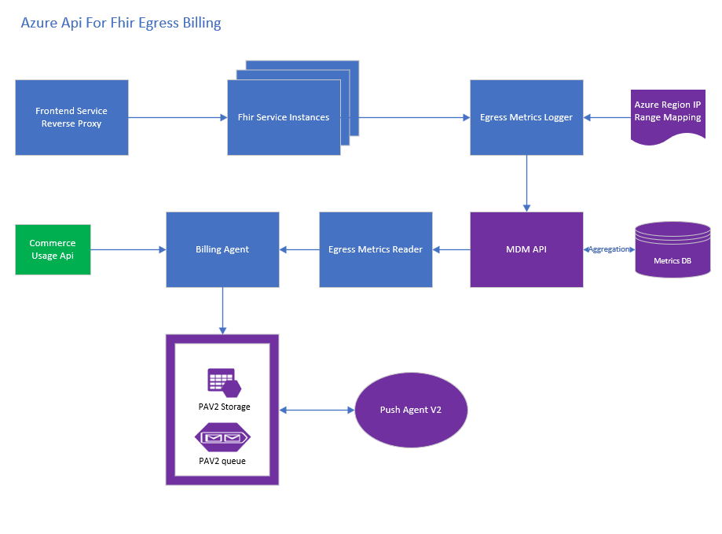

*Summary of the feature.*

[[_TOC_]]

# Business Justification

As part of running the Azure Api for Fhir service, we incur bandwidth charges for data transfer between regions and from any region to the internet. We need to charge costs that we incur for egress back to our customers.

# Scenarios

1. As "Azure Api for Fhir" service, we want to charge our customers back for egress costs that we incur from Account CosmosDb.
2. As "Azure Api for Fhir" service, we want to charge our customers for data egress in response to an api call.
3. As "Azure Api for Fhir" service, we want to charge our customers for data egress in response to Export of data.
  (**__Note__**: This is a P2 scenario for now since export is still not in PaaS besides we are planning on a restriction that the store to which we will export be part of the same region where the export api is running meaning no egress charges would be incurred.)

# Non Goals
* For the sake of this design, we will not consider egress costs incurred from Global CosmosDb, since these charges are miniscule in comparison to overall egress costs besides being hard to attribute to an account.
* We will not specifically consider Azure Government cloud or DE special region for the sake of this design. Although, the design would be flexible enough to accomodate these in the future when we have our service available in these special clouds.

# Metrics

*List the metrics/telemetry that should be collected. For example: number of accounts that use feature X, number of requests to Y API per hour/day/week. How do we measure the success of this feature?*

# Design

The following image shows the interaction between the various components


## Attributable Egress
This is the egress that we can attribute to our customer subscription in a straightforward manner. An example is the egress that account CosmosDb bills us for. We will take the commerce usage for cosmosdb egress and attribute to our customer subscription by generating a usage record by decoding the account information either from the name of the cosmosdb database or the resourceCreatedFor tag that is available as part of the usage record from Commerce. The resourceCreatedFor tag has the fhir resourceid. An example usage snippet from Commerce is below. 

```` json
  {
    "PartnerId": "Azure",
    "SubscriptionId": "680180cd-e78d-4fd0-8fd3-6008bab2b07d",
    "EventId": "88b34dc6-b00a-53f4-83ae-29436bd3d015",
    "ReportedDateTime": "2019-04-07T16:57:01.0892721+00:00",
    "UsageDateTime": "2019-04-07T11:00:00+00:00",
    "ProcessedDateTime": "2019-04-07T16:57:01.1234678+00:00",
    "MeteredResourceId": "9995d93a-7d35-4d3f-9c69-7a7fea447ef4",
    "Quantity": 0.0,
    "CustomFields": {
      "AzureUsageEventCustomPropertiesKey": "{\"Microsoft.Resources\":{\"resourceUri\":\"/subscriptions/680180cd-e78d-4fd0-8fd3-6008bab2b07d/resourceGroups/mshapisprod-ts-14d8vamoiqv5t7w20z8s1veqi-rg/providers/microsoft.documentdb/databaseaccounts/cdb-14d8vamoiqv5t7w20z8s1veqi\",\"location\":\"northcentralus\",\"tags\":{\"resourceCreatedFor\":\"/subscriptions/e220ceb3-f037-44ca-bcd0-814c1a08aa9c/resourceGroups/K8s_Development/providers/Microsoft.HealthcareApis/services/datica\"},\"additionalInfo\":{\"DatabaseAccount\":\"cdb-14d8vamoiqv5t7w20z8s1veqi-northcentralus\",\"ImageType\":\"GlobalDocumentDB\"}}}"
    },
    "InfoFields": null,
    "RatingParameters": null,
    "BatchId": "5f7869b4-46ff-42eb-907e-bb7d686eae0d",
    "IsRejected": false,
    "Source": "Usage"
  }
````

## Non Attributable Egress
This is the egress that we see for resources like VMs from Commerce that we cannot attribute directly to a single account since these resources are shared among accounts. Attributing this to a customer account is difficult. The following are the elements of the design for generating billing usage for non attributable egress.

### Billing Egress Metric
We will create a Resolute Egress Billing Metric in Geneva with the following dimensions.

1. **ResourceId**: The Fhir Azure service resource id.
2. **Source Region**: This is based on the IP address of the incoming request.
1. **Target Region**: The cluster region where the fhir instance is running.
1. **Subscription Id**: This can be derived from the fhir resource id.
1. **MeterId**: This is based on the target region's zone. Please see below in this doc for the list of meterids by zone.
1. **Time**: The utc time of the egress.

The metric value will have the value of the response size out of the api in bytes.

**_Note_**: If the source and target region are the same, we will not generate a billing usage record, but still record the response size metric for any future reporting purposes.

### Billing Egress Metric Logger
We will use the shoebox metrics logger to log the billing metric from a middleware component to Ifx.
Please see [Shoebox metrics design](https://microsofthealth.visualstudio.com/Health/_git/health-paas-docs?path=%2Fspecs%2FShoebox%2FShoebox%20-%20metrics.md&version=GBmaster)

Based on the incoming request remote ip address and the Azure Region IP Range Mapping, we will determine the region of the incoming ip as the source region. The resource id, customer subscription id and target region will be determined from the fhir instance. The meter id will be based on the egress meter ids table below and the zone id based on the source region. The time will be the current utc time. The metric value will be the response bytes.

For V1, we are not currently thinking of adding any aggregations for the metric. Also, the Geneva configuration for the metric will be setup to upload the metrics every minute by the monitoring agent. it is possible that for some reason if the node is down, then upto a minute of data might be missed. We are assuming that it is not that significant a hit, if it turns out to be, we can look at reducing the granularity of uploads.

Should we use a different MDM account for billing?
Currently the answer is yes to prevent throttling in Geneva.

### Billing Egress Metric Reader
We will write an abstraction layer for reading metrics using an IMetricReader interface. This will take in the metric name, the time series start time, the time series end time and return the aggregated metric value by all the dimensions. This reader will be injected into the Billing Agent.

Our billing cycle currently lags the current UTC time by 2 hours, so we will read egress records reported 2 hours before. This gives enough time for the metric records to make it to Geneva and be available.

We will roughly have:
* Microsoft.Health.Cloud.ServicePlatform.IMetricReader
* Microsoft.Health.Cloud.ServicePlatform.NullMetricReader : IMetricReader
* Microsoft.Health.Cloud.ServicePlatform.IfxMetricReader
* Microsoft.Health.Cloud.ServicePlatform.MetricReader : IMetricReader

### Egress Meter Ids

| MeterId                              | Zone         |
|--------------------------------------|--------------|
| 45d55bc5-9f30-4572-8b5c-5b17a6b6a7bd | DE (Trustee) |
| 6c5c3140-e894-4ecf-aacc-60137b0bc93b | Gov (US)     |
| 9995d93a-7d35-4d3f-9c69-7a7fea447ef4 | Zone 1       |
| c089a13a-9dd0-44b5-aa9e-44a77bbd6788 | Zone 3       |
| fe167397-a38d-43c3-9bb3-8e2907e56a41 | Zone 2       |

### Region to IP Mapping
We have two sources for getting the region to iprange mapping, one an internal source and another an external source.
1. An internal source http://169.254.169.254/machine/plugins?comp=nmagent&type=GetIpRangesV2 that comes from an internal rollout. The data format is xml and a snippet for Australia Central 2 is below. We will use only the public ranges as they are only ones exposed to customers.
````xml
<Tier SdnRegionId="59" Region="Australia Central 2" Description="CBR21" Name="CBR21"><AddressRange Accessibility="Private" To="10.1.47.63" From="10.1.47.0"/><AddressRange Accessibility="Private" To="10.12.100.59" From="10.12.100.59"/><AddressRange Accessibility="Private" To="10.20.50.175" From="10.20.50.160"/><AddressRange Accessibility="Private" To="10.20.51.223" From="10.20.51.192"/><AddressRange Accessibility="Private" To="10.20.251.207" From="10.20.251.192"/><AddressRange Accessibility="Private" To="10.41.193.127" From="10.41.193.0"/><AddressRange Accessibility="Private" To="10.78.8.63" From="10.78.8.0"/><AddressRange Accessibility="Private" To="10.78.10.127" From="10.78.10.64"/><AddressRange Accessibility="Private" To="10.78.10.255" From="10.78.10.128"/><AddressRange Accessibility="Private" To="10.78.11.127" From="10.78.11.0"/><AddressRange Accessibility="Private" To="10.78.11.191" From="10.78.11.128"/><AddressRange Accessibility="Private" To="10.78.11.207" From="10.78.11.192"/><AddressRange Accessibility="Private" To="10.97.139.159" From="10.97.139.144"/><AddressRange Accessibility="Private" To="10.98.100.31" From="10.98.100.16"/><AddressRange Accessibility="Private" To="10.207.151.255" From="10.207.148.0"/><AddressRange Accessibility="Private" To="10.254.41.95" From="10.254.41.64"/><AddressRange Accessibility="Public" To="13.106.201.255" From="13.106.200.0"/><AddressRange Accessibility="Public" To="13.107.184.251" From="13.107.184.248"/><AddressRange Accessibility="Public" To="20.36.95.255" From="20.36.64.0"/><AddressRange Accessibility="Public" To="20.36.127.255" From="20.36.112.0"/><AddressRange Accessibility="Public" To="20.39.79.255" From="20.39.72.0"/><AddressRange Accessibility="Public" To="20.39.127.255" From="20.39.96.0"/><AddressRange Accessibility="Private" To="25.71.42.127" From="25.71.42.96"/><AddressRange Accessibility="Private" To="25.71.46.127" From="25.71.46.0"/><AddressRange Accessibility="Private" To="25.87.255.255" From="25.87.224.0"/><AddressRange Accessibility="Private" To="25.88.38.63" From="25.88.38.32"/><AddressRange Accessibility="Private" To="25.88.40.255" From="25.88.40.0"/><AddressRange Accessibility="Private" To="25.88.43.255" From="25.88.43.0"/><AddressRange Accessibility="Private" To="25.95.207.255" From="25.95.207.0"/><AddressRange Accessibility="Private" To="25.96.95.255" From="25.96.64.0"/><AddressRange Accessibility="Private" To="25.145.164.127" From="25.145.164.64"/><AddressRange Accessibility="Private" To="25.145.164.255" From="25.145.164.192"/><AddressRange Accessibility="Public" To="40.66.77.255" From="40.66.76.0"/><AddressRange Accessibility="Public" To="40.82.15.255" From="40.82.12.0"/><AddressRange Accessibility="Public" To="40.82.247.255" From="40.82.244.0"/><AddressRange Accessibility="Public" To="40.90.130.47" From="40.90.130.32"/><AddressRange Accessibility="Public" To="40.90.142.95" From="40.90.142.64"/><AddressRange Accessibility="Public" To="40.90.149.63" From="40.90.149.32"/><AddressRange Accessibility="Public" To="40.126.191.255" From="40.126.128.0"/><AddressRange Accessibility="Public" To="52.143.218.255" From="52.143.218.0"/><AddressRange Accessibility="Public" To="52.239.219.255" From="52.239.218.0"/><AddressRange Accessibility="Private" To="100.126.63.255" From="100.126.62.0"/><AddressRange Accessibility="Private" To="100.126.75.255" From="100.126.72.0"/><AddressRange Accessibility="Private" To="100.126.85.255" From="100.126.84.0"/></Tier>
````
2. We can download the json file that has the ip range to region mapping published by Microsoft at https://www.microsoft.com/en-us/download/details.aspx?id=56519. 

The download will be done during the fhir instance startup and be available as part of the serviceplatform.

We will create a data structure of azure region to public ip range mapping in memory. This data structure will provide fast lookups. This data structure would be refreshed every week.

We will load the ip mapping file as below during the fhir service startup
  1. In the first version (V1) of this feature we will checkin the file as a resource and load it from there. Since new regions are not created often, we can update this file once every few releases.
  1. Subsequently, we can have what we have above, but dynamically read the file on startup and once every week falling back to the one checked in if the file is not available online due to any reason.

**_Note_**: We are currently planning using the internal source. Both the sources are generated from the same master data from IPAM.

### Region to Zone Mapping
We will generate the zone mapping based on the region. This will be a static list based on details [here](https://azure.microsoft.com/en-us/pricing/details/bandwidth/?resourceguids=1).

### IP range parser
We will use the [IPNetwork](https://docs.microsoft.com/en-us/dotnet/api/microsoft.aspnetcore.httpoverrides.ipnetwork?view=aspnetcore-2.2) class for parsing ip ranges from the region to ip mapping data structure.
Alternatively we can also use the [open source ipnetwork library](https://github.com/lduchosal/ipnetwork).

### Overall Non Attributable Billing Usage Generation Flow
1. In a middleware component for every request before the response is sent out
    1. Parse the incoming IP to get the source region from the ip to region mapping data structure. The source region is external if the incoming ip is not in the map.
      **_Note_**: We cannot store the ip address directly because it is considered PII. Masking the last octet and storing is also not an option because of the way the ip range map is structure for regions. This is the reason the parsing and mapping cannot be offloaded to the Billing Agent.
    1. Get the zone id based on the zone map for the source region. If external, the zone id would be for the cluster region.
    1. Get the meter id based on zone id.
    1. Calculate the response value in bytes.
    1. Write the metric value using MetricLogger.
1. During a given billing cycle, we will read the aggregated metric value by resource id for the billing cycle time. Create a billing usage record and write usage.

# Test Strategy

We will use unit tests where appropriate. We can also use integration tests for verifying metrics. A full e2e is a bit difficult as data is available in Commerce after 6 hours. However, there is a plan to use a test account for the same, but it won't be part of this feature for now.

# Security

We will use the same mds certificate that we currently use for Geneva for reading and writing metrics.

# Other

## User Stories
Please see egress stories under [feature](https://microsofthealth.visualstudio.com/Health/_workitems/edit/68648).

**__Note__**: We will postpone the account cosmosdb egress billing work to after GA. This is because egress for account cosmosdb is generated only when geo replication is setup, which is currently scheduled to happen after GA.

**__Note__**: The egress feature will be enabled only after GA is announced. We will do the work under a flag enabled after GA. Before GA, we will do e2e manual testing using whitelisted subscriptions.

## Alternatives Considered
Instead of Geneva we can use the same storage account we use for Billing. However writing to a storage account is slow and we will have to implement some sort of a durable service ourselves for non blocking durable writes. With Geneva we do not have to implement any of these.
Besides, on scanning the MSAzure One source, I see other teams like CosmosDb and Azure Networking using similar architectures involving using Geneva metrics for storing billing information.
Please see CosmosDb code files I found [file1](https://msdata.visualstudio.com/CosmosDB/_search?action=contents&text=ExecuteMdmGetTimeSeriesAsync&type=code&lp=code-Project&filters=ProjectFilters%7BCosmosDB%7DRepositoryFilters%7BCosmosDB%7D&pageSize=25&sortOptions=%5B%7B%22field%22%3A%22relevance%22%2C%22sortOrder%22%3A%22desc%22%7D%5D&result=DefaultCollection%2FCosmosDB%2FCosmosDB%2FGBmaster%2F%2FProduct%2FHealth%2FCommon%2FClients%2FMdmClient.cs), [file2](https://msdata.visualstudio.com/_search?action=contents&type=code&text=RawUsageRecordEventRequest&filters=&sortOptions=%5B%7B%22field%22%3A%22relevance%22%2C%22sortOrder%22%3A%22desc%22%7D%5D&result=DefaultCollection%2FCosmosDB%2FCosmosDB%2FGBmaster%2F%2FProduct%2FCosmos%2FBilling%2FRuntime%2FBillingEventSource.cs) and [file3](https://msdata.visualstudio.com/_search?action=contents&type=code&text=RawUsageRecordEventRequest&filters=&sortOptions=%5B%7B%22field%22%3A%22relevance%22%2C%22sortOrder%22%3A%22desc%22%7D%5D&result=DefaultCollection%2FCosmosDB%2FCosmosDB%2FGBmaster%2F%2FProduct%2FCosmos%2FBilling%2FRuntime%2FRawUsageReader.cs) for examples.
**_Note_**: I don't have an understanding of the exact arcitecture of CosmosDb billing, this is my understanding from just a scan of the code.
## Links
1. [Bandwidth Pricing in Azure](https://azure.microsoft.com/en-us/pricing/details/bandwidth/?resourceguids=1)
1. [Azure commercial region ip range map](https://www.microsoft.com/en-us/download/details.aspx?id=41653)
1. [Azure Government region ip range map](https://www.microsoft.com/en-us/download/details.aspx?id=57063)
*Describe any impact to privacy, localization, globalization, deployment, back-compat, SOPs, ISMS, etc.*
