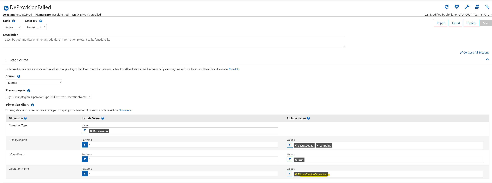
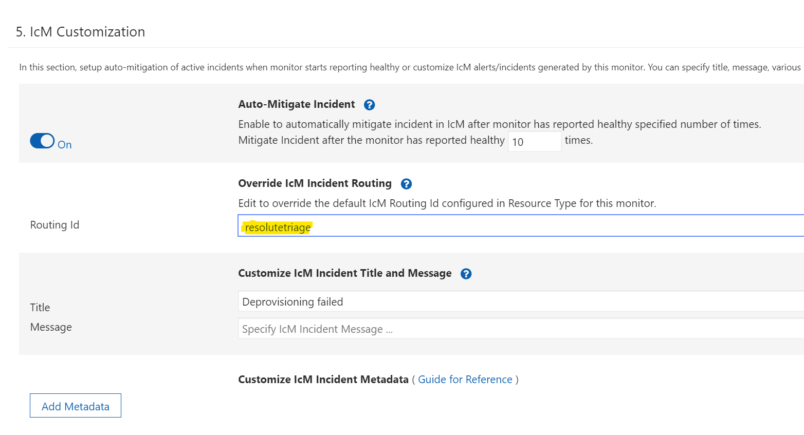

This document contains high level information on how do we intend to setup DRI rotations for Healthcare APIs. 

[[_TOC_]]

# Guiding principles
* Each team should be able to setup their own on-call rotations. 
* Each team should be able to dictate their own escalation policies. 
* Each team should be able to see their exceptions in their own dashboard. 

# Teams

Following are the teams at the start of the rotations. Each team should get to decide if they want to pool their team with another team 

### DICOM
### IoMT
### Platform / FHIR
### SRE

Each team should be stood up as an individual team under FHIR Server (This should be renamed to HealthCare APIs some time in future). 

Each team shall have at least one person added as Tenant Admin at Service Level. This way, team is able to make their own changes. 

Each team should be able to stand their own dashboard based on metrics emitted. All common metrics such as provisioning, should contain an identifying information such as which underlying service emitted the metric. 

# Routing

## ICM
Each team will be responsible for managing their own ICM incidents. For ICM incidents originating from service specific code should have correct routing id on it and have corresponding routing rule to get the incident to correct team. 

For incidents originating from common code metrics should include a dimension that would identify which of the services metric originated from. Inside monitors under Jarvis, should create ICM with correct routing Id. 

    
 

In order to prevent surprize alerts and in the spirit of empowering teams to manage their own incidents, member of Jupiter team shall not setup an alert for a different team without a some sort of  handoff.

# Logbook
Each team shall be responsible for documenting a DRI logbook process. It shall contain incidents over the past DRI rotaion and should be accessible to all teams. Each team is reponsible for coming up with their own DRI logbook format and location. Each logbook should have risk management controls, including the checkbox that says DRI has verified the logs.

# Role of platform team
Platform team shall own alerts for infrastructure such as high CPU, low memory etc for Service Fabric infrastructure for now. In future this may expand to process level CPU utilization and memory usage or AKS usage.

# Transfer of ICM within teams. 
Each team shall be responsible for triaging their own incidents, upon initial triage if the issue turns out to be caused by a component owned by a different team then team shall transfer the incident to other team. 

# Existing alerts. 
Current set of ICM alerts shall be enumerated and modified with correct routing id. 

# Executive manager and incident manager
Each team shall designate their own set of incident manager rotation as they see fit. For executive manager team shall be expanded to reflect current stake holders.