# Stress test on Event Grid
We deployed a [Event Grid custom topic](https://docs.microsoft.com/en-us/azure/event-grid/custom-event-quickstart-portal). We tested it in different throughput (Low, Mid, High) with [Locust](https://locust.io/), gave the time percentiles and metrics on Event Grid/Event Hub as below.

The time percentiles indicate the time to send events to the Event Grid by calling the interface from SDK. 

[[_TOC_]]

# 1. Some basic services as the the handler of Event Grid
We use [Event Hub](https://docs.microsoft.com/en-us/azure/event-hubs/)  (Standard) and [Service Bus](https://docs.microsoft.com/en-us/azure/service-bus-messaging/) (Standard) as the handler of the Event Grid, and publish the events in different RPS throughput(~400, ~1200, ~5000). The results include the time percentiles of publish client and collected metrics from the portal services.  

The **Batch size** represents the number of events in a each publish request. The publish client trigger the publish interface from Event Grid SDK to send events, which naturally supports batch publish.

## Hub of [Event Hub](https://docs.microsoft.com/en-us/azure/event-hubs/)  (Standard) as the handler
### 1. low throughput (~ 400 events/s)
- time percentiles (/ms, publish)

    | Batch Size | 50% | 75% | 95% | 99% | 99.9% | 99.99% | 100% | avg |
    |-|-|-|-|-|-|-|-|-|
    |1/req|10|11|15|43|140|240|290|11|
    |5/req|11|15|30|50|81|150|150|13|
    
- Metrics on Event Grid and Event Hub (Event Hub is handler of Event Grid)
    * Batch Size = 1
    
        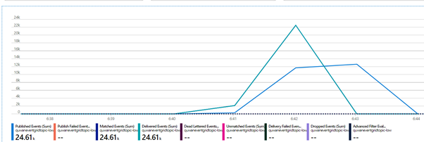
        
Event Grid

        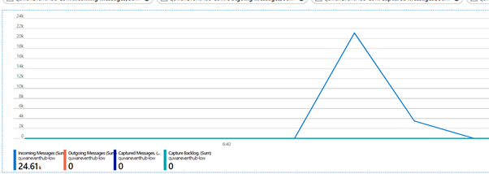
        
Event Hub

    * Batch Size = 5
    
        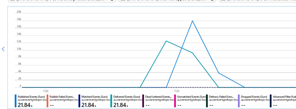
        
Event Grid

        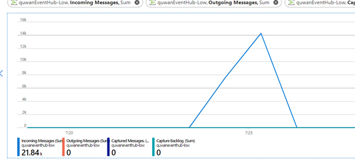
        
Event Hub

### 1. Middle throughput (~ 1200 events/s)
- time percentiles (/ms, publish)

    | Batch Size | 50% | 75% | 95% | 99% | 99.9% | 99.99% | 100% | avg |
    |-|-|-|-|-|-|-|-|-|
    |1/req|10|11|14|34|140|320|510|11|
    |20/req|15|16|42|70|250|300|300|18|
    
- Metrics on Event Grid and Event Hub (Event Hub is handler of Event Grid)
    * Batch Size = 1
    
        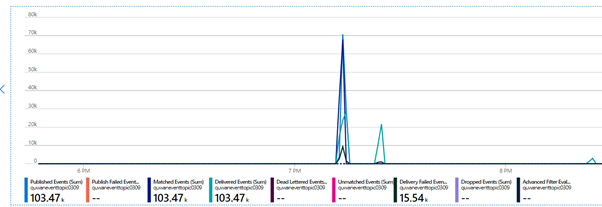
        
Event Grid

        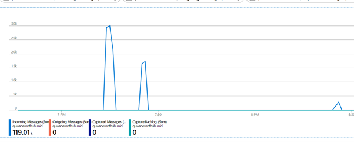
        
Event Hub

    
    * Batch Size = 20
    
        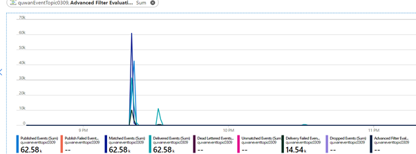
        
Event Grid

        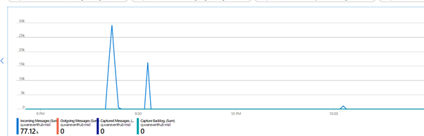
        
Event Hub

### 3. High throughput (~ 5000 events/s)
- time percentiles  (/ms, publish)

    | Batch Size | 50% | 75% | 95% | 99% | 99.9% | 99.99% | 100% | avg |
    |-|-|-|-|-|-|-|-|-|
    |1/req|11|13|46|62|220|380|670|13|
    |20/req|16|18|49|88|270|450|500|21|
   
- Metrics on Event Grid and Service Bus Topic
    * Batch Size = 1
    
        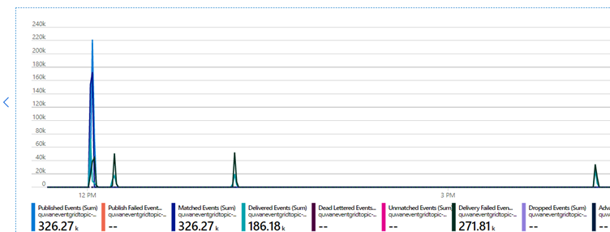
        
Event Grid

        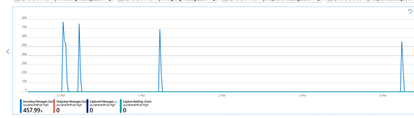
        
Event Hub

    * Batch Size = 20
    
        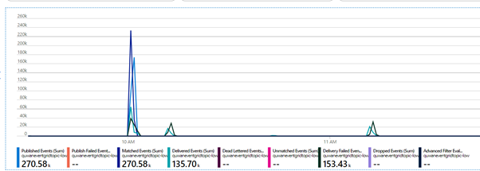
        
Event Grid

        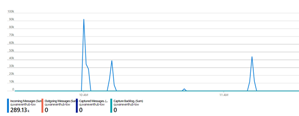
        
Event Hub

## Topic of [Service Bus](https://docs.microsoft.com/en-us/azure/service-bus-messaging/service-bus-messaging-overview) (Standard) as the handler
From the pervious test results, when customer using the Event Grid to handle the notification tasks, their end-to-end experience is limited by the handler throughput performance. 

Here we test what if we use the standard Service Bus topic as the handler of Event Grid, and publish events in high throughput.

### 1. High throughput (~ 5000 events/s)
- time percentiles (Publish)

    | Batch Size | 50% | 75% | 95% | 99% | 99.9% | 99.99% | 100% | avg |
    |-|-|-|-|-|-|-|-|-|
    |1/req|11|11|19|51|180|270|440|12|
    |20/req|15|17|38|75|220|320|460|18|
   
- Metrics on Event Grid and Service Bus Topic
    * Batch Size = 1
    
        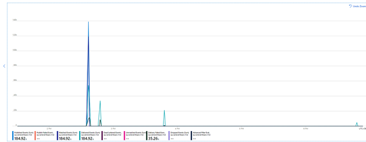
        
Event Grid

        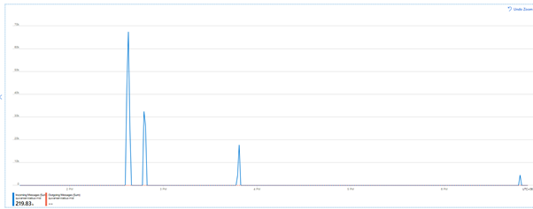
        
Service Bus

    * Batch Size = 20
    
        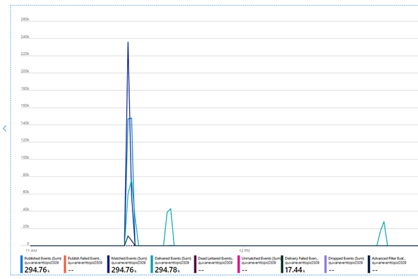
        
Event Grid

        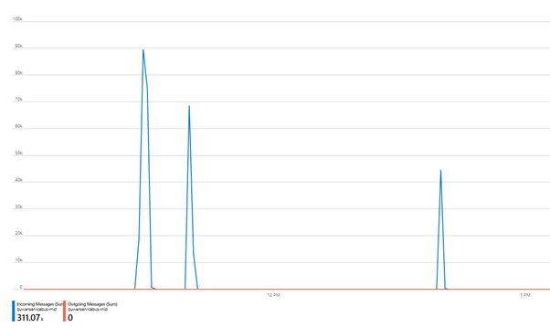
        
Service Bus

## Conclusion
When using the Event Grid as the notification service, customers' end-to-end experience is limited by the handler throughput performance, even if their publish client can perform the high throughput publish process.

If we expect the throughput exceed 500 RPS, We'd better remind users not to use the basic version of notification services in azure as the handlers of Event Grid.

# 2. Some powerful/premium services as the the handler of Event Grid

## Topic of [Service Bus](https://docs.microsoft.com/en-us/azure/service-bus-messaging/service-bus-messaging-overview) (Premium) as the handler

The initial [message units](https://docs.microsoft.com/en-us/azure/service-bus-messaging/service-bus-premium-messaging#messaging-unit---how-many-are-needed) count is 1, and we enabled its autoscale flag.

### 1. Middle throughput (~ 1000 events/s)
- time percentiles (Publish)

    | Batch Size | 50% | 75% | 95% | 99% | 99.9% | 99.99% | 100% | avg |
    |-|-|-|-|-|-|-|-|-|
    |20/req|15|17|47|66|210|270|270|20|
   
- Metrics on Event Grid and Service Bus Topic

    * Batch Size = 20
    
        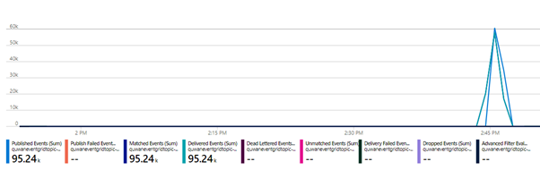
        
Event Grid

        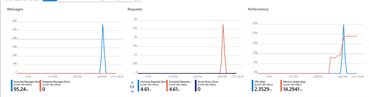
        
Service Bus

### 2. High-Middle throughput (~ 3000 events/s)
- time percentiles (Publish)

    | Batch Size | 50% | 75% | 95% | 99% | 99.9% | 99.99% | 100% | avg |
    |-|-|-|-|-|-|-|-|-|
    |20/req|15|17|48|77|240|410|950|20|
   
- Metrics on Event Grid and Event Hub (Event Hub is handler of Event Grid)

    * Batch Size = 20
  
        
        
Event Grid

        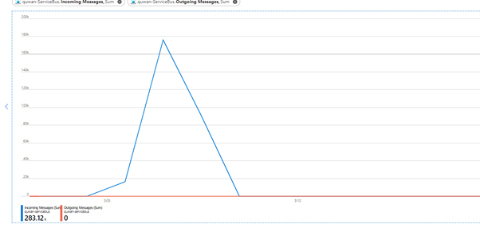
        
Service Bus

### 3. High throughput (~ 5000 events/s)
- time percentiles (Publish)

    | Batch Size | 50% | 75% | 95% | 99% | 99.9% | 99.99% | 100% | avg |
    |-|-|-|-|-|-|-|-|-|
    |20/req|16|18|49|83|240|410|520|21|
   
- Metrics on Event Grid and Event Hub (Event Hub is handler of Event Grid)

    * Batch Size = 20
  
        
        
Event Grid

        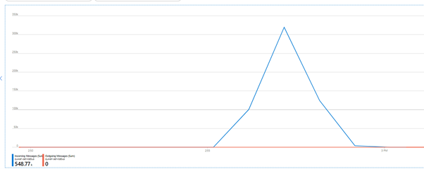
        
Service Bus

## Conclusion

The powerful/premium notification service can handle the high throughput scenairo if they are handlers of Event Gird. But we need to be aware that Event Grid itself can only guarantee the 99.99% avaliable server time refer to its [SLA](https://azure.microsoft.com/en-us/support/legal/sla/event-grid/v1_0/). So there will still be some devliery fails in Event Grid metric.

If we expect the throughput exceed 3000 or higher RPS, We'd better remind users to use the premium version of notification services in azure as the handlers of Event Grid.