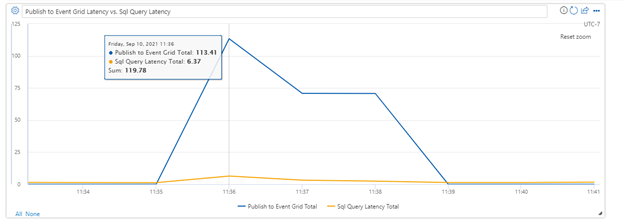
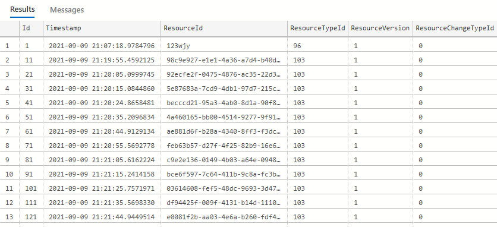
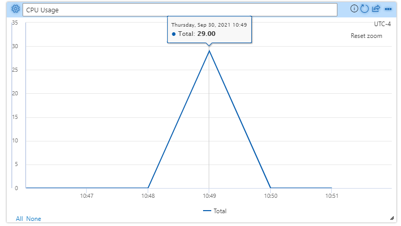
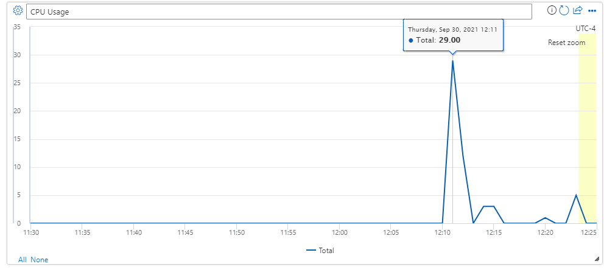
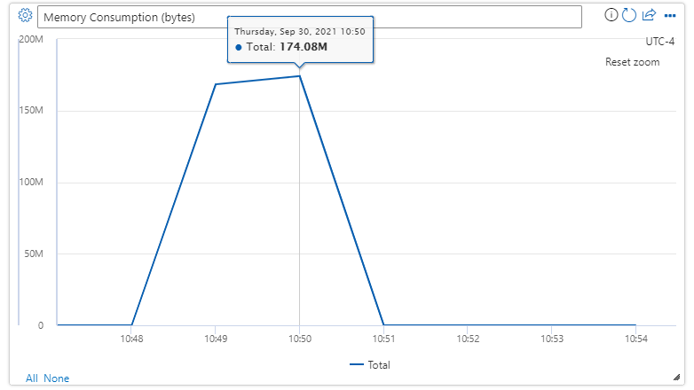
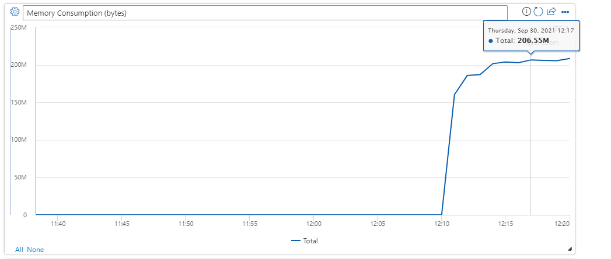
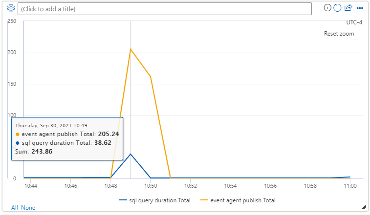
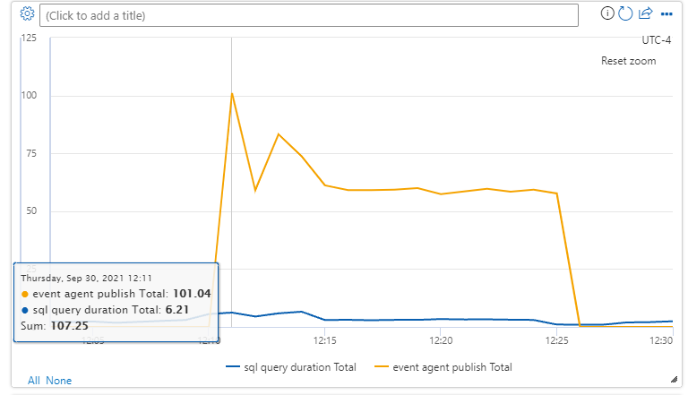

Outline possible perf improvements for Event Agent

[[_TOC_]]

# Business Justification

The Event Agent currently reads resource change data from a table and sends the changed records to the Event Grid. In the future we would like to increase the amount of resource change data we can read and send to the Event Grid. This can be achived through parallelization and/or configuration changes.

# Scenarios

1. Get baseline throughput metrics for a single Event Agent running with a pageSize of 200.
2. Get throughput metrics for a single Event Agent running with larger pageSizes (400, 600, etc)
3. Test throughput when running multiple Event Agent Services
4. Test throughput when running one Event Agent Service but using multiple Tasks to send data to Event Grid in parallel.

# Additional considerations
This design does not assume that events need to be delivered in order. If they need to be delivered in order and only once, then we should consider other solutions such as Service Bus.


# Design
**Background**

When doing performance testing, we created additional metrics (EventAgentSqlFetch and EventAgentPublishEventGrid) to help determine where most of the latency was occurring when processing events from the resource change data table.

Based on the data below, the current bottleneck when testing large amounts of change events is the rate at which we send events to the Event Grid.
    
When processing ~25000 events, the chart below shows the latency of sending to Event Grid is about 20x slower than the latency of performing the SQL query to fetch the resource data changes. Some of reasons why are mainly due to network latency and service latency, so it not really an issue with the existing code. However there may be ways to improve which will be described later. 




Possible ways to increase throughput (not mutually exclusive)
1. Increase the pageSize of the SqlQuery from 200 -> 600
    
    This increases the batch size of events sent to Event Grid and yields roughly 3x increase in performance.

    | pageSize | Processing Time for 25571 records
    | --- | ------------|
    | 200 | 140 seconds
    | 400 | 71 seconds
    | 600 | 49 seconds

    Increasing to a page size >= 1000 seemed to return http 413 (Request Entity Too Large) errors with Event Grid.


2. Increasing the number of event agents or number of parallel Tasks sending data to Event Grid also increases throughput.

    For each additional agent or additional Task (N) we can expect the time to process records to be roughly (records/N)

    | # of Event Agents or Tasks | Processing Time for 25571 records (pageSize 600)
    | - | - |
    | 1 | 49 seconds
    | 2 | 27 seconds

    Parallel Tasks Cont.

    | # of Parallel Tasks | PageSize |Processing Time for 25571 records
    | - | - | - |
    | 4 | 1200 | 26 seconds
    | 4 | 2400 | 14 seconds
    | 8 | 4800 | 7 seconds

    25571 records in 7 seconds is ~3,653 records/sec.

**Running multiple event agents vs. One event agent with multiple sender Tasks**

Either solution technically should work.

Running multiple event agents in Service Fabric entails:
1. Set a service instance count, let's say 4.
2. Service starts up, gets an id (Service 0, Service 1, Service 2, Service 3)
3. Service queries resource changes that are (service id = row id % num event agents)
4. Service publishes events to Event Grid
5. Set checkpoint for each service id.

Pros:
1. Leveraging Service Fabric capabilities for scaling
2. Potentially better availability for HA/DR
3. Somewhat adaptable to AKS if we switch (assigning a list of partitions to service/pod)

Cons:
1. How to handle checkpointing if we change # of event agent instances. If we decrease from 4 event agents to 2 event agents, how do we make use of the 4 previous checkpoints? Could start from the most out-of-date checkpoint and reprocess.
2. Purge job considerations with multiple Event Agent Services. We would like the purge job to run on only one Event Agent Service. (Could just run on Service 0).
3. Potentially have to change the SF Application Manifest for FhirApplication.
4. Requires provisioning and deprovisioning code changes.
5. Would need to partition the FetchRecords Sql Query
6. Would assigning more than one partition to each service be possible? It is possible from SF perspective but how to perform Sql Query for all the partitions a service is assigned? Multiple Queries? Threads/Tasks still needed?


Running as one event with multiple Event Grid sender Tasks entails:
1. Event Agent Provisioned with instance count = 1.
2. Define maximum number of parallel Tasks
2. Service queries for change data from Sql table (one Task)
3. Once we get the records, then split records into paritions ``` partition = new List<ResourceChangeData>```, where the partition# is the maximum number of Tasks.
4. We can divide the records up by row id MOD maxTasks
5. Once we have divided the records into paritions, each Task is assigned a partition. Each task sends records in its assigned partition to Event Grid.
6. Set checkpoint once all the Tasks have completed their work.
7. Move on to the next batch of records 

Pros:
1. Not a whole lot of effort required (10 lines of code)
2. Can be writen to be adaptable to different loads (can spin up and down based on need).
3. Can guaranty some sort of balance among the work.
4. Potentially saving on some CPU/memory since we only have one service running at all times as opposed to 4.
5. Potentially fewer sql queries than the multiple service approach. (1 query/sec vs. 1 query/sec for each partition)
6. Also adaptable to AKS if we switch
7. Don't necessarily need to partition the FetchRecords Sql Query
8. Checkpointing is easier
9. Sample code seems to yield good results so far.

Cons:
1. Not leveraging SF capabilities for scaling and potentially reinventing something that is solved.
2. Not great for HA/DR if the single Event Agent Service goes down (maybe solved with replicas though)


**Sending Data to Event Grid with parallel Tasks**

Sample code here:
https://microsofthealth.visualstudio.com/Health/_git/health-paas/commit/6f0b01990e62e677c25bd7cbbe25c2d77fccc98e?refName=refs%2Fheads%2Fpersonal%2Fwiyochum%2Fevent-grid-parallel-tasks

Essentially we are doing this:
```dotnet
    // test splitting up the records into 4 collections (can be more in the future)
    // will make this configurable in the future
    int maxPartitions = 4;
    var lists = new List<List<ResourceChangeData>>();
    for (int partition = 0; partition < maxPartitions; partition++)
    {
        lists.Add(new List<ResourceChangeData>());
    }

    // distribute events across the partitions
    for (int index = 0; index < records.Count; index++)
    {
        var partition = index % maxPartitions;
        lists.ElementAt(partition).Add(records.ElementAt(index));
    }

    // process partitions in parallel
    await Task.Run(async () =>
    {
        var tasks = lists.Select(async list =>
        {
            var events = list.Select(rcd => _publishEventsWorkerHelper.CreateEventGridEvent(rcd)).ToList();
            if (events.Count > 0)
            {
                _logger.LogInformation(message: $@"EventAgent:Event publishing {list.First().Id} {events.First().Id}");
                await _eventSink.WriteAsync(events).ConfigureAwait(false);
                _logger.LogInformation(message: $@"EventAgent:PublishEventsWorker Published {list.Count} records up to {list.Last().Id}.");
            }
        });

        await Task.WhenAll(tasks);

        // when all tasks are done, checkpoint and increment
        long maxEventId = records.Max(record => record.Id);
        lastProcessedId = maxEventId;

        _lastKnownCheckpoint.Identifier = _eventAgentCheckpointIdentifier;
        _lastKnownCheckpoint.LastProcessedDateTime = records.Last().Timestamp;
        _lastKnownCheckpoint.LastProcessedIdentifier = maxEventId.ToString();
        await _checkpointClient.SetCheckpointAsync(_lastKnownCheckpoint, cancellationToken).ConfigureAwait(false);
    });
```


**Fetching data using partitions (if necessary)**
```sql
CREATE OR ALTER PROCEDURE dbo.FetchResourceChangesPartitioned
    @partitionId smallint,
    @partitionRange smallint,
    @startId bigint,
    @pageSize smallint
AS
BEGIN
    SET NOCOUNT ON;
    SELECT TOP(@pageSize) Id,
      Timestamp,
      ResourceId,
      ResourceTypeId,
      ResourceVersion,
      ResourceChangeTypeId
      FROM dbo.ResourceChangeData WITH (REPEATABLEREAD)
    WHERE Id >= @startId AND Id % @partitionRange = @partitionId ORDER BY Id ASC
END
GO
```

```sql
EXEC dbo.FetchResourceChangesPartitioned 1, 10, 1, 100;  
GO  
```



# FHIR Service plans for scaling
TBD
- Document throughput SLA/targets for FHIR Service.
- Manual Scaling?
- Auto-Scaling?

# Resource Consumption by Event Agent Service
CPU (PageSize = 4000, Tasks = 10)


CPU (PageSize = 200, Tasks = 10)


Memory (PageSize = 4000, Tasks = 10)


Memory (PageSize = 200, Tasks = 10)



Network - TBD

Sql Query Performance

PageSize = 4000 has an average Sql Query Latency of ~38ms


PageSize = 200 has an average Sql Query Latency of ~6ms


# Event Grid Limits and Scaling
Current Event Grid limits and quotas are documented here: https://docs.microsoft.com/en-us/azure/event-grid/quotas-limits

- TODO - how do we want to handle scaling beyond these limits. What is the process? Manually update and manually notify Event Grid team?


# Test Strategy
TBD - may leverage some of the perf testing tests

# Other
SF partition documentation: https://docs.microsoft.com/en-us/azure/service-fabric/service-fabric-concepts-partitioning

*Describe any impact to privacy, localization, globalization, deployment, back-compat, SOPs, ISMS, etc.*
