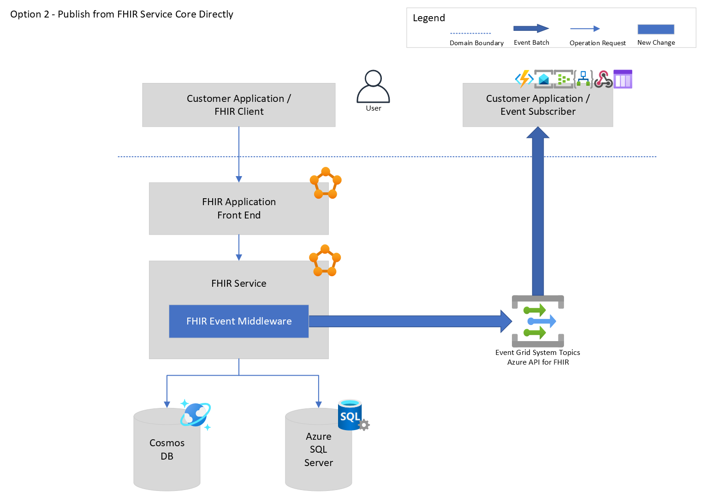

# Event Framework

[[_TOC_]]

# 1 Business Justification
The customers want the capability to receive events from Azure Healthcare API services like FHIR, DICOM or IoT Connector. When different events happening in those services, it will enable them to use the events for running continuous business workflows asynchronously. 

We want to launch FHIR event capability in Public Preview with Jupiter in August 2021 as a foundation milestone and then work towards the GA for the next milestone.

# 2 Scenarios

## 2.1 In Scope

High Level Scenarios:
- (P0) As an Azure customer, I wanted to receive the events when the resources get created/updated/deleted on my FHIR server.
- (P0) As an Azure customer, I wanted to have filters that define the conditions of when the event should be sent to my subscriber endpoint.
- (P0) As an Azure customer, I wanted to manage the subscriptions based on different event topics. The subscriber, either with Azure managed service or with applications hosted in somewhere else, will get triggered when there is new event happening.
- (P0) As an Azure customer, I wanted a secured way of handling the events. I wanted to verify and receive events from the trusted sources.
- (P0) As an Azure customer, I wanted to continue receiving the past events if my endpoint did not receive it successfully transiently.
- (P0) As an Azure customer, I wanted to keep the past events if my endpoint has severe issues to receive the events.
- (P0) As an Azure customer, I wanted the event to describe the resource data change that has happened, including create, update and delete. I do NOT want any PHI/PII information appeared in the content of the event.
- (P0) As an Azure customer, I can use PaaS portal/AZ CLIs/ARM template to manage subscriptions for my FHIR server topic.
- (P0) As an Azure customer, I expect the event published to my subscriber within near real-time from when the data change committed to the persistence.
- (P0) As an Azure customer, I want to see the metrics for event delivery count, failure rate and other stats.
- (P2) As an Azure customer, I want to receive events for resource changes with a FHIR bundle request.
- (P3) As an Azure customer, I want to receive events for resource changes within the bulk import.
- (P3) As an Azure customer, I may not want the ordering in the current use cases proposed, but I have a workaround in case I need it.

## 2.2 Out Scope

Below items are out of scope in current priority list, we may or may not revisit to bring them in scope in later milestones.

- As an Azure customer, I understand that the ordering is not guaranteed in initial launch of the eventing system of the Azure API for FHIR.
- As an Azure customer, I understand that the event system will only have topics for FHIR server data operations. The DICOM and IoT Connector will not be included at initial launch.
- As an Azure customer, I understand that, with OSS, I will not be able to have identical experience as what PaaS offers. Meantime, I will still be able to use FHIR Proxy.  
  **Note**: for OSS, we may still be able to let customer use the event features, for example, configure the OSS to emit events to Event Grid with custom schema. But this is not committed to the current milestones.

## 2.3 Scale Estimations
- (P0) As an Azure customer, I accept that the amount of data manipulating events should be 200 on medium, 2k on peak, for one workspace per second.
- (P0) As an Azure customer, I accept that the delay of the event delivery to be less than 5 seconds. 
- (P2) As an Azure customer, I accept that the amount of data manipulating events should be less than 2K for one workspace per second.
- (P2) As an Azure customer, I accept that the delay of the event delivery to be less than 1 second. 

# 3 Metrics

These are what we wanted. We will further investigate the possibility of collecting below metrics.
1. (P0) We will collect number of workspace accounts that have been configured as Source for Event Subscription.
1. (P0) We will collect P50(Average), P99(Peak) number of events published per second or per hour, for the Event Subscriptions. The dimensions can have:
   - All subscriptions. To evaluate the capability of our backend service.
   - Subscriptions per Azure Healthcare API workspace account, to evaluate the hot-spot account.
1. (P0) We will collect metrics of the filtering usage.
1. (P0) We will collect the performance impact on FHIR server.
1. (P0) We will collect the price impact on FHIR server.
1. (P0) We will collect failure rate of publishing.
1. (P0) We will collect failure rate of sending, if possible.
1. (P2) We will monitor when the delivery time of an event or certain events breaks or will break (more advanced) the proposed delaying time.
1. (P2) We will design telemetry to indicate average delaying time of the events to tell when and whether we will need to scale up the throughput. 

# 4 Design

## 4.1 Event Delivery Service

### Onboard Event Grid as system topic for Azure Healthcare APIs.

**Summary**  

Event Grid provides an onboarding process for 1P Azure service to publish events to the managed system topics. We can leverage Event Grid's existing features to meet all the design goals. Customers can easily create Topics, Subscriptions by choosing the Azure Healthcare API resources as the event source. The other features like access control, authentication, security, network are also offered out of box.

In the control plane, the Health PaaS RP will receive the resource information from Event Grid's RP via the ARM proxy. 

In the data plane, the event framework of the FHIR will start publishing the events to the endpoint of the Event Grid that should have been assigned when onboarding.

**The high-level workflows for RP service.**

1. Event Grid RP service received the request from customer for creating the event subscriptions, filters and other properties from ARM.
2. Event Grid RP service will process with asynchronous completion.
3. Event Grid RP service will construct a proxy resource and send it in request to HealthcareApis RP service, which is the publisher service.
4. HealthcareApis RP service processes the request, provisions or de-provisions the resources and returns the corresponding results back to the Event Grid RP. 
5. Event Grid RP will mark the event subscription state as "Succeeded".

**On/Off for event publishing**
1. When the first event subscription is created, there will be a resource object created and sent with name "_default".
1. When all the event subscription is deleted, there will be another deletion request sent with the same name "_default".

**Architecture**


**SLA**
| MONTHLY UPTIME PERCENTAGE | SERVICE CREDIT | 
|-|-|
|< 99.99%|	10%|
|< 99%| 25%|

**Evaluation**

Pros:
1. The purpose of the FHIR event aligns with the definition of event that the Event Grid handles.
2. Event Grid is faster in general because it's a push-push model. In this model, if we also design a system that is pushing out the events, this could reach best result for "near realtime".
3. Event Grid offers first class level experience for managing the resources usually happens in a pub/sub business domain. We have out-of-box solution for our customer to use proposed features.
4. When we integrate with Event Grid, we will have less work for recreating the pub/sub experience, which is not necessary to our core functionality at this point.
5. Event Grid integrates better within the Azure eco-system. Customer will have plenty choices to define their subscribers, there is seamlessly integration that handles event delivery as well as the authentication, security boundary.
6. The Event Grid delivers in batch.
7. We can launch faster to win more chances for customer to integrate with Azure Healthcare APIs ecosystem.
  
Cons:
1. The Event Grid does not guarantee delivery in order given the nature of a push mode. We currently don't have business requirement for this. Even if we do, customer can leverage FHIR resource version or the Sequence number we may add to the payload to reconcile the sequence on their end. That would be a work around. 
1. The Event Grid does not guarantee no duplicates given the nature of a push mode. Customer should consider implement their subscriber with idempotence assurance.
1. The charge of Event Grid will be higher than Service bus when the amount go beyond roughly 120 events/ second.

### Justification for using Event Grid
***Other eliminated options and more research results can be found in [Appendix](#appendix).***

We get these benefits:
1. The goal is to send the event that describes the state changes of the FHIR resources persisted on the FHIR server. From the nature, it falls into the event concept.
1. The Event Grid is a push-push mode ensuring that the event will be delivered in short delay once it has been published. It can trigger multiple subscribers with existing integrations of many 1P Azure services natively, including the Azure Functions, Logic Apps etc.
1. The performance and reliability meets our current business and technical goals.
1. Event Grid offers capabilities to manage the subscription relationship, the event source topics, subscribers, network, security so on and forth. We can fully leverage the Event Grid with first-class level support on those capabilities. At first milestone, we can focus on building the data pipeline infrastructure. The development complexity, effort budgets, tech and timeline risks are competitively more manageable.
1. If there is a chance that we offer the event experience sooner, the customer will be able to start using it sooner. There would be more room for us to learn from the outcome without spending efforts on unproven values.

We will have these limits:
1. Event Grid does not guarantee the delivery in order. In short term, We can offer a workaround with sequencing number. In the future, when that requirement gets prioritized, we can also expose another channel with service bus.
1. Event Grid does not offer de-duplicate experience for both publish and delivery processes. we would have to suggest customer to ensure idempotence in their subscriber implementation.
1. In push-push mode of Event Grid, we can only work and handle situations when publishing the events to the Event Gird from our side, but customer's end-to-end experience also depends on the process that Event Grid deliveries the events to the specific handlers. Customer may still face long latency/lost/duplicate even if we successfully publishing the events to the Event Grid.
1. Event Grid has a limit for peak traffic at 5,000 events/second OR 5 MB/second (whichever is met first)

   For bulk import or some other scenarios when the traffic is not consistently at 5,000 CUD requests/second, we can try flattening the throughput curve over time but delay applies.

   In the future, we will introduce filters in the publishing-time to further reduce the amount of the event. 

   We can also try working with Event Grid team to increase the limit.

With Event Grid integration. It also implies:
1. Max event throughput is 5,000 events/second. That is the limit for a topic which is at the workspace level at this point. We can also work with Event Grid team to see potential strategy to scale that up for the system topic. 
1. Max event size is 1MB,
1. We have tested on Azure VM, the latency to communicate with Event Grid is at level of 10x ms. It was for sending single event via the interface from Event Grid SDK. The testing VM, testing Event Grid endpoint and the FHIR server are in same Azure Location.
1. At-least-once delivery, duplicate may happen. On the other side, this also implies the guarantee that the Event Grid should not be the factor that causes any missing event of the data change commits as long as our service sends them successfully.
1. 24 Hours TTL for retrying.
1. Dead Letter storage applies when all retries failed.
1. Price is $0.60 / 1 million events after first free 100k events in each month
1. Event Grid can not deliver the events using private endpoint, the isolation is not supported. However, customer can talk to other Azure services, like Event Hubs, Service Bus or Azure Storage, as a middle hop with the managed identity, then use Azure Functions or webhook deployed on the VNet to consume the events.
1. At this moment, the topic of the Event Grid only supports top-level resource, in our case, it's going to be workspace level in Azure Healthcare APIs. This implies that we will send event for all FHIR service accounts by default.  
   
   We can work with Event Grid team to figure out the possibility of using fine-grained level of resource as a topic source. 
   
   Meanwhile, customer can use different subscribers with different filters to consume events from different FHIR account. Customer can also create separate workspaces with FHIR servers sending events versus not sending events.


## 4.2 Event Publish Workflow

### Design Tenets

1. The event should describe what exactly has happened. For example: a state has been changed from x to y or there is a proposal (http request) that is changing the state from x to y. Event should not describe what will happen but not yet, otherwise, there will be miscommunication risk. Events should be affirmative and immutable after being generated. 

1. FHIR Event should generate only when it was customer's intent for the data change. For example, any external resource operation should trigger event; internal data operations should not trigger events. 

1. Event emission should be closer to the source of truth to reduce the chance of failures in relay or miscommunication in the middle. 

1. FHIR event delivery is a derived data system based on the FHIR datastore, it should avoid or reduce new overhead in any form, like compute, memory, network, delay etc, which can impact performance or introduce new limits to the FHIR server. 

1. An event can describe the occurrence of one single thing or can describe occurrences of a series of things. For example, the state change of a few things happened sequentially. 

### Solutions

In general, the Event Sourcing pattern is good at solving the problem. In this pattern, the application state changes will be captured and persisted in the append-only store as the source of truth. Different systems can subscribe to the Event Source and react to state change events by replaying them. This pattern decouples the business and the technical domains across multiple systems or services. Because it is an asynchronous communication between systems, and the event publishing should only happen after when the state change has committed, the delay implies. However, there can be improvements for increasing the publishing frequency and throughput. For example, creating materialized views or scaling vertically or horizontally for the event publishing processor.

There are more benefits of implementing this pattern. Here is the article from Microsoft: https://docs.microsoft.com/en-us/azure/architecture/patterns/event-sourcing

### Capture Change Data from Persistence Layer

**Summary**  

In this option, we will leverage the concepts of change feed. The Change Feed is a source that can provide the history of data changes. The history is immutable and contains the changes committed to the persistence in time order. We will have the job agent to consume the change feed and keep sending batched events.
- For the Cosmos DB, the change feed is a feature offered out-of-box.
- For the SQL DB, we will need to implement own change feed.

The job agent or the Event Handling Agent will periodically pull the changes from the change feed with sliding time window, composing the event batch and publish to the endpoint that is assigned by the Event Grid when onboarding.


**Event Schema**
| Name | Type | Required | Description | 
|-|-|-|-|
| topic | string | Yes | The system topic for the event source resource. In our use case, it's workspace resource. |
| subject | string | Yes | The resource data manipulating URI. |
| eventType | string(enum) | Yes | The data manipulating outcome. |
| eventTime | string(datetime) | Yes | The time the event is generated based on the provider's UTC time. |
| id | string(uuid) | Yes | Unique identifier for the event. Customer should also be able to use this ID for dedup. |
| data | object | Yes | A bag for information of the event. |
| data.resourceType | string(enum) | Yes | The resource type manipulated. |
| data.resourceFhirAccount | string | Yes | The FHIR account identifier. |
| data.resourceFhirId | string | Yes | The resource ID manipulated. |
| data.resourceVersionId | string | Yes | The resource version manipulated. |
| dataVersion | string | no | The schema version of the data object. The publisher defines the schema version. |
| metadataVersion | string | no | The schema version of the event metadata. Event Grid defines the schema of the top-level properties. Event Grid provides this value. |

Example:
```json
  { 
    "topic": "/subscriptions/{subscription-id}/resourceGroups/{resource-group-name}/providers/Microsoft.HealthcareApis/workspaces/{workspace-name}", 
    "subject": "myfhirserver.contoso.com/Observation/cb875194-1195-4617-b2e9-0966bd6b8a98", 
    "eventType": "Microsoft.Health.FhirResourceCreated", 
    "eventTime": "2020-12-21T18:41:00.9584103Z", 
    "id": "931e1650-001e-001b-66ab-eeb76e069631", 
    "data": { 
      "resourceType": "Observation", 
      "resourceFhirAccount": "myfhirserver.contoso.com", 
      "resourceFhirId": "cb875194-1195-4617-b2e9-0966bd6b8a98", 
      "resourceVersionId": "1", 
    }, 
    "dataVersion": "1", 
    "metadataVersion": "1" 
  }
```

**Change Data with SQL Server**

For SQL Server, we can leverage the database features to perform the action of capturing the change. Overall, it should be one atomic action along with the original data change statement. This can mitigate the risk that the data gets committed but the change events were not captured due to any types of failures. In the worst case, if that atomic action failed, the original operation will fail and rollback, so customer needs to re-send the request. 

**Change Data Table**   

Here is the schema for the change data table. 
```sql
USE FHIR
GO

CREATE TABLE ChangeData (
  Id                      BIGINT IDENTITY(1,1)  NOT NULL, /* Indexed ID used for performing the query in pagination. */
  Timestamp               DATETIME2(7)          NOT NULL, /* UTC timestamp for when the change data was captured. */  
  ResourceId              VARCHAR(64)           NOT NULL, /* ID of the FHIR resource. */
  ResourceTypeId          SMALLINT              NOT NULL, /* Type ID of the FHIR resource. */
  ResourceVersion         INT                   NOT NULL, /* Data version of the FHIR resource. */
  ResourceChangeType      SMALLINT              NOT NULL, /* Type of the FHIR resource change. */
)
GO
```

**SP update**   

In this approach, we will modify the stored procedure within the transaction that has both data manipulation statements and change capturing statements.

For example: add one more statement in the procedure "dbo.UpsertResource". The existing schema example is [here](https://github.com/microsoft/fhir-server/blob/main/src/Microsoft.Health.Fhir.SqlServer/Features/Schema/Migrations/7.sql#L1214)

***Other evaluated options can be found in the appendix.***

```sql
CREATE PROCEDURE dbo.UpsertResource
  ...
AS
  BEGIN TRANSACTION

  /* <All Other Statements> */

  DECLARE @currentDateTime datetime2(7) = SYSUTCDATETIME()
  
  IF (@isDeleted = 1) BEGIN
    SET changeType = 2  /* DELETION */
  END
  ELSE BEGIN
    IF (@version = 1) BEGIN
      SET changeType = 0 /* CREATION */
    END
    ELSE BEGIN
      SET changeType = 1 /* UPDATE */
    END
  END
   
  INSERT INTO dbo.ResourceChangeFeed
    (Timestamp, ResourceId, ResourceTypeId, ResourceVersion, ChangeType)
  VALUES
    (@currentDateTime, @resourceId, @version, @version, @changeType)

   /* <All Other Statements> */

   COMMIT TRANSACTION
GO
```

**POC and Performance Test**   
Test conditions:
- The perf test was handled with 196 Requests/Second.
- DB was hosted with elastic pool: GeneralPurpose: Gen5, 4 vCores.
- The FHIR server was running on K8s.
- The load testing framework was Locust running on same K8s as FHIR server.
- The network was in local of K8s.

Test Result:  
- There was no obvious change for CPU consumption for the database and Service latency.

***CPU consumption***


***Service response time***


**Event Handling Agent**   

Once we have the Change Data table from the database, we will have a long running job agent periodically pulling the changes from the database, generating the events batch and sending to the endpoint of the Event Grid. The query will be performed in pagination(preferred) or a sliding time window. The endpoint will be assigned when we aboard the Event Grid. It will be saved on the RP document to be used by the Event Handling Agent in the data plane.

The Agent is an application program continuously running. Here are some overall thoughts.
- The simplest way is to have a single runtime instance keeping flushing the events. Given the average amount of operation traffic to FHIR server, and the peak amount we may have is at 1000x level, one agent should be capable to do that. 

  We will address the watermarking strategy for flushed change data in implementation. There could be 2 ways for it: 1) having a sidecar to maintain the watermark, this could benefit horizontal scaling and minimize the change data table 2) marking the state of event delivery in the original change data schema.

- Because single instance can become a single failure point, another goal is to restarting the agent from failure state asap. To achieve that, we can leverage some IaaS offerings like AKS to help manage the runtime health. To improve even further, we can have a few instances warmed up and let one be the leader by locking an object in the CosmosDB or Blob Storage. The other instance will wait and elevated as new leader if the previous one was down.

- To handle higher throughput, we can choose two scaling strategy:
  - Vertical. Find a balance between performance and cost. This may increase the blast radius since the DB may also needs to upgrade to accommodate the needs. However, in this strategy, we still can ensure the global ordering.
  - Horizontal. If any customer has less concern about the ordering, we can design logical partitions to balance the load on change data consumption. The evolved design will be needed to orchestrate the distributed agents, for example, by maintaining a container that holds the leases and watermarks.

More design detail will be addressed in its own design doc. 

**Evaluation**

Pros:
1. The change data captured in an atomic action at database layer. It prevents from losing the track of committed data logically. 
1. The data capture is close and scope to where the original data change happened. Its blast radius is more smaller and manageable.
1. The change feed gets persisted, it opens options for sending events in batch. The consumer has opportunity to rewind on history if there was an intermittent issues happening.
1. We have opportunity to control the knob for throughput. For time insensitive scenarios, we can handle the spike curve of traffic over time.
1. The change feed is a derived system. It will empower the downstream workers for supporting different use cases. It decouples the Event domain from the HTTP server domain of the FHIR server in holistic view. The component in that domain will has self-contained concerns for scaling, no need to worry about HTTP domain logics.
1. The pattern is being used in different occasions for integrating the system communication more reactively. 
1. The solution is simpler. It reduces the burden of holding a long-running process in pull mode. It starts an unstopped stream from the source of truth till the customer's endpoint in push mode all the way down.

Cons:
1. Performance impact implied to the original FHIR operations or FHIR Database. Based on current testing result, we don't see much overhead though.
1. Whenever we change a database type, we will need to implement the similar work.
1. New learning curve may imply for team to use the DB features well.


### Extensions

**GEN 1 with COSMOS DB**   
Cosmos DB offers Change Feed feature out-of-box. It provides a few ways to subscribe to it including both pull mode and push mode. It's horizontally scalable with logical partitions. The change feed are sending in batch during a configurable interval. We can have the similar agent handler to consume the change feed and generate events.


**Scaling with larger traffic**

We will have a few scenarios to scale for traffic potentially:
1. The data manipulating requests grow naturally for customer or when big customer engaged.
2. We will need to support eventing for Bulk import.

In these cases, we should be able to vertically scale up the Database for serving larger amount of data.
We should also be able to horizontally scale the agents with logical partitions for processing change data simultaneously, assuming the order does not matter. If it matters, we will talk in below section.

**Support higher SLA of Delay**

We can increase the frequency for querying the change data table, but on the downside, since the default SQL SELECT will do a table lock so it may impact the SP of single resource, especially on the bundle FHIR operations. We can definitely bring the delay down to the level of millisecond but we need more due-diligence to decide a balance between the delay requirement and performance sacrifice for FHIR. 

**Support FHIR Transaction**

We have a strategy to leverage another metadata table which keep the state of the transaction execution status to mitigate concerns of:
1. No deadlock when Write/Read happened concurrently,
1. Transaction performance impact and potential,
1. Reading interleaved data commits,
1. Reading change data in correct order without dirty data (the data rolled back).

**Support Ordering**

When the ordering requirement gets prioritized, we can have these strategies:
1. Formalizing the sequencing number in the event schema
2. Orchestrate the system to flush the event in correct order and deliver them to a FIFO guaranteed service output, for example, service bus.


### Justification for using This Option
***Other eliminated options and more research results can be found in [Appendix](#appendix).***

Here are the reasons:
1. The data change information will be captured along with the data change itself. It's guaranteed to be atomic. We keep data integrity in the source of truth. It prevents lost events of committed data logically. The physical loss may still possible but it will be addressed in Disaster Recovery, for example, data center outage.
1. The event is emitted in a place close to where the event happened. There is less intermediate steps in the middle, so there is less chance to have miscommunication or other failures. For example, with middleware approach, when one middleware changes the response context, it may impact the other middleware. The middleware of different logics will be coupling.
1. We keep the event system a derived system from resource server system. We decouple it from the FHIR HTTP domain to a self-contained domain for event. The responsibility are cut clear and simpler for each domain as well as the concerns. 
1. This architecture closes our current requirements but open for future innovations. For example, when we start adding filter features, the system does not have to include the concerns of the HTTP server.
1. The runtime programs required in event system will have their own hosting environment, based on different requirements, they can adapt to different scaling strategy in its own scope. It's technically and economically more elastic.

Here are the downside and mitigation plans:
1. Whenever we change a data persistence type, we will implement the similar work. However, in the foreseeable future, the data persistence should not be more than Cosmos Db and Azure SQL server at this point. 
1. The Change Data schema is specific per each service type in Azure Healthcare APIs. So far, we don't have plan to develop a generic solution for sending the events for various protocols. However, we can try to come up with sharable libraries if this is proven to be good approach.
1. Delay implies. Because we capture the data change first and then let another job agent perform periodic actions to send event. The delay in between can't be avoided. So far, we don't have time-sensitive requirements, the event should be delivering near real-time, the proposed delay time is acceptable. For future, we can evaluate different scaling strategies to increase the speed and throughput.
1. Extra cost implies. We will store the data changes in another table for later use. There is extra cost incurring for such storage. The resource table currently is responsible for supporting FHIR server domain logic, we are trying to avoid putting extra burden on it and avoid the disruptions. We will provide more insights in the pricing analysis.

   On top of that, we can find a practical way to define a policy that purge the change data as time goes. At this point, the data appears to be not useful after the event gets emitted. 

# 5 Risks
**NOTE: working on evaluating the mitigation plan for the risks**

## 5.1 Performance Impact Implications
- Change Feed with DB
- Bulk Import

Based on the POC result, the performance was not hugely impacted. The measuring dimensions were primarily focusing on Database resource consumptions and FHIR service response time.

## 5.2 Uncertainty with transaction use cases
The transactions can be handled in current design with another metadata table which help the query to look up data without locking the original SP transactions and can also guarantee the order of the event. Once we have more clarity for the FHIR transaction and how the event will be generated for those, we will have more detailed implementation designs.

## 5.3 Disaster Recovery story

- The basic principle is that we should make sure the events for data change will never get lost before delivered to customer's subscriber. Further details will be addressed in the implementation. 

# 6 Test Strategy

- Unit tests.
- Integration test to cover integration of:
    - Initialization when enable the Event Service.
    - Communication between RPs
- E2E test to cover event life cycle procudure.
- Performance test to make sure there's no much performance downgrade when customer enable the Event service.

# 7 Security and Privacy
- Subscriber authentication will be handled by event grid to guarantee no spoofing requests can be sent to subscriber's endpoint.
- No PHI information should be submitted through the event message.

# 8 Appendix
## 8.1 Eliminated Options for Control Plane
### Option 2 Deliver event with Service Bus provided by customer

**Summary**  

Service Bus supports pub/sub with topics. In this option, customer will need to choose a Service Bus Queue that has been provisioned on customer's Azure subscription to receive the messages. The authentication can be done with managed identity. 

In the control plane, we will need to enrich the Health PaaS ARM and RP to manage the service configuration resources used for FHIR event. Here are list of changes we should consider implementing:
- the ARM manifest and RP API changes to support, at least but not limited to
  - definition of the subscription resources that has: 
    - Topic Selection at FHIR service level
    - Event Type Selection at FHIR service operation level
    - Subscriber information, in this case, it's the Service Bus.
  - definition of the filter resources that has:
    - Positive or negative conditions.
- user who has enough permission, like with the admin role or with the managed application contributor role, can send 

In the data plane, we will send the messages to the Service Bus queue provided by the customer.

| MONTHLY UPTIME PERCENTAGE | SERVICE CREDIT | 
|-|-|
|< 99.9%|	10%|
|< 99%| 25%|

There is additional complexity to support the Private Link.  


One option we can provide is that customer can choose to trust our service and grant the access to our service identity, assuming we will have one assigned. In this case, the data will only flow in Microsoft's backbone infra without going to the internet.  


if customer so far it's only supported with Premium tier [(more info)](https://docs.microsoft.com/en-us/azure/service-bus-messaging/private-link-service).

**Architecture**


**Evaluation**

Pros:
1. Service Bus offers FIFO given it's a message broker queue so customer can pull from it.
1. Service Bus has capability to guarantee no duplicates are polled.
1. Service Bus support larger publishing size.
1. Service Bus charges lower for customer with larger traffic.

Cons:
1. Delay of the Service Bus goes higher than Event Grid on average.
1. We need to implement the pub/sub experience in Azure Healthcare APIs. We have to manage all related resources involved. That is going to be big amount of efforts to invest. 
1. The charge is higher than Event Grid below 120 events/second.
1. More work for security benchmark implies.

### Option 3 Deliver event with internal Service Bus

**Summary**  

In this option, instead of letting customer provide a Service Bus Queue, we will provision one automatically for customer and expose the access to customer. In this option, we can also automatically provision the pre-defined topics for customer to subscribe.

**Evaluation**

Option 3 has many downside on top of the Option 2, including but not limited to:
- We will need to manage and configure the internal Service Bus. We will define more interfaces to manage the internal Service Bus, for example, retention period, dead letter storage etc which are extra works and unnecessary to the Healthcare APIs domain.
- More complexity in security benchmark implementation.
- More complexity in Geo-Recovery.
- Extra cost implications.

There could be more downside but given above shortages, we can easily found Option 2 is more favorable than Option 3 for using the Service Bus.


## 8.2 Eliminated Options for Control Plane
### Option 2 - Change Feed from middleware layer in FHIR service core

**Summary**  

In this option, we send the event from a middleware layer directly. The naive way is when the data gets committed and the operation result coming back from the persistence layer, the event will be sent.



Example code:

```c#
public class EventMiddleware : IMiddleware
{
    private readonly IFhirRequestContextAccessor _fhirRequestContextAccessor;
    private readonly IMediator _mediator;
    private readonly ILogger<EventMiddleware> _logger;

    public EventMiddleware(
        IFhirRequestContextAccessor fhirRequestContextAccessor,
        IMediator mediator,
        ILogger<EventMiddleware> logger)
    {
        EnsureArg.IsNotNull(fhirRequestContextAccessor, nameof(fhirRequestContextAccessor));
        EnsureArg.IsNotNull(mediator, nameof(mediator));
        EnsureArg.IsNotNull(logger, nameof(logger));

        _fhirRequestContextAccessor = fhirRequestContextAccessor;
        _mediator = mediator;
        _logger = logger;
    }

    public async Task InvokeAsync(HttpContext context, RequestDelegate next)
    {
        EnsureArg.IsNotNull(context, nameof(context));
        EnsureArg.IsNotNull(next, nameof(next));

        await next(context);
        if (context.Request.IsFhirRequest())
        {
          PublishEventsAsync(context); // Transform the object and call Event Grid endpoint with the client.
        }
    }
}
```

**Limitations**

- Hard to mitigate the risk that the data change has committed but events failed to send in various situations.
  
  We can add more retries but that will sacrifice the FHIR server performance. Another way is to having human intervention which increase the operation cost. For example, once we get error logs, technician can look up what happened and backfill the event publishing.

  But in the extreme worst case, if the runtime crashes, either any thread or the whole process is down before telemetry generate, the event track will get lost.

- To send event in batch, we need in-memory caching on the server host, assuming we do not want to over-engineering with a remote cache.
- Increase the chance of generating duplicated events because we are not emitting event for net new changes but operation results, the workflow is not stateful, the current middleware execution context is not aware of states of past events.
- Though we don't need deliver in order at this moment, but this option can't support that requirement when it comes up. The reason is the ingesting point is from each HTTP request which is discrete with unpredictable order in time.

To solve the problem described above, we can also add data change store from middleware layer.


In this evolved option, every data commit will be tracked. There is a state-transition logic maintained. When a data operation request comes in, we persist a record upon it with the initial state, for example, ```PendingToCommit```. When the data commits finished, we update that state to ```Committed``` which means that the record is ready for event. There will be a similar job agent running like in the option 1 for collecting records and sending events in batch. For a bad record that hangs in initial state, agent can perform sanity check with DB and recover that event.

Since the agent can run on a separate host, we have more flexibility to perform more retries with back-off strategy.

**Evaluation**

Pros:
1. If we go with the remote data cache approach for keeping tracking of committed data, this can be handled in async calls from the middleware. It will not impact the DB performance, but it can impact the performance of the FHIR server.
1. Easier to develop. Leverage the compute power of the FHIR server for emitting the event.
2. In directly publishing mode, because we only add a middleware layer and very little logical processing is involved, the SLA mainly depends on SLA for Event Grid.

Cons:
1. Overall, it introduces very complicated logic for capturing the change in two steps, which can be easily solved by DB feature in one step.
1. It takes dependency on FHIR HTTP server to kick off the events, for other data incoming paths that don't go with HTTP requests, we will have to add more work.
1. It impact the performance of FHIR server, though it may be small or not.
1. If we go without a remote data caching or persistent, we will not be able to mitigate the risk that we may lose the track of the committed data due to a few types of errors as discussed above. It will also limit us to have a robust solution for sending events in batch.  

   If we go with a remote data caching or persistent, we would introduce new dependency to the middleware for using an external data caching or data storage service, which is extra to HTTP server comparing to option 1.

4. It couples with the FHIR HTTP server domain. When extending and scaling, the concerns are hinged for each domain. For example, when we will run more complicated filters during time of publish, we have to further concern about the impact of the FHIR server or have to limit the options of doing that.
5. It's a few step away from the data persistent layer. It's creating another barrier for maintaining all the middleware in the HTTP server. This middleware is not required for handling a HTTP request. It's break the Single Responsibility or Simple Responsibility of the FHIR server. 

### Option 3 - Integrate in API Proxy Layer in FHIR FrontEnd Application

**Summary**   

In this option, we examine the HTTP metadata returned from the FHIR service to determine the data operations just happened. The event uses the assumption that the HTTP method and HTTP response code exactly follow the FHIR protocol. However, the abuse of those fields or a mistake can easily make event fail.

This option is not recommended as it breaks a few design tenets. There are other reasons explained in the below.

API Proxy layer resolves communication problems for request ingress and response egress. Usually, it’s an outfacing proxy responsible for routing, authenticating, auto-balancing etc. The resource data change event should not include in that domain. 

There is a few hops from the proxy layer to the persistence layer. The failure in the middle will also result in event delivery failures. 

In this option the proxy layer is coupled with the core layers. The future change of any layer will have unnecessary concerns for each other. Fundamentally, it should not be a good practice. 

This may break the isolation on FHIR account level as well. 

Overall, we will skip this option.


## 8.3 Event Delivery Service Options Research
In this section, we look at below options:
 - **Event Grid**  
   The Azure service that manages near-real time pub/sub that triggers handlers asynchronously with events.  
   More info: https://docs.microsoft.com/en-us/azure/event-grid

 - **Service Bus**  
   The message broker implemented with the message queues and pub/sub topics.   
   More info: https://docs.microsoft.com/en-us/azure/service-bus-messaging

 - **Event Hub**  
   The big data platform that ingest events. It doesn't manage the pub/sub automatically. The event consumer or subscriber needs to use client to pull events. There is integration with Functions or Stream Analytics but it doesn't give a out box pub/sub management offering.  
   More info: https://docs.microsoft.com/en-us/azure/event-hubs

 - **Queue storage**  
   The service that stores large numbers of messages permanently.  
   More info: https://docs.microsoft.com/en-us/azure/storage/queues

### Comparisons

There are many dimensions and perspectives to compare above options. Some good resources are:
- https://docs.microsoft.com/en-us/azure/event-grid/compare-messaging-services
- https://docs.microsoft.com/en-us/azure/service-bus-messaging/service-bus-azure-and-service-bus-queues-compared-contrasted

Some useful callouts quoted below:
 - The differences between Event and Message. The Event is notification describing the state/condition changes of a thing. The message has data content of a thing or an event.  
 - How to gauge them with our use case, at high level:
   Comparison of services
   | Service | Purpose Type | When to use |
   |-|-|-|
   | Event Grid	| Reactive programming | Event distribution (discrete)	React to status changes |
   | Event Hubs	| Big data pipeline	Event streaming (series) | Telemetry and distributed data streaming |
   | Service Bus | High-value enterprise messaging | Message	Order processing and financial transaction |
 - Service Bus supports FIFO, Event Grid does NOT support FIFO. Event Hub has different concepts. It has partitions, for each partition, there is a watermark proceeding to indicate which event has been read. So for each partition, it guaranteed that a series of events will be consumed, each event has a timestamp to indicate when the event was ingested. Partition is used for parallelization.
 - Storage queue is part of Azure Storage. It allows storage of large number of messages. This type of queue is usually used to create backlog for high volume tasks to process asynchronously. It doesn't provide FIFO.

### More insights with our requirement

| Service | Event Grid | Service Bus | Event Hub |
|-|-|-|-|
| Topic Pub/Sub | Yes | Standard/Premium  | No topic concept. Support multiple instances under one namespace |
| Fan Out | Yes | Standard/Premium | Support consumer groups. |
| Filter | Yes, with JSON path and pre-defined arithmetic operators  | Yes, with SQL. | No |
| Batching | Both publish/delivery | Both publish/delivery | Both publish/delivery |
| Deliver retry | Yes on server side for 24 hours (Push mode) | Native in client (Pull mode) | Native in client (Pull mode) |
| Dead-letter | Yes| Yes | Yes with capture feature|
| DL retention | 24 hours before persist in storage| 14 Days TTL with basic and years with Standard/Premium | Basic/Standard/Dedicated: 1 day / 7 days / 90 days |
| De-Duplication | Not guaranteed | Yes | Yes |
| Order | No. Can workaround with the sequence number. | Yes | Yes. Within partitions |
| Message Size | 1 MB | Basic/Standard/Premium 256 KB/ 256 KB/ 1MB | Basic/Standard/Dedicated: 256 KB/ 1 MB/ 1 MB |
| Traffic | 5K events/second | 100 per transaction, throttle at 5K concurrent request. | Same as left | 

Price Comparison with examples
| Benchmark | Event Grid | Service Bus Basic | Service Bus Standard | Service Bus Premium |
|-|-|-|-|-|
| 10 TPS / 36K TPH | $15.49 | $1.30 | $20.15 | $677/Dedicated message unit x 8 Unit (max) |
| 100 TPS / 360k TPH | $155.46 | $12.96 | $159.01 | Same as above |
| 1000 TPS / 3.6M TPH | $1,555.14 | $129.60 |$1,297.81| Same as above |
| 3000 TPS / 10.8M TPH | $4,665.54 | $388.80 |$2,779.21| Same as above |

The [message unit](https://docs.microsoft.com/en-us/azure/service-bus-messaging/service-bus-premium-messaging#messaging-unit---how-many-are-needed) in Service Bus Premium is dedicated resources that be allocated to the namespace. Users need to study the practical CPU usage metrics on the Resource usage metrics of Service Bus namespace, to decide the message unit count to be deployed.

From our test, when average size of event is 1KB, 1 message unit is enough to handle the throughput less than 3000 TPS/10.8M TPH, and 2 message units are enough to handle the throughput less than 5000 TPS/18M TPH. But if size of event goes up, the required message unit could be increased.

### Competitors
**Google Cloud Healthcare API**
GCP has Pub/Sub available for life-cycle events of DICOM instance, FHIR resource and HL7v2 messages.
https://cloud.google.com/healthcare/docs/concepts/pubsub

Highlight:
- " Information about each event is added to the corresponding data store's Pub/Sub topic in the form of a message. These messages do not contain any personal information. They only include the following:
  - The project for which the message is generated
  - The message ID
  - In FHIR messages, the resourceType and action that caused the message
  - In HL7v2 messages, the HL7v2 message type "
- The GCP Pub/Sub offers scalable, in-order message delivery with pull and push modes.   
  " In-order delivery at scale  
  Optional per-key ordering simplifies stateful application logic without sacrificing horizontal scale—no partitions required"
   - https://cloud.google.com/pubsub  
   - https://cloud.google.com/pubsub/docs/ordering

**AWS HealthLake**  
No direct competitive service was found. The AWS launched the Amazon Healthlake that provides common data warehouse functionality for health data in FHIR.

The similar AWS SaaS offering for message broker is the SQS/SNS, which supports FIFO. The realtime data streaming platform is Kinesis, that guarantees FIFO in a Shard, a Partition likewise in the Event Hub. 

## 8.4 Ordering Considerations

We have a few paths to offer the ordering guarantee from data commits’ point of view. Global order/total order for any type of data changes happened on Database or partial order on certain criteria, for example resource type or edits on a resource instance. From service perspective, assuming we go with a change feed solution, the change feed will contain all transactions in order of time-series. It preserves the source of truth from a global point of view. 

In order to merely support the ordering upon specific resource type or modifications upon resource instances, that could be simpler to leverage the resource instance's version and/or committed timestamp. 

From client perspective, if customer just needs some way to make sure the recent event with older data version does not step over the early event with new data version, customer can use the data version to distinguish, furthermore we can introduce sequence number for a wider scope of event ordering. Whenever client requires delivery in order as hard requirement, we can flush the changes to a order-guaranteed channel, for example Service Bus, Event Hub, Kafka etc.

## 8.5 Failing to Publish Considerations

The problem of failing to push, or false negative, means that the data has committed but the event failed to send out for various failing reasons. The customer will lose the track of the record change and fail to react based on the service level contract. 

Assuming any system has chances run into transient failures or disasters after the data has been committed, the above problem can’t be 100% guaranteed to not happen. Thinking back from the time point when the data gets committed, we should also think what kind of mechanism is robust enough to capture and persist that commit. When the system start failing, we can look back to that commit and re-work on it. Assuming that commit has been persisted as the source of truth with enough information to rewind, we then can keep retrying automatically in designated time-window or have human intervention to investigate the failure and backfill.

The above thinking assumes the database is durable. This should be addressed in the fundamental design of FHIR server so we can leverage for the event user stories.

If a fatal disaster happened, like the data center power outage, that will be addressed at another level of story when we shop a durable database. We will also need consult Event Grid team to learn their disaster recovery. However, the most safe way is that we will retain the changes for a period before purging, so if the Event Grid is restarted, we will be able to re-publish the event.

## 8.6 Failing to Push Considerations 
In short description, with the Event Grid solution, if the event failed to push to customer’s endpoints, for any reasons, retries will happen. Retry will continue within 24-hour TTL, after that, the events will go to a dead letter storage. More details in here: https://docs.microsoft.com/en-us/azure/event-grid/delivery-and-retry.

When dealing with retry or recover from DL storage, we should inform the customer to adopt a scalable architecture. For managed cloud services, they should be designed to auto-scale in general; if customers hold webhooks by themselves, we should let them be cautious on sudden traffic spikes.

## 8.7 Duplicate Considerations 
Event Grid guarantees at-least-one-time delivery which means it may send duplicated event. It's not by design but by the side-effect of the push-push mechanism in the network transactions. 

We would highly suggest that customers should implement idempotence on their subscribing endpoint. 

## 8.8 Spoofing and authentication considerations 
To use native Azure cloud service as subscribers, they can leverage the managed identity to authenticate and authorize subscriber. For Webhook, there is a feature for the Event Grid to use AAD to authenticate with the Webhook endpoint. 

More info: https://docs.microsoft.com/en-us/azure/event-grid/security-authentication#authenticate-event-delivery-to-webhook-endpoints

Event Grid offers identity access control at Event Topic level and so far, the topic source could only be at the top-level-service for 1P Azure services, in our use case, the topic will be specific to workspace level resource. That implies, subscriber can't have sub-level access control per FHIR instances. In short term, we could suggest customer to apply filtering to each subscriber in control plane to make isolation if they need to, since we will put FHIR service instance identifier in the metadata of the event payload. In long term, we have started conversations with Event Grid team to see the opportunity of supporting children services as source of Event Grid topic.

## 8.9 Bulk Import Considerations
Bulk Import is a feature to launch with Jupiter. Customer wants to import the data into FHIR with big batches. 

There may be two derived scenarios from that feature:   
1. Customer wants to have event for bulk imported resources.  
   In this case, assuming customer's imported data can exceed the limit of max events/second that the Event Grid team has, we can manage the throughput so the spike curve can be flattened, however, the delay may imply. Another approach is to add filters to the publishing time, the amount of the event to publish will reduce. The last option is to work with Event Grid team to scale up the number to meet the goal. This also depends on how the FHIR server is handling the bulk import, whether it can write the data to DB breaking the max number also matters in here. 
1. Customer may also not want to have event for bulk imported resources.  
   For example, customer already turned on events for regular CUD operations, and now the customer wants to upload historic data without triggering events. Or customer's subscriber can't handle the load of events for such spike. In this case, we may have to provide a way that the customer can turn the event off for bulk import.

To think about the event, it's really about what has happened and when were agnostic to the customers upfront, however, the follow up workflow knows how to handle it. For bulk import, if customer already knows what happened and when, they could then choose to directly invoke the workflow without using the event. However, the downside is that customer needs more work rather than leverage FHIR server for it. 

## 8.10 Pricing Considerations
Quoted directly from public pages of each service providers. I didn’t bring in the complicated scenarios, only the basic usage info are displayed here. 

### Azure Event Grid Basic tier 
https://azure.microsoft.com/en-us/pricing/details/event-grid/  

Event Grid Basic tier is priced as pay-per-use based on operations performed. Operations include ingress of events to Domains or Topics, advanced matches, delivery attempts, and management calls. Plan pricing includes a monthly free grant of 100,000 operations. 

|||
|-|-|
| Price per million operations | $0.60 |
| Free usage per month  | 100,000 operations  |

### Azure service bus 
| STANDARD ||
|-|-|
| Base charge | $0.0135/hour |
| First 13M ops/month | Included |
| Next 87M ops (13M–100M ops)/month | $0.80 per million operations |
| Next 2,400M ops (100M–2,500M ops)/month | $0.50 per million operations |
| Over 2,500M ops/month | $0.20 per million operations |

### AWS SNS
SNS is more or less equivalent to Event Grid https://aws.amazon.com/sns/pricing/  
||||
|-|-|-|
| HTTP/s | 100,000 notifications | $0.60 per million notifications |

### AWS SQS price 
How are Amazon SQS requests priced? 
The pricing for monthly requests is shown below: 

|| Standard Queues (per Million requests) | FIFO Queues (per Million requests) |
|-|-|-|
| First 1 Million Requests/Month | Free | Free |
| From 1 Million to 100 Billion Requests/Month | $0.40 | $0.50 |
| From 100 Billion to 200 Billion Requests/Month | $0.30 | $0.40 |
| Over 200 Billion Requests/Month | $0.24 | $0.35 |

### Google Health API PubSub  
https://cloud.google.com/healthcare/pricing#notification_volume  
||||
|-|-|-|
| Category | 0-100,000 notifications (per 1 million) | 100,000+ notifications (per 1 million) |
| Standard Notifications | $0.00 | $0.29 |

### Google PubSub 
https://cloud.google.com/pubsub/pricing  

Quoted from the document:

"Message delivery pricing 

Message ingestion and delivery are priced per volume of data transmitted in a calendar month. The first 10 gigabytes of usage are free. After that, the price for ingestion or delivery of messages is $40 per TiB. "

To compare the prices, here is a bit more analysis. If we turn the billing approach into same unit how Azure and AWS charges, we found that: 

The price per number of messages with same size limit of Event Grid: 1 MB, that will be  
```
  # of 1 MB messages 1 TB / 1 MB = 1,000,000. 
  $ of 1 MM message = $40 
```
 
Using 256KB 
```
  # of 1KB messages 1 TB / 256 KB = 3,906,250. 
  $ of 1 MM messages = $40 / 3,906,250 * 1,000,000 = $10.24 
```
 
Using 1KB 
```
  # of 1KB messages 1 TB / 1 KB = 1,000,000,000. 
  $ of 1 MM messages = $0.04 
```
 
Pricing Summary 

We find that the GCP Pub/Sub price is based on the traffic bandwidth volume. For messages with similar footprint size, its cost is lower. Comparing other products from other cloud providers, they are billing based of count numbers. The GCP Pub/Sub maybe designed to handle small size message fashion, which kind of making sense as well. If the message’s content go way larger than what an Event usually occupies, it maybe better to maintain a pointer in the payload pointing to an object on DB or static storage. 

After we reversed the price of Health API, we found that: 

```
$/TB = 40
$/1MM Count = 0.29

0.29 / 40 = 0.00725 TB / 1MM Count = 7 KB / Count 
```
Most likely, if the GCP Health API designed the message close to that size limit, they can optimize the price for a better position which other competitor can't catch up. Because the nature of how the underlying platform designed differently.

## 8.11 Transaction Considerations

So far, we don't have a clear picture about how the transaction will be looked like. Transaction is one type of bundle operation type the FHIR standard defines. The FHIR implementation should guarantee ACID principle for the transaction. Inside of the transaction, the minimum unit should still be CUD resource operation.

Overall, there are a few possibilities for the transaction event.
1. Send event per each CUD operation regardless of order.
2. Send event per each CUD operation enforcing global order.
3. Send event per each CUD operation enforcing partial order.

In the solutions discussed above, the assumption would be that the change gets captured to the change feed with the original operation in an atomic action. At that point, it will be less different than the singular FHIR operations. We will still have chances to keep the order for them.

## 8.12 FHIR subscription consideration

FHIR also has its own definition of subscription: https://www.hl7.org/fhir/subscription.html

There are alignments between its concepts and the experience we're proposing with the Event Grid. However, another big difference is that the subscription definition with FHIR will be happening in the data plane, but pub/sub with Event Grid will be happening in the control plane. 

For subscription management, we need further investigation to seek solution that can work with the Event Grid seamlessly at this moment, for example, how can we provision a subscriber in the ARM with Event Grid versus make a subscription creation request to the API of the FHIR server.

Currently, supporting FHIR subscription is not in scope of current project and it's still trial use at this moment. We will have separate learning path and investigation as we move forward. 

## 8.13 Change Data Capture Example
```
USE FHIR
GO  

EXEC sys.sp_cdc_enable_db
EXEC sys.sp_cdc_enable_table  
@source_schema = N'dbo',  
@source_name   = N'Resource',  
@role_name     = NULL
GO

EXEC sys.sp_cdc_add_job @job_type = N'capture'; 
EXEC sys.sp_cdc_add_job @job_type = N'cleanup'; 
GO 
```

```
USE FHIR
GO  

DECLARE @from_lsn binary (10), @to_lsn binary (10)
SET @from_lsn = sys.fn_cdc_get_min_lsn('dbo_Resource')
SET @to_lsn = sys.fn_cdc_get_max_lsn()

SELECT *
FROM cdc.fn_cdc_get_all_changes_dbo_Resource(@from_lsn, @to_lsn, 'all')
```

## 8.14 Approaches for capturing change data with DB

There were different features to capture the changes.
1. SQL Change Data Capture feature.
1. SQL Change Tracking feature.
1. SQL Transaction in Stored Procedure that has both statement of data change operation and statement of data change logging.
1. SQL Trigger that automatically runs when a DML operation occurs.

The Change Data Capture is an out-of-box offering by SQL server. It has features to support column level filtering, net changes query, role assignments etc. Under the hood, it runs a job agent to consume the Transaction Log of the DB so it will not interfere the original DML transaction. However, this option is eliminated since so far CDC is not supported in Azure SQL which is the SQL service we are going to provision for the FHIR service.

The Change Tracking feature offered by the SQL server does not keep all the history changes per row. It only keeps tracking of current state of the row. So this will not fit in the use case.

After eliminating those two, we primarily look at the Stored Procedure and Trigger.

**Change Capture in Stored Procedure**

In this approach, we will modify the stored procedure within the transaction that has both data manipulation statements and change capturing statements.

For example: add one more statement in the procedure "dbo.UpsertResource". The existing schema example is [here](https://github.com/microsoft/fhir-server/blob/main/src/Microsoft.Health.Fhir.SqlServer/Features/Schema/Migrations/7.sql#L1214)

```sql
CREATE PROCEDURE dbo.UpsertResource
  ...
AS
  BEGIN TRANSACTION

  /* <All Other Statements> */

  DECLARE @currentDateTime datetime2(7) = SYSUTCDATETIME()
   
  INSERT INTO dbo.ResourceChangeFeed
    (Timestamp, ResourceId, RequestMethod, ResourceTypeId, ResourceVersion)
  VALUES
    (@currentDateTime, @resourceId, @version, @requestMethod, @version)

   /* <All Other Statements> */

   COMMIT TRANSACTION
GO
```

Pros and cons for modifying the stored procedure.
- Pros:
  - It is one unit of grouped statements. High visibility to the procedure details.
  - We can add the change feed insertion for selected stored procedure of FHIR operations. We will explicitly define which ones have the change capture. 
  - Easy to implement if the dependency relationship in stored procedure is not complicated.
- Cons:
  - Coupled with original DML stored procedure. Needs to be cautious for the sequence of the statements. 
  - When the statements and logic in the stored procedure keep growing, we need be cautious in maintenance.
  - Repeating code for each DML stored procedure or the nested stored procedure would be required.
  - Whenever there is a new stored procedure coming up, either addition or migration, we need to carry over that logic. 

**Change Capture with Trigger**

In this approach, we will create trigger that reacts to the DML events. It's decoupled with the original stored procedure. It reacts to the entity it monitors on the database.

More benefits of using a trigger can be found [here](https://docs.microsoft.com/en-us/sql/relational-databases/triggers/dml-triggers?view=sql-server-ver15).

Here is one example:
```sql
CREATE TRIGGER tr_ResourceChangeFeed ON Resource
AFTER INSERT, UPDATE, DELETE
AS
  DECLARE @currentDateTime  datetime2(7) = SYSUTCDATETIME()
  DECLARE @version          INT
  DECLARE @requestMethod    VARCHAR(10)
  DECLARE @resourceTypeId   VARCHAR(64)
  DECLARE @resourceId       VARCHAR(64)

  SELECT @version = Version, @resourceId = ResourceId, @requestMethod = RequestMethod, @resourceTypeId = ResourceTypeId FROM inserted
  INSERT INTO ChangeFeed VALUES (@currentDateTime, @resourceId, @requestMethod, @resourceTypeId, @version)
GO
```

Pros and cons for using the trigger.
- Pros:
  - In nature, the trigger is a special type of stored procedure that automatically runs when an event occurs. It's designed for reacting to the DML event.
  - Decoupled with DML stored procedure, no need to keep them together.
- Cons:
  - Need to be cautious to avoid chained trigger or circular trigger.
  - New learning curve for team members.

**Stored Procedure v.s. Trigger(Preferred for now)**

- Trigger is preferred as it's standalone from the original DML stored procedure. It is managed by SQL Server natively. It's more scalable in development. However, we need more knowledge to make the decision. 
- Since we're adding complexity during the upserting process, this may impact the R/W performance of the database. We will need experiment results to evaluate the impact.
- We also need to consider the case with bulk import which is a feature under development.
- The order of change feed depends on the locking mechanism either explicitly declared or implies. We need understand how parallel update would impact, for the use case of global ordering.
