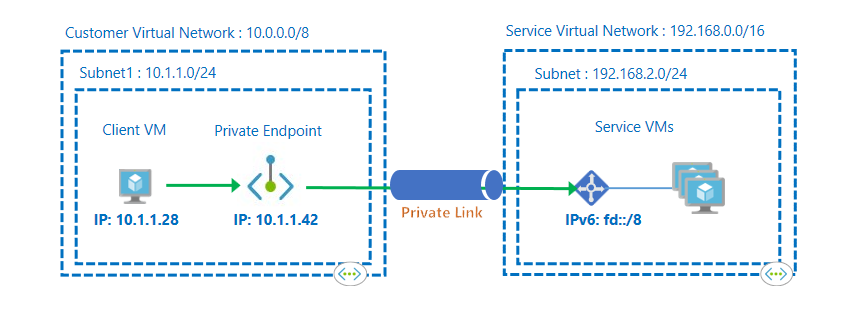
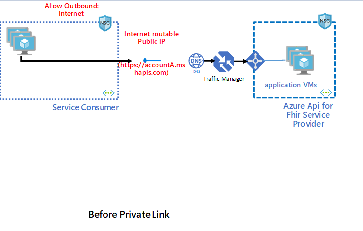
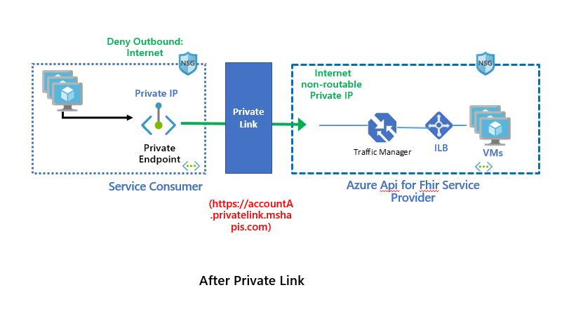
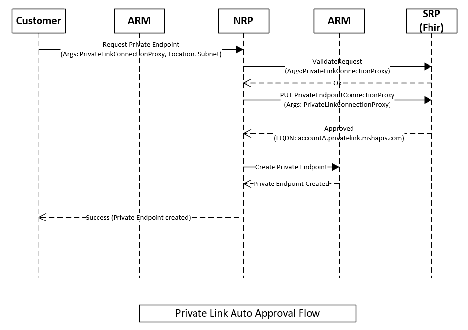
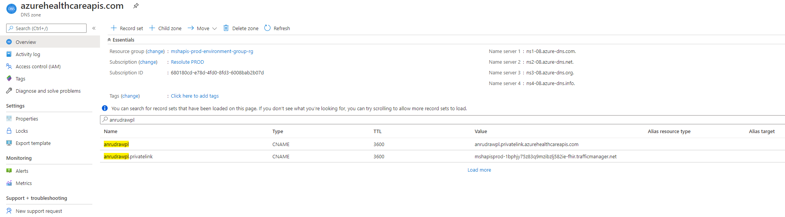
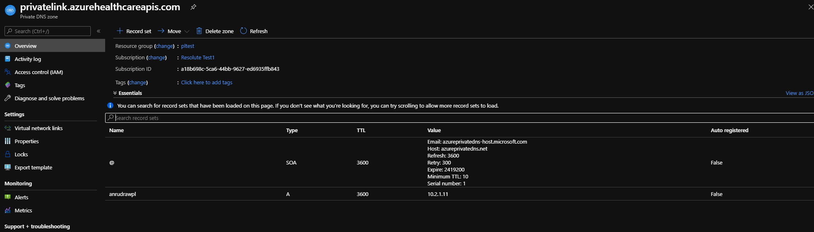
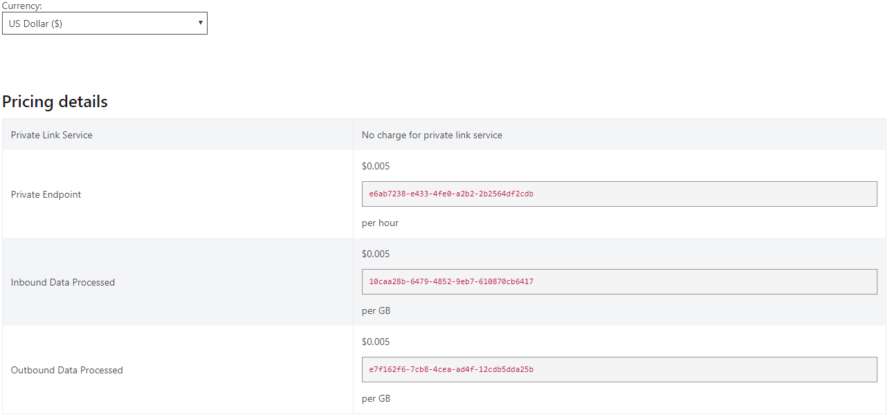

*Summary of the feature.*

[[_TOC_]]

# Business Justification

Private endpoints offer a solution to our customers who do not wish to access our Azure Api for Fhir service through public channels. This essentially brings the service into the customers virtual network allowing the customer to communicate with it directly using a private IP without having to use the public DNS.
This spec is about bringing the private endpoints feature to Azure Api for Fhir as a first party service.

# Scenarios

1. As a "Azure Api for Fhir" service user, I want to access the service securely from inside my Vnet as a first party service without having to go through a public DNS.
2. As a "Azure Api for Fhir" service user, I want my attempted connection request for private endpoint approved or rejected.
3. As a "Azure Api for Fhir" service user, I should be able to discover that I can create a private endpoint to the service.
1. As a "Azure Api for Fhir" service user, I should be able to create a private endpoint connection request from my vnet using powershell, cli or the azure portal after the service account is created.
1. As a "Azure Api for Fhir" account creator from Azure portal, I should be able to create the private endpoint connection during account creation. (P2 for Private Preview)
1. As a "Azure Api for Fhir" account creator from powershell/cli, I should be able to create the private endpoint connection during account creation. (P2 for Private Preview)

# Non Goals
The design for first party portal experience or first party powershell/cli is not included in here. We propose to have those for public preview.
The current thinking is that first party UI interactions for public preview will follow the same model as one of the released apps like storage. Same goes for first class support for powershell and cli for public preview.
Please see the [onboarding process](https://microsoft.sharepoint.com/teams/vnet/SitePages/Private-Endpoints.aspx) outline.

# Metrics

1. To track the feature usage, we will collect data about the number of accounts that have been provisioned with Private Link enabled. This can be tracked by looking at the request ARM sends to RP for provisioning and logging approrpiately. We will similarly track requests to remove existing Private Link enabled accounts.
2. We will track the number of private endpoint(s) configured for a FHIR account.
3. We will log the performance data such as number of requests, request latency etc.
4. To track the number of downloads happening for a new powershell module and any errors or exceptions in the usage of it, we will build a dashboard by querying client telemetry database/ Devdiv Kusto clusters.

# Design

## Terminologies

### Azure Private Link
It is a way to render and consume services delivered on Azure Platform privately.

### Private Link Service
A privately linkable service created by the Service provider (Microsoft.HealthcareApis). We will create this for Azure Api for Fhir as a first party service.

### Private Endpoint
A networking resource in consumer VNet used to consume services privately on Azure Platform. 

## Private Link Benefits
- Customers can consume services privately in their VNET.
- Traffic stays over Microsoft backbone and does not travel over the internet.
- Access from On-prem and peered networks.
- Approval workflow is available.



## High Level Architecture

### State Before Private Link



### State After Private Link



## Onboarding to make Microsoft.HealthcareApis Private Link enabled
We need to follow a bunch of steps for onboarding our service to be private link enabled.

## Onboarding Form
We provide a bunch of details for [onboarding](https://microsoft.sharepoint.com/teams/WAG/AzureNetworking/_layouts/15/Doc.aspx?sourcedoc={a5f1b1a5-c06f-47e0-8a99-65fe87d680af}&action=view&wd=target%28Documentation.one%7Cab1cc159-9ace-422c-9822-b902d233f61f%2FOnboarding%20Forms%20for%20All%20RPs%7Cae9ad659-79a6-4c71-9362-a5e82c0f1798%2F%29) to the private link team in an email including

- Our ResourceProvider Name (Microsoft.HealtcareApis/sevices)
- Arm Manifest Api version to use (2020-03-30)
- The first party application id for our Resource Provider used for supporting cross tenant scenario and S2S authorization
	- DF: 894b1496-c6e0-4001-b69c-81b327564ca4
	- Prod: 894b1496-c6e0-4001-b69c-81b327564ca4
- The ARM Rbac Role definition id that arm will use for RP-RP authorization.
    - DF : c69c1f48-8535-41e7-9667-539790b1c663
    - Prod: c69c1f48-8535-41e7-9667-539790b1c663
- Team Contacts
    - Private Link Control Plane - Ajinkya Potdar (ajpotd@microsoft.com), PM - Mario Lopez (malop@microsoft.com)
    - Private Link Data Plane - Shefali Garg (shefgarg@microsoft.com) 

## Control Plane Changes

We implement control plane changes as outlined in the private endpoints specification. Please see [spec](https://microsoft.sharepoint.com/:w:/r/teams/WAG/AzureNetworking/_layouts/15/Doc.aspx?sourcedoc=%7B64F10150-563A-4715-9476-FFA24F9BD42E%7D&file=%5BNRP%5D%20Private%20Endpoint%20Design%203.docx&action=default&mobileredirect=true&cid=7075b01e-18b3-42f7-950a-e1a09ede0e17).

As part of this work, we will add 3 new child "ProxyOnly" resource types on the parent resource "services" : 
- PrivateEndpointconnectionProxies - This resource type is used only for internal RP-RP interaction.
- PrivateEndpointconnection
- PrivateLinkResources

### High Level Interaction Flow (Control Plane)
The below figure shows the high level auto approval interaction workflow happy path during provisioning. NRP is the network resource provider and HARP is the Microsoft.HealthcareApis Service Resource Provider.


- Customer requests a new private endpoint. The request goes through ARM to NRP.
- NRP sends a validate request to our service RP (HARP) through ARM with a proxy object representing the private endpoint.
- HARP validates the request and returns a validation response.
- NRP then calls HARP on validation pass with the private endpoint proxy object and a unique link identifier and the request type of either manual or auto approval.
- HARP stores the metadata for the endpoint and returns the FQDN information if auto approved. Otherwise, HARP stores the metadata as pending.
- NRP goes ahead and creates the private endpoint if auto approval. Otherwise, whenever a data admin approves the endpoint, NRP creates the private endpoint.

### Approval workflow for private endpoints
Customer requests a private endpoint with either manual or auto approval request type.

In case of manual request, ARM does not do any permission check, HARP stores the metadata with a pending state and returns. NRP creates a private endpoint pending approval by a data admin. 

In case of auto approval request, ARM checks to see if the user has permission on the healtcareapi account, if not rejects it. Otherwise, calls HARP which will store metadata information in the registry and return Success to NRP. NRP will create an active endpoint.

For pending manual approval requests, a data admin (consumer subscription owner) will have to approve or reject the endpoint. This resuls in NRP calling an api on our end and HARP will mark the endpoint as approved in its metadata and return. NRP will create an endpoint with Succeeded status.

### Connection State Diagram


### Transition Scenarios for Manual Approval workflow

· Approved -> Rejected: The data admin rejects a previously approved PrivateEndpointConnection. The HARP must notify NRP.

· Approved -> Disconnected: The data admin deletes the PrivateEndpointConnection (or the HARP’s resource). The HARP must notify NRP.

· Rejected -> Pending: The network admin resubmits the request. This change is only possible from the NRP-side; the data admin cannot change state from Rejected -> Pending. The HARP does not need to notify NRP since NRP will be initiating the state change via PUT PrivateEndpointConnection

· Rejected -> Disconnected: The data admin deletes the PrivateEndpointConnection (or the HARP’s resource). The HARP must notify NRP.

· Pending -> Approved: The data admin approves a previously pending request via PUT PrivateEndpointConnection. The HARP must notify NRP.

· Pending -> Rejected: The data admin rejects a pending request via PUT PrivateEndpointConnection. The HARP must notify NRP.

· Pending -> Disconnected: The data admin deletes the PrivateEndpointConnection (or the HARP’s resource). The HARP must notify NRP.

### Public Network Access Control

Per [Private Endpoints resource for public traffic section 6.1](https://microsoft.sharepoint.com/:w:/r/teams/WAG/AzureNetworking/_layouts/15/Doc.aspx?sourcedoc=%7BC91D7F66-C00C-4160-AED0-A671C5400FC6%7D&file=Private%20Endpoints%20PM%20Spec.docx&action=default&mobileredirect=true&cid=f4e2406a-0244-4619-b206-f42f176d6862) , properties.publicNetworkAccess could be implemented:

· **PublicNetworkAccess: Enabled** traffic over the public interface is accepted. This value can be used as default to avoid breaking changes on existing customer resources and templates.

· **PublicNetworkAccess: Disabled** traffic over public interface is not allowed, private endpoint connections would be the exclusive access method for a resource with public network access disabled.

### REST Api Calls to be implemented
We need to implement the following REST Api calls for the various interactions between NRP and HARP as outlined above. Please also see [spec](https://microsoft.sharepoint.com/:w:/r/teams/WAG/AzureNetworking/_layouts/15/Doc.aspx?sourcedoc=%7B64F10150-563A-4715-9476-FFA24F9BD42E%7D&file=%5BNRP%5D%20Private%20Endpoint%20Design%203.docx&action=default&mobileredirect=true&cid=7075b01e-18b3-42f7-950a-e1a09ede0e17) for more details.


| API                              | Method         | Description | Phase |
|--------------------------------------|--------------|-|-|
| https://manangement.azure.com/subscriptions/{subscriptionId}/resourceGroups/{rgName}/providers/Microsoft.HealthcareApis/{resourceType}/{resourceName}/privateEndpointConnectionProxies/{peName}.{guid}/validate?api-version=[version]  | POST |Validate Call|Private Preview|
| https://management.azure.com/subscriptions/{subscriptionId}/resourceGroups/{groupName}/providers/Microsoft.HealthcareApis/{resourceType}/{resourceName}/privateEndpointConnectionProxies/{peName}.{guid}?api-version=[version] | PUT     |Create Private Endpoint Connection Proxy|Private Preview|
| https://management.azure.com/subscriptions/{subscriptionId}/resourceGroups/{groupName}/providers/Microsoft.HealthcareApis/{resourceType}/{resourceName}/privateEndpointConnectionProxies/{peName}.{guid}?api-version=[version] | DELETE     |Delete Private Endpoint Connection Proxy|Private Preview|
| https://management.azure.com/subscriptions/{subscriptionId}/resourceGroups/{groupName}/providers/Microsoft.HealthcareApis/{resourceType}/{resourceName}/privateEndpointConnectionProxies/{peName}.{guid}?api-version=[version] | GET     |Get Private Endpoint Connection Proxy|Private Preview|
| https://management.azure.com/subscriptions/{subscriptionId}/resourceGroups/{groupName}/providers/Microsoft.HealthcareApis/{resourceType}/{resourceName}/privateEndpointConnections/{privateEndpointConnectionName}?api-version=[version] | PUT     |Approve/Reject for Manual Approval Flow|Public Preview|
| https://management.azure.com/subscriptions/{subId}/resourceGroups/{rgName}/providers/Microsoft.HealthcareApis/[resourceType]/{resourceName}/privateEndpointConnections/{privateEndpointConnectionName}?api-version=[version]   | DELETE     |Delete private link connection(s)|Public Preview|
| https://management.azure.com/subscriptions/{subId}/resourceGroups/{rgName}/providers/Microsoft.HealthcareApis/[resourceType]/{resourceName}/privateEndpointConnections/{privateEndpointConnectionName}?api-version=[version]   | GET     |Get private link connection|Public Preview|
| https://management.azure.com/subscriptions/{subId}/resourceGroups/{rgName}/providers/Microsoft.HealthcareApis/[resourceType]/{resourceName}/privateEndpointConnections/{privateEndpointConnectionName}?api-version=[version]   | GET     |List private link connection(s)|Public Preview|
| https://management.azure.com/subscriptions/{subscriptionId}/resourceGroups/{groupName}/providers/Microsoft.HealthcareApis/[resourceType]/[resourceName]/privateLinkResources?api-version=[version]  | GET     |Get Private Link Resources(Group Ids)|Private Preview|
| https://management.azure.com/subscriptions/{subscriptionId}/resourceGroups/{groupName}/providers/Microsoft.HealthcareApis/[resourceType]/[resourceName]/privateLinkResources/{groupID}?api-version=[version]  | GET     |List Private Link Resources/Group Ids|Public Preview|
| https://management.azure.com/subscriptions/{subId}/resourceGroups/{rgName}/providers/Microsoft.HealthcareApis/[resourceType]/{resourceName}?api-version=[version]   | GET     |Modify existing API to add private link info in properties|Private Preview|
| https://management.azure.com/subscriptions/{subId}/resourceGroups/{rgName}/providers/Microsoft.HealthcareApis/[resourceType]/{resourceName}?api-version=[version]   | DELETE     |Modify existing API to notify NRP and delete private endpoint connections first before deleting an account|Public Preview|

We will update the ARM Resource Provider Service to add new Resource Type handlers to handle the new routes required for implementing the above REST Api calls.
**NOTE** : Move operation will not be supported on the Private Link enabled FHIR account.

### Broad implementation outline for the various REST Apis
- Validate Call: For validate call, we will verify that the specified group id is valid and is fhir. We will check the account metadata to see if we have already reached the maximum number of private link connections allowed. We will also validate that the call is coming from NRP by checking for the NRP application id in the header.
- Create Private Endpoint: We will validate that the caller is NRP by verifying the application id for NRP in the header. Then we will update the registry document for the account (the private link service id is the same as the resource id for the account) to add the private endpoint information in the account metadata. The private endpoint information saved to the registry would be the endpoint name, the private link id, the fqdn, the approval status of approved and other details necessary in case of auto approval request. In case of manual approval request, we will update the metadata with the endpoint name and the approval status of pending.
- Approve/Reject for Manual Approval Flow: We will validate the caller is NRP by verifying the application id calling us is NRP's application id. This call will happen whenever a data admin goes ahead and approves a private endpoint connection. We will validate that the connection is indeed pending. We will follow the same process as in create private endpoint above for auto approval.
- Delete Private Link Connection: Remove the details added from registry added as part of Create Private Edpoint. Validations include check whether NRP is calling and also if the endpoint information actually exists in the registry.
- Get Group Ids: "fhir"
- Maximum # of Private Endpoint Connections allowed - 100

### Permissions
- For manual approval workflow and deletion of Private Link enabled FHIR account, we need to notify NRP of approval/rejection of the "pending" Private Endpoint Connection(s). We will be using newly created first-party AAD app so that it can talk to NRP. We will need to get the corresponding certificate and add it to our deployment process so that the RP App can use it to authenticate itself.
- We will verify the called app id to ensure that only the NRP service is allowed to call the private link internal apis(PrivateEndpointConnectionProxies). In case we find that NRP is not calling, we will return a 409 (Conflict) as per [spec](https://microsoft.sharepoint.com/:w:/r/teams/WAG/AzureNetworking/_layouts/15/Doc.aspx?sourcedoc=%7B64F10150-563A-4715-9476-FFA24F9BD42E%7D&file=%5BNRP%5D%20Private%20Endpoint%20Design%203.docx&action=default&mobileredirect=true&cid=7075b01e-18b3-42f7-950a-e1a09ede0e17).
- Azure RBAC role definition will be mapped to the newly created first-part app in the ARM manifest that enables HARP to call NRP and vice versa. It is required only for resource type : PrivateEndpointConnectionProxies. ** Note ** : Resource used for RP-RP interaction is followed by "Proxy/Proxies" postfix in the name. While public facing resource don't have it.
```json
NRP folks add these to HARP's RP role definition (otherwise HARP won't be able call NRP):

"Microsoft.Network/locations/operationResults/read",
"Microsoft.Network/locations/operations/read",
"Microsoft.Network/privateEndpoints/privateLinkServiceProxies/read",
"Microsoft.Network/privateEndpoints/privateLinkServiceProxies/write",
"Microsoft.Network/privateEndpoints/privateLinkServiceProxies/delete"

And We have to add these to NRP's role definition (otherwise NRP can’t call HARP):

"Microsoft.HealthcareApis/services/privateEndpointConnectionProxies/read",
"Microsoft.HealthcareApis/services/privateEndpointConnectionProxies/write",
"Microsoft.HealthcareApis/services/privateEndpointConnectionProxies/delete",
"Microsoft.HealthcareApis/services/privateEndpointConnectionProxies/validate/action"
```
Refer [Azure RBAC Role Definition](https://microsoft.sharepoint.com/teams/msh/_layouts/15/Doc.aspx?sourcedoc={88c3d919-efdc-4b77-9910-b7e1f892113d}&action=edit&wd=target%28Operations%2FInfrastructure.one%7C29b9a948-a57c-4de1-bd7e-361bcefcf065%2FAzure%20RBAC%20Role%20Definition%7C022cfd3b-c699-4299-92a8-2c50522a366d%2F%29) for details on adding a new Role Definition for the HARP.

## Data Plane Changes


1. A VM on the customer’s VNET sends a publish event to HealthcareApis' domain from a private endpoint.
2. SDN (Software Defined Networking) data plane converts the IPV4 packet into a GRE encapped packet.


3. The GRE encapped packet is delivered to the HealthcareApis Frontend service's public IPv4 VIP over the Azure backbone network.
4. The load balancer on the HealthcareApis Frontend service side will handle this packet and send it to one of the load balanced VMs.
5. The SDN data plane on the destination VM's host will decap the GRE packet and send the IPv6 packet to the private IPv6 address on which Kestrel CommunicationListener is listening.
6. KestrelCommunicationListener Changes:
    - As publish events from Private Endpoint will be coming on IPv6 address on the VM, we need to bind SSL certificate to IPv6 addresses too.
    - We are using the same TCP probe listener for both IPv4 and IPv6 load balancing rules, so we need to update our KestrelCommunicationListener to listen on both IPv4 and IPv6 addresses on the VM.

7. Frontend Service will parse the Source IPV6 address and will do the following to perform VNET PrivateEndpoint ACL:

    ○ Check the 9th bit.  If the 9th bit is SET then it is a V1 packet or if it is NOT SET then it is a V2 packet 
 
    ○ If it is a V1 packet:  
        • It will not have the SNAT VIP/Private Link Id inside it.  So ignore 
 
    ○ If V2 packet:     
        • 10th bit will determine if this packet is a ST packet or Private IP Packet.        
        • If 10th bit is NOT SET then it will be a ST packet and it will carry a SNAT VIP of the source VM in this location        
        • If 10th bit is SET then it will be a Private IP packet and it will carry the Private Link ID of the mapped resource at the same location 
 
8. After getting the Private LinkId from the source IPV6 address, check if this Private LinkId is one of the approved "LinkIdentifier" for the FHIR server and perform the ACL based on that.

## Steps needed on the Healthcare RP to support above flow:

1. Enable below feature for the subscriptions where we want to handle the Service Tunnel traffic:

    - AllowDestinationServiceEndpoints 

2. Configure service VM to receive IPv6 Service Tunnel traffic by deploying the Service Tunnel loopback adapter.

3. SDN data plane will deliver the IPv6 packets to a private IPv6 address in the VM using LB load balancing rule. To support the IPv6 address, we will update basic load balancer setting to handle this GRE encapped packets.
 
**Basic Load Balancer changes:**

Configure Service Tunnel traffic by adding "EnableDestinationServiceEndpoint" and optionally DestinationServiceEndpointProbe properties. Below is an example:

**Example 1:**
``` json
"loadBalancingRules": [

{
"name": "LBHttpsRule",
"properties": {
"backendAddressPool": {
"id": "[variables('lbPoolID1')]"
},
"backendPort": "[variables('nt1HttpGatewayPort')]",
"enableFloatingIP": "false",
"frontendIPConfiguration": {
"id": "[variables('lbIPConfig1')]"
},
"frontendPort": "[variables('nt1HttpGatewayPort')]",
"probe": {
"id": "[variables('lbHttpProbeID1')]"
},
"protocol": "tcp",
"**EnableDestinationServiceEndpoint": "true**"
}
},
```
**Example 2:**
``` json
Under loadbalancing rules make these changes :

{
"properties": {
"frontendIPConfiguration": {
"id": "[concat('/subscriptions/', subscription().subscriptionId,'/resourceGroups/', resourceGroup().name, '/providers/Microsoft.Network/loadBalancers/', variables('loadBalancerName'), '/frontendIPConfigurations/LoadBalancerFrontEnd')]"
},
"backendAddressPool": {
"id": "[concat('/subscriptions/', subscription().subscriptionId,'/resourceGroups/', resourceGroup().name, '/providers/Microsoft.Network/loadBalancers/', variables('loadBalancerName'), '/backendAddressPools/', variables('bePoolName'))]"
},
"**DestinationServiceEndpointProbe**" : {
"id": "[concat('/subscriptions/', subscription().subscriptionId,'/resourceGroups/', resourceGroup().name, '/providers/Microsoft.Network/loadBalancers/', variables('loadBalancerName'), '/probes/lbprobe3')]"
},
"protocol": "Tcp",
"frontendPort": 10100,
"backendPort": 10100,
"idleTimeoutInMinutes": 15,
"EnableDestinationServiceEndpoint":"true"
},
"name": "lbrule2"
}
"probes": [
{
"properties": {
"protocol": "Tcp",
"port": 80,
"intervalInSeconds": 15,
"numberOfProbes": 2
},
"name": "lbprobe1"
},
{
"properties": {
"protocol": "Tcp",
"port": 22,
"intervalInSeconds": 15,
"numberOfProbes": 2
},
"name": "lbprobe2"
},
{
"properties": {
"protocol": "Tcp",
"port": 10100,
"intervalInSeconds": 15,
"numberOfProbes": 2
},
"name": "lbprobe3"
}
],
```
**Exception from above checks**

Whenever health checks are called (accountA.azurehealthcareapis.com/health/check) on a Private Link enabled account as well as on accounts where Public Network Access is set to enabled, we will let it through.

## DNS Changes

### Create/Update private endpoint

PrivateEndpoints require to override the public DNS records currently mapping into public IP address and use instead private IP address associated with the private endpoint (DNS domains need to be globally unique). Two FQDN needs to be allocated when creating privateEndpointConnectionProxies:

- internalFqdn: resolve to public IP of the LB.
- customerVisibleFqdn: resolve to private endpoint IP from customer VNet.

RP's Public DNS should setup CNAME re-direction chain for customer's FHIR account



While customer's PrivateDNSZone should setup private DNS A record:



To achieve this, we will reconfigure the azure public DNS records during provisioning create/update of the first private endpoint for an account as follows.

**Current DNS records**

cname accountA.azurehealthcareapis.com => trafficmgrprofilenameforaccount.trafficmanager.net

**Updated DNS records**

cname accountA.azurehealthcareapis.com => accountA.privatelink.azurehealthcareapis.com

cname accountA.privatelink.azurehealthcareapis.com => trafficmgrprofilenameforaccount.trafficmanager.net

### Delete private endpoint
We will reconfigure the azure public DNS records when **all** private endpoints are deleted.

**Current DNS records**

cname accountA.azurehealthcareapis.com => accountA.privatelink.azurehealthcareapis.com

cname accountA.privatelink.azurehealthcareapis.com => trafficmgrprofilenameforaccount.trafficmanager.net

**Updated DNS records**

cname accountA.azurehealthcareapis.com => trafficmgrprofilenameforaccount.trafficmanager.net

## Portal Changes
For private preview, we are not planning on making any portal changes for now as part of provisioning or updating a fhir resource for creating private endpoints. There is a separate portal experience already available for managing private endpoints and we will initially have our customers use that experience.
For public preview, we will have an inbuilt portal experience for Azure Api for Fhir. This will need a bit of UI interaction design, however this is something we can follow from other apps like storage's lead.

## ARM Related Changes
- We will have to update the provider authorization section of the arm manifest to add the role id assoicated with our service.
- We need to add the new endpoints for private link in the arm manifest.
- We need to update our Swagger definition to add the new rest api endpoints for private link.
- We need to update ARM schema to support specifying private endpoints in the properties section of the arm manifest.

## Powershell Changes
For private preview, we do not intend to make any powershell changes. For GA, we intend to add support for private endpoints in our healthcare apis commandlets.

During private preview, customers can use the available commandlet below to create a private endpoint.

New-AzPrivateEndpoint
   -Name <String>
   -ResourceGroupName <String>
   -Location <String>
   -Subnet <PSSubnet>
   -PrivateLinkServiceConnection <PSPrivateLinkServiceConnection[]>
   [-ByManualRequest]
   [-Tag <Hashtable>]
   [-Force]
   [-AsJob]
   [-DefaultProfile <IAzureContextContainer>]
   [-WhatIf]
   [-Confirm]
   [<CommonParameters>]

**Example**:
```json
$virtualNetwork = Get-AzVirtualNetwork -ResourceName MyVirtualNetwork -ResourceGroupName TestResourceGroup

$plsConnection= New-AzPrivateLinkServiceConnection -Name MyPLSConnections -PrivateLinkServiceId "/subscriptions/00000000-0000-0000-0000-000000000000/resourceGroups/TestResourceGroup/providers/Microsoft.HealthcareApis/accountA" -RequestMessage "Please Approve my request"

New-AzPrivateEndpoint -Name MyPrivateEndpoint -ResourceGroup TestResourceGroup -Location centralus -PrivateLinkServiceConnection $plsConnection -Subnet $virtualNetwork.Subnets[0]
```
## Billing Changes
Azure charges the customer separately for each private endpoint. Please see [pricing](https://azure.microsoft.com/en-us/pricing/details/private-link/?resourceguids=1) details. Current snapshot below



Since Azure is already charging customers for data ingress and egress for using private endpoints, we were thinking whether to charge the customer for data egress. The consensus from the design review was to continue charging th customers for data egress like we plan to.

## Questions
- How would health check work with private link?
    - The front end service will allow health check requests to go through 
- How would audit logging work with private link?
    - Since the ip addresses can be overlapping in case of private link, we will also log the linkid with the private ip address (like privateip:linkid).

# Test Strategy

Each component will have appropriate unit and integration tests. Since, Private Link is not available in DogFood, plan is to add a feature flag "PrivateLinkPreview" in arm manifest and test the changes in Korea South/Canary during Private Preview.
Feature flag will be removed during Public Preview/GA.

## Scenarios to test

1. Create Private Endpoint using auto approval with RBAC
2. Create Private Endpoint using manual approval 
3. Validate CNAME creation
4. Validate utility API GET privateLinkResources (including requiredZoneName)
5. List privateEndpointConnections on Resource
6. Approve/Reject/Delete privateEndpointConnection
7. Change/validate publicNetworkAccess control to disabled
8. Validate Portal Create private resource UX
9. Validate Portal Manage private endpoint connection UX
10. Validate PS to manage private endpoint connections
11. Validate CLI to manage private endpoint connections

# Implementation Timeline

| Item                              | Phase         |
|--------------------------------------|--------------|
|Onboarding Form|Initial (Mostly Done!)|
|Control Plane Implementation|Private Preview|
|Data Plane Implementation|Private Preview|
|DNS Changes|Private/Public Preview|
|Portal Changes|Public Preview|
|Swagger and SDK (PS/CLI)|Public Preview|
|Documentation|Public Preview|

## User Stories
Please see private link stories under [feature](https://microsofthealth.visualstudio.com/Health/_boards/board/t/Resolute/Stories/?workitem=71066).

## Links
1. [Private Link Onboarding](https://aka.ms/privatelinkonboarding)
1. [Private Link for First Party Design Spec](https://microsoft.sharepoint.com/:w:/r/teams/WAG/AzureNetworking/_layouts/15/Doc.aspx?sourcedoc=%7B64F10150-563A-4715-9476-FFA24F9BD42E%7D&file=%5BNRP%5D%20Private%20Endpoint%20Design%203.docx&action=default&mobileredirect=true&cid=7075b01e-18b3-42f7-950a-e1a09ede0e17)
1. [Private Link DNS integration Spec](https://microsoft.sharepoint.com/:w:/r/teams/WAG/AzureNetworking/_layouts/15/Doc.aspx?sourcedoc=%7BBDEF881A-6D2E-4E9D-A146-6CFA1CF97B09%7D&file=Private%20Endpoints%20DNS%20Integration%20PM%20Spec.docx&action=default&mobileredirect=true&cid=90bc9c52-6a58-470a-89d5-5f34daaf41ed)
1. [Private Link Pricing](https://azure.microsoft.com/en-us/pricing/details/private-link/?resourceguids=1)
1. [Private Link checklist](https://microsoft.sharepoint.com/teams/msh/_layouts/15/Doc.aspx?sourcedoc={88c3d919-efdc-4b77-9910-b7e1f892113d}&action=edit&wd=target%28Features%2FSpecs.one%7C76b377e8-bfa9-4cd5-8f21-9705e022ec7f%2FPrivate%20Link%20Checklist%7C2e41febc-3c65-4834-8231-02935b53b9a0%2F%29)

*Describe any impact to privacy, localization, globalization, deployment, back-compat, SOPs, ISMS, etc.*
