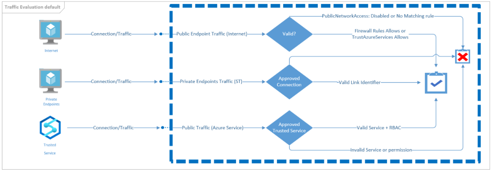
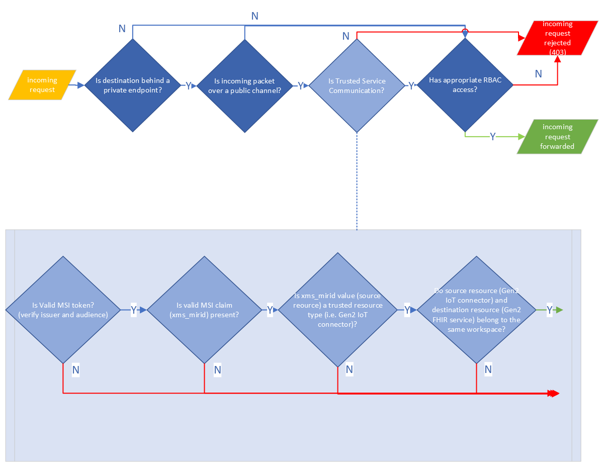

*Summary of the feature.*

[[_TOC_]]

# Business Justification

A private link enabled FHIR service disables public network access thereby rejecting any incoming traffic via public channels.
As a result, this impacts communication from other first party Healthcare API services such as the IoT connector service that is targetting a private link enabled FHIR service, which would be forbidden to transmit any data.

"Trusted Microsoft Services" offers a solution to customers who wish to authorize communication between a client service and a privately secured target service, by bypassing VNet/Firewall rules.
By leveraging this solution, we can enable a core scenario that allows an IoT connector service to transmit data to a private link enabled FHIR service (within the same workspace), bypassing the private link restrictions.

This document details the design to establish trusted service communication specifically between an IoT connector and a private link enabled FHIR service via Transitive Customer Managed Service Identity (MSI).

# Scenarios

1. As an IoT connector service user, I want to transmit my IoT medical data to my private link enabled FHIR service.

# Metrics

[TBD]

# Design

## Background

Customers who wish to restrict access to their FHIR service and avoid exposing to public traffic, can opt into enabling private link for their FHIR service.
By creating a private endpoint for a FHIR service, other services within the customer's VNet can privately and securely communicate to the FHIR service using a private IP from the VNet, without having to go through a public DNS.
Traffic between the customer's VNet and the FHIR service behind a private endpoint securely travels across the Azure backbone network.
Configuring a private endpoint for a FHIR service automatically disables public network access and any incoming traffic over public channels is rejected.

Consequently, this directly impacts certain core scenarios involving communication between our first party Healthcare APIs services when the FHIR service is behind a private link.
For instance, data being sent from an IoT connector to a FHIR service behind a private endpoint is forbidden and results in a 403 response from the FHIR service in accordance to the private link restrictions,
since the incoming IoT data is not coming via the private link channel and is thereby not a private IPv6 packet, and by default this packet will be dropped. 

Therefore, there is a need to establish a trusted relationship between our first party Healthcare APIs services such as the IoT connector service and a private link enabled FHIR service so as to allow an
IoT connector resource to transmit data to the secure FHIR service over a public endpoint since all the traffic is still within the bounds of the Azure backbone network.
By incoporating appropriate validations (detailed in following sections) against the incoming token, that verifies the expected First Party application and the source Azure resource, we can bypass the private link restrictions
and authorize this "internal service communication" and permit the data to be sent to the secure FHIR service.

The image below summarizes the traffic evaluation performed for incoming requests to private resources for various scenarios, of which our scenario falls under a special case of the Trusted Service scenario:

## Private Link Interconnect

The [Private Link Interconnect Spec](https://microsoft.sharepoint.com/:w:/r/teams/WAG/AzureNetworking/_layouts/15/Doc.aspx?sourcedoc=%7B9EAF9776-69C1-43CE-B530-0BB8A647BFC2%7D&file=Private%20Link%20Interconnect%20PM%20Spec.docx&action=default&mobileredirect=true&cid=E261C844-D8D4-4B52-A1E7-FD5CDEE371D2&wdLOR=c87DCBACE-8277-4386-B315-F4CAF8D4218D)
 describes various approaches to provide secure outbound access to customer's private resources, as listed below:
* VNet Injection - Using Customer network identity by deploying dedicated instances of the service and initiating network connections from within customer’s VNet.
  This model grant access to all customer’s private resources including on premises and delegated full control to customer’s on segmentation by being subject to their network policies like NSG, UDR or Firewalls.
* Shared Private Endpoint access - Using Service network Identity by providing a declarative API to allows customers to explicitly share access to their private resources.
  Service providers can initiate an access request and customers can manage(approve/reject) using control plane operations.
  During data plane operations, connections to private resources are limited to specific shared instances. 
* Transitive customer MSI - Using customer identity from trusted service network with assigned RBAC access by customer.
  In this model, customer will assign specific granular access to shared resources using RBAC, the service provider will get an access token to reach into the specific shared instances of the service.
  Service provider is responsible for securing tokens to prevent any outsiders from usage. 
* Transitive Service Identity - Using service identity from trusted service network by providing a declarative API to allow customers to explicitly share access to their private resources. 
  During data plane operations, connections to private resources are limited to specific shared instances.

## Transitive Customer Managed Service Identity (MSI)

Among the above approaches, given the current state of our services, Transitive Customer MSI suits our scenario for the following reasons: 
* By design, an IoT connector resource is set up to use customer's MSI via the usage of System Assigned Managed Identity (MI) to establish an identity with the FHIR service.
* The customer can assign this MI associated with their IoT connector, granular access using RBAC for the specific role (FHIR Data Writer) to their FHIR service, to grant the right permissions to be able to persist data into their FHIR service. 
* Given the nature of the relationship between the source IoT connector (Microsoft.HealthcareApis/workspaces/iotConnectors) and target FHIR service (Microsoft.HealthcareApis/workspaces/fhirServices) belonging to the same workspace
  making them sibling resources, as per the Azure Network team this inherently qualifies as an "internal service communication", and hence doesn't require additional onboarding to explicitly define the IoT Connector service
  as a Trusted Service for FHIR service as long as the required validations (detailed in subsequent sections) were performed on the presented MSI token.

In this approach, traffic coming from a trusted resource with MI, will present an approved AD token and the target service must ensure:
* Token is coming from a Trusted Service using MSI claims (`xms_mirid` claim) for onboarded resource type or App ID from previously onboarded service. 
* Validate RBAC access from MSI is given to the specific resource instance depending on the operation (read or write).  

### MSI token claims

The MSI token (i.e., tokens emitted by Azure AD (ESTS) for Azure resources that have Managed Identity enabled) contains certain claims that are relevant for VNet bypass on a target resource, as outlined below.

#### xms_mirid

* Managed identities expose the identity's Azure resource id as an optional claim in Azure AD under the name `xms_mirid`.
* For Azure resources with system assigned managed identity, the claim value for `xms_mirid` will be the Azure resource ID of the owning resource, i.e., in this scenario the IoT connector's resource ID.
  While for user assigned identities, the value is the resource ID of the user assigned identity.
* For system-assigned identities, this claim is leveraged for VNet/Firewall bypass by target service. 
* Target resource verifies if this claim is present and can perform additional validations on the claim value (containing the Azure resource ID of the source resource).

Note -
* There are certain security issues associated with this claim as detailed in [this](https://microsoft.sharepoint.com/:w:/t/activedirectory/acmi/EeoTKcYIFj5LnP6lC2Mzv3wBw9tG7KeXJtr7wsvm8neMpQ?e=HUQnXm) spec, and the general
  recommendation for services onboarded as one of the “Trusted Microsoft Service” for Vnet bypass on target resource is to use the new claim `xms_az_tm` (detailed in the following section).  \
  However, this new guidance to use `xms_az_tm` does not apply for internal service communication, unless we intend to also support VNet bypass for resources created with User Assigned Managed Identities.
* Since this is an optional claim, AAD Applications must opt-into receive this claim in the MSI token.
  * The claim is only exposed for the correct target audience (as per the first party app configured) and is not controlled based on the resource the MI is associated with.

#### xms_az_tm 

* This is a new claim that has been added for VNet bypass which overcomes security issues with xms_mirid.
* It indicates if the source resource is running in "Trusted" mode or "User" mode.
* The expected claim value for VNet bypass is "azureinfra" which indicates the request is from Trusted Azure subsystem.

Note - 
* As mentioned in the previous section, for internal service communication based on system assigned identities, there is no need to switch to this new claim.
* If the `xms_mirid` claim is deprecated or we intend to support user assigned identities, then it will be required to onboard to this new claim based on the guidelines mentioned [here](https://armwiki.azurewebsites.net/authorization/managed_identities/MSIOnboardingTrustedMicrosoftServices.html)
  and update our VNet bypass strategy accordingly. \
  Currently, one of the major blocker to adopting this new claim is the fact that as per the above linked spec, in order to incorporate these custom claims, the data plane which requests the token from MI will need
  access to the first party app certificate. Given that we request a token for each IoT connector separately, the first party app certificate must be shared across all IoT connectors, which is not favourable or straightforward with the current data plane infrastructure. \
  Alternatively, as per the FAQ [here](https://armwiki.azurewebsites.net/authorization/managed_identities/MSIOnboardingTrustedMicrosoftServices.html#dataplane-does-not-have-aad-1p-app-certificate---what-do-i-do-),
  the other option is to wait until the MI team supports `xms_az_tm` claim by leveraging MSI SNI Authentication.

## Limitations

* The current design only accounts for IoT connector resources that are created with System Assigned Managed Identities and not User Assigned Managed Identities. \
  This is because the `xms_mirid` claim cannot be used for VNet bypass for user assigned identities as the value is the resource ID of the user assigned identity and not the owning resource. \
  To support user assigned identities, the MSI token claim `xms_az_tm` needs to be used instead, which as called out in [this](#xms_az_tm) section has additional dependencies that are not in place yet/require further evaluation.

## Implementation Details

### Receiving the `xms_mirid` token claim

A first party application must be configured to receive optional claims in the [AAD Onboarding portal](https://aka.ms/aadonboarding), in order to be able to see such claims in the token.
The MSI token claim `xms_mirid` is an optional claim and therefore the first party app `id: 4f6778d8-5aef-43dc-a1ff-b073724b9495, name: Azure Healthcare APIs` must be updated to add this optional claim to the "Access Token Claims" section.

This update will follow the below process:
1. The changes (addition of the optional claim) will be first tested in the PPE version of first party app *insert app details*, and tested out with Dogfood AAD.\
  Once this has been validated in the PPE version of the app, only then proceed to the next steps.
    * To test that we are receiving this claim in the token, procure the credential bundle created for an IoT connector resource in Dogfood, and retreive the MSI token using that credential. Upon deconding this MSI token with
      the fhir service audience, the `xms_mirid` claim should appear with the value being the IoT connector's resource ID.
2. For PROD app updates, a Prod Change Request (PCR) will be submitted for approval detailing the changes to the application(s) and the need/business justification for the same. \
   The request has to be approved by a member of the owning security group (ame\res-firstpartyappowners).
3. Once the request is approved, a rollout plan will be defined. The intial rollout phase will only target a few internal Microsoft tenants for testing the changes, before pushing it out globally to all customers.
4. From a SAW device, navigate to the first party app in [AAD Onboarding portal](https://aka.ms/aadonboarding), select the "Optional Claims" page and under the "Access Token Claims" section, add the claim - `xms_mirid`. 

### Token validation

The FrontEnd service needs to perform the following validations against the incoming traffic to a private link enabled FHIR service from the trusted IoT connector service that will present an approved MSI token:
1.	Validate the MSI token from the incoming request following [Azure AD's general guidelines for validating tokens](https://docs.microsoft.com/en-us/azure/active-directory/develop/access-tokens#validating-tokens)
    * Given that we are unpacking the contents of the token to check for the claim, we should validate the authenticity of the token by verifying the issuer and audience is correct.
2.  *[TBD]* Validate the incoming request is coming from a first party app id (in this case the app id representing the IoT connector service - app `id: 4f6778d8-5aef-43dc-a1ff-b073724b9495, name: Azure Healthcare APIs`).
3.	Validate the token received contains the `xms_mirid` MSI claim (the value corresponds to the Azure resource ID of the source resource sending the requests).
4.  Validate the Azure resource ID corresponds to an IoT connector resource, i.e., resource type is Microsoft.HealthcareApis/workspaces/iotConnectors.
5.	Validate the source (IoT connector issuing requests) and the target (private link enabled FHIR service) resources belong to the same workspace (using the `xms_mirid` value).

If any of the above validations fail, then the incoming request will be forbidden and a 403 status code will be returned.

!!Note!! - There is an open question regarding step #2 to the MI team. It is unclear if this step is really needed as the presence of the `xms_mirid` claim itself could indicate the request is coming from a 1P app.

# Test Strategy

* Each component will have appropriate unit tests.

* Testing first party app update to receive optional `xms_mirid` claim:
   * This will first be tested in the PPE version of the app.
     * To test that we are receiving this claim in the token, procure the credential bundle created for an IoT connector resource in Dogfood, and retreive the MSI token using that credential. Upon deconding this MSI token with
       the fhir service audience, the `xms_mirid` claim should appear with the value being the IoT connector's resource ID.
   * For the PROD app update, the rollout plan will be scoped at first to internal MS test tenants where the testing will be targetted at, before rolling it out globally.

* Bulk of the E2E testing will be performed in TiP env as testing in Dogfood is not possible due to the following reasons:
  * Private link is not supported in Dogfood
  * Event hub is not supported in Dogfood which is required to setup an IoT connector and test data flow.

## Scenarios to test

1. Data flow succeeds from a source IoT connector with System Assigned Managed Identity to a private link enabled FHIR service in the same workspace, with FHIR Data Writer RBAC assigned to the MI.
2. Data flow is forbidden from a source IoT connector with System Assigned Managed Identity to a private link enabled FHIR service in a different workspace.
3. Data flow is forbidden from a source IoT connector with User Assigned Managed Identity to a private link enabled FHIR service in the same workspace, with FHIR Data Writer RBAC assigned to the MI.
4. Data flow is forbidden from a source IoT connector with System/User Assigned Managed Identity to a private link enabled Azure API for FHIR (Gen 1) in the same/different workspace, with FHIR Data Writer RBAC assigned to the MI.

# Security

*Describe any special security implications or security testing needed.*

# Other

*Describe any impact to privacy, localization, globalization, deployment, back-compat, SOPs, ISMS, etc.*

# References

* [Private Endpoints support for FHIR Service](https://microsofthealth.visualstudio.com/Health/_git/health-paas-docs?path=/specs/PaaS/IPFiltering/PrivateEndpoints.md&version=GBpersonal/pallar/trustedservicecommunication&_a=preview)
* [Private Link Interconnect Spec](https://microsoft.sharepoint.com/:w:/r/teams/WAG/AzureNetworking/_layouts/15/Doc.aspx?sourcedoc=%7B9EAF9776-69C1-43CE-B530-0BB8A647BFC2%7D&file=Private%20Link%20Interconnect%20PM%20Spec.docx&action=default&mobileredirect=true&cid=E261C844-D8D4-4B52-A1E7-FD5CDEE371D2&wdLOR=c87DCBACE-8277-4386-B315-F4CAF8D4218D)
* [MSI Onboarding Trusted Microsoft Services](https://armwiki.azurewebsites.net/authorization/managed_identities/MSIOnboardingTrustedMicrosoftServices.html)
