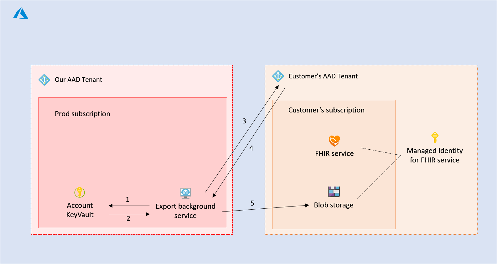
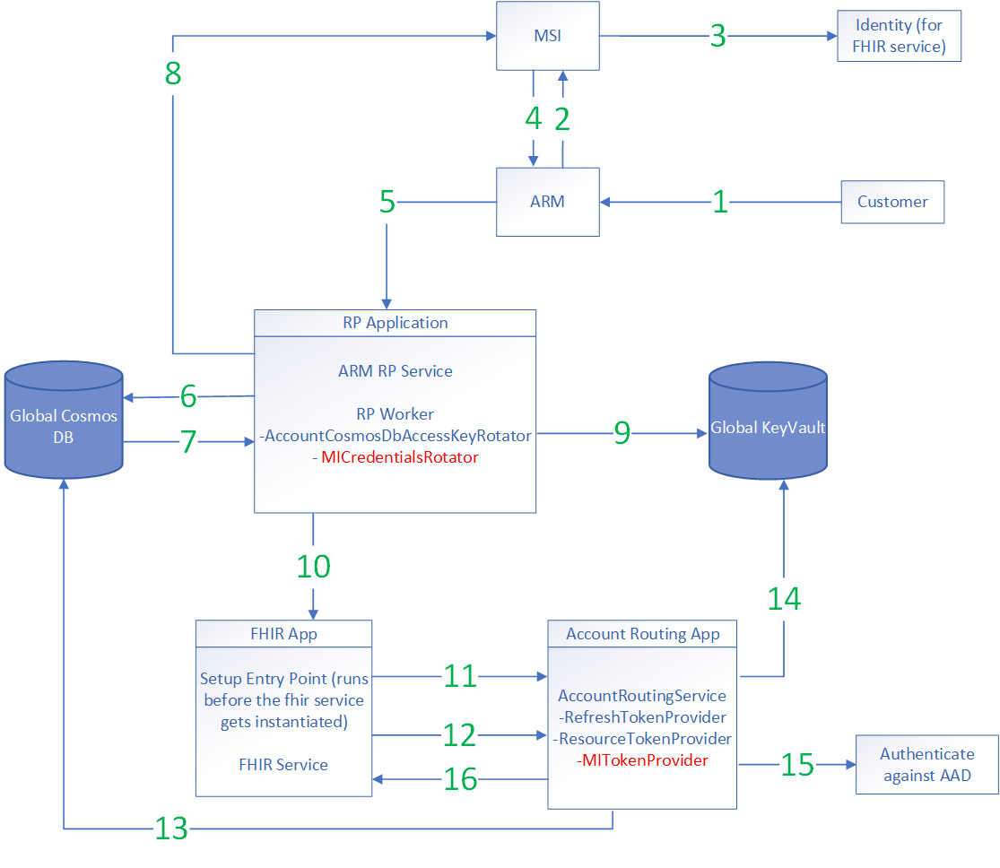

Managed identity allows us to build more secure service and simplify credential management for our customers.

To understand more about managed identity, [What is managed identities for Azure resources?](https://docs.microsoft.com/en-us/azure/active-directory/managed-identities-azure-resources/overview) is a great place to start. From the link:

> A common challenge when building cloud applications is how to manage the credentials in your code for authenticating to cloud services. Keeping the credentials secure is an important task. Ideally, the credentials never appear on developer workstations and aren't checked into source control. Azure Key Vault provides a way to securely store credentials, secrets, and other keys, but your code has to authenticate to Key Vault to retrieve them.
>
>The managed identities for Azure resources feature in Azure Active Directory (Azure AD) solves this problem. The feature provides Azure services with an automatically managed identity in Azure AD. You can use the identity to authenticate to any service that supports Azure AD authentication, including Key Vault, without any credentials in your code.

[[_TOC_]]

# Business Justification

Managed Identity allows us to establish an identity for the FHIR service. This will allow customer's to grant permissions to our FHIR service to access other resources in their subscriptions. This will in turn enable multiple scenarios such as exporting data and integration with other services.

# Scenarios

As a customer, I want to be able to grant permission to my FHIR service so that it can export data to specified storage account without having to specify storage key.

# Metrics

1. We will collect data regarding number of accounts that have been provisioned with MI enabled. This will give us data on feature usage. This can be tracked by looking at the request ARM sends to RP for provisioning and logging an approrpiately. We will similarly track requests to remove existing identities.
2. Once this feature is complete we expect the number of calls to the Global KeyVault to increase as consumers start using this. We will need to track performance (number of requests, request latency, etc) to make sure we are not overloading the Global KeyVault.

# Design

In this scenario, we want to establish an identity for the FHIR service that provisioned in customer's subscription allowing customer to grant permissions for our FHIR service to directly access other resources in their subscription.

Use case:

The customer has a FHIR service and a storage account provisioned in their own subscription. The customer should be able to export their FHIR data to the storage account without having to provide us their storage key and would like the service to handle it seamlessly behind the scene.

In this case, the customer can establish an identity for the FHIR service and grant write permission to their storage account using that identity. Our service will then obtain the bearer token of that identity and call the storage endpoint.

### Establishing the managed identity

In order to establish the identity, we will need to onboard with MSI service, create a first party AAD application for our RP and update our RP to accept the calls from MSI.

The specific onboarding process can be found [Onboarding instructions for Partner Resource Providers](https://microsoft.sharepoint.com/teams/AzureMSI/_layouts/OneNote.aspx?id=%2Fteams%2FAzureMSI%2FSiteAssets%2FAzureMSI%20Notebook&wd=target%28Onboarding%20Guide%20-%20Partner%20Teams.one%7CCE62BE5A-835A-479E-9475-A2F787A04C1E%2FOnboarding%20Instructions%20for%20Partner%20Resource%20Providers%7C9DED79C3-F2AD-4FDA-B18B-1662D7FB093A%2F%29).

The following diagram shows the interactions between different components.


1. The customer requests to create a resource (in this case a FHIR service)  with a system managed identity in their subscription.
2. ARM requests the identity to be created through the MSI control plane call using the RP's 1st party AAD app.
3. MSI creates a service principal in the customer's AAD tenant.
4. MSI returns identity metadata to ARM including the URL to retrieve the credentials.
5. ARM requests our RP to create the FHIR service, passing the identity metadata from step 4.
6. RP retrieves the credential of the identity through MSI data plane call using the RP's 1st party AAD app.
7. MSI returns the certificate and metadata for the identity.
8. RP stores the certificate in the account specific key vault.

### Assign RBAC using managed identity

Once the identity is established, the user can assign RBAC permissions using the newly created identity.


1. The customer requests to create a new blob storage and allows access to the managed identity by setting specifiesRBAC permissions.
2. ARM requests a blob storage account to be created and sets the RBAC permissions.

### Accessing resource using managed identity

The service now can request the bearer token from AAD using the certificate of the managed identity and access the target resource.



1. The background service fetches the certificate from account specific KeyVault.
2. The KeyVault returns the certificate and metadata.
3. The background service request the bearer token from customer's AAD tenant using the certificate.
4. AAD returns the bearer token.
5. The background service performs operations against the blob storage using the bearer token from step 4.

### Rotating the credential

The certificate has expiration date and must be renewed before the expiration periodically.

When RP retrieves the credential of the managed identity from MSI, MSI returns the location of the certificate along with metadata indicating when the certificate needs to be renewed.

``` json
{
  "client_id": "60702f51-2cc0-4941-bb8f-0e4151284cf4",
  "client_secret": "<secret>",
  "client_secret_url": "https://control-eu2.identity.azure.net/subscriptions/f871dcf3-f8c8-42b3-933b-451c20342f55/resourcegroups/MSIGROUP4298c72d58f541e3b3a4c9e/providers/Microsoft.Compute/VirtualMachines/MSIRESOURCEc9a563409ba8494aada3c97/credentials?tid=abd8daee-d393-4239-9377-883adda3d40f&oid=60702f51-2cc0-4941-bb8f-0e4151284cf4&aid=29c14bce-0cfe-49e9-8129-338a8d73150a",
  "not_before": "2016-12-01T14:11:00Z",
  "not_after":"2017-03-01T14:11:00Z",
  "renew_after":"2017-02-28T14:11:00Z",
  "cannot_renew_after":"2017-05-30T14:11:00Z
}
```

We already have a process that enumerate through each account and rotate the Cosmos DB key for the account. We can use the same process to check the status of the certificate and renew the certificate if necessary.

## Implementation Details



1. Customer sends a provisioning request along with opting in for MI.
2. ARM talks to MI and passes along the AAD application id of the RP App.
3. MI creates an identity for the FHIR Service in the customer's tenant.
4. MI returns this metadata information to ARM. This metadata contains an endpoint from which we have to retreive the credentials.
5. ARM passes the metadata information to our ARM RP Service (part of the Resource Provider App) along with the provisioning request.
6. Our ARM RP Service stores this metadata information in the Global Cosmos DB (as part of the current provisioning request flow).
7. RP Worker pulls in the account information to start the provisioning process.
8. The RP Worker uses the MI metadata from the account information to retreive the credentials from the MI endpoint.
9. Once the RP Worker retrieves the credentials, it stores these credentials in the Global KeyVault and updates the Account document in the Global Cosmos DB with the name of the secret.
10. As part of the provisioning process, the RP Worker provisions the FHIR instance.
11. The SetupEntryPoint script retrieves the refresh token from the Account Routing App and prepares the FHIR service to authenticate itself to the AccountRoutingApp.
12. When the FHIR service needs to use the MI credentials (eg: when it has to export data to a storage account), it will request a token from the Account Routing Service's MI token endpoint. The FHIR service will also need to provide the uri of the resource it needs access to (eg: a storage account in the case of exporting data). To authenticate itself against the Account Routing Service, the FHIR service will pass in the refresh token it got from the previous step.
13. MITokenProvider will validate the request and read the MI credentials metadata from the Global Cosmos DB for the corresponding service.
14. Using the metadata, MITokenProvider will then retrieve the appropriate credentials from the Global KeyVault.
15. MITokenProvider will use these credentials along with the resource uri (that it received previously from the FHIR service) to authenticate against AAD. This should give us a bearer auth token that can be used to access the end resource (eg: storage account in the case of exporting data).
16. MITokenProvider will return the auth token (including the expiry information) to the FHIR Service instance. The FHIR Service will ask for a new token from MITokenProvider based on when expiry data. This process is repeated as long as the FHIR Service requires the auth token.

### Permissions

The new components we are adding (MICredentialsRotator and MITokenProvider) are within existing applications (ResourceProviderApplication and AccountRoutingApplication). These applications already have the required permissions/credentials to read/write to Global Cosmos Db, Global KeyVaul, etc.

Our RP Application had to be registered as a first-party AAD app so that it can talk to MI to retrieve the credentials. We are going to use the AAD App Id that we registered for portal. We will need to get the corresponding certificate and add it to our deployment process so that the RP App can use it to authenticate itself.

### Deleting credentials during de-provision

When we receive a request to de-provision the FHIR instance, the RP worker takes care of de-provisioning all the associated resources. We will add an extra step to remove the credentials from the KeyVault after the FHIR instance has been de-provisioned.

### Revocation of credentials by customer

There could be a number of scenarios which could cause the credentials to be revoked. One such scenario is that the customer can request (via ARM) that all identities be removed. The RP Worker will remove the credentials from the Global KeyVault and update the Account document in the Global Cosmos DB accordingly. The auth token currently used by the FHIR instance will fail server side authentication. This will cause FHIR service to request a new token from the MITokenProvider endpoint. At this point MITokenProvider will not be able to get a new token (either AAD authentication will fail or the credentials will not be present in the Global KeyVault). The FHIR service will need to know how to handle such a scenario. In case of losing access in the middle of processing an export request, we will have to mark the job as completed and return a list of the partially exported data to the client.

### Rotating the credentials

We already have a mechanism by which we rotate account specific Cosmos DB keys (using the AccountCosmosDbAccessKeyRotator). This runs as part of the ResourceProviderWorker within the RP Application. We will add a similar mechanism - called MICredentialsRotator - that will do something similar for the MI credentials. The MICredentialsRotator will poll the account metadata in the Global Cosmos DB database and talk to the MI data plane to rotate any expiring credentials. Since MICredentialsRotator will run as part of the RP Application, it will already have all the permissions it needs to do the job (read and update Global Cosmos DB, Global KeyVault and authenticate against MSI).

One potential issue during rotation would be when we fail to save the credentials in the KeyVault after retrieving them from MI. We get a refreshed url everytime we get the new credentials and we will update the account metadata only if we successfully store the new credentials in the KeyVault. On it's next loop, the MICredentialsRotator will again try to retrieve the credentials from the "old" refresh URL (and hopefully succeed this time). The old "url" will be active until the "cannot_renew_after" timestamp. There seems to be a lot of buffer time for between "renew_after" and "cannot_renew_after" timestamps (at least a few days). We will make sure the MICredentialsRotator operates at a high enough frequency that it gets enough tries to renew the credentials.

Currently, The MI credentials are valid for 90 days and we can start renewing them after 45 days. Since the buffer time is large, our plan is to run the MICredentialsRotator once per day.

### Work Items

Corresponding work items can be found [here](https://microsofthealth.visualstudio.com/Health/_backlogs/backlog/Resolute/Features) under the `MSI for External Resource Access` feature

# Test Strategy

Each component will have appropriate unit and integration tests. We can't publish the new ARM Manifest without the supporting code and we can't test the code without the ARM manifest changes. So we will be using the Dogfood environment for our testing. All of the additional code will be under a feature-flag that will be turned off by default.

## Scenarios to test

1. A complete E2E test where we provision an account with `identity: {type: systemManagedIdentity}`, retrieve the MI credentials and successfully obatin a bearer token by authenticating against AAD. This test could be potentially flaky because we will have dependency on ARM, MI and AAD.
2. Validate that the MI credentials get removed (and account metadata is updated) when we receive an ARM request with `identity: {type: None}`.
3. If we fail to store a newly "rotated" MI credential, validate that we can still get the new credential by hitting the "old" MI endpoint.
4. Validate that the MI credentials get removed when we de-provision the account.
5. If a managed identity has been created, validate that GET requests to the RP return the `identity` metadata. We also need to make sure we return only the `principalId` and `tenantId` values.
6. If a customer updates their FHIR instance to include an identity (not during initial provisioning), validate that we successfully retrieve the MI credentials.
7. Validate that MI works even after moving the FHIR instance to a different resource group.

# Security

For each account, we will need to store the certificate and rotate it according to the metadata provided by MSI. Will require security review before shipping the feature.

# Other

*Describe any impact to privacy, localization, globalization, deployment, back-compat, SOPs, ISMS, etc.*
