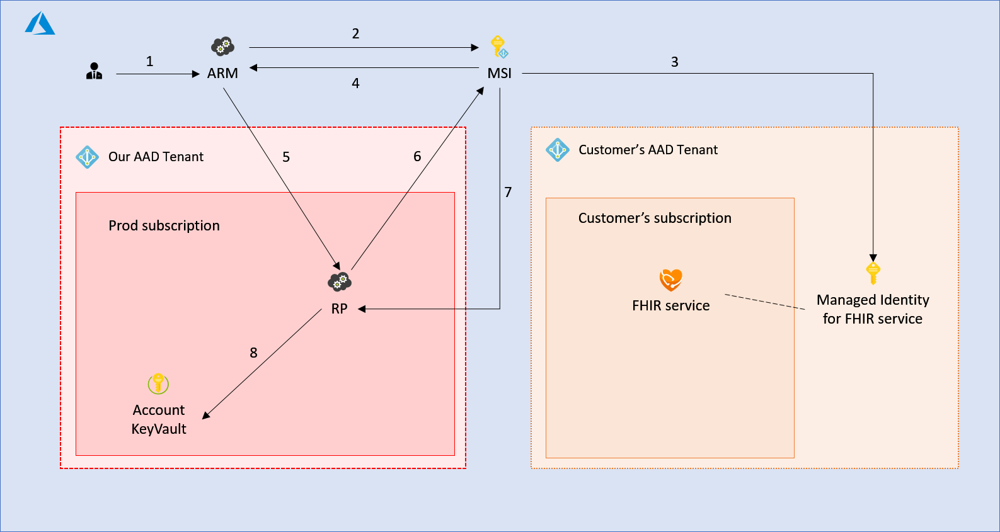

# User-Assigned Managed Identities

To understand more about managed identity, [What is managed identities for Azure resources?](https://docs.microsoft.com/en-us/azure/active-directory/managed-identities-azure-resources/overview) is a great place to start.

For specific details about [How to onboard user assigned identities](https://armwiki.azurewebsites.net/authorization/managed_identities/MSIOnboardingUserAssigned.html).

[[_TOC_]]

# Business Justification

Consistent support for all Managed Identity types is an Azure Enterprise Promise and a requirement for some customers. Some of our current services provide a way for customers to set up a System-Assigned Managed Identity, but we currently don't provide a way for customers to set up User-Assigned Managed Identities. Another scenario that is not currently supported is assigning multiple Managed Identities to a single resource. ARM allows several different identity configurations for resources that support Managed Identities, including assigning both System-Assigned and one or many User-Assigned Managed Identities to a single resource. 

# Scenarios

- As a customer, I want to define a User-Assigned Managed Identity in provisioning requests, and assign the identity to the resource.
- As a customer, I want to define multiple User-Assigned Managed Identities in provisioning requests, and assign different identities to the resource depending on the scenario.
- As a customer, I want to define both User-Assigned and a System-Assigned Managed Identities in provisioning requests, and assign different identities to the resource depending on the scenario.


# Metrics

1. The number and type of Managed Identities requested in a provisioning request.

# Current Design

The following diagram is an example of the interactions between different components during **System-Assigned Managed Identity** setup for a Gen 1 FHIR Service. The sequence is the same for Jupiter FHIR Services and Iot Connectors.



### ARMResourceProviderService

1. The customer requests to create a resource (in this case a FHIR service) with a **System-Assigned Managed Identity**.
2. ARM requests the identity to be created through the MSI control plane call using the Resource Provider's (RP) 1st party AAD app.
3. MSI creates a service principal in the customer's AAD tenant.
4. MSI returns identity metadata to ARM including the URL to retrieve the credentials.
5. ARM requests our Resource Provider to create the FHIR service, passing the identity metadata from step 4.

### ResourceProviderWorker

6. Resource Provider retrieves the credential of the identity through MSI data plane call using the Resource Provider's 1st party AAD app.
7. MSI returns the certificate and metadata for the identity.
8. RP stores the certificate and identity metadata in a Key Vault.

**Note:** Steps 6, 7 and 8 are handled by the [health-external-mi](https://microsofthealth.visualstudio.com/Health/_git/health-external-mi) NuGet package.

# Updates to support User-Assigned Managed Identities

The current implementation of Managed Identity support does not allow User-Assigned Managed Identities to be used. If a provisioning request includes a User-Assigned Manged Identity, the request will fail. Furthermore, The infrastructure assumes that there will only ever be 1 identity per resource; all existing code only handles single identity scenarios.

It's important to note that, at the time of this writing, the Identity team does not have a requirement for how multiple identity support should be implemented. There are examples of how other teams support multiple identities, but It will be up to our team to decide how we want to provide customers a way to specify which Managed Identity to use for a given feature.

The [Storage Account API](https://docs.microsoft.com/en-us/azure/templates/microsoft.storage/2021-02-01/storageaccounts?tabs=json#encryption-object) has an encryption feature that provides a way for a specific identity to be used.

There is also a concept the Identity team is developing they are calling '[default identity](https://microsoft.sharepoint.com/:w:/t/activedirectory/acmi/EezPXufdShZLq3OKVdJQ57gBQ7tqthF4hTRhP_wRBm2ofA?e=SGGa6D)', that would select a Managed Identity from the identity collection without requiring any additional data provided by the customer. If we choose to implement 'default identity', we should develop the feature so it aligns with the specification provided by the Identity team. 

## Development Work

### Provisioning

The term "Provisioning" in the context of Manged Identity is a misnomer because the actual "provisioning" of an identity is handled by Managed Service Identity (MSI) in the case of System-Assigned, or by the customer in the case of User-Assigned.

What our Resource Provider must do to support Managed Identity is fetch the identity certificate and metadata from the Managed Identity Resource Provider (MIRP) endpoint, save this data to Key Vault and periodically rotate the certificate. 

* Update the ARMResourceProviderService to properly parse User-Assigned Managed Identities included in provisioning requests.
* Update ManagedIdentityEntity to include a collection of User-Assigned Managed Identity resource ids.
* Update the ExternalManagedIdentityOperationHandler to support multiple Managed Identities.
* Update health-external-mi to use batch endpoint to fetch multiple identity certificates and metadata in a single request.
* Update health-external-mi to properly handle patch and updated requests, where, the list of User-Assigned Managed Identities has changed.
* (Optional) Update ExternalIdentitySecretRotator to batch certificate rotation requests.

### Retrieving Managed Identity Access Token

Once our Resource Provider has saved the certificate and metadata to a Key Vault, services that need to use the identity to access other Azure Resources, can use the certificate and metadata to fetch a bearer token from the customer's AAD tenant.

FHIR Server

* Update ARM manifest to provide a way for customers to assign specific Managed Identities for specific scenarios.
* Update FhirExportConfiguration to include properties to specify the specific Managed Identity to use for FHIR data export.
* Update WorkspaceFhirServiceFabricProvisioningProvider to include Managed Identity settings in FHIRApplication deployment parameters.
* Update AccountRoutingApplication TokenController to fetch Bearer token for specific Managed Identity.

IoT Connector

* Update ARM manifest to provide a way for customers to assign specific Managed Identities for specific scenarios.
* Update EventHubEndpointConfiguration to include properties to specify the specific Managed Identity to use for reading/writing to Event Hub.
* Update IoTConnectorExtensions to include Managed Identity settings to Kubernetes Pod.
* Update FhirDestinationConfiguration to include properties to specify the specific Managed Identity to use for reading and writing data to a FHIR Server.
* Update DestinationExtensions to include Managed Identity settings to Kubernetes Pod.

# Rotating the credentials

The current ExternalIdentitySecretRotator should work to rotate both User-Assigned and System-Assigned Manged Identities, however, improvements can be made to batch rotation requests to improve performance (the current implementation will make one request per identity).

# Proposed ARM Manifest updates

The ARM manifest defines an object representing the 'identity' property on resources called ServiceManagedIdentity. The current definition does not include support for User-Assigned identities. Changes to the ServiceManagedIdentity below will allow customers to add a collection of User-Assigned Managed Identities during provisioning requests.

```json
"ServiceManagedIdentity": {
  "type": "object",
  "description": "Azure resource's identity definition. Required if the resource has an identity.",
  "required": [
    "type"
  ],
  "properties": {
    "type": {
      "type": "string",
      "description": "A comma separated list of identity types for the resource. Can contain 'SystemAssigned', 'UserAssigned' and 'None'."
    },
    "principalId": {
      "type": "string",
      "readOnly": true,
      "description": "The object id / principal id of the system assigned identity. Required when the type is 'SystemAssigned'. The 'x-ms-identity-principal-id' request header has this value."
    },
    "tenantId": {
      "type": "string",
      "readOnly": true,
      "description": "The object id / principal id of the system assigned identity. Required when the type is 'SystemAssigned'. The 'x-ms-home-tenant-id' or 'x-ms-client-tenant-id' request header has this value, 'x-ms-home-tenant-id' is preferred."
    },
    "userAssignedIdentities": {
      "type": "object",
      "additionalProperties": {
        "type": "object",
        "properties": {
          "principalId": {
            "readOnly": true,
            "type": "string",
            "description": "The principal id of user assigned identity."
          },
          "clientId": {
            "readOnly": true,
            "type": "string",
            "description": "The client id of user assigned identity."
        }
      }
    },
    "description": "The list of user identities associated with the Azure resource. Required when the type is 'UserAssigned'. The user identity dictionary key references will be ARM resource ids in the form: '/subscriptions/{subscriptionId}/resourceGroups/{resourceGroupName}/providers/Microsoft.ManagedIdentity/userAssignedIdentities/{identityName}'."
  }
}
```

The ServiceManagedIdentity can also be added to objects in the property bag to provide a way for customers to define which identity should be used for a given scenario. **The ARMResourceProvider.Service will need to enforce a limit of one identity per scenario.**

```json
"IotEventHubIngestionEndpointConfiguration": {
  "type": "object",
  "properties": {
    "eventHubName": {
      "type": "string",
      "description": "Event Hub name to connect to."
    },
    "consumerGroup": {
      "type": "string",
      "description": "Consumer group of the event hub to connected to."
    },
    "fullyQualifiedEventHubNamespace": {
      "type": "string",
      "description": "Fully qualified namespace of the Event Hub to connect to."
    },
    "identity": {
      "$ref": "#/definitions/ServiceManagedIdentity"
    }
  },
  "description": "Event Hub ingestion endpoint configuration"
},
```


# Security

For each Managed Identity, the corresponding certificate is stored in Key Vault and the certificates are rotated at an interval defined in the identity metadata.

