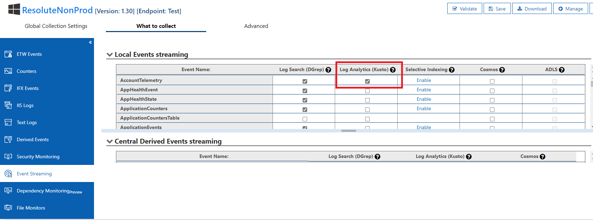

# Azure Healthcare APIs Resource Telemetry

[[_TOC_]]

# Business Justification
As we make Jupiter generally available, it is critical to analyze the customer usage and feature adoption, as well as to track customer setup when using our product. This design describes a feature can be used to study who and how customers are using Jupiter, and how the users are setting up services.

# Scenarios
We want to enable telemetry per resource stored for the Jupiter project for both reporting metrics and debugging. Similar telemetry is already being captured for Gen 1 for Account Telemetry.

## Acceptance Criteria
* Feature parity with Gen 1 Account Telemetry
* Resource Telemetry caputured for Jupiter Services

# Metrics
N/A

# Design
A new table will be exposed in Kusto for ResourceTelemetry under the resolutetelemetry cluster. This data will be loaded to Geneva and synced with Kusto. Each dataset will represent properties of the resource document from the global DB.

## Requirements
* Feature parity with Gen 1 Account Telemetry
    + On-going telemetry captured from the global DB
    + Data stored in Kusto table and queryable in Geneva
* Resource Telemetry caputured for Jupiter Services

## Table Schema
| Column Name |   Data Type    |  Description   |  Example Data  |
|-------------|----------------|----------------|----------------|
|CreatedTimestamp|datetime|UTC timestamp the resource was created|2021-06-22T16:21:01.7837785Z|
|ResourceCloud|string|Cloud identifier.  Previously coupled as the prefix on the tenant column, i.e. prod:eu or govprod:usga|prod, govprod, etc|
|ResourceLocation|string|Short location id for the Azure location the request occurred in.  Dropping environment prefix that existed in old|eus, wus2, usga, etc|
|ResourceId|string||/subscriptions/431cd853-a778-4768-8f21-8d53b931a351/resourceGroups/rgname/providers/Microsoft.HealthcareApis/workspaces/wsname/fhirservices/fhirservicename
|SubscriptionId|guid|Id of the customer's subscription|431cd853-a778-4768-8f21-8d53b931a351|
|TenantId|guid|Id of the tenant|72f988bf-86f1-41af-91ab-2d7cd011db47|
|ParentResourceName|string||workspaces|
|ParentResourceType|string||wsname|
|ResourceName|string|Resource Type following the resource provider segment of the ResourceId.  Could be derived from ResourceId but added for ease of use.|workspaces/fhirservices|
|ResourceType|string|Resource Name following the resource provider segment of the ResourceId.  Could be derived from ResourceId but added for ease of use.|wsname/fhirservicename|
|Properties|json|Customer defined properties for the resource. Specific to each resource type. These are properties defined by the customer at time of creation of the Jupiter service, and may include import service configuration information such as bulk export (for FHIR Services).|``` {"fhirServiceConfiguration\":{"accessPolicies":[],"acrConfiguration":{"loginServers":[]},"authenticationConfiguration":{"authority":"https://login.windows-ppe.net/acad93b0-d7e5-46eb-998f-37564c6efac2","audience":"https://mshapis.com","smartProxyEnabled":false},"corsConfiguration":{"origins":["*"],"headers":["*"],"methods":["DELETE","GET","OPTIONS","PATCH","POST","PUT"],"maxAge":1440,"allowCredentials":false},"exportConfiguration":{"storageAccountName":null}},"fhirVersion":"R4","smartProxyEnabled":false}```|

## Data Collection
The ResourceProviderWorker will facilitate the data collection by invoking the new ResourceTelemetryRecorder service on RunWorkerAsyc. This service will work by iterating over each resource document from the global DB per region at a time, and then log the collected data using the IEventSourceLogger. This data will be collected each 24 hours, and the time of the last execution will be stored in a per-region document in the global DB.

### Expectations
* The data will be persisted to a table in Kusto using Geneva event streaming
    + Onboarding to this feature has already been done for the Account Telemetry and we can utilize this for the Resource Telemetry
    + The telemetry will be available in both Prod and NonProd environments

# Test Strategy

* We will use unit tests where appropriate. We can also use integration tests for verifying that metrics are being emitted to our Metrics accounts.
* Manual full E2E test will be required.
* We will manually check persisted account information in ResourceTelemetry with the unchanged account document in our global DB to ensure the account information is correct.

# Security

* Telemetry data shall not contain PII information
* We shall not create, update or delete customer data in this process. We should only assign read permission to access customer data in global DB.
* The Account Telemetry threat model can be utilized for Resource Telemetry

# Other
## Localization and Globalization
N/A

## Deployment
* Enable Log Analytics (Kusto) from the Event Streaming setup screen in Geneva

To enable event streaming to Geneva and deployment of the new ResourceTelemetry Kusto table, we will only need to add the .xml event configuration within the Monitoring Agent project and import that within the MA Config file of each environment namespace. Once done, we can simply enable the flow from the Event Streaming setup screen within Geneva. This will log to the Kusto DB assigned to the account and create any new tables that are not already there. The Monitoring Agent is already configured to promote event streaming to the Geneva environments, and since we are leveraging this existing component for the Jupiter telemetry, no other deployment steps should be needed.




## Compatibility
No back-compat issues for this feature because it will push to a new table and not impact the current Account Telemetry flow.

## References
- [Azure Healthcare APIs Reporting Spec](https://microsoft.sharepoint.com/:w:/t/msh/EVsxG0yl0LtIlHo_K9tET3UBkJkl5joc8otPgsI7UUe4OA?CID=6308FA02-AB4C-4DDF-9C7C-0AE2FD206465&wdLOR=c21D022D8-A66C-4A8D-BE57-C4194750B68B&isSPOFile=1)
- [Azure Healthcare APIs Reporting Schema](https://microsoft.sharepoint.com/:x:/t/msh/ERBrrfdHAelAtlPSuNLf1CkBAsvRV-GQNJQuFFa0Vr1E8w?e=VbqC7W&isSPOFile=1)
- [Azure API for FHIR Account Telemetry](https://microsofthealth.visualstudio.com/Health/_git/health-paas-docs?path=/specs/PaaS/AccountInformationTable/%23%20Azure%20API%20for%20FHIR%20Account%20information.md&anchor=what-will-this-table-look-like%3F&_a=preview)
- [Account Telemetry in ResoluteThreatModel](https://microsofthealth.visualstudio.com/Health/_git/health-paas?path=/doc/ResoluteThreatModel.tm7)
- [Geneva Kusto Documentation](https://eng.ms/docs/products/geneva/connectors/genevatokusto/overview)