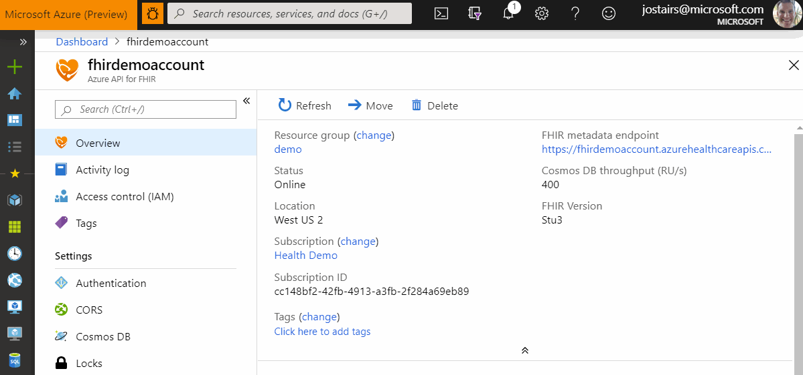
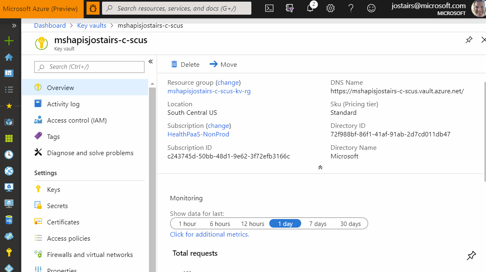
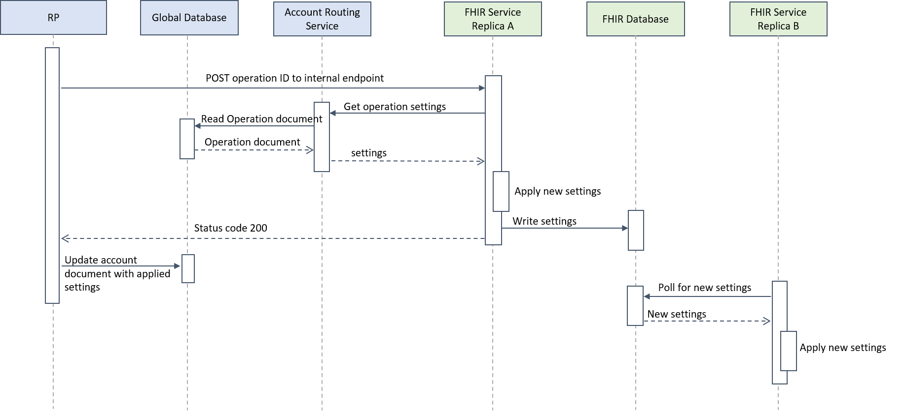

When a customer uses the Azure Portal (or CLI or PowerShell) to update settings on an existing FHIR service, it takes around 5 minutes for the change to complete, no matter how minor the change.



This is a pretty poor user experience. For comparison, changing a setting on a Key Vault resource takes only a couple of seconds:



In the design change proposed here, we intend to bring the time to under 10 seconds at P50.

[[_TOC_]]

# Business Justification

Users that manage their Azure API for FHIR resource face the 5 minute save experience every time they change a setting. Correcting a typo in an allowed user's object ID? That'll be 5 minutes. Adding an allowed origin for CORS? 5 minutes.

# Scenarios

The optimization will apply to most but not all of the properties that can be set on an API for FHIR resource. For reference, here are all the properties of an example resource: (output from `az resource show --ids <id>`):

``` json
{
  "etag": "\"080096a1-0000-0400-0000-5d781a300000\"",
  "id": "/subscriptions/cc148bf2-42fb-4913-a3fb-2f284a69eb89/resourceGroups/demo/providers/Microsoft.HealthcareApis/services/fhirdemoaccount",
  "identity": null,
  "kind": "fhir",
  "location": "westus2",
  "managedBy": null,
  "name": "fhirdemoaccount",
  "plan": null,
  "properties": {
    "accessPolicies": [
      {
        "objectId": "9215e7b1-613a-4d69-8035-a09014661d4d"
      },
      {
        "objectId": "9215e7b1-613a-4d69-8035-a09014661d4d"
      }
    ],
    "authenticationConfiguration": {
      "audience": "https://azurehealthcareapis.com",
      "authority": "https://login.microsoftonline.com/72f988bf-86f1-41af-91ab-2d7cd011db47",
      "smartProxyEnabled": false
    },
    "corsConfiguration": {
      "allowCredentials": false,
      "headers": [
        ""
      ],
      "maxAge": null,
      "methods": [],
      "origins": [
        "https://azure.com"
      ]
    },
    "cosmosDbConfiguration": {
      "offerThroughput": 400
    },
    "provisioningState": "Succeeded",
    "secondaryLocations": null
  },
  "resourceGroup": "demo",
  "sku": null,
  "tags": {},
  "type": "Microsoft.HealthcareApis/services"
}
```

The properties that this design change will affect are:

``` json
{
  "properties": {
    "accessPolicies": [],
    "authenticationConfiguration": { },
    "corsConfiguration": { },
    "cosmosDbConfiguration": { }
  }
}
```

All but `cosmosDbConfiguration` are values that serve as configuration values for the FHIR service itself.

# Metrics

We already track in telemetry the duration of provisioning operations. We expect to see a dramatic decrease in the duration of updates.

# Design

## Existing design

There are two aspects of the design that contribute to the slowness.

The first is that whenever a user submits a property change to our RP, we go about reprovisioning every Azure resource that backs the API for FHIR resource: the database, the Traffic Manager profile, the web tests, etc., even when there hasn't been a change that would affect the configuration of those resources.

The second - and dominant - reason for the slowness is that FHIR service configuration settings are all mapped to parameters on the Service Fabric FHIR application and when any of these change, the RP initiates a monitored rolling upgrade of the application. This upgrade capability is designed to be safe and slow and to roll back if the health of the service deteriorates as a result of the upgrade. It was designed for safe rollout of code and configuration changes, but was not designed for user-initiated, interactive settings changes. On the other hand, this current design, while suffering from poor performance, does have the advantage of being simple, consistent with the way other parameters are set, and stateless. The parameters are read in though environment variables when the service starts up and never change. And the RP, thanks to the Service Fabric SDK, knows when the changes have been propagated to each replica.

## Design Goals

1. There should be no service downtime. In a non-error case, at least one replica should be able to handle requests throughout the update flow. If processes need to restart, then it needs to be coordinated. Otherwise, we need to make sure that the replicas can apply changes on the fly without restarting.
1. All service replicas should quickly respond to a settings change.
1. The global database should remain the unambiguous source of truth for desired state of the API for FHIR resource.
1. We prefer replicas to be unavailable over functioning with stale or incorrect settings data (debatable, perhaps).
1. A FHIR application running a cluster must not be able to read another application's configuration.

## Proposed Design

There are two parts to the the design: (1) avoiding unnecessarily reprovisioning Azure resources for every RP update operation and (2) avoiding Service Fabric app upgrades to push config changes to the FHIR service.

### Avoiding Unnecessary Reprovisioning

For most updates, it is unnecessary to reprovision Azure resources as their properties will not have changed. On an update operation, when the existing API for FHIR resource is in a provisioned (not failed) state, we will skip provisioning steps where the inputs to the steps are unchanged. For Azure resources like Traffic Manager and Application Insights web test, a redeployment would only be required if the region configuration has changed (which is not currently supported through ARM).

We will also introduce a `Force` flag on the Operation document, which will force a reprovisioning of all resources (as we do today).

### FHIR Server Reacting to Settings Changes

We will change the way that FHIR server obtains its user-specified configuration settings (`accessPolicies`, `authenticationConfiguration`, and `corsConfiguration`. `cosmosDbConfiguration` is set on the database by the RP directly).

These settings will continue to be part of the `Account` document, persisted in the global database. Upon an an update to these settings, the RP will initiate the following flow:

1. The RP initiates a POST to an internal endpoint on the FHIR service. The OAuth token for this call will use the RP worker's internal service principal (`https://resourceproviderworker.internal.mshapis.com` in `test`) as the client identity and the FHIR service's internal service principal (`https://fhirservice.internal.mshapis.com` in `test`) as the audience. The body of this request will include the operation ID to read the `Operation` document in the global database. This document includes the desired settings to be applied to the account.
1. One of the FHIR service replica handles the POST. It calls a new endpoint on the account routing service to obtain the settings, passing in the subscription ID, operation ID, and and the refresh token (which is its existing credential for calling the account routing service).
1. The account routing service reads the `Operation` document and returns just the relevant settings to the FHIR service.
1. The FHIR service replica applies the settings changes without downtime or restarting the WebHost.
1. The FHIR service replica writes the settings to the FHIR database in a system document. In the case of SQL, it will be a system table with a `nvarchar(max)` column, with a JSON serialization of the settings.
1. The FHIR service replica returns a 200 OK response to the POST.
1. The RP updates the `Account` document, copying over the applied settings from the `Operation` document.

Additionally, all FHIR replicas will be polling for changes to the settings stored in the FHIR database. When they detect a change, the apply the latest settings.

The RP worker will report the operation as successful once it receives a successful response from the FHIR replica (and its other processing completes). We do not intend to block until we can verify that all replicas have applied the settings. This is because all replicas will be frequently polling the FHIR DB and applying any new settings. If a replica cannot reach its DB, is will also not be able to handle any other service call.

Here is sequence diagram of the flow:



### Failure Cases

#### The RP does not get a successful response from the FHIR server when POSTing the operation

When this happens, the RP worker will retry the call a number of times. The operation will be retried (see below). If there still is no luck, the operation will be marked as failed.

#### The FHIR service applies and persists the new settings but the RP does not get a successful response

We will make a change to the RP worker's exception handling to not mark an operation as terminally failed when an exception happens, allowing the operation to be retried up to 3 times.

## Alternate Designs Considered

There are of course a number of possible variation of this design. Some of them are:

1. The RP could post the entire settings to the FHIR server, instead of making it fetch it from the global database through the account routing service. The problem with this approach is tha the bearer token is valid for all FHIR accounts, and so malicious code running in a FHIR process could push malicious settings to other FHIR services.
1. We could create our own AAD tenant and create applications for each of our accounts. Bearer tokens used by the RP to call the FHIR service would then be good for only one account. With this design, we could push the entire settings securely to the FHIR service. But managing an AAD tenant does not seem appealing.
1. The RP could write the the FHIR database directly instead calling an HTTP endpoint. There are two problems with this approach:
    1. Validation is not as straightforward as in the synchronous call. What happens when the settings are invalid? With the endpoint, they can be validated by the FHIR server before being written to the database. With this design, they are written before being validated. If invalid, the RP would need to be notified by reading some kind of status from database.
    1. The RP gets tighter coupling with the FHIR server by writing to its database. And this database could be a Cosmos db or a SQL server.
1. We could use RabbitMQ or Service Bus to broadcast the settings change to replicas. This could be an appealing option, and one that could allow for powerful options in the future, but at the cost of taking on a major new dependency into the system when it isn't really needed yet.

# Test Strategy

This flow will be tested by adding tests to our existing provisioning tests. We will:

1. Provision a test account
1. Verify connectivity to it
1. Change CORS settings and verify that the CORS headers are properly set on a test request
1. Change the authority and verify that the metadata endpoint reflects the change
1. Change the authorization policy to remove the test agent and verify that a call the FHIR service fails.

# Security

The key security principle that we adhere to here is ensuring that each service has access to no more information than it requires, and should never be able to access settings or data belonging to another service.

# Other

This feature will have to be rolled out in stages:

1. Add the endpoint to the account routing service, the internal endpoint to the FHIR service, and the polling, but use config from Service Fabric parameters if available.
1. Change RP worker to call the internal endpoint instead of setting service fabric parameters
1. Remove the service fabric parameters.
