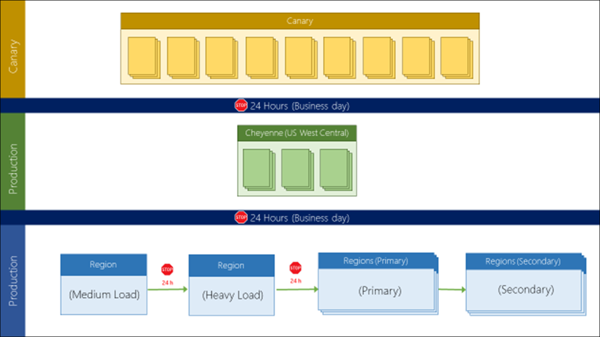

# Safe Deployment practice

In order to meet the expectations of our customers, whether large or small, all C&E cloud services must offer the highest quality, reliability and availability. This is a strong requirement for all services across all parts of the platform

[[_TOC_]]

# Business Justification
The most common cause for reducing customer availability has been due to deployments and updates. This includes updates that impact single regions that could have been better validated before hitting broad production and updates that impact multiple regions at once, an absolutely unacceptable outcome. Given this frequent and high impact problem, the organization has instituted very strict policies for deployment in order to guarantee all services maintain the highest degree of availability.

Every service, even if it has a small footprint, offers important value for our customers and carries the Azure brand. A negative experience or negative social communication damages Azure's reputation. Consequently, these required policies cover all external facing customer services.

# Scenarios

- As an administrator of Healthcare APIs for Azure (FHIR on Azure) I follow Safe Deployment Practices (SDP) for code rollout - P1

-  As an administrator of FHIR on Azure I follow SDP for config change rollout - P1

* As an administrator of FHIR on Azure I follow SDP for certificate rotation - P1

* As an administrator of FHIR on Azure I follow SDP for Data Plane updates - P2

* As an administrator of FHIR on Azure I follow SDP for Control Plane Updates - P1

* As an administrator of FHIR on Azure I follow SDP for Sovereign clouds - P2

* FHIR on Azure supports Regional segmentation (non SaaS) or Customer realm segmentation (SaaS) so that in case of failure as your deployment happens, only affects a small number of the customer base. - P1 

# Metrics

N/A

# Design

## Regional Update Policy
Adhere to 'regional update' strategy which requires to preserve region pairing constraints. Regional update policy is depicted in picture below. 

Regional Update Strategy Explained:
Canary: Deploy to the Canary Region first

Run health checks to determine whether it is safe to continue with the update
If the rollout is problematic, as determined by the health signals, then the system should initiate a rollback for the region where the deployment has failed or the service exhibits a problem
Wait for at least 24 hrs before proceeding. This 'wait' should happen during the business hours.
First Region: Services must rollout to 'uswestcentral' region that has the Cheyenne DC. This region has all the Microsoft workloads.

Run health checks to determine whether it is safe to continue with the update
If the rollout is problematic, as determined by the health signals, then the system should initiate a rollback for the region where the deployment has failed or the service exhibits a problem
Wait for at least 24 hrs before proceeding. This 'wait' should not happen during the weekend.
Second Region: Rollout to a full region or single update domain or single slice in a single region, with a medium load for your service. (Note: If your service must mandatorily be deployed simultaneously to the region pair, for example due to a schema breaking change, then you can have an exception to deploy to the region pair instead of to a single region).

Run health checks to determine whether it is safe to continue with the update
If the rollout is problematic, as determined by the health signals, then the system should initiate a rollback for the region where the deployment has failed or the service exhibits a problem
Wait for at least 24 hrs before proceeding. This 'wait' should not happen during the weekend.
Third Region: Rollout to a full region or single update domain or single slice in a single region, with heavy load for your service. This is to ensure that the service does not have a scale issue later in the rollout. (Note: If your service must mandatorily be deployed simultaneously to the region pair, for example due to a schema breaking change, then you can have an exception to deploy to the region pair instead of to a single region).

Run health checks to determine whether it is safe to continue with the update
If the rollout is problematic, as determined by the health signals, then the system should initiate a rollback for the region where the deployment has failed or the service exhibits a problem
Wait for at least 24 hrs before proceeding. This 'wait' should not happen during the weekend.
Fourth Region Set: After the third region completes, the half of the remaining regions can be deployed, following the region pairing rules. Thus, you can only deploy to half (left or right column) as defined on this public page 

Run health checks to determine whether it is safe to continue with the update
If the rollout is problematic, as determined by the health signals, then the system should initiate a rollback for the region where the deployment has failed or the service exhibits a problem
Teams can choose to continue without any wait period, before moving to the next set
Fifth Region Set: Finally, after the first half is completely finished, you can finish with the second half of the region pairs

Run health checks to determine whether it is safe to continue with the update
If the rollout is problematic, as determined by the health signals, then the system should initiate a rollback for the region where the deployment has failed or the service exhibits a problem
You may start deploying to Sovereign clouds within the fourth region set, or after completing the public cloud.

Example
A Service deployed to all 26 Azure regions (13 primary and 13 secondary) will use the following pattern:

(Mon) Day 1: Rollout to the Canary region and wait for 24hrs for the health signals

Day 2: Rollout to first region - "US West Central" and wait for 24 hrs for the health signals.

Day 3: Rollout to a region with medium load and wait for 24 hrs for the health signal

Day 4: Rollout to a region with heavy load and wait for 24 hrs for the health signal

Day 5: Rollout to the remaining primary regions

(Mon) Day 8: Rollout to the remaining secondary regions

## Hot Fixes or Emergency Releases
Adhere to the standard rollout policies for hot fixes or emergency releases.
Bypassing the standard rollout process should be done only with approval of division VP or delegate(s).

*  Bypassing SDP is not recommended.

*  But it is left at the discretion of the team to make exceptions in case of significant impact to customer business, missing SLA for multiple customers, risk of losing business, etc.

* Standard rollout stages and delays must not be eliminated, but the times between stages can be reduced to achieve the desired rollout latency.

*  Wait time between stages can be reduced (6 hours by default for a hotfix, but the times can be lower or higher depending on business needs).

### Risk must always be assessed before proceeding:

*  If the risk is assessed as low, after the testing is complete, teams can deploy the hotfix to the affected regions/customers to mitigate impact faster and reduce the SLA impact.

*  If the risk is assessed as medium/high, team must first deploy to Canary and/or West Central US region to gain confidence of no regressions. After this teams can target the most affected location to reduce TTM.

## Schema changes/breaking changes
In case of schema changes or breaking changes paired regions should be deployed together. 

# Canary region
The new Canary environments are built as 2 new regions in the US. These are logical regions: they co-share physical datacenters and some infrastructure with 2 other existing US regions. This fact is invisible to most services and to customers, for which these are just 2 new regions in the US in public prod and should be treated as such.

Names of the two canary regions

Canary consists in 2 small paired regions. The regions are logical (they share some infrastructure with the parent regions), but they are surfaced to customers and general services as completely independent normal regions. The names are:

* Central US EUAP (co-hosted with Central US)

* East US 2 EUAP (co-hosted with East US 2)

EUAP stands for “Early Updates Access Program” which is the name we use to talk to external customers about this program. 

Ring 1 services must deploy at least to 1 of the region pairs, and ensure the service is available then for usage across Canary.

## Onboarding to Canary
What steps do I need to follow to onboard to Canary regions

* Identify the capacity requirements and subscriptions to use. Make the whitelisting request using this form: https://aka.ms/canaryintwhitelist. This will be used to whitelist your subscription as needed, to work with WACAP to adapt the quotas and track capacity utilization needs.

* If needed, identify the dependencies and communicate to waeap@microsoft.com. This will enable an estimation for when your service will be unblocked to onboard.

*  Provide an estimation when your service will be ready in Canary and record it in Service Tree.

*  Once dependencies are ready, you will be able to onboard to the Canary regions (East US 2 EUAP and Central US EUAP) just like with any other production region.

*  If your service has a Resource Provider, lock the endpoints so that they are only visible to subscriptions whitelisted for Canary. See [example](https://sharepoint/sites/CIS/fabric/_layouts/15/WopiFrame.aspx?sourcedoc=%7B0B869203-B407-496B-AB75-4AC802B25623%7D&file=Azure%20Early%20Updates%20Access%20Program%20-%20Services%20Onboarding.docx&action=default) 

Note that ARM does not support required features at both resource and endpoint level, so moved the required feature definitions to endpoint level.

Note: Per guidance from Finance and for compliancy reasons, Services must provide their own subscriptions when onboarding to Canary. These subscriptions can be common with general Production.

Minimum of 2 internal or external customers should be onboarded to canary. 

# Resolute release pipeline
Below are the high level steps plan to meet Resolute's SDP obligaion. 
* Test rollback in PPE before Canary. 
* Onboard Azure API for FHIR to both Canary regions
* Modify release pipeline to do rollout changes in following region order while compliant with regional update strategy
  * First region to go Canary in Central US EUAP and East US 2 EUAP
  * W Central US
  * Regions with medium load
  * regions with heavy load
  * regions listed in right columns under Ring 1 Pairing Table in  [HA Region document](../HAregion.md)  and not already covered by regions mentioned above
  * regions listed in left columns under Ring 1 Pairing Table in  [HA Region document](../HAregion.md) and not already covered by regions mentioned above

## Current status and timeline for implementation
Right now, Resolute follows SDP process somewhat by deploying to one region at a time. Some time during July, August timeframe Resolute will follow SDP practices for all of the production releases.  

## Tracking adherence to SDP
There are sections in Service Tree where SDP is tracked. Project Resolute's service tree entry will need to be modified to include these sections. 

## Tracking health of each region post deployment
After deployment each region will have to be monitored for its health. Geneva Synthetics or similar technology should be leveraged for that. 

# Additional Reading
* [Safe Deployment Practices](https://msazure.visualstudio.com/AzureWiki/_wiki/wikis/AzureWiki.wiki?pagePath=%2FAzure%20Wiki%20Home%2FOneDeploy%2FMandatory%20Safe%20Deployment%20Practices%20(SDP)%20for%20Production%20Deployments&wikiVersion=GBwikiMaster&pageId=3420) 
* [Azure Early Update Access Program](https://sharepoint/sites/CIS/fabric/_layouts/15/WopiFrame.aspx?sourcedoc=%7B0B869203-B407-496B-AB75-4AC802B25623%7D&file=Azure%20Early%20Updates%20Access%20Program%20-%20Services%20Onboarding.docx&action=default)

# Test Strategy

*Describe the test strategy.*

# Security

NA

# Other
NA
