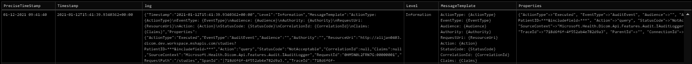

# Log Redaction
Log redaction is redacting personally identifiable information (PII) from the log messages. There are two levels of redactions currently present in FHIR:
- Redacting parameter values from query string
- Excluding logs containing usernames

## FHIR - Logging to Geneva
FHIR pushes logs to Geneva using Application Insights. Telemetry configuration is created for Application Insights. This telemetry configuration has telemetry processor with a default telemetry sink. Geneva is also registered as an additional telemetry sink. When the logs are emitted, they are captured by the monitoring agent which brings them to the telemetry processor. While processing, they first go through the log redaction and log exclusion filters which redact the PII data. Once the PII data has been redacted, logs are then passed on to the Geneva Channel to be published.

## DICOM - Logging to Geneva
Since DICOM does not use Application Insights, the same Telemetry Configuration and Geneva Sink cannot be used here.

### What do we currently have?
Dicom logs are currently getting published to Geneva using Fluentd. Fluentd captures the emitted logs and has Geneva registered as the sink.

### Log Redaction in DICOM
**Fluentd**

Since we already have Fluentd in place to write logs to Geneva, it would make sense to use features provided by Fluentd to redact PII data. Fluentd does provide ability to redact specific data from JSON based logs however we need to know exact names of properties to be redacted. In case of DICOM, since we want to redact all the parameter values in the query string, this might not be feasible.

**Serilog**

An alternative to achieve this is Serilog. Serilog is an opensource logger which has a wide community. The plan would be to inject Serilog and use the Json Formatter to perform additional actions on the logs. This Json Formatter would redact parameters from the query string and also exclude logs that have username as a parameter.

An additional benefit of using Serilog and Json Formatting is that logs with line breaks were treated as separate log entries. After formatting the log as Json, all of these separate messages will be combined and reported as one single log which is the expected behavior.

**_Plan of action:_**

Plan is to register Serilog as a logger which captures all the logs. With Serilog, Console will be configured as the output sink. Logs to this sink will go through a custom formatter. This custom formatter will be responsible for redaction of PII data and exclusion of specific logs. Once the logs are written to the standard output, these will be captured by Fluentd and pushed down to Geneva.

**_Dicom Geneva Logs before Serilog_**

**_Dicom Geneva Logs after Serilog_**

**_Things to verify:_**
- If logs are emitted to Standard Output, are they still captured by Fluentd that is currently in place or do we need to register Fluentd as a sink.
    - Verified: There is no need to register Fluentd as an additional sink.
- Do we actually want to exclude username?
    - Yes, we want to exclude username.
- Do we want to keep includefield parameter values? Any other parameter values that we do not want to redact?
    - Yes, we want to exclude includefield value as a precaution.
    - Redact every query parameter value.
