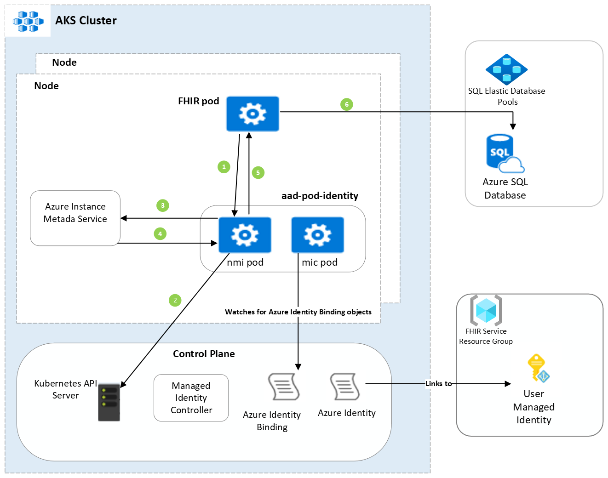

*Summary of the feature.*

[[_TOC_]]

# Business Justification

*Explain WHY we are building this feature. For customer-facing features, which customers will use it?*

# Scenarios

*List the scenarios this will enable. These should map to acceptance criteria.*

# Metrics

*List the metrics/telemetry that should be collected. For example: number of accounts that use feature X, number of requests to Y API per hour/day/week. How do we measure the success of this feature?*

# Design

A high-level architecture will look like this:

# Test Strategy

*Describe the test strategy.*

# Security

*Describe any special security implications or security testing needed.*

# Other

*Describe any impact to privacy, localization, globalization, deployment, back-compat, SOPs, ISMS, etc.*
