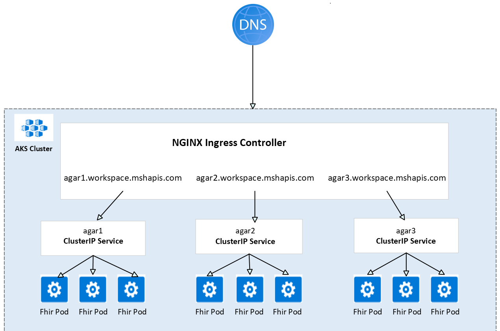

# Ingress for Fhir Service on AKS

**STATUS: Work In Progress.**

The purpose of this document is to detail the design and changes for setting up Ingress for Fhir Services on AKS. Ingress may provide load balancing, SSL/TLS termination and name-based virtual hosting.

[[_TOC_]]

## Terminology
For clarity, this document defines the following terms:
- Node: A worker machine, part of a Kubernetes cluster.
- Cluster: A set of Nodes that run containerized applications managed by Kubernetes.
- Service: A Kubernetes Service that logically groups pods to allow for direct access on a specific port via an IP address or DNS name.
- Ingress: A Kubernetes resource that exposes HTTP/HTTPS routes from outside the cluster to Kubernetes services within the cluster. Traffic routing is controlled by rules defined on the Ingress resource.
- Ingress Controller: A Kubernetes Controller, responsible for fulfilling the Ingress, usually with a Load Balancer to help handle the traffic.

## Business Justification
Using Ingress for Fhir Services on AKS will have the following advantages:
- `Lower Infrastructure Costs` - If we want to expose multiple services so they are reachable from the public internet then using Kubernetes service type LoadBalancer will create a cloud load balancer per service. If we use an Ingress Controller, we only have to use service type LoadBalancer once to expose the Ingress Controller and we only have to pay for the single load balancer.
- `Scalable Load Balancer Architecture` - Ingress controllers work at layer 7, and can use more intelligent rules to distribute application traffic. They can be combined with the scale of a layer 4 Load Balancers.
- `Distributed Load Balancer Configuration` - we can have multiple small ingress files instead of one huge loadbalancer.config file.
- `Less code maintenance for developers`
- `Same experience for current customers`
## Design
In a Service Fabric(SF) cluster, a Front-End, or gateway, service sits behind a load balancer and handles incoming internet traffic for all FHIR services and routes requests to the appropriate FHIR service instance. Each account is given its own domain name and the Front-End service performs the routing based on the hostname of the incoming request. Front-End Service fetches account routing information from the Account Routing Service.
In workspace-platform (AKS clusters) we will use Ingresses to distribute incoming traffic to FHIR services. Traffic routing will be controlled by rules defined on the Ingress resource. We will leverage the existing Nginx Ingress Controller implementation in workspace-platform.

A high-level architecture of Fhir Services on AKS configured with Ingress to distribute application traffic.



### Prototype Phase
The goal was to identify what changes will be needed for setting up Ingress for Fhir Services on AKS for traffic routing instead of using Front-End and Account Routing Services.
We created a [Fhir web project](https://microsofthealth.visualstudio.com/Health/_git/workspace-platform?version=GBpersonal/petyag/migration&path=/fhir/fhirservice). It is based on Fhir Service implementation in health-paas repo. We excluded settings and services like:
  - Ifx and Shoebox Auditing
  - Authentication and Authorization
  - RBAC
  - Telemetry
  - Export
  - Reindex

We disabled all references to Account Rounting and Front-End Services. 

We created temporary YAML specs to provision the following Kubernetes networking objects:
- `ClusterIP Service` object, that logically groups Fhir pods to allow for direct access on a specific port.
- `Ingress` object, configured with rules to give the `ClusterIP Service` externally reachable URL.

Example of a ClusterIP Service object:
```yaml
apiVersion: v1
kind: Service
metadata:
  name: agar-fhir-service
  namespace: default
spec:
  type: ClusterIP
  ports:
    - port: 80
      targetPort: 8080
      protocol: TCP
  selector:
    deployment: agar-fhir-deployment
  sessionAffinity: None
status:
  loadBalancer: {}
```
Example of an Ingress object:
```yaml
apiVersion: extensions/v1beta1
kind: Ingress
metadata:
  name: agar-fhir-ingress
  namespace: default
spec:
  rules:
  - host: agar.dicom.agar.workspace.mshapis.com
    http:
      paths:
      - backend:
          serviceName: agar-fhir-service
          servicePort: 80
        path: /
        pathType: Prefix
  tls: 
  - hosts:
    - agar.dicom.agar.workspace.mshapis.com
```
### Next Phase
- Implement [Fhir Operator](./fhir_server_on_aks.md) that will set up automatically Ingress objects. The goal of the Fhir Operator will be to facilitate the management of the underlying Kubernetes components by using Fhir Custom Resource and Controller. When provisioning a new Fhir Service, a new instance of a Fhir resource will be created along with Ingress and Kubernetes Service objects.
- Enforce a secure communication between the client and the Nginx Ingress Controller. This will require using a managed identity to read a cert from the Azure KeyVault and the secret store CSI driver to auto sync the cert in the Kubernetes cluster.
- Enforce a secure communication between the Nginx Ingress Controller and the Fhir Services in an AKS cluster. We can follow DICOM approach - internal cert and a sidecar TLS proxy to secure the traffic inside the Kubernetes cluster.
### Future Considerations
#### Private Link
For Fhir Services in workspace-platform we will need to continue to use Front-End and Accounting Rounting Services until we no longer need to proxy traffic through SF for private link enabled accounts.
#### Billing
For Fhir Services in workspace-platform we can follow the same approach as DICOM and Iot - [BillingAgentV2](https://microsofthealth.visualstudio.com/Health/_git/health-paas-docs?path=/specs/PaaS/Billing/BillingAgentV2/BillingAgentV2.md&anchor=overview&_a=preview).
## Test Strategy
We will continue to use all of the tests that we have in the FHIR service for verifying all existing scenarios are working as expected.

We will need to add a new set of E2E tests for provisioning a new Fhir service using Ingress.

## Security
We will follow security practices that are used already, such as using the KeyVault CSI driver for secrets, and using Managed Identities for auth.

## Other

*Describe any impact to privacy, localization, globalization, deployment, back-compat, SOPs, ISMS, etc.*

